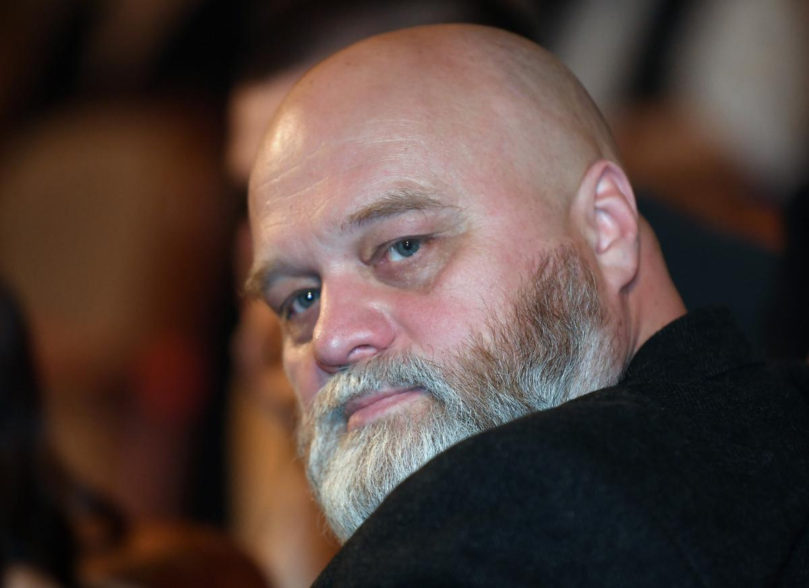

# Алексей Федорченко: «Государству нужны оптимисты с плохой памятью». Триумфатор кинофестивалей — о «культуре отказа», неотменимости искусства и невозможности снимать кино в нынешних обстоятельствах

- **URL:** https://novayagazeta.ru/articles/2022/03/27/aleksei-fedorchenko-gosudarstvu-nuzhny-optimisty-s-plokhoi-pamiatiu
- **Дата:** 2022-03-27
- **Автор:** Лариса Малюкова

## Алексей Федорченко: «Государству нужны оптимисты с плохой памятью»

## Триумфатор кинофестивалей — о «культуре отказа», неотменимости искусства и невозможности снимать кино в нынешних обстоятельствах

Один из самых интересных режиссеров, идущий собственным причудливым путем, реконструктор мифологии, космических полетов и исторических трагедий — о кошмарном сне, в котором сегодня оказался мир. Стоит ли в этом мороке снимать кино?

Алексей Федорченко. Фото: Екатерина Чеснокова / РИА Новости

— Больше месяца мы живем в измененном пространстве, где даже называть происходящее своими именами запрещено. В измененном пространстве другой воздух, точнее его отсутствие, и сознание — измененное. Что сейчас происходит с тобой, с профессией?

— Ну, о профессии, честно говоря, пока не думаю. Все, что произошло, зачеркнуло мотивировку работать, жить. Пытаюсь найти какие-то смыслы, чтобы дальше существовать. Об искусстве говорить, мне кажется, и рано, и невозможно что-то точное сформулировать. Когда сердце болит, голове трудно и планы в руинах. Вот сейчас я должен был снимать большую картину, планировал съемки в Харькове, потом в Киеве, в Житомирской области. Мы решили сделать фильм о выдающемся русском философе Митрофане Аксенове, жившем в Украине, он сформулировал оригинальную теорию времени.

— Время как четвертое измерение.

— Да, он на 15 лет предвосхитил открытие Минковского — Эйнштейна! При этом об Аксенове фактически ничего не известно. В «Википедии» стоят знаки вопроса: где родился, чем занимался, как умер, где. К нему относятся как к мифу, хотя книги остались. Нам хотелось из небытия вернуть человека в культурное, научное поле. Вернуть имя как мировое достояние. И мы по крупицам собрали его биографию.

— В общем, ты сам оказался в ловушке искореженного времени.

— И непонятно, когда кончится эта… операция на открытом сердце страны. Сколько еще смертей будет. Планировали мы и другой фильм — в Греции, третий — в Колумбии. И дело не только в физической невозможности съемок — я уже и к этим сценариям отношусь по-другому. Что-то удалось предугадать, но основные смыслы перевернуты на 180 градусов. Не знаю, как к этому подступиться.

— Твой недавний фильм «Последняя «Милая Болгария» — поэма-витраж, собранная из осколков советской страны. Осколки, как оказалось, умеют срастаться.

— Мы старались прямым текстом сказать про опасность сталинизма, но почему-то никто этого в фильме не увидел. Помнишь, там был мультик — танец членов Политбюро, Сталина и… Москва, которая пожирает все. Ни один кинокритик этого не заметил, говорили о других каких-то смыслах, о киноязыке.

Кадр из фильма «Последняя «Милая Болгария» (2021)

Сначала нам «спецоперация» закрыла все возможные векторы существования — у нашего авторского кино и так была аудитория, дай бог, один процент…

А сейчас и мировая культурная общественность подключилась. Нам говорят: не важно, что вы хотите сказать, важно, к какой нации вы принадлежите. Но это тот же нацизм.

— Пока продолжает разворачиваться трагедия в Украине, тема бойкота российской культуры будет набирать обороты. Ее жертвой стал и украинский режиссер с мировой славой Сергей Лозница. После его исключения из украинской академии за космополитизм он сделал заявление, в котором говорит, как опасно опираться на «национальную идентичность» в принятии решений, «использовать сталинскую трактовку космополитизма, основанную на ненависти, отрицании свободы слова, защите коллективной вины и запрещении любых проявлений индивидуализма». Но сегодня и европейские институции отменяют индивидуальный выбор художника, его гражданскую позицию.

— Пока одни хотят отменить все автономное украинское, иные — отменяют все российское, закрашивая в коричневый цвет весь народ. Мир присоединяется к этому флешмобу. Я сейчас едва ли не ежедневно получаю письма от фестивалей и киноакадемий, они будто написаны под копирку. Понятно желание людей поддержать Украину, поддержите. Почему надо вычеркивать наши фильмы? Если бы я мог спасти Украину (или хотя бы одного человека) ценой своих фильмов, я бы немедленно сжег их все, никогда не возвращался бы к этой деятельности.

Они бойкотируют мою картину про геноцид художников в сталинские времена и в то же время закупают у России нефть и газ. Это подлая позиция.

Понимаю, что у меня все время какая-то обида лезет, сейчас это непростительно. Но мне кажется, что позволенное сегодня украинцам не позволено участникам этого мирового флешмоба. Как если бы в советское время бойкотировали Эйзенштейна, Довженко, Тарковского, Синявского с Даниэлем. В Европе начинают воевать с самыми активными бойцами с режимом: с теми, кто уехал, с теми, кто даже «под крышкой» пытается что-то делать. Позор — блокада параолимпийцев, удар по всему олимпийскому движению, призванному бороться против войны в принципе. А тут людей, победивших свой недуг, отправили назад за то, что они не той нации. Поэтому ощущение, что нас предали: и правительство, и весь мир.

— Процесс cancel russian culture в Европе может превратиться в отмену культуры? Отмену «великоросса Пушкина», «отца русского национализма Достоевского»?

— Украинцы имеют сейчас на это право, они смотрят на нас сквозь кровавую пелену. Если мы говорим о Европе и Америке, то это похоже на симультанную акцию. Самое точное слово — «флешмоб». Я старался не вмешиваться в споры, но зарубился с каким-то «культурным» израильтянином. Я говорю: «Ты чего, парень, ты кто? Давай еще к погромам призови!»

Фото: Екатерина Чеснокова / РИА Новости

— Недавно наблюдала дискуссию в закрытой группе документалистов. Выяснилось, что режиссеры, которые на коленках делали протестное кино, оказались в западне. Сейчас одному из них западные дистрибьюторы предлагают написать в титрах, что фильм грузинский. Тогда у него будет будущее. То же с аниматорами, в том числе теми, кто после протестов и задержаний вынужден был уехать. Они пытаются примерить на себя вину… Они — щепки, которые летят из горящего леса.

— Да, лес рубят, щепки летят. Я очень переживаю за тех, кому пришлось уехать. Знаю, как живут сейчас многие, какие унижения им достаются. Даже не из-за притеснений. Просто в мире не один миллион украинцев-беженцев, которых спасают всем миром, но очевидно, что появление лишних ртов со временем начинает раздражать, и в скором времени они станут для многих людьми второго сорта. А наши там — люди третьего сорта, потому что работа, которой и так нет, будет доставаться сначала своим гражданам, потом украинским беженцам, потом нашим. И нужно будет или бежать дальше в неизвестность, или возвращаться, потому что там жить не получится.

— Получится ли жить здесь, тоже большой вопрос.

— Прогнозы больше не работают, живем во времени со многими неизвестными. Это страшно, особенно тем, у кого дети.

Поддержите нашу работу!

1000 500 300 Нажимая кнопку «Стать соучастником», я принимаю условия и подтверждаю свое гражданство РФ

Если у вас есть вопросы, пишите [email protected] или звоните:+7 (929) 612-03-68

— Как можно выработать какую-то повестку, которая остановила бы гуманитарную катастрофу? Что вообще мы можем делать?

— Пытаюсь заставить себя вернуться в работу. У нас готовится к запуску дебютный игровой фильм прекрасного аниматора Светланы Филипповой про семейные отношения. Что еще… Затеял ремонт. Долго его откладывал, но

когда все рушится и хочется бежать — надо делать ремонт.

— У тебя самого всегда много проектов, ты кино сейчас снимать не хочешь или не можешь?

— Понимаешь, у меня долг перед Митрофаном Аксеновым, которого я обнаружил, и мне кажется, что я просто обязан вернуть его…

— Считаешь, в мире тотальной катастрофы будет кем-то востребована трансцендентально-кинетическая теория времени Аксенова?

— Ну, в мире по-прежнему востребованы «Макдоналдс», «Пепси-кола» и Соловьев. Но мы же не будем на все это тратить наше время. Остались буквально единицы, готовые заниматься смысловыми вещами. Читать, слушать музыку, исследовать.

Фото: Екатерина Чеснокова / РИА Новости

— Я думала, все ради того, чтобы пробуждать в людях человечность, неприятие мира насилия. Хотя вера в спасительную миссию искусства разрушена.

— Несколько лет назад я сформулировал, что у России должно быть только три нацпрограммы: вода — сохранение, леса — возрождение, люди — просвещение. Все остальные векторы развития страны следуют из этих трех тезисов.

В просвещении был провал, вместо него мы и получили изощренные исторические искажения, подмены.

— Сегодня все события развиваются в соответствии с культурной перезагрузкой, составленной в нулевые госсмысловиками во главе с тогдашним министром культуры Владимиром Мединским. Это концепция «особого пути» российского «государства-цивилизации» с девизом «Время, назад!», с превращением гражданина в верноподданного своего государства.

— В «Последней «Милой Болгарии» чекист Адалат говорит: «Государству нужны оптимисты с плохой памятью». Бомбардировки начинаются, когда заканчивается просвещение.

— Может, правда реальность, причиняющая такие страдания, означает конец цивилизации?

— Сейчас подобные мысли многим приходят в голову. И кажется, тут уж не до культуры. Думаю, напротив. Если бы она у нас все эти годы не была на десятом плане, такого бы не случилось.

— Даже в смутные времена следует говорить о культуре, не откладывать?

— А дальше откладывать некуда. Одичание идет полным ходом.

— К теме просвещения… Расскажи про свою книжную коллекцию.

— Я собираю библиотеку репрессированных ученых. Собираю книги и истории этих людей, пишу книгу.

— В какой стадии работа над твоими новыми игровыми картинами?

— Недавно были завершены съемки фильма «Большие змеи Улли-Кале», не просто об отношениях России и Кавказа, а о колониальной идеологии страны. И сейчас картина читается совершенно по-другому. Следующий фильм, который мы запустили за неделю до 24 февраля, называется «Енотовый город». Он о том, как люди изживают из себя фашизм. В августе мы должны были ехать в Колумбию на съемки. Это третий фильм из цикла мокьюментари: «Первые на Луне», «Большие змеи Улли-Кале» и «Енотовый город» — хотел такую трилогию сделать.

Читайте также

Ниже дна не упадешь

Номинант на премию «Оскар» Антон Дьяков — о том, почему мы горим

— У тебя в «Первых на Луне» энкавэдэшники в 1938-м запускали в космос ракету, а космонавта Харламова воронок забирал с любовного свидания и вез на космодром. Актуально. От тебя можно ждать чего угодно.

— Сейчас не знаю, чего ждать. И от себя, и от моей страны. И от происходящего в мире. Все творческие и производственные вопросы ушли на сотый план. Думаю о том, что сестра моя в горящих Сумах…

— Пытаешься ее вывезти?

— Не могу пока найти. И в Киеве много родственников, еще больше — Кременчуг, Полтавская область. Это затмевает все эти бойкоты и кино.

— Что делать, на что уповать?

— Я всегда успокаивал себя фразой Швейка: «Никогда так не было, чтобы никак не было». Как-то будет, будем жить, если самого плохого не случится. Дай бог, чтобы договорились. Мне вот совершенно уже не важно, какие там условия, лишь бы перестали убивать. По большому счету все эти границы были созданы для безопасности — не для смерти. Они все равно исчезнут со временем…

— Ну, или они исчезнут, или человечество.

— Не знаю, на что надеяться. Только на то, чтобы остановить кровь. Любому больному — человеку ли, обществу ли — надо вначале оказать скорую помощь. Надеюсь, люди придут в себя. А сейчас они одурманены запахом крови, сходят с ума, убивают. Какое тут кино.

Поддержите нашу работу!

1000 500 300 Нажимая кнопку «Стать соучастником», я принимаю условия и подтверждаю свое гражданство РФ

Если у вас есть вопросы, пишите [email protected] или звоните:+7 (929) 612-03-68
