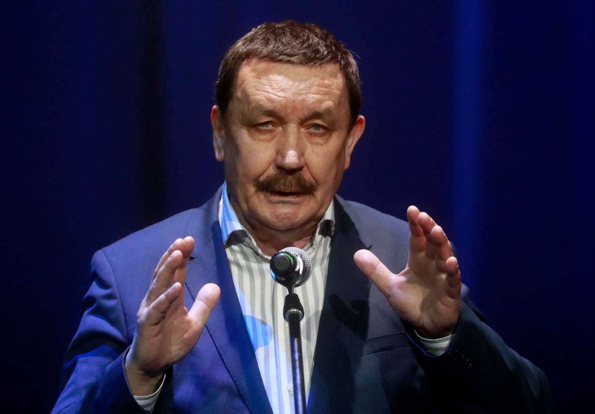

# Нежный перфекционист. Умер режиссер Вадим Абдрашитов

- **URL:** https://novayagazeta.ru/articles/2023/02/12/nezhnyi-perfektsionist
- **Дата:** 2023-02-12
- **Автор:** Лариса Малюкова

## Нежный перфекционист

## Умер режиссер Вадим Абдрашитов

Вадим Абдрашитов. Фото: Сергей Фадеичев / ТАСС

Вспоминаем одного из крупнейших режиссеров ХХ века и его прогностические фильмы, которые пробивались к нам сквозь толщу запретов и непонимания. Предупреждали нас об опасности тотального конформизма, который непременно приведет к гигантским «магнитным бурям», к ненависти, которая тянет ко дну. Их не услышали.

В этих картинах был и выброс мрачной первобытной энергии, и подспудная раскаленная стихия — под железной крышкой коллективного бессознательного. «Плюмбум…», «Остановился поезд», «Парад планет», «Время танцора», «Армавир», «Магнитные бури». Фильмы — социальные слепки эпохи, но в них море подтекстов, смыслов, метафор. И эмоциональная память страны, ее геном. Фильмы как зеркало, в котором мы — сегодняшние.

Такими нас увидели и показали Абдрашитов и Миндадзе в своем кино десятилетия назад. Поэтому и картины их с каждым годом становятся все современней, важнее.

Не буду писать о том, почему он больше не снимал. Хотя знаю о нескольких удивительных замыслах, сшивающих намертво нашу историю с сегодняшним днем.

Но современным кинопроцессом, в отличие от многих режиссеров интересовался. Просил ссылки на новые картины. Буквально дней десять назад послала ему линки. Говорил: «Вернетесь с Берлинского кинофестиваля, жду отчета»

Очень красивый. Надежный. Верный. При всей преданности кинематографу, ничего дороже семьи, его Нателлы и его дочки Наны у него не было. Сдержанный. В оценках честный. Перфекционист. Нежный. Человек и Режиссер Вадим Абдрашитов.

Материал Вадима Абдрашитова в «Новой», 2011 год

Вадим Абдрашитов: Прогноз на завтра отменяется

Известный режиссер — о психологии временщиков, об этническом противостоянии, о сиротстве молодежи
