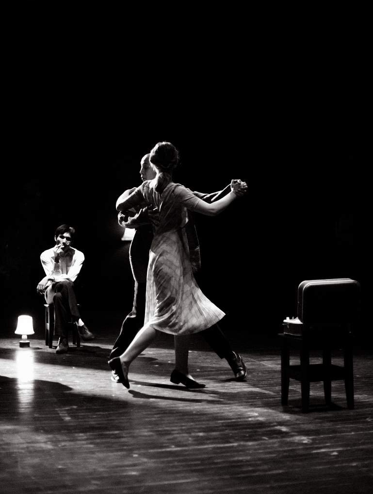

# Але, вас не слышно, говорите громче! Первая сессия спектаклей «Июльский дождь» в Музее Москвы — 4, 5 и 6 марта

- **URL:** https://novayagazeta.ru/articles/2023/03/02/ale-vas-ne-slyshno-govorite-gromche
- **Дата:** 2023-03-02
- **Автор:** Лариса Малюкова

## Але, вас не слышно, говорите громче!

## Первая сессия спектаклей «Июльский дождь» в Музее Москвы — 4, 5 и 6 марта

Сцена из спектакля «Июльский дождь»

Мы узнаем хуциевское кино по первым кадрам. Старые троллейбусы, вымытые улицы и памятники, лужи на асфальте, театральные тумбы, спешащие люди. Куда они спешат? Мужчины с газетой, зажатой в руке, женщины с сумочками, милиционеры, мальчишки… Или вот эта девушка, случайно обернувшаяся прямо в камеру.

«Июльский дождь» рожден на излете оттепели, поэтому в нем горечь тающей, как шарики града, надежды.

Как передать воздух времени, атмосферу, звуки, пойманные в сачок хуциевского кино? Узнаваемый шорох телефонного диска и щелчок перед тем, как на другом конце провода услышим дыхание.

В начале спектакля по сценарию Анатолия Гребнева и Марлена Хуциева люди деловито идут к телефонным автоматам и скрываются в них. Их лица едва различимы. Как лица и звуки тех, кто жил за полувековой толщей времени.

«Але, здравствуйте, Женя, я уже узнаю ваш голос, я даже по звонку узнаю, что это вы». — «А какой у меня звонок?» — «Особый какой-то».

Поддержите нашу работу!

1000 500 300 Нажимая кнопку «Стать соучастником», я принимаю условия и подтверждаю свое гражданство РФ

Если у вас есть вопросы, пишите [email protected] или звоните:+7 (929) 612-03-68

Девушка в ярком зеленом платье рассказывает про дождь, который жарким июльским днем прокрадывается в город незаметно. Прохожие не обращают на его первые редкие капли внимания, они спешат по своим делам. И тогда дождь, словно обидевшись, набирает силу, разгоняет людей по подворотням, под козырьки витрин, в телефонные автоматы.

В телефонной будке двое прячутся от дождя. Они становятся черно-белыми, словно переносятся в то время. И мы уже следим за их диалогом на экране. «Вы спешите? Возьмите хотя бы куртку, она не промокает… Звоните, у нас всегда кто-то дома».

Чем они отличаются от нас? «Современный человек имеет в среднем 300 знакомых и при этом никому ничем не обязан». Так говорят в «Июльском дожде» во время обычной домашней вечеринки. На той самой вечеринке, где Владик Александра Митты в капроновой белой рубашке с бутылкой коньяка и рюмкой в руке советует героине фильма лучшее на свете хобби — коллекционировать друзей.

Да ничем они не отличаются. Только если надеждой, еще тлеющей в конце 60-х. Впрочем, и надежда уже была ненадежной. Как пелось в песенке уже поседевшего Визбора в том самом фильме:

«Не верьте погоде, Когда затяжные дожди она льет.

Не верьте пехоте, Когда она бравые песни поет.

Не верьте, не верьте, Когда по садам запоют соловьи.

У жизни со смертью Еще не окончены счеты свои».

Спектакль Мурата Абулкатинова открывает «а39» — новый театральный проект, созданный режиссером Григорием Добрыгиным вместе с выпускниками режиссерского факультета ГИТИСа. Проект вырос из знаменитой «Мастерской Кудряшова» — резидентов театра «Практика». Здесь мастерская выпустила спектакли «Дождь в Нойкельне», «YouTube/в полиции», «Приоткрытый микрофон» и другие.

«а39» — независимый проектный театр: здесь нет постоянной труппы, художественная и актерская команды формируются под конкретную премьеру. Среди задач площадки — взаимодействие с выпускниками и студентами театральных вузов, поиск новых имен и превращение студенческих эскизов и проектов в полноценные спектакли.

«а39» — номер аудитории ГИТИСа, где уже десятки лет проходят показы курсовых работ режиссерского факультета. Именно здесь когда-то были представлены первые эскизы мастерской Петра Фоменко и Сергея Женовача, здесь появились первые «Кудряши», «Камни», «Хейфеца» и многие другие творческие команды, тоже уже ставшие историей. Но эта история продолжается сегодня. В команде «а39» — Елизавета Янковская, Денис Парамонов, Дарья Верещагина, Лев Зулькарнаев, Александр Горчилин, Александр Алябьев, Серафима Гощанская и другие.

Как говорит основатель и куратор проекта Григорий Добрыгин: «Мне хочется, чтобы театр разговаривал со зрителем не с высоты своего авторитета, а значительно проще. Чтобы диалог между зрителем и актерами выстраивался горизонтально, без поклонения зданию как «храму искусства» и без трепета перед портретами в актерском фойе. Мы хотим добиться дружеского общения, общения ровесников, современников».

Этот проект — попытка наладить связь, услышать друг друга. Герой нашего времени все так же пытается расслышать голос родственной души в страшном хаосе, скрежете времени, когда связи между самыми близкими рвутся. «Вас не слышно! Говорите, пожалуйста, громче!»

Поддержите нашу работу!

1000 500 300 Нажимая кнопку «Стать соучастником», я принимаю условия и подтверждаю свое гражданство РФ

Если у вас есть вопросы, пишите [email protected] или звоните:+7 (929) 612-03-68
