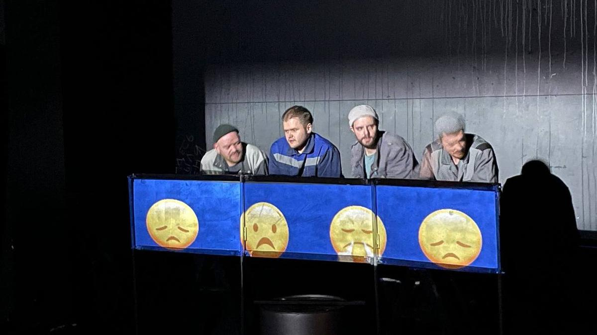

# «Я, как Алиса, устал удивляться». В Театре DOC вновь играют «Синего слесаря» по пьесе Михаила Дурненкова

- **URL:** https://novayagazeta.ru/articles/2023/04/03/ia-kak-alisa-ustal-udivliatsia
- **Дата:** 2023-04-03
- **Автор:** Лариса Малюкова

## «Я, как Алиса, устал удивляться»

## В Театре DOC вновь играют «Синего слесаря» по пьесе Михаила Дурненкова

Кадр со спектакля «Синий слесарь» в Театре Doc

В нулевые Михаил Угаров и Руслан Маликов уже ставили эту пьесу, и спектакль стал событием. Потом время побежало как-то неправильно: мытарства, скитания Театра DOC, смерть основателей. И вновь этот мигнувший из прошлого «синий троллейбус». Ну как о нем рассказать? Никак. Головокружение.

Здесь в цехах завода мерцает дух «синего слесаря». Об этом рабочие поведают новобранцу, пришедшему на завод мудрости у народа поднабраться.

И поднабрался. Окунулся с головой в мифологию почище горнозаводской — хармсовскую антиутопию. Со своими легендами и легендарными персонажами. Познакомился, например, с девочкой-магнитом — раньше она жила в метро, там, где ее мама оставила, и силой своего дара сбивала электрическое расписание поездов. Теперь она на проходной работает металлоискателем.

Познакомился с бригадой, и на дне стакана обнаружил истину о том, как все устроено. Было в стакане что-то крепкое, за чем успели в перерыве сгонять: то ли денатурат, то ли мистика…

Обрел-таки недостижимую гармонию под умиротворяющий голос заводского радио, рассказывающего о детройтских рабочих, изобретших конвейер с помощью японских иммигрантов. И теперь высокоградусные заводские хокку — неотъемлемая часть заводского пейзажа, эту песню не задушишь, не убьешь:

На проходной Люди плечами прижаты. Чувство плеча Помогает прожить понедельник.

***

О подъемник случайно разбил себе бошку. Сразу как будто живым Для меня стал подъемник. Угандошил его монтировкой.

Поддержите нашу работу!

1000 500 300 Нажимая кнопку «Стать соучастником», я принимаю условия и подтверждаю свое гражданство РФ

Если у вас есть вопросы, пишите [email protected] или звоните:+7 (929) 612-03-68

В этом спектакле-концерте примерно в 11 действиях (сбилась со счета, потому что нарядная и торжественная ведущая к финалу концерта уже лыка не вязала, путалась в листочках) не знаешь, плакать или смеяться.

И только те самые хокку — внутрицеховые, которые Дурненков то ли вынес под полой с заводской практики, то ли присочинил — дают сил пробиваться сквозь беспробудный дым и морок:

После работы слегка посидели с друзьями. Там, где я жил, — туда не пускают. Я, как Алиса, устал удивляться.

Вот такая премьера со смехом и слезами, а в финале страшным сочувствием к героям — последний спектакль «Дока» на Острове, на Садовнической набережной. Посвятили премьеру Михаилу Угарову и сыграли ее в день его смерти. Вот так все совпало.

Кадр со спектакля «Синий слесарь» в Театре Doc

А я вспомнила вот что: свой последний вечер Михаил Угаров провел с нами. Был на 25-летии «Новой газеты». Сидели на Новом Арбате за одним столом. Очень звал в театр, «где не врут», рассказывал про зрителей с «повышенной чуткостью».

И вот снова 1 апреля, у нас был юбилей. Но уже без Угарова.

Там, где я жил, — туда не пускают.

Я, как Алиса, устал удивляться.

Поддержите нашу работу!

1000 500 300 Нажимая кнопку «Стать соучастником», я принимаю условия и подтверждаю свое гражданство РФ

Если у вас есть вопросы, пишите [email protected] или звоните:+7 (929) 612-03-68
