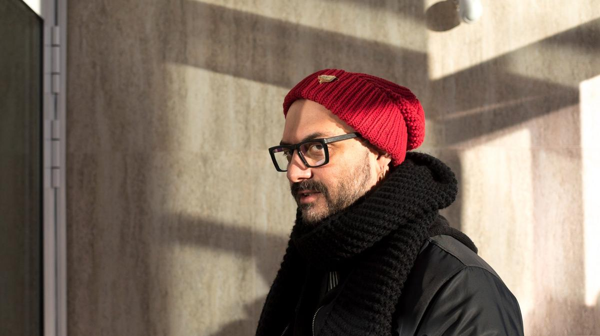

# Блокбастер в Парижской опере. Кирилл Серебренников поставит «Лоэнгрина» Рихарда Вагнера на одной из величайших мировых сцен

- **URL:** https://novayagazeta.ru/articles/2023/04/06/blokbaster-v-parizhskoi-opere
- **Дата:** 2023-04-06
- **Автор:** Лариса Малюкова

## Блокбастер в Парижской опере

## Кирилл Серебренников поставит «Лоэнгрина» Рихарда Вагнера на одной из величайших мировых сцен

Кирилл Серебренников. Фото: Влад Докшин / «Новая газета»

В этой музыкальной драме будут размышления о войне как «о машине для сокрушения тел и душ», — говорится в сообщении представителей Парижской национальной оперы.

Режиссер рассказывает о желании сотворить на сцене Бастилии настоящий блокбастер, проводя параллели со вселенными Матрицы или Marvel, так как у Вагнера многие оперы внутренне связаны, в том числе героями. И «Лоэнгрин» сплетен с «Парсифалем». «В «Парсифале» мы видим молодого, а в «Лоэнгрине» — мудрого, опытного композитора, — говорит режиссер, — Возможно, эти две оперы отражают разные стороны человеческой жизни, жизни великого художника».

«Вагнера нельзя сократить до чего-то меньшего, более примитивного. В его работах много тем, вопросов, слоев, подтекстов, как в музыкальном плане, так и в театральном.

Я думаю, Вагнер писал оперы о человеческой природе: она очень гибкая, изменчивая и сложная, темная, с одной стороны, и ярко сияющая — с другой, портрет любого человека не может быть написан одним лишь цветом.

И нам необходимо найти путь к этой многогранности от тех примитивных вещей, что нас окружают. Давайте прочувствуем сложные элементы вагнеровского мира, проживем их, нырнем глубже в этот темный, но такой захватывающий и волнующий мир».

Спектакль «Парсифаль», поставленный Серебренниковым на сцене Венской оперы, стал одним из самых обсуждаемых в 2021-м.

Читайте также

«Я, как Алиса, устал удивляться»

В Театре DOC вновь играют «Синего слесаря» по пьесе Михаила Дурненкова

Поддержите нашу работу!

1000 500 300 Нажимая кнопку «Стать соучастником», я принимаю условия и подтверждаю свое гражданство РФ

Если у вас есть вопросы, пишите [email protected] или звоните:+7 (929) 612-03-68
