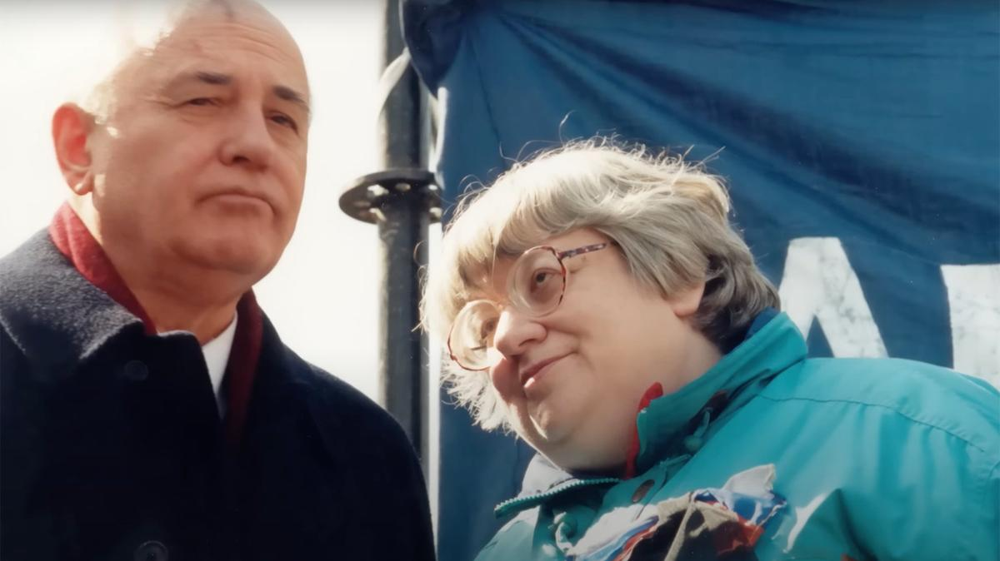

# А я одна умная. На YouTube можно посмотреть фильм «Белое пальто» — первую подробную биографию российской политической активистки, созданную режиссером Игорем Садреевым

- **URL:** https://novayagazeta.ru/articles/2023/04/14/a-ia-odna-umnaia
- **Дата:** 2023-04-14
- **Автор:** Лариса Малюкова

## А я одна умная

## На YouTube можно посмотреть фильм «Белое пальто» — первую подробную биографию российской политической активистки, созданную режиссером Игорем Садреевым

Михаил Горбачев и Валерия Новодворская. Кадр из фильма

Почему такое провокационное название? Оно родилось из мема. Мы увидим его на экране. На плакате Валерии Новодворской написана фраза «Вы все дураки и не лечитесь! А я одна умная». Мем гулял по интернету. Автор фильма полагает, что выражение «белое пальто» началось с этой картинки. И надо сказать, что от этого образа «отдельности», собственной точки зрения, противопоставления себя большинству — она не отказывалась.

Те, кто не знает о Новодворской, откроют для себя яркого, независимого человека, живущего в жесткой авторитарной системе по законам, самой над собой установленным.

Даже за время перестройки у нее было 17 арестов, 17 голодовок, четыре принудительных лечения в психбольницах.

Ценой собственного здоровья, а если необходимо, и жизни она отстаивала право на свое мнение, защищала свободу слова. Да просто свободу для всех нас.

Поддержите нашу работу!

1000 500 300 Нажимая кнопку «Стать соучастником», я принимаю условия и подтверждаю свое гражданство РФ

Если у вас есть вопросы, пишите [email protected] или звоните:+7 (929) 612-03-68

Такие люди, как Валерия Новодворская, сделали чрезвычайно много для того, чтобы сквозь российскую действительность пробивались ростки свободы, пусть даже дарованной сверху.

Кадр из фильма

Сегодня из Новодворской пытаются сделать этакого клоуна от политики. Благодаря фильму Игоря Садреева мы начинаем лучше понимать мотивы и действия этой уникальной, энциклопедически образованной женщины. Не только несгибаемого борца за «нашу и вашу свободу», но и теплого, нежного друга, веселого, остроумного, сильного человека. И свидетельства Игоря Царькова, подробно описывающего Валерию Ильиничну, бесценны.

Благодаря изысканиям автора, редким съемкам, интервью фильм «Белое пальто» становится портретом масштабной, противоречивой, трагической личности. Портретом на фоне страны, переступающей через пропасть, не выбрав пути.

Читайте также

«Я как рыба, выброшенная на берег»

Андрей Звягинцев на «Радио Франс» рассказал о жизни во Франции

Поддержите нашу работу!

1000 500 300 Нажимая кнопку «Стать соучастником», я принимаю условия и подтверждаю свое гражданство РФ

Если у вас есть вопросы, пишите [email protected] или звоните:+7 (929) 612-03-68
