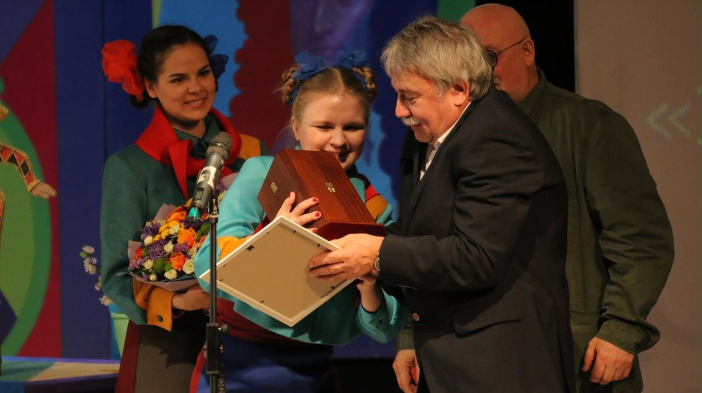

# Да здравствуют одуванчиковые войска! Школа-театр друга «Новой газеты» Сергея Казарновского отмечена очередной наградой

- **URL:** https://novayagazeta.ru/articles/2023/05/03/da-zdravstvuiut-oduvanchikovye-voiska
- **Дата:** 2023-05-03
- **Автор:** Лариса Малюкова

## Да здравствуют одуванчиковые войска!

## Школа-театр друга «Новой газеты» Сергея Казарновского отмечена очередной наградой

Приз «За великое служение театру для детей» получил Сергей Казарновский. Фото: премия «Арлекин»

Почетный приз «За великое служение театру для детей» премии «Арлекин» получил Сергей Казарновский — создатель, директор и художественный руководитель уникальной школы «Класс-центр». Школьная концепция «Театр как система гуманитарного образования» — не пустые звуки. Питательная среда.

Стоит лишь войти в эти стены, увидеть торчащих в кабинете директора учеников. Прийти на совершенно волшебные спектакли (многие из которых ставит Олег Долин). Заглянуть в кафе под цветными зонтиками. Или увидеть концерт… родителей учеников и переживающих детей: как бы папы с мамами не лажанулись.

Здесь атмосфера. Здесь уважают творчество и личность.

Не важно, в каком классе личность учится: во втором или выпускном. Здесь второклассники создали свою рок-группу «Кошки удачи». Хотели сами — еле уговорили взять музыкального руководителя. «Когда твоя девушка больна» в их исполнении — что-то особенное. Кстати, на стенах школы большие портреты не «политбюро», а выпускников, которые говорят о школе как о прививке счастья. И мечтают служить в одуванчиковых войсках. А в темном театральном зале здесь во время спектаклей светит солнце.

Пусть всегда будет солнце.

Поддержите нашу работу!

1000 500 300 Нажимая кнопку «Стать соучастником», я принимаю условия и подтверждаю свое гражданство РФ

Если у вас есть вопросы, пишите [email protected] или звоните:+7 (929) 612-03-68
