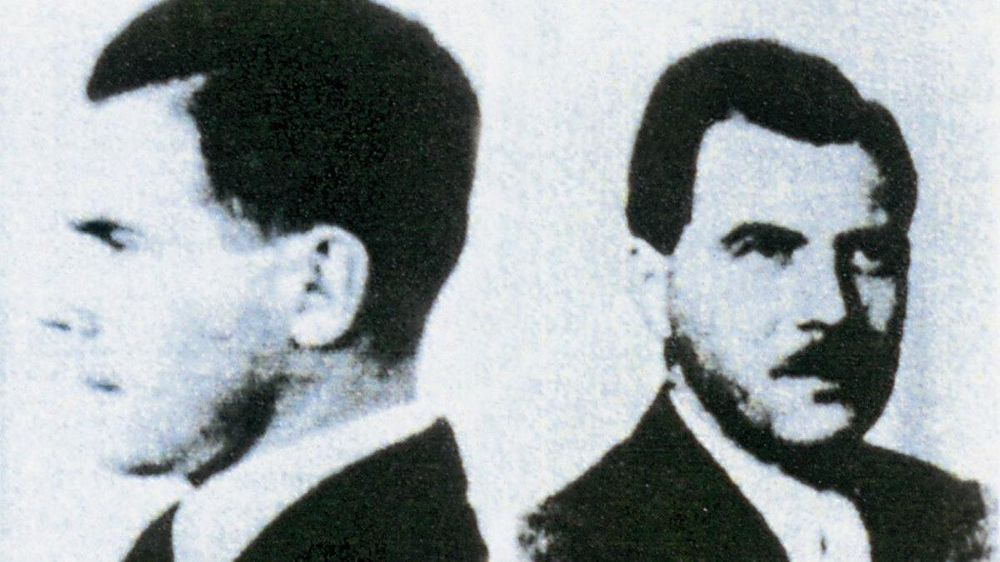

# Судьба «Доктора Смерти». Кирилл Серебренников снимает фильм про Йозефа Менгеле

- **URL:** https://novayagazeta.ru/articles/2023/06/05/sudba-doktora-smerti
- **Дата:** 2023-06-05
- **Автор:** Лариса Малюкова

## Судьба «Доктора Смерти»

## Кирилл Серебренников снимает фильм про Йозефа Менгеле

Йозеф Менгеле. Фото: East News

Начались съемки «Исчезновения» (Disappearance) — о нацистском докторе, военном преступнике Йозефе Менгеле. Режиссер ленты — Кирилл Серебренников. Август Диль («Бесславные ублюдки», «Скрытая жизнь» и «Молодой Карл Маркс») сыграет сладострастное чудовище — Ангела Смерти, годами скрывавшегося в Бразилии.

Даже сухое перечисление «экспериментов» Менгеле над живыми людьми, детьми (особенно его «увлекали» близнецы и монахини) — словно мороз по коже. Так же, как и число его жертв. Фильм будет сниматься в Южной Америке. Это подтвердил продюсер, глава Hype Studios Илья Стюарт. В основе фильма — роман французского писателя Оливье Геза «Исчезновение Йозефа Менгеле». Книга рассказывает о том, как после войны Менгеле бежал из Германии в Латинскую Америку и 35 лет скрывался там от преследований. А его пытались выловить и знаменитый «охотник за нацистами» Симон Визенталь, и «Моссад».

Гез исследует один из ужасающих мифов ХХ века, воскрешая судьбу «Доктора Смерти» вплоть до самого конца, когда, преследуемый всем миром, Менгеле оказывается лицом к лицу с призраками страшного прошлого.

Попытки найти его и предать суду так и не увенчались успехом — нацистский доктор умер в Бразилии в 1979 году. Любопытно, что за два года до смерти (Менгеле утонул) его разыскал сын Рольф, по мнению которого отец остался нераскаявшимся нацистом, утверждавшим, что лично никому не причинял вреда и только выполнял свой долг.

Поддержите нашу работу!

1000 500 300 Нажимая кнопку «Стать соучастником», я принимаю условия и подтверждаю свое гражданство РФ

Если у вас есть вопросы, пишите [email protected] или звоните:+7 (929) 612-03-68
