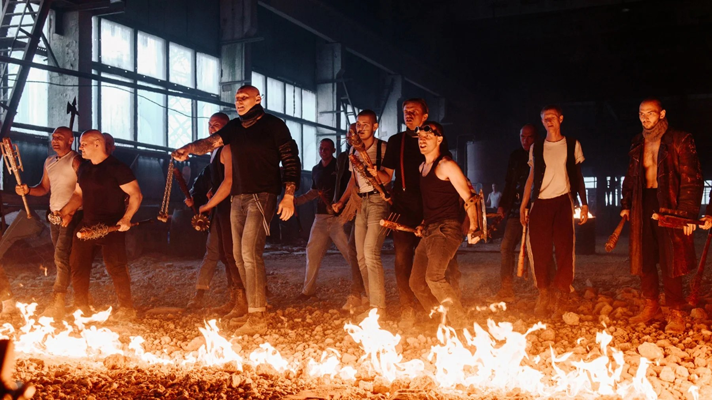

# Дума о сталинском фарфоре. Начался Пятый фестиваль сериалов «Пилот». Лариса Маликова рассказывает о фильме Открытия — «Библиотекарь» Ивана Твердохлебова

- **URL:** https://novayagazeta.ru/articles/2023/06/23/duma-o-stalinskom-farfore-media
- **Дата:** 2023-06-23
- **Автор:** Лариса Малюкова

## Дума о сталинском фарфоре

## Начался Пятый фестиваль сериалов «Пилот». Лариса Маликова рассказывает о фильме Открытия — «Библиотекарь» Ивана Твердохлебова

Кадр из сериала «Библиотекарь»

А открывался фестиваль на вокзале города Иваново. В синем зале ожидания. И названия проектов на экране щелкали, как строчки табло с поездами и временем отправления.

В конкурсной программе — 20 новых российских сериалов.Президент смотра Валерий Тодоровский с экрана объявляет фестиваль открытым. Он же говорит, что каждый фестиваль с возрастом обрастает призами, и объявляет о новой награде — лучший проект по итогам прошлого года. Что имеется в виду под «итогами», не очень понятно. Но это действительно отличный сериал Наташи Мещаниновой «Алиса не может ждать» о тинейджерке, теряющей зрение. Еще из новаций — новый приз шоураннеру. Как считает актриса Дарья Мороз, освоившая новую для себя профессию, одно из главных качеств шоураннера — чувство вкуса. И это точно: отсутствие вкуса — одно из главных проблем отечественных сериалов.

Приз получает продюсер Ирина Сосновая (среди ее проектов на START, помимо «Алисы…»: «Черная весна», «Содержанки», «Контейнер» и «Жиза»).

Ее спич про то, что нужно делать интересное и честное кино, как бы трудно ни было: «И именно здесь и сейчас».

Здесь и сейчас — фильм Открытия «Библиотекарь» Ивана Твердохлебова. Это многосерийное городское фэнтези по мотивам известного романа писателя, поэта и музыканта Михаила Елизарова, в 2008-м получившего премию «Русский Букер». С тех самых пор спорят о достоинствах и недостатках романа, с тех самых пор идет речь об экранизации.

Актер-лузер Алексей Вязинцев (Никита Ефремов) мечтает о карьере и популярности Брэда Питта, но для американской визы нужен депозит в несколько тысяч долларов. Заработать в порно или затейником на детских днях рождения вряд ли получится. Да и актер из Вязинцева — так себе. Тут очень кстати странным образом погибает его отец (Андрей Мерзликин), бросивший их с мамой давным-давно. И значит, надо срочно ехать в поселок Широнино, продавать малогабаритную отцовскую квартиру и мчать вдогонку за убегающей голливудской мечтой. Все же 27 уже. Скоро самому роли отцов играть.

Кадр из сериала «Библиотекарь»

И только в этом Широнино Алексей узнает, что главное наследство, оставленное ему, не малогабаритная обшарпанная двушка, а книжка некоего писателя Громова. Малоизвестного творца, каких в семидесятые прошлого века роились легионы: строчил светлые и добрые истории о тружениках, о зерне — золотом по осени закрома родины наполняющие, воспевал ситцевое бытие провинциальных городков и деревень, шахты со сверкающим углем, фабрики, трубами в небо упирающиеся, бескрайнюю целину и битвы за урожай. Книжки его, уцененные макулатурой, пылилась на складах. Сам он лет в 80 умер в полном забвении, незадолго до самоубийства его родного колосистого СССР.

От чтения таких книг скулы сводит. Но если прочитать от корки до корки книжку — вроде «Тихих трав» или «Дорогами труда», — она полностью изменит твою личность: силой небывалой магической нальешься до самых мочек, людьми будешь управлять, как шахматными фигурами на доске. Поэтому и идут за обладание книжками кровавые сражения между мощными кланами «громовцев», или как они себя сами называют — «библиотеками». Каждая из таких «читален», познавших тайную силу книг, мечтает собрать полное собрание сочинений Громова из семи томов.

Кадр из сериала «Библиотекарь»

В мистическом романе Елизарова батальные сцены напоминают компьютерные стрелялки-догонялки. В фильме первая битва происходит не в открытом поле — в лесу, и бьются, как и положено героям громовских книг, мотыгами, топорами, колами, предметами хозяйственного обихода. В обычной реальности эти люди никто — выброшенные на обочину жизни: учителя, инженеры, врачи, спортсмены, зэки, охранники. Но кому интересна эта, предавшая мечты юности реальность?

Теперь они борцы за истинную правду и веру в победу абстрактного добра над абстрактным злом. Очень актуально.

Поддержите нашу работу!

1000 500 300 Нажимая кнопку «Стать соучастником», я принимаю условия и подтверждаю свое гражданство РФ

Если у вас есть вопросы, пишите [email protected] или звоните:+7 (929) 612-03-68

Кадр из сериала «Библиотекарь»

Так же, как в мистическом триллере «Потерянная комната» обычные предметы обретали магические свойства, а сама комната оказывалась окном в параллельный мир, так и громовские буковки складываются в замысловатое и недостижимое слово «Вечность».

Авторы фильма, во всяком случае в первой серии, не следуют маршруту густой мистики. Идут тернистым путем достоверности, просто «оступившейся». А у нас оступаться никак нельзя. Сразу хтонь уволакивает в болото. И именно что в малогабаритной обшарпанной квартирке.

Это в миру книжки Громова носили названия «Дума о сталинском фарфоре» и «Серебряный Плес». Среди собирателей и фанатов книги были известны совсем под другими именами: Книга Силы, Книга Власти, Книга Ярости, Книга Терпения, Книга Радости, Книга Памяти и наконец главная — Книга Смысла… И силой они обладали немереной. И умереть им за новый смысл бытия в борьбе с супостатами не страшно.

Кадр из сериала «Библиотекарь»

«Библиотекарь» — фэнтези с элементами магического реализма, боевика и детектива.

Добро здесь бьется со злом в духе «Игры престолов», «Хроник Нарнии» или наших «дозоров» с «черновиками» — на фоне блеклого постсоветского быта конца 90-х.

В свое время парафилософскую мистерию Елизарова, отсылающую одновременно и к утопической «Третьей империи» Юрьева и к антиутопии Сорокина «День опричника», нещадно критиковали за поэтизацию советского, актуализацию канувшего в прошлое мифа. Но выяснилось, что миф никуда не «канул». Живет с нами бок о бок в нашем крупногабаритном коммунальном общежитии.

У Елизарова сакральное могучее прошлое протягивает руку настоящему. Надеюсь, авторам хватит и в дальнейших сериях иронии во взгляде на маргиналов книжных сект, влюбленных в советское мироздание, и способности взглянуть на книгу самого Елизарова без фанатизма громовских «читален». Рассмотреть в ней не только романтику, но и пародийность.

Все-таки «чары могильного тления», о которых писал Корней Чуковский, обладают страшной, причем притягательной силой. Они хватают настоящее за горло и не отпускают. Сегодня мы это чувствуем особенно остро.

Премьера фэнтези-сериала «‎Библиотекарь»‎ в видеосервисе Wink состоится 29 июня.

Лариса Малюкова ведет телеграм-канал о кино и не только. Подписывайтесь тут.

Поддержите нашу работу!

1000 500 300 Нажимая кнопку «Стать соучастником», я принимаю условия и подтверждаю свое гражданство РФ

Если у вас есть вопросы, пишите [email protected] или звоните:+7 (929) 612-03-68
