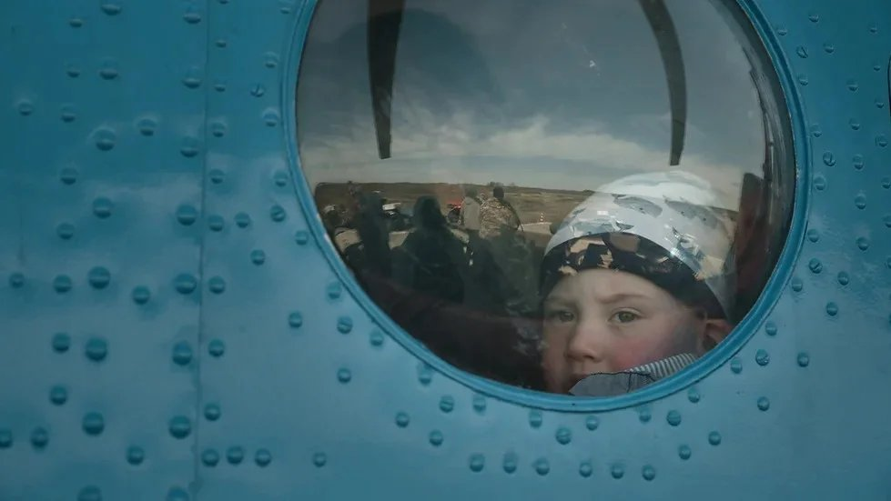

# Поболит — пройдет? В Москве идут показы Международного фестиваля «Докер» — актуальное и качественное мировое документальное кино

- **URL:** https://novayagazeta.ru/articles/2023/06/26/pobolit-proidet-media
- **Дата:** 2023-06-26
- **Автор:** Лариса Малюкова

## Поболит — пройдет?

## В Москве идут показы Международного фестиваля «Докер» — актуальное и качественное мировое документальное кино

Кадр из фильма «Последний теплоход»

40 фильмов из 20 стран мира, много премьерных показов. Некоторые из картин останутся в московской киноафише.

На что обратить внимание.

«Последний теплоход» Ильи Желтякова. Для любителей дальних странствий в пределах родной страны. Один из героев фильм — старый теплоход, много повидавший на своем веку. Вместе с ним всматриваемся в живописные берега Кольского полуострова, причаливаем к деревянным пристаням в поморских деревнях. Побываем в закрытом городе Островной (Гремиха), крошечном поселке Сосновка, поморской деревне Чаваньга.

Здесь очень его ждут, он соединяет людей с Большой землей, везет им самое необходимое. В некоторые деревни заглядывает всего пару раз в год. С каждым годом поселки и города на берегу Белого моря все больше пустеют. И остаются здесь те, кто называет себя «людьми Севера». Вросли в эту холодную землю, надеются только на себя. Но даже им нужна связь с Большой землей.

«Дозор» Грегориса Рентиса.

Кадр из фильма «Дозор»

Вблизи сомалийского побережья орудуют вооруженные группировки сомалийских пиратов. И как бы ни успокаивали капитанов представители береговой охраны, каждый рейс чреват смертельной опасностью. Понятно, какие денежные интересы вынуждает моряков рисковать жизнью, но все же… Хорошо, что представители специальной береговой охраны готовы их охранять. Однако, как в самом настоящем приключенческом романе, — и само море, и пираты-головорезы разворачивают сценарий в неожиданное русло. Совместное производство Греции и Франции.

«Святая дилемма» — одна из самых интересных картин года. Документальный хит, с успехом идущий в кинотеатрах разных стран. Критики уже назвали его неигровым «Молодым папой».

Кадр из фильма «Святая дилемма»

Роберт Полгар — католический священник из большой венгерской деревни Муракерестур, неподалеку от границы с Хорватией. После девяти лет служения стал любимцем деревни. Причем и взрослых, и детей. Ему внимают на воскресных проповедях, он тренирует мальчишек на футбольном поле, он воспевает любовь к Богу, аккомпанируя себе игрой на гитаре. Ну просто душка.

Но мало кто знает, что у Роби трое детей от Анетт, живущей в соседней деревне. А это категорически противоречит обету безбрачия.

Выходит, благонравный священник ведет двойную жизнь?

«Когда я в церкви, я лгу, потому что отрицаю, что я отец. Когда я дома, я лгу, потому что отрицаю, что я священник», — признается он авторам фильма (или себе самому) в коренном противоречии, которое буквально разрывает его на части.

Ему так доверяют прихожане, а он, получается, им лжет?

Благодаря близкой камере погружаемся в глубины этого трудноразрешимого конфликта.

Наблюдаем за спокойными нежными отношениями Роби с Анетт, которая никогда (!) не просила его оставить сан. Видим, как его ждут дети, с которыми он вынужден редко встречаться. С какой заботой он укладывает их спать. Как они на нем висят, требуя игры, чтения, разговора.

Роберт долго готовится, собирается с силами. Он все-таки должен решиться, сделать самый трудный, драматичный выбор в своей жизни, чтобы двигаться дальше.

Кульминация — сцена, в которой священник признается церковным собратьям в своем грехе. Объясняет, что нужен детям. Что решил покинуть лоно церкви. И как же ему трудно. До слез…

Мы еще увидим Роби светского. В театре. Они с женой нарядные, как самая настоящая пара, выходят в фойе. И для Роберта это какое-то новое невиданное счастье. А дома «молодого папу» ждут дети.

Авторы фильма — опытные венгерские кинодокументалисты Джулианна Угрин и Мартон Визкелети.

«Беглецы» Юлии Бобковой. Я назвала для себя этот фильм «Повестью о настоящем отце».

Кадр из фильма «Беглецы»

Еще одна совершенно невероятная история. Сорокалетний Денис Лисов — отец-одиночка. Плетет дочерям косички, варит им суп, стирает. Отвозит в школу. Девочки помогают ему с уборкой. Он им и за отца, и за мать.

А за всем этим благолепием — настоящий триллер. В свое время Денис с семьей уехал из маленького провинциального городка в Швецию. И даже начал там становиться на ноги, нашел работу. Он вообще труженик. Но вскоре его жена на чужбине затосковала, впала в глубокую депрессию, попала в психиатрическую клинику.

А у Дениса шведская служба опеки отобрала его трех дочерей. И отдала их на воспитание в ливанскую многодетную семью. Он мог изредка только видеться с девочками. Младшие начали забывать русский язык. Как он ни бился с правоохранительными органами — все без толку. И тогда Денис решил их похитить. С помощью знакомого они на грузовике переехали вместе с детьми границу и очутились в Польше. Тут началась вторая серия. Долгая муторная судебная волокита.

Приехали ливанские опекуны. Швеция требовала экстрадиции детей и их отца, чтобы его судить…

Но в Польше омбудсмен по правам ребенка и один из следователей поверили в эту нормальную и грандиозную любовь, в чуткость и искренность «осиротевшего» папы. Увидели подлинную близость между Денисом и девочками, лишившимися мамы.

Поддержите нашу работу!

1000 500 300 Нажимая кнопку «Стать соучастником», я принимаю условия и подтверждаю свое гражданство РФ

Если у вас есть вопросы, пишите [email protected] или звоните:+7 (929) 612-03-68

В общем, суд они выиграли. И да, в Европе.

В одной из сцен мужчина один плывет в большом бассейне.

Камера поднимается вверх и обнаруживается, что бассейн этот расположен посреди бесконечных снегов. Это Денис.

Хорошая картина, правда, не лишенная пафоса, стихов про родину. Зато наблюдать за Денисом, его дочками, их хрупкой и крепкой связью — здорово.

И еще один маленький чудесный фильм «Хороший доктор» Сергея Лукьянченко — еще одного талантливого ученика Александра Сокурова.

Кадр из фильма «Хороший доктор»

Человек крепкого телосложения опрашивает местных жителей: имена записывает, про самочувствие спрашивает… на грубость нарывается. Он новый доктор и приехал в село Новенькое. Алтайский край, почти у границы с Казахстаном.

В 1961-м здесь жили 2526 человек. В 2022-м — 162.

И новый доктор старается сохранить жизни, каждая из которых имеет значение.

Он тут и медицинский быт налаживает. Кресло гинекологическое из полуразрушенного дома тащит, чинит, кабинет устраивает. Он же до приезда и рабочего места своего не видел. Вот чемоданчик дали с лекарствами, да и все. Только потом понял, на какую разруху подписался. Ну ничего, так быстрее учатся. Грядку посадил с огурцами. Ходит по домам. Лечит. Уколы. Кому пробку из уха. Кому жар снять. Кому массаж. Люди здесь лечиться не привыкли: «поболит — пройдет», «не болит — ну и ладно».

В этом кино горечь и поэзия. В одном из эпизодов человек тащит плуг по черному полю. Этот человек — совершенно чеховский персонаж, фельдшер Константин Колпаков.

Последний титр: 8 октября 2022-го, согласно закону о частичной мобилизации, Константина мобилизовали и отправили в Украину…

Среди участников программы — призеры фестивалей документального кино 2022 и 2023 годов.

Показы, организованные «КАРО-Арт», проходят в киноцентре «Октябрь».

Лариса Малюкова ведет телеграм-канал о кино и не только. Подписывайтесь тут.

Поддержите нашу работу!

1000 500 300 Нажимая кнопку «Стать соучастником», я принимаю условия и подтверждаю свое гражданство РФ

Если у вас есть вопросы, пишите [email protected] или звоните:+7 (929) 612-03-68
