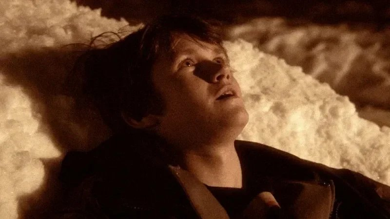

# Кто здесь мертвый? Мистическое «Наследие» Романа Михайлова — с отсылками к Балабанову — покажут в Москве. Не пропустите

- **URL:** https://novayagazeta.ru/articles/2023/06/27/kto-zdes-mertvyi-media
- **Дата:** 2023-06-27
- **Автор:** Лариса Малюкова

## Кто здесь мертвый?

## Мистическое «Наследие» Романа Михайлова — с отсылками к Балабанову — покажут в Москве. Не пропустите

Кадр из фильма «Наследие»

28 июня, в 19.30, в московском «Иллюзионе» можно увидеть фильм Романа Михайлова «Наследие». Он был в программе «Пример интонации». И вряд ли вы слышали про это атмосферное кино с воздухом. У авторского кино нет средств на рекламу.

Зато иногда это кино.

Маленький фильм Михайлова напомнил мне фразу из его рассказа про старый телевизор, который бьется током: «можно было поднести к экрану ладонь и погладить колкие колоски». «Наследие» — вроде бы мистическая сказка, при этом бьется током непричесанной, малоприветливой жизни. С германовской интонацией, сепия-изображением, деревянными бараками с запахом бедности. С тусней и гоготом подростков, курящих травку, слушающих русский рэп. С драками беспричинными. С репликами наезжающими друг на друга. С оглушительной, до немоты, первой влюбленностью.

Руслан (Олег Чугунов из фильма «Майор Гром…») навещает соседа, старого знахаря Тихона Сергеевича, прибитого к койке. Носит ему продукты, творог там и прочее. И перед смертью выцветший, как старое фото, кашляющий старик просит об одном: чтоб панихида была настоящая, не меньше часа.

Когда знахаря не станет, Руслан попросит местного священника отпеть доктора. Священник Руслана с детства знает, когда тот еще мальчишкой алтарником был. Еще говорил, что видел ангела. Но все равно священник откажет, был, говорит, Тихон старообрядцем. Точно знаю. Не положено. Руслан мотанется в город. Но и там от ворот поворот.

Да и из сельских на похороны никто не придет, уж как Руслан бился в двери соседей. Не положено.

Кадр из фильма «Наследие»

Правила, традиции, отжившее сильнее живых чувств, благодарности («Как же так, вы же все к нему ходили, он же всех вас лечил?»), памяти. Истинной веры. Кто здесь мертвый?

Поддержите нашу работу!

1000 500 300 Нажимая кнопку «Стать соучастником», я принимаю условия и подтверждаю свое гражданство РФ

Если у вас есть вопросы, пишите [email protected] или звоните:+7 (929) 612-03-68

И тогда Руслан смастерит сам… нет, не оружие, как брат Данила (рифма с балабановским кино здесь очевидна), а кадило — из железной кружки с цепочкой от ходиков.

И отмолит старика, отпоет.

Где-то за снежными могильными крестами ангелы в белых платьях прошелестят. А может, это Руслану показалось.

«Наследие» — четвертая картина режиссера и писателя Романа Михайлова по мотивам его рассказа из сборника «Праздники».

«Наследие» сняли за две недели с микробюджетом. Сейчас режиссер снимает пятую картину. Сборник «Праздники» опубликован.

### P.S.

P.S. После показа картины 28 июня в «Иллюзионе» состоится встреча с режиссером и съемочной группой.

Лариса Малюкова ведет телеграм-канал о кино и не только. Подписывайтесь тут.

Поддержите нашу работу!

1000 500 300 Нажимая кнопку «Стать соучастником», я принимаю условия и подтверждаю свое гражданство РФ

Если у вас есть вопросы, пишите [email protected] или звоните:+7 (929) 612-03-68
