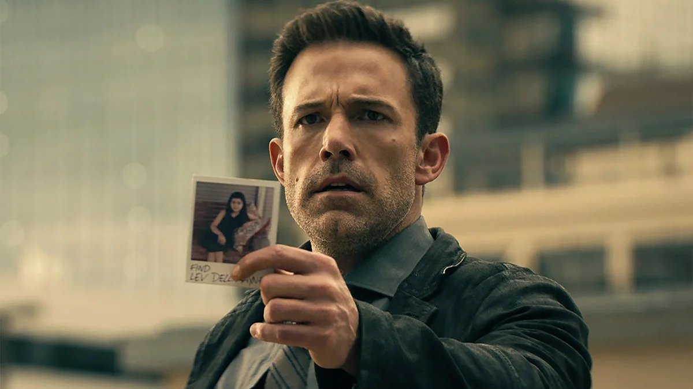

# Иллюзия гипноза. На экранах — фантастический триллер Роберта Родригеса с Беном Аффлеком

- **URL:** https://novayagazeta.ru/articles/2023/07/05/illiuziia-gipnoza-media
- **Дата:** 2023-07-05
- **Автор:** Лариса Малюкова

## Иллюзия гипноза

## На экранах — фантастический триллер Роберта Родригеса с Беном Аффлеком

Кадр из фильма «Гипнотик»

Все начнется с оглушительного стука шариковой ручки о блокнот. Детектив Дэнни Рурк (Бен Аффлек) на приеме у психотерапевта вспоминает драматическое событие — как в парке у него похитили семилетнюю дочь Минни. Тело ребенка так и не было найдено. Только блестящий флюгер, который был в ее руках. Рурк травмирован неискоренимым чувством вины за то, что не уберег Минни. Единственный способ остаться в здравом уме — вернуться к работе.

Его первое дело связано с ограблением очередного банка. Вроде бы и засада выставлена, и наблюдение. Но он чувствует, что все идет не так, и люди ведут себя странно. Он замечает загадочного высокого седого человека (Уильям Фихтнер), который, кажется, более чем случайно и косвенно участвует в разворачивающихся событиях. Постепенно выяснится, что этот таинственный незнакомец гипнотизирует людей, заставляя их выполнять его мысленные приказы. Именно поэтому служащая банка, посмотрев ему в глаза в девять часов утра, верит, что пора «сдавать кассу». Послушно спускается в хранилище, чтобы вынести сумку с деньгами. А после ее ухода Дэнни обнаруживает в банковской ячейке фотографию своей пропавшей дочери. Связь ограбления и киднеппинга становится очевидной. Единственная зацепка приводит Рурка к экстрасенсу Диане (Брага), которая знала этого седого незнакомца. Это Делл Рейн — самый могущественный и опасный из гипнотиков. Работающий для секретного правительственного агентства, которое готовило «гипнотиков», способных менять реальность для других, выполняя щекотливые задания.

Начало фильма «Гипнотик» увлекательное. Но дальше начинается путаница и дикое мельтешение. Авторы полагают, что точно так же, как персонажи играют в кошки-мышки друг с другом, так и они водят за нос зрителя, не слишком усердствуя. Неряшливо и суетливо.

Понятно, что на одних могущественных гипнотиков найдется «проруха» — еще более могущественные месмеристы. Вспоминается не самый удачный триллер «Утешение» 2015 года, в котором Энтони Хопкинс помогал ФБР, действуя как своего рода экстрасенсорная навигация.

Параллельно мы все узнаем о гипнотиках. Это люди со сверхмощными джедайскими способностями разума, которые могут создавать «конструкции» в сознании жертв. Своего рода художественный гипноз. Они способны влиять на людей, встреченных ими даже случайно на улице, с помощью изменяющего сознание гипноза. И уже «превращенные машины» с запущенной программой — по невидимому приказу начинают совершать преступления. По молчаливому требованию властного джедая убивать других или жесточайшим образом самоубиваться. Здесь, конечно, напрашиваются аналогии с современными обществами, в которых невидимые миру урфинджюсы при помощи самых разнообразных видов «гипноза» превращают людей в послушных пешек, посылая их убивать и самоубиваться.

Кадр из фильма «Гипнотик»

Разнообразные гипнотики рулят современной новостной повесткой. Чему мы — свидетели. Да и к чему менять реальность, если можно изменить ее восприятие?

Но Роберт Родригес (соучастник режиссерского созвездия в «Четырех комнатах», среди его знаменитых картин «Город грехов», «От заката до рассвета»), набивший руку на «Детях шпионов», к четвертому фильму превратившихся в боевитую жвачку, — не пользуется предоставленными экспозицией обещаниями. Он прессует историю в трудноразличимое мессиво экшена. Он вроде бы жонглирует реальностью и ее восприятием, изобретательными цифровыми трюками. Но в отличие от Кристофера Нолана, которому в этой картине старается подражать, его персонажи нарисованы одной краской, а сама история бежит по кругу, словно сбилась с маршрута.

Он приглашает на главные роли знаменитых и хороших актеров. Бен Аффлек («Влюбленный Шекспир», «Смерть супермена», «Операция «Арго»). Алисе Брага — одна из лучших актрис бразильского происхождения («Хищники», «Я — легенда»). Но Аффлеку, кажется, так и не объяснили, кого именно он играет: героя комикса, потерянного отца, супермена в области гипноза.

Временами кажется, что самого Аффлека перед съемками загипнотизировали, и он действует словно во сне. Никакой химии между ним и героиней Алисе Браги не существует.

Поддержите нашу работу!

1000 500 300 Нажимая кнопку «Стать соучастником», я принимаю условия и подтверждаю свое гражданство РФ

Если у вас есть вопросы, пишите [email protected] или звоните:+7 (929) 612-03-68

Уильям Фихтнер («Нашествие», «Побег», «Эквилибриум») — с примороженной маской злодея играет, как по нотам, то, что играл много раз: неуязвимого Акелу, который промахнется.

В фильме, во всяком случае его первой части, есть интересные крючки и зацепки, которые никак не срабатывают или развиваются с такими зигзагами, что забываешь, а собственно, к чему эти очередные погони и перестрелки. Сюжет больше сбивает с толку, чем увлекает.

Кадр из фильма «Гипнотик»

У Нолана были умопомрачительные повороты и сокрушительные падения из реальности в сон и обратно, но все это было жесточайшим образом привинчено к прописанному сценарному каркасу.

«Гипнотик» напоминает фильм, который снял по мотивам произведений Нолана искусственный интеллект. В общих очертаниях похоже. Но где-то не доиграл, где-то пережал. При высоком темпе развития событий в какой-то момент становится скучно. И уже ждешь не дождешься, когда этот заблудившийся в потемках взаимных гипнозов сюжет вырулит на предсказуемую мелодраматическую финальную прямую.

Лариса Малюкова ведет телеграм-канал о кино и не только. Подписывайтесь тут.

Поддержите нашу работу!

1000 500 300 Нажимая кнопку «Стать соучастником», я принимаю условия и подтверждаю свое гражданство РФ

Если у вас есть вопросы, пишите [email protected] или звоните:+7 (929) 612-03-68
