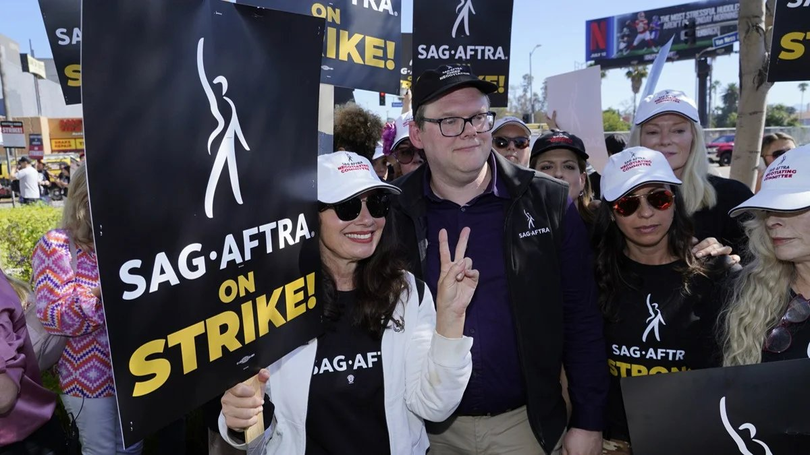

# Мэтт Деймон ушел писать пикетные плакаты. Почему бастуют актеры и сценаристы киноиндустрии США и какой ущерб нанесет второй в мировой истории временный коллапс Голливуда

- **URL:** https://novayagazeta.ru/articles/2023/07/15/mett-deimon-ushel-pisat-piketnye-plakaty-media
- **Дата:** 2023-07-15
- **Автор:** Лариса Малюкова

## Мэтт Деймон ушел писать пикетные плакаты

## Почему бастуют актеры и сценаристы киноиндустрии США и какой ущерб нанесет второй в мировой истории временный коллапс Голливуда

Фрэн Дрешер на забастовке Гильдии актеров и сценаристов. Фото: Chris Pizzello / Associated Press / East News

## «С жиру бесятся» или «отстаивают свои права»?

Комментарии в Сети свидетельствуют о градусе реакций, которые вызвала начинающаяся забастовка голливудских актеров.

Во второй раз в мировой киноистории два крупнейших голливудских профсоюза решили бастовать (первая совместная акция была в 1960-м, когда профсоюз актеров возглавил Рональд Рейган — собственно, с тех социальных протестов и начался дрейф актера в политику), остановив производство текущих и будущих проектов.

В 1960-ом забастовка продолжалась почти 150 дней. Как удалось прийти к соглашению?

Переговорам помогал влиятельный человек, медиатор. В 1960 и 1981 годах им стал «папа Голливуда», киномагнат Лью Вассерман. Он дипломатично и мастерски умел договариваться по самым непримиримым позициям конфликта. В юности он сам представлял интересы актеров, и отлично понимал их нужды.

Сейчас такого умного дипломата и уважаемого тяжеловеса в Голливуде не сыскать.

А сегодня актеры присоединились к голливудским сценаристам на пикетах в борьбе за более выгодные контракты с учетом развития стриминговых сервисов и новых технологий. Variety пишет, что текущий контракт между актерами и продюсерами истек в полночь по тихоокеанскому времени 12 июля.

Профсоюз, представляющий 160 000 голливудских актеров, готов к долгой к забастовке, так как переговоры с голливудскими студиями и стриминговыми гигантами не привели к соглашению.

«В старой модели получали гонорары в зависимости от успеха, — сказала в одном из интервью Ким Мастерс, главный редактор Hollywood Reporter, — в новой они не могут даже узнать, что происходит за кулисами, потому что стримеры не делятся информацией».

«Студии и стриминги внесли масштабные односторонние изменения в бизнес-модель нашей отрасли, в то же время настаивая на том, чтобы наши контракты оставались замороженными, — заявляет Дункан Крэбтри-Ирландия, главный переговорщик профсоюза. — Но они недооценили нашу решимость и скоро это поймут».

По словам Фрэн Дрешер, звезды сериала «Няня», активистки и президента SAG-AFTRA, реакция студий на требования актеров была «оскорбительной и неуважительной»: «То, что происходит с нами, происходит во всех областях труда, когда работодатели создают свой «Уолл-стрит», а свою жадность считают приоритетом, забывая об участниках отрасли, которые заставляют машину работать».

## Как это было

Еще в марте Гильдия сценаристов Америки (WGA) заявила о недопустимости использования алгоритмов искусственного интеллекта для создания текстов, драматурги сравнили ИИ-контент с плагиатом. Нейросети обучаются на текстах, защищенных авторскими правами, а затем сами компилируют на их основе новые произведения. Был подан коллективный иск против компании OpenAI — за незаконное использование защищенной информации при обучении искусственного интеллекта.

Гильдия киноактеров (SAG) не только подключилась к борьбе за более справедливое распределение прибыли и лучшие условия работы, но также пытается защитить актеров от манипуляций и спекуляций их цифровыми копиями. Профсоюзу необходимы гарантии того, что искусственный интеллект и сгенерированные компьютером лица и голоса не будут использоваться для замены актеров.

98% участников гильдии проголосовали за инициативу.

Забастовка Гильдии актеров и сценаристов. Фото: RW / Associated Press / East News

Напомним, на днях американская актриса Сара Сильверман, писатели Ричард Кадри и Кристофер Голден, а также радиоведущий Марк Уолтерс подали в суд на разработчиков ChatGPT, на Meta Platforms* и OpenAI за нарушение авторских прав. В исках утверждается, что ChatGPT, OpenAI и LLaMA Meta (языковая модель от команды Цукерберга) обучались на незаконно приобретенных наборах данных, содержащих в том числе и их работы.

Профсоюз работников исполнительского искусства Equity запустил в Великобритании кампанию «Остановите ИИ, который ворует шоу». Постепенно в индустрию проникают технологии дипфейков — цифровых аватаров, также созданных нейросетями. Пока это еще не слишком «дешево и сердито», но скорость развития технологий делает угрозу для реальных актеров вовсе не шуточной. Эту угрозу, считают активисты забастовки, их коллегам следует осознавать до подписания трудовых договоров, защищая свои права.

## Австралия поддерживает Голливуд

Исполнительный директор Австралийского союза СМИ, развлечений и искусства (MEAA) Эрин Мадли заявила, что профсоюз солидарен с членами SAG-AFTRA. Она считает справедливыми требования компенсаций, которые должны выплачивать потоковые сервисы, и поддерживает опасения актеров, ожидающих вытеснения их из киноиндустрии искусственным интеллектом:

«Потоковые сервисы получают миллиарды долларов дохода и прибыли, поскольку их аудитория продолжает расти, но эта прибыль, увы, не отражается на заработках актеров».

В соответствии с действующими в США договоренностями потоковые сервисы платят актерам меньшую комиссию за повторы фильмов и телесериалов, чем вещательное телевидение.

Поддержите нашу работу!

1000 500 300 Нажимая кнопку «Стать соучастником», я принимаю условия и подтверждаю свое гражданство РФ

Если у вас есть вопросы, пишите [email protected] или звоните:+7 (929) 612-03-68

## Последствия

Пока длится забастовка, актеры не могут сниматься в фильмах или даже участвовать в рекламных кампаниях уже снятых картин. А значит, пропадут средства, потраченные на рекламные мероприятия, в том числе — на премьерные показы и репортажи с красных дорожек. Многие премьеры могут отложить до осени. Увеличится и время создания целого ряда картин. Ведь даже когда съемки завершены, актеров будет невозможно пригласить для повторных съемок, постпродакшена, продвижения.

Актеры Киллиан Мерфи, Мэтт Дэймон и Эмили Блант покинули премьеру фильма Кристофера Нолана «Оппенгеймер», состоявшуюся в Лондоне в четверг вечером.

Эмили Блант и Килиан Мерфи на премьере фильма «Oppenheimer» в Лондоне. Фото: Vianney Le Caer / Invision / East News

Нолан рассказал зрителям, что звезды «ушли писать свои пикетные плакаты», добавив, что поддерживает их в их борьбе. Мэтт Дэймон заключил, что причины забастовки голливудских актеров «невероятно важны».

Скорее всего, могут пострадать и многие крупные релизы, находящиеся в производстве: от «Аватара» до «Гладиатора», продолжения «Мортал Комбата» и «Дэдпула 3».

Среди потенциальных жертв протестной кампании называют диснеевский «Особняк с привидениями». Под угрозой оказались «Андор», «Индустрия», «Плохие сестры», «Доктор Кто», «Веном-3» и «Миссия: невыполнима. Смертельная расплата, часть 2», а также долгоиграющие качественные сериалы. Знаменитости через Instagram* выражают поддержку забастовке. Среди них звезда «Лучше звоните Солу» Боб Оденкирк, «Секса в большом городе» Синтия Никсон и «королева крика» Джейми Ли Кертис.

Кадр из фильма «Особняк с привидениями»

Сейчас остановлено производство как минимум двух игровых фильмов, которые должны сниматься в Австралии на Золотом берегу — фэнтезийная картина Warner Bros о боевых искусствах «Мортал Комбат — 2» и драмы Universal Studios, основанной на романе Лианы Мориарти «Яблоки никогда не падают», с Сэмом Нилом и Аннетт Бенинг в главных ролях. Забастовка WGA уже привела к отмене ремейка классического фильма Фрица Ланга «Метрополис» 1927 года. Съемки восьмисерийного сериала для Apple TV должны были начаться в октябре в студии Docklands в Мельбурне.

Эксперты прогнозируют временный коллапс Голливуда. «Двойная забастовка» может остановить индустрию и в Австралии, и тысячи австралийских рабочих, вероятно, будут уволены из кинопроизводства, что подтвердили австралийские кинопродюсеры.

## Другая сторона

Генеральный директор Disney Боб Айгер полагает, что сценаристы и актеры не относятся к забастовкам «реалистично»: «Меня беспокоит то, что все это окажет разрушительное влияние на бизнес. Есть огромный побочный ущерб для людей, которые оказывают вспомогательные услуги. Это повлияет на экономику разных регионов… Это позор, это действительно позор».

Генеральный директор Disney Боб Айгер. Фото: Vianney Le Caer / Invision / East News

По его мнению, требования сценаристов и актеров «нереалистичны», а своими забастовками они усложняют и без того непростое состояние индустрии.

По данным Deadline, голливудские студии не планируют идти на уступки бастующим сценаристам и актерам. Они ждут, когда те останутся без денег и начнут терять свои дома и квартиры, чтобы во время переговоров диктовать свои условия любой возможной сделки.

Руководители крупных кинокомпаний называют это «жестоким, но необходимым злом».

От двойной забастовки пострадают и кинофестивали (ближайшие — в Мельбурне и Венеции). Организаторы уже ведут переговоры с возможными почетными гостями и звездами, согласовывая условия их визита.

Под большим вопросом проведение международной телевизионной премии «Эмми», которая должна состояться 18 сентября. По данным источников Deadline, премию могут перенести на январь 2023-го.

Пока стриминги не сдаются. «Нам пришлось строить планы на худшее. И поэтому у нас есть довольно солидный список релизов, чтобы затянуть эту ситуацию на долгое время», — сказал со-генеральный директор Netflix Тед Сарандос незадолго до начала забастовки сценаристов.

Скорее всего, забастовка не коснется независимого кино, снимающегося на небольших студиях, и дневных мыльных опер, сценаристы которых, как правило, не состоят в профсоюзах. Но одним «мылом» жив не будешь.

«Как долго это будет продолжаться?» — задается вопросом CNN Business. И не находит ответа.

Боб Айгер из Disney не предполагает, что решение будет найдено в ближайшее время, хотя переговоры будут возобновляться.

В любом случае, всем уже очевидно, что кинорынок переживает беспрецедентные революционные изменения, сравнимые с приходом звука или компьютера.

Сегодня меняются не только возможности производства и продвижения кино, но и всей экономики индустрии, взаимоотношений цехов, способов доставки фильмов и сериалов зрителю, который как будто в стороне от всех этих скандалов и акций. Но похоже, что и зритель, не дождавшийся премьер, окажется среди жертв «Двойной забастовки».

С утра пятницы, 14 июля, возле штаб-квартир кинокомпаний проходят пикеты участников забастовки.

### * Признана в РФ экстремистской организацией и запрещена

Поддержите нашу работу!

1000 500 300 Нажимая кнопку «Стать соучастником», я принимаю условия и подтверждаю свое гражданство РФ

Если у вас есть вопросы, пишите [email protected] или звоните:+7 (929) 612-03-68
