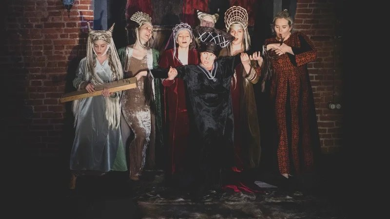

# Путь в никуда. После продления ареста драматургу Светлане Петрийчук и режиссерке Евгении Беркович мы решили посмотреть, как тема вербовки женщин исламистами отражена в экранной культуре. И почему это важно

- **URL:** https://novayagazeta.ru/articles/2023/07/18/put-v-nikuda-media
- **Дата:** 2023-07-18
- **Автор:** Лариса Малюкова

## Путь в никуда

## После продления ареста драматургу Светлане Петрийчук и режиссерке Евгении Беркович мы решили посмотреть, как тема вербовки женщин исламистами отражена в экранной культуре. И почему это важно

Спектакль «Финист Ясный Сокол». Фото: «Золотая маска»

Начнем с «виновников» судебного «торжества».

Драма Светланы Петрийчук «Финист Ясный Сокол»— о российских женщинах, завлеченных обманом в Сирию, где они становятся женами исламских радикалистов. В основе пьесы — материалы допросов и приговоров по уголовным делам против женщин, уехавших в Сирию, и после возвращения судимых за «пособничество терроризму». Большая часть действия проходит (по злой иронии) в стенах суда, где рассматривают дела этих обманутых женщин.

Автор не то что не скрывает, но осмысленно, страстно живописует пагубность их инфантилизма, доверчивости, неоправданных надежд и ошибок, ведущих к драматическому финалу.

Что толкает их в объятия военизированного домостроя? Прежде всего подлейший обман новоявленных «суженых-ряженых», которые даже лица свои скрывают, зато вяжут кружева высокопарных признаний, обещаний даров небесных. Зачастую причиной побега в бездну оказываются пыльные патриархальные нравы, грубость домашнего окружения и насилие, предательство близких, да просто одиночество и ненужность. Они бегут от насилия, из полымя патриархальной тюрьмы в преисподнюю смертоубийства.

И вот этот текст следователи, призывающие для новой лингвистической экспертизы региональную ФСБ, называют «оправданием терроризма»? Хотя всем очевидно, что Евгения Беркович создала не спектакль-оправдание, а спектакль-размышление над неудобными вопросами: как подобное могло происходить? почему? чего им не хватает в реальной жизни?

На подобные вопросы пытаются ответить авторы многих экранных произведений.

В фильмах и сериалах, касающихся этой общественно-значимой проблемы, авторы за авантюрным сюжетом пытаются высветить глубинную суть проблемы. Понять механику «очарования злом», а значит, спасти сотни, если не тысячи потенциальных жертв.

## Финист Билель

Самый известный мировой хит на эту тему — фильм Тимура Бекмамбетова «Профиль», снятый в формате скрин-лайф. Действие триллера разворачивается на экране компьютера — визуальной мозаики, соединившей соцсети, видео, поисковые системы, Skype, текстовые сообщения. Все вместе превращается в мотор действия, нервно пульсирующего в тактильных вибрациях, форшлагах, разворачиваясь в экранное зазеркалье, режим онлайн.

Кадр из фильма «Профиль»

Основано на мемуарах французской журналистки Анны Эрель «В шкуре джихадиста» (2015) — о том, как она создала поддельный профиль в Сети, изображая из себя новообращенную исламистку, дабы вступить в онлайн-контакт с вербовщиком из Алеппо. Ее визави — восхитительно красивый мусульманин британского происхождения, ставший солдатом Бога по имени Билель (Шазад Латиф). Увидев ее в хиджабе, Билель «потерял голову», уговаривал переехать в Сирию: стать женой, родить ему детей.

Любопытно, как сам скрин-лайф доказывает, что не только мы вторгаемся и обживаем виртуальное пространство, но само пространство вторгается в нашу жизнь, меняя ее необратимо. Мы теряем приватность, становимся прозрачными, манипулируемыми, а значит, беззащитными в этом мире.

Мы ведем параллельную жизнь с нашими вторыми цифровыми личностями. И других воспринимаем через их двойников. Такой искусственно созданный волоокий двойник-харизматик умело увлекает Эми в плен отношений, на которые она не рассчитывала. И в финале ей с большим трудом удастся из них вырваться.

### Тимур Бекмамбетов:

«Я считаю, что автор вправе думать и говорить то, что ему кажется важным и необходимым сказать людям. Ответственность по закону должна быть на тех, кто распространяет контент. Что касается темы терроризма, то мне кажется триллер «Профиль» помогает осознать опасность этого явления, предостеречь, предупредить… В моем «Профиле» та же история про соблазнение героини. Фильм лежит на двух крупнейших платформах: Кинопоиск и ИВИ».

Есть еще одна интенция, объединяющая разных героинь подобных фильмов: все они — недолюбленные, мечтают о взаимной любви. И экран вроде бы эту мечту осуществляет, однажды тебе дают понять-почувствовать, что ты единственная, тобой восхищаются. И ты не замечаешь, как безмятежная романтическая связь превращается в петлю.

Ведь с той стороны экрана — психологически выверенная, отработанная годами система вербовки, методики манипуляций, постоянная запись диалогов. И у «финистов» — долгожданных вымечтанных «принцев» — обычно сразу целый «куст» кандидаток в рабство. Об этом сериал «На краю».

Кадр из сериал «На краю»

## «На краю»

Это вам не маргинальный театрик на задворках. Это крупнейший федеральный телеканал «Россия-1», поднимающий ту же актуальную тему. У сериала «На краю», снятом компанией «Русское» по заказу «России-1», — более 17 миллионов просмотров. Он рассказывает и о технике вербовки девушек в ИГИЛ (запрещенная в России организация), и драме самообмана. Девушки оказываются заложницами не столько коварных террористов, сколько собственных иллюзий, поэтому и принимают за принца на белом коне — вербовщика Руслана в романтическом прикиде с подведенными печальными глазами. Калиф на час с томным взором является на сеансы свиданий в скайпе. Набив руку в вербовке, профессионально-душевно обрабатывает сразу двух девушек (в реальности случается и больше).

У каждой из его «невест» своя беда. Катя (Софья Шуткина) бежит из родного дома в Вологде от домогательств пьющего отчима (Николай Шрайбер), работает официанткой в ночном клубе, мечтает о небывалых деньгах. На этих крыльях самообмана летит с кружевным бельем в чемодане в «безопасную» Турцию, где «все включено», тем более что «возлюбленный» оплачивает ей дорогу. Значит, он ее ждет!

У студентки Лены внезапно грохнулся вдребезги ее хрупкий мир: молодой человек ее бросает, а у прекрасного отца (Николай Фоменко) обнаруживается любовница. Тут-то и возникает лис-Руслан, обещающий верность и новый дивный мир. И Лена едет на Восток — «на свою свадьбу», а оказывается в Халифате… Третья девушка — вдова боевика, которую травят односельчане, и ей кажется, что уж в Сирии-то ей будет спокойней.

Так все три молодые женщины оказываются сестрами по несчастью — пленницами боевиков. Их история, как и многие схожие, про то, как дьявол насилия порождает еще большее насилие.

## «Путь в никуда»

Документальный фильм «Путь в никуда» Антона Парахина, между прочим, создан при поддержке Министерства цифрового развития, связи и массовых коммуникаций РФ и Национального антитеррористического комитета России.

Кадр из документального фильма «Путь в никуда»

Несколько историй, объясняющих мотивы того, как человек может оказаться в террористической организации. Съемки в Омске, на Северном Кавказе, в Москве и Республике Башкортостан. Исповедь террориста, мнения экспертов в области профайлинга, психиатрии, представителей духовенства. Места съемок — следственный изолятор, центр информационной безопасности, центральное управление мусульман и институт психоанализа.

Эксперты уверяют, что попасть в сети экстремистов может едва ли не каждый. Как и многие авторы подобных произведений, режиссер стремится предупредить зрителей и называет свое кино скромно — «частью комплексной профилактической работы».

Авторы убеждены, что не только силовые органы должны заниматься этой проблемой, но и общество, искусство способны участвовать в создании иммунитета против идеологии насилия.

Большинство проектов на эту тему рождались по запросу общества и государства, тогда еще понимавшего, что без борьбы с насилием, в том числе домашним, подобных проблем не решить.

## Это нормально говорить о проблемах

«Небеса подождут» («Le ciel attendra») Мари-Кастиль Ментьон-Шаар — о двух французских девочках-подростках, завербованных агентами Исламского халифата. Режиссер признается, что ее фильм «возник из инстинкта и импульсов».

Поддержите нашу работу!

1000 500 300 Нажимая кнопку «Стать соучастником», я принимаю условия и подтверждаю свое гражданство РФ

Если у вас есть вопросы, пишите [email protected] или звоните:+7 (929) 612-03-68

Кадр из фильма «Небеса подождут»

Министр образования Франции рекомендовала картину учителям в качестве пособия и «образовательного инструмента» для противодействия и предотвращения этой социальной «эпидемии».

Двух девушек вербуют через соцсети исламские фундаменталисты, и в их семьях разворачиваются трагедии непонимания. До этого Соня и Мелани вели обычную жизнь: любящие родители, книги, друзья, школа. Но обычный подростковый бунт радикалисты используют для «промывки мозгов». И потрясенные родители ничего не могут изменить. Мелани будет слушаться исключительно «тайного друг», бросит занятия виолончелью, разорвет связи с подругами. Полностью подчинится воле новообретенного «принца». Он один в мире называет ее «неограненным алмазом». Девушки отправляются на поиски недостижимого рая, который им предлагает исламский радикализм в обличье «жениха»: вот тебе билет в Турцию, считай, прямой рейс в «рай».

Ощущение, что над головами опустошенных, подавленных личными проблемами героинь висит заклятье: на их глазах пелена. Они сами обманываться рады.

Готовы бесследно пропасть в Халифате, где вместо обещанного «рая» их ждет унижение, боль и кровь.

Сценарий основан на историях, рассказанных раскаявшимися девушками-джихадистками, бежавшими из Ракки, а также их семьями. В фильме поднята любопытная тема «дерадикализации», которой занимается реальный антрополог Дуния Бузар, руководящая Центром по предотвращению сектантских отклонений, связанных с исламом (CPDSI).

Авторы исследуют самый страшный и загадочный момент вербовки — согласие на совершение злодеяний. Показывают, что не только слабые и отчужденные молодые люди, живущие в неблагополучных районах, становятся жертвами вербовщиков ИГ, но и вполне благополучные. Виртуозы-вербовщики умеют подобрать ключ к каждому, подробно изучая своих жертв.

## «Халифат»

Шведский сериал Горана Капетановича, снятый в строгой скандинавской стилистике.

Кадр из сериала «Халифат»

Снова об уязвимости, неготовности защитить себя от «разведчиков», «злоумышленников», отправляющих тебя прямой дорогой в ад, который они именуют Эдемом. И здесь главные героини женщины, судьба которых так или иначе переплетается в Сирии: там готовится масштабная террористическая атака в Стокгольме. И вот подруги, ученицы старшей школы в Швеции Зулеха и Керима попадают под влияние джихадиста.

## Заколдованная

Фильм узбекского режиссера Хилола Насимова так и называется «Обманутая женщина» («Алданган аёл»). Как и в большинстве подобных проектов, в основе — реальные события. Героиня — хранительница очага. Заботливая мама двух детей, любимая жена. Ведет праведную жизнь и исповедует ислам, хотя в вере своей — неофитка. Намаз совершать не умеет, молится своими словами. Недавно потеряла маму, тоскует. Тут соседка и подсказывает средство утешения: за маму надо правильно молиться. Надо идти в «образовательный» центр читать Коран, священные Хадисы. Занятия два раза в неделю, никому не говорить, что посещает «клуб правоверных верующих».

И у молодой женщины «раскрываются глаза»: она больше не будет есть нехаляльную колбасу, не будет готовить запрещенные шариатом продукты. Она прячет волосы под хиджаб, в бешенстве рвет рисунки дочери — в Коране запрещено изображать лица.

Кадр из фильма «Обманутая женщина»

Словно под гипнозом погружаясь в веру, она отдаляется от семьи, готова жертвовать жизнью ради веры. Планирует совершить вместе с подружками священный хиджрат, мужьям велено солгать о командировке в соседний городок. Так женщины и оказываются в пакистанском лагере, где готовят шахидок, которые примут «мученическую смерть на войне против врагов, сражаясь во имя Аллаха».

## «Четыре дочери Ольфы»

Фильм из каннского конкурса нынешнего года. В экспериментальной докудраме оскаровской номинантки из Туниса Каутер Бен Ханьи актеры играют реальных людей. Имя Ольфы Хамруни, разведенной женщины из прибрежного городка Сусс, мелькало в заголовках газет лет семь назад, когда две из четырех ее дочерей исчезли из страны, чтобы стать шахидками, и, вероятно, погибли в Сирии.

Режиссер Каутер Бен Ханья пытается воспроизвести ключевые моменты этой трагической семейной истории. На экране сама Ольфа и ее младшие дочери, играющие самих себя. А в ролях сбежавших сестер — молодые профессиональные актрисы. Все вместе они действительно похожи на сестер. Щебечут, подтрунивают друг над другом. Доверительно общаются. Восстанавливают недавнее прошлое по крупицам.

Кадр из фильма «Четыре дочери Ольфы»

Звезда тунисского кино Хенд Сабри входит в кадр, чтобы сыграть Ольфу. Она расспрашивает свою героиню о жизни. Ольфа — харизматичная женщина вспоминает, как доставалось ей и дочерям от ее плешивого мужа-абьюзера. И как в первую брачную ночь она дала ему отпор: побила, чтобы «не приставал».

Постепенно в разговорах женщин обнаруживаются темные темы, о которых нелегко говорить, связанные с тунисской революцией 2010–2011 годов. События, изменившие арабский мир, а в итоге разрушившие семью Ольфы. Европейцу трудно понять, почему хиджаб и никаб стали для женщин символами освобождения: после тунисской революции многие девушки начали их носить в знак протеста против местного истеблишмента. И многие из этих девушек стали легкой добычей для идеологов «священной войны». Когда одна из дочерей Ольфы надевает хиджаб, сестры над ней издеваются: «Ты похожа на Бэтмена», в конце концов, все четверо одеваются в черное…

Реконструкция и реальные признания, игровые и документальные сцены в этом шероховатом фильме сшиты в одну историю вторжения внешней силы в семейные отношения. Историю неразрешимого конфликта поколений, ощущения вины и поиска недостижимой истины.

А Ольфа и поныне мучается вопросом: что она сделала не так, почему потеряла дочерей?

Удивительно ли то, что в мире, где, словно на войне, исчезают женщины и обнаруживаются в лагерях боевиков, авторы фильмов, сериалов, спектаклей не оставляют эту болезненную тему. Исследуют мотивы, первопричины, почему молодые женщины из бедных или самых благополучных европейских стран сломя голову летят в беспросветное никуда: вырываются из тлена несчастья? непонимания? насилия? ищут любви? Но ведь это даже не любовь, скорее гипноз, манипуляция, колдовство новой цифровой эпохи. И влюбляются все эти «марьюшки» не в конкретных людей — в придуманные образы «финистов» — приукрашенные иконки на мониторе компьютера. А в рабстве оказываются в самом подлинном. И потом, если повезет выжить, бежать из плена — возвратиться на родину в качестве заключенных.

Сегодня у нас создательниц такого профилактического, создающего иммунитет произведения судят… за само это произведение. Значит, на болезненную, сверхважную тему запрещено говорить? И пусть новые поколения девочек оказываются жертвами радикальных исламистов? А что, если это ваши соседки? подруги? дочери? Официальные российские СМИ утверждают, что террористы превратили вербовку девушек в индустрию. Противостоять им очень сложно. А теперь еще и говорить об этом запрещено.

Лариса Малюкова ведет телеграм-канал о кино и не только. Подписывайтесь тут.

Поддержите нашу работу!

1000 500 300 Нажимая кнопку «Стать соучастником», я принимаю условия и подтверждаю свое гражданство РФ

Если у вас есть вопросы, пишите [email protected] или звоните:+7 (929) 612-03-68
