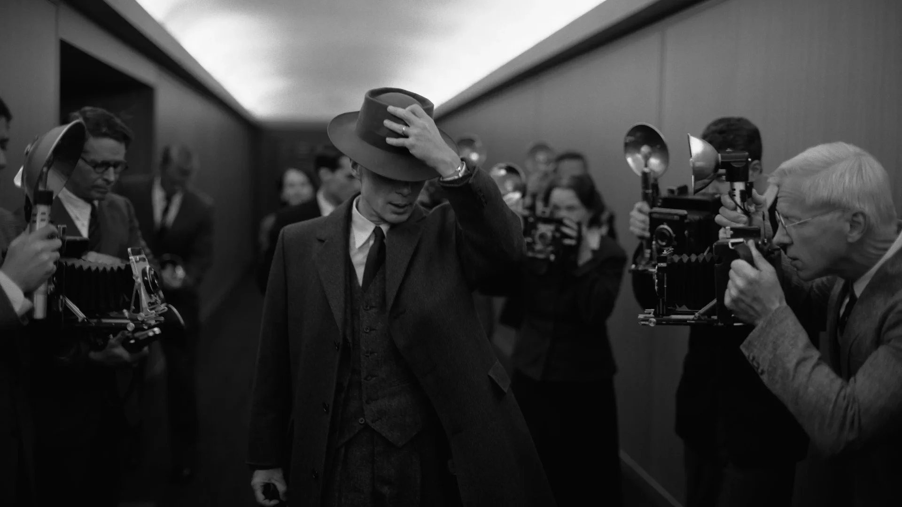

# «Оппенгеймер» — главный фильм года об открытиях, которые нас убивают. Амбициозный взрывной эпик, посвященный отцу атомной бомбы, уже на экранах. Но не в России

- **URL:** https://novayagazeta.ru/articles/2023/07/24/oppengeimer-glavnyi-film-goda-ob-otkrytiiakh-kotorye-nas-ubivaiut-media
- **Дата:** 2023-07-24
- **Автор:** Лариса Малюкова

## «Оппенгеймер» — главный фильм года об открытиях, которые нас убивают

## Амбициозный взрывной эпик, посвященный отцу атомной бомбы, уже на экранах. Но не в России

Кадр из фильма «Оппенгеймер»

Этот материал мы публикуем вместе с экологическим изданием «Кедр.медиа».

Кристофер Нолан снял напряженный интеллектуальный триллер об одном из главных ученых ХХ века, повлиявших на современную политическую повестку и изменивших траекторию развития человечества.

После неудачи «Довода», в котором режиссер за излюбленными играми в инверсии и переходы, захваты времени и сбивчивые алгоритмы потерял героев, превратив их в математические функции, выходящие из точки А в точку Б, он развернул оптику своего особого метода на внутренний мир героев. И определенно выиграл, выбрав для портретирования разрываемого противоречиями ученого, исследующего загадки нейтронных звезд и черных дыр, квантовой механики и электродинамики, влияющих в том числе и на поведение человека.

Его кино не байопик, а увлекательный зрелищный блокбастер об играх разума и их последствиях, созданный в формате 70 мм для IMAX и при этом скрупулезно документирующий бесконечную россыпь мелких подробностей, которые срастаются в историю ошеломительного взлета и сокрушительного падения Роберта Оппенгеймера,

возглавляющего сверхсекретный манхэттенский проект в Нью-Мексико.

Кажется, Кристофер Нолан («Начало», «Тенет», «Дюнкерк», «Темный рыцарь») строит фильм по законам квантового движения: вместо последовательно текущей истории — фрагменты. Герои, как частицы, могут перемещаться во временных и пространственных измерениях. Из малейших кирпичиков — диалогов, реакций, поступков, прозрений и ошибок — складываются и конкретные судьбы, и сам сюжет, и мироздание. В драматургический рисунок на равных вписаны запутанная личная жизнь физика-ловеласа, научные открытия, политические и философские дебаты — и геополитические интриги.

Киллиан Мерфи в роли Оппенгеймера. Кадр из фильма «Оппенгеймер»

Сценарий основан на удостоенной Пулитцеровской премии книге Кая Берда и Мартина Шервина — историков, собиравших в течение 25 лет материал про ученого и всех, кто так или иначе был связан с ним и его открытиями. Но режиссер, как и его герой, разбивающий об стену бокалы, чтобы понять механику взрыва, разбивает биографию физика-теоретика на осколки, которые складывает на экране в прихотливую мозаику уникальной судьбы.

Мы узнаем о пути молодого, блестяще образованного, но неудачливого экспериментатора (он ненавидел опыты и даже отравил с помощью шприца яблоко своего шефа, критиковавшего юного выскочку за нерасторопность) в фундаментальную науку. Кембридж, Геттинген (обучение под руководством Борна), Лейден (здесь он читал лекции о молекулах на голландском, переводы с санскрита), Цюрих, Беркли, Калифорнийский технологический институт, Принстон (где он стал директором и завкафедрой после Альберта Эйнштейна)…

Любитель Достоевского и Пруста, Элиота, древнеиндийского эпоса и Пикассо развивает квантовую физику как способ восприятия, понимания многофакторной реальности, не забывая о загадочной сути человека. Строит свой идеальный мир научных парадоксов, создает новую вселенную возможностей как новое мироздание — и разрушает ее. Ведь результатом запредельно отважных изысканий станут… бомбардировки Хиросимы и Нагасаки.

Сам фильм строится по принципу взрывного устройства. Споры о быстрых нейтронах, о морали ведения войны и способах ее остановить, о кровавом перекрестке между наукой и политикой, о «кольце всевластья», которое военные непременно отбирают у ученых, словно обладают накопительным эффектом

Кадр из фильма «Оппенгеймер»

И вот уже в пустыне Нью-Мехико под руководством генерала Лесли Гровса (Мэтт Деймон) — жесткого военного союзника, выбравшего Оппенгеймера на роль лидера Манхэттенского проекта, — с помощью всей инновационной мощи Америки как центр секретных изысканий строится «город для бомбы» Лос-Аламос. Три года и два миллиарда долларов налогоплательщиков… Они спешат, чтобы опередить нацистов, создающих свое смертоносное оружие (одна надежда на звериный гитлеровский антисемитизм, фюрер назвал физику жидовской наукой, мешая ей развиваться). Перед взрывом Гровс интересуется:

не может ли этот эксперимент оказаться смертельным опытом для человечества? И честный физик не может дать ему стопроцентной гарантии того, что бомба не превратится в начало апокалипсиса.

Разумеется, главный страшный «аттракцион», сам Trinity Test, созданный режиссером и выдающимся оператором, оскаровским лауреатом Хойте ван Хойтема практически без компьютерной графики, — это кульминация фильма. Гигантский экран IMAX используется не просто как полотно для живописания самой зрелищной и яркой вспышки смерти из всех возможных, в которой высвобожденная лучистая энергия плавит воздух, сыплет искрами и огненными линиями, разрастается в выросший до циклопических размеров ядерный гриб… Но силовым полем кинематографической энергии оказывается крупный план самого отца бомбы. Прозрачные океанические глаза Киллиана Мерфи, его замерший взгляд, в котором восторг и страх, завораживает. Похоже на магический сеанс связи. Словно герой в этот момент вспоминает пророческие слова своего любимого Бхагавадгиты «Я — смерть, разрушитель миров».

А после успешного испытания «Тринити» на полигоне Аламогордо крупные государственные чиновники решают, на какие именно японские города следует сбросить бомбу. По предложению одного из них сразу вычеркивают Киото — уж больно красивый древний город, чиновник там был с женой в качестве туристов.

Кадр из фильма «Оппенгеймер»

Оппи — как его называют друзья — произносит триумфальную речь перед коллегами и студентами после бомбежки, которая «должна остановить войну». И восторженная аудитория в его глазах корчится, плавится, рассыпаясь прахом. Ну да, слишком декларативно. Но Нолан никогда не боялся визуальных манифестов.

При этом в какой бы толчее сподвижников или злопыхателей ни находился Оппенгеймер, он существует отдельно, обособленно. Рассказывают, что для этого ощущения космического одиночества Мерфи во время съемок в Нью-Мексико держался особняком, практически не контактируя с группой.

…Он надеялся с помощью атома спасти Вселенную, а в итоге вместе с единомышленниками открыл двери смертоносным войнам и водородным бомбам. Добро пожаловать в ад. Цепная реакция действительно меняет атмосферу. Взорванная бомба меняет мир. И уже с вместе с Эйнштейном Оппи ищет ответы на тупиковые вопросы. А когда пытается остановить гонку вооружений, его обвиняют в нелояльности, потакании коммунистам и русским шпионам.

Поддержите нашу работу!

1000 500 300 Нажимая кнопку «Стать соучастником», я принимаю условия и подтверждаю свое гражданство РФ

Если у вас есть вопросы, пишите [email protected] или звоните:+7 (929) 612-03-68

Кадр из фильма «Оппенгеймер»

Как же похоже на историю Сахарова! Правда, речь идет лишь о допуске к секретности, а не о ссылке и искусственном кормлении во время голодовки. Но и в том, и в другом случае в основе — наивность веры в чистоту красивых теоретических идей, оторванных от их потенциальных сокрушительных последствий, пагубность «общей конструктивной работы» гения и правительства.

Американский Прометей, способный смотреть за пределы горизонта, воспринимал бомбу как гарантию мира, но она уничтожала города, бился за сдерживание ядерной гонки, но ускорил ее, был патриотом, но оказался жертвой травли за инакомыслие в эпоху победобесия красных Маккарти.

Сюжет сплетает личные, интимные связи Оппи с политическими потрясениями: Вторая мировая и гонка на опережение с нацистами. И на этом фоне — любовные романы невротика и ловеласа, в том числе с психиатром и коммунисткой Джин Тэтлок, повлиявшей на его взгляды. Начало холодной война и охота на ведьм.

Все эти события изощренный монтаж почти иррационально рассеивает в нелинейной кубической структуре фильма, собирая заново смыслы, проникая в сознание человека, в воображение человека, изменившего мир.

Голова ученого то покрывается пеплом седины, и взгляд его разочарованно меркнет, то он снова молод, горит, готов переворачивать науку и реальность.

Киллиан Мерфи в роли Оппенгеймера и Эмили Блант в роли его жены Китти. Кадр из фильма «Оппенгеймер»

Авторы различают разные периоды жизни Оппенгеймера с помощью цвета (основная часть повествования) и черно-белого изображения. Причем черно-белые флешбэки — эпизоды слушания по допуску к секретности в 1954 году, когда его допрашивают о прошлых связях с коммунистами, — режиссер монтирует со слушаниями в Сенате 1959 года, спровоцированные властолюбивым и артистичным, заботливым и ненавидящим Оппи, тихим и кипящим гневом, изощренным интриганом председателем Комиссии по атомной энергии США Льюисом Штрауссом. Роберт Дауни-младший упоительно играет поистине шекспировский образ змеи, спрятавшейся под камнем. И, вне всякого сомнения, заслуживает «Оскар».

Опираясь на книгу Берда и Шервина, Нолан ведет повествование через многочисленных реальных персонажей, через столкновения характеров. Здесь звезды в эпизодах и в крошечных ролях.

Роберт Дауни мл. в роли Льюиса Стросса. Кадр из фильма «Оппенгеймер»

Уроженец Венгрии физик-теоретик Эдвард Теллер (Бенни Сафди) отчаянно настаивает не необходимости разработки водородной бомбы, хотя для Оппи это еще один шаг в пропасть. Гровс верит в высшую привилегию их команды — стать частью «самого важного гребаного события в истории мира», и он отравлен подозрениями и поисками потенциальных советских шпионов (и ведь небезосновательно).

Мудрый, хотя и несколько увядший Эйнштейн (Том Конти), открытия которого остались в прошлом, доквантовом мире, но именно к нему в Принстоне бросается Оппенгеймер за советом в поиске безупречного этического решения трагической дилеммы, перед которой оказались ученые ХХ века. Отец квантовой физики и наставник Нильс Бор (блеклый и скучный Кеннет Брана) и саркастически зловещий президент Трумэн (искрометный эпизод с Гари Олдманом), для которого сомневающийся в своей правоте ученый — плакса и слабак. Подумаешь, «руки его испачканы кровью!», он протянет этому «недопатриоту» свой белоснежный носовой платок: «Не волнуйтесь, это у меня руки в крови!»

Женские роли для Нолана — как всегда, скорее «живой интерьер» для раскрытия характера героя. Эмили Блант достоверна в роли биолога Кэтрин Харрисон — жесткой и слабой, эгоистичной и сочувствующей, тихо спивающейся в пустынном Лос-Аламосе жены гения, но актрисе мало пространства для интереснейшего характера потерявшейся личности в зените славы мужа.

Беспощадная музыка оскароносца, талантливого шведского композитора Людвига Йоранссона («Довод», «Черная пантера», «Веном»), уместная в кульминации, к сожалению, терзает зрителя, не давая ему вздохнуть, на протяжении всего фильма.

Кадр из фильма «Оппенгеймер»

«Оппенгеймер» возвращает сотрясенному пандемией Голливуду большое зрелищное кино формате IMAX, завязанное на актуальных смыслах и сложнейшей моральной дилемме героя. На конфликтах, соединяющих развлечение с философским и человеческим опытом. На нерасторжимой связи науки и политики. Кино Нолана — о гении, застрявшем в мире абсолютов, вдохновившем своими догадками идеи разрушения, возлюбленным нации патриоте, оказавшемся одним из первых «мучеников маккартизма».

Режиссер и сценарист Пол Шредер («Таксист», «Умирающий свет», «Садовник») назвал картину «лучшим, самым важным фильмом этого века».

«Если вы хотите посмотреть один фильм на большом экране в этом году, им должен стать «Оппенгеймер». Я не фанат Нолана, но конкретно этот фильм срывает дверь с петель»,

— написал он в запрещенной в России сети. Фильма в России на большом экране легально не покажут. А жаль — устроить бы спецсеанс в Думе, некоторые депутаты которой призывают нанести «предупредительный ядерный удар»… Словно живут в параллельном пространстве, где люди не умирают от радиации и у политиков руки не испачканы кровью. За два года до смерти «отец бомбы» сформулировал отличие науки от поэзии: «Наука учится не повторять одни и те же ошибки».

Кстати, решение 1954 года об отзыве секретного допуска Оппенгеймера было аннулировано лишь в 2022-м, через 55 лет после его смерти, когда Нолан уже завершил съемки фильма о выдающемся ученом.

Кадр из фильма «Оппенгеймер»

Лариса Малюкова ведет телеграм-канал о кино и не только. Подписывайтесь тут.

Поддержите нашу работу!

1000 500 300 Нажимая кнопку «Стать соучастником», я принимаю условия и подтверждаю свое гражданство РФ

Если у вас есть вопросы, пишите [email protected] или звоните:+7 (929) 612-03-68
