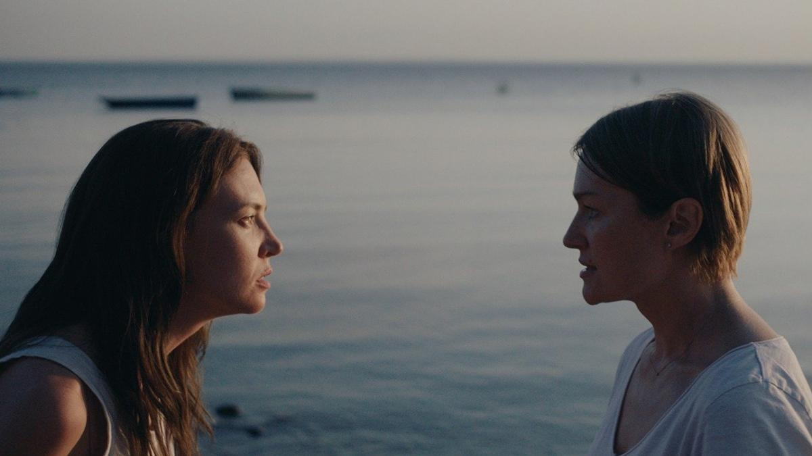

# Женский род, единственное число. Женская оптика в описании шершавой, путаной, неопределенной современности преобладает в конкурсе кинофестиваля «Выборг»

- **URL:** https://novayagazeta.ru/articles/2023/08/03/zhenskii-rod-edinstvennoe-chislo
- **Дата:** 2023-08-03
- **Автор:** Лариса Малюкова

## Женский род, единственное число

## Женская оптика в описании шершавой, путаной, неопределенной современности преобладает в конкурсе кинофестиваля «Выборг»

Кадр из фильма «Край надломленной луны». Источник: Кинопоиск

4 августа в стенах старой крепости открывается кинофестиваль, который перестал быть «Окном в Европу» (теперь он называется «Выборг»), но в отсутствии «Кинотавра» стал главным смотром авторского и мейнстримного отечественного кино.

Насчет давнего фестивального девиза «Прогноз на завтра» не уверена — сегодня этот прогноз все меньше зависит от самих кинематографистов. Больше от политиков и идеологов от культуры.

Конкурсная программа, составленная из игровой, документальной и анимационной секций, кажется неожиданно любопытной и разнообразной.

Первые фильмы игрового конкурса отмечены пристальным вниманием к женской теме. Так было однажды на «Кинотавре», тогда едва ли не разом появилось целое поколение: в режиссуру, в сценарное ремесло пришло много талантливых девушек. Готовых к личностному бескомпромиссному высказыванию. Снимающих кино со своей интонацией. Наталия Мещанинова с «Комбинатом «Надежда», Оксана Бычкова («Еще один год»), Тамара Дондурей («21 день»), Ангелина Никонова, Нигина Сайфуллаева («Как меня зовут»). Кстати, фильм «Как тебя зовут» по сценарию Любови Мульменко тогда даже получил диплом с формулировкой «За легкое дыхание»… А годом раньше были Авдотья Смирнова с психологическим женским поединком «Кококо» и Ангелина Никонова с «Портретом в сумерках».

В нынешнем году «они возвращаются». Правда, один из важнейших фильмов сезона Наташи Мещаниновой — «Один маленький ночной секрет» — был показан на фестивале Тарковского. Но по сценарию Мещаниновой в секции «Выборгский счет» будет «Край надломленной луны» Светланы Самошиной — фильм, получивший приз ММКФ (программа «Российские премьеры»). Программа «Выборгский счет» с этого года носит имя многолетнего президента фестиваля, недавно ушедшего Армена Николаевича Медведева.

Это кино о разрыве по живому внутри семьи, о растерявших понимание мамы (Виктория Толстоганова) и дочерей (Маша Лобанова и Анна Шепелева). На «чужой территории», в стенах пустующей дачи им придется докопаться до правды, о которой дома не принято говорить. Проговорить обиды. Признаться в предательстве, которое всегда можно объяснить-оправдать. Ложь во спасение часто оседает на дне отношений близких мутной неправдой, мешающей жить.

Кадр из фильма «Край надломленной луны». Источник: Кинопоиск

Фильм Открытия — «Нина» Оксаны Бычковой и Любови Мульменко (продюсер Екатерина Филиппова). Скромное европейское кино; может быть, местами слишком туманно прописанное, с большими припусками. О зыбких, летучих отношениях, в которых герои пытаются рассмотреть самих себя. Зато в этом фильме есть город-вселенная — Тбилиси, с вечными бродячими собаками, мальчишками, гоняющими мяч на узких кривых мостовых. Город, где прошлое не расстается с настоящим. Город, который кружит голову так, что это чувство можно перепутать с любовью. А любовь (или несостоявшаяся мечта о любви), как вино, здесь пьется смертельными дозами.

Кадр из фильма «Нина». Источник: Кинопоиск

Один из лучших фильмов конкурсной программы — «Привет, мама» Или Малаховой, о котором непременно расскажем отдельно. Тончайшим пером выписанная психологическая драма. Семейный портрет в интерьере Питерской Малой Охты. С одной важной подробностью: в семье этой живут исключительно женщины — две старших сестры и две младших сестры. А еще есть их воспитанник — сосед-аутист Петя. И рисунок их взаимоотношений напоминает «колыбель для кошки» — сложное плетение из меняющихся на глазах узоров взаимоотношений.

Кадр из фильма «Привет, мама». Источник: Кинопоиск

И даже в фильме «Лунатики» известного режиссера Юрия Мороза («Каменская», «Братья Карамазовы», «Угрюм-река») центральный образ — сильная, успешная женщина, self-made, которая не может смириться с потерей сына, сознательного наркомана. И она предпринимает чрезвычайные меры — процедуру психозондирования. Этот «прогрессивный» и экспериментальный метод психокоррекции использует профессор психологии, подключающийся к подсознанию и стирающий память. Авторы задаются вопросом о цене лечения — перемене личности. Ведь память во многом и определяет нашу идентичность. Но главная история фильма — выбор, который должна сделать героиня. Ведь для нее сохранение жизни сына равно потере сына…

Поддержите нашу работу!

1000 500 300 Нажимая кнопку «Стать соучастником», я принимаю условия и подтверждаю свое гражданство РФ

Если у вас есть вопросы, пишите [email protected] или звоните:+7 (929) 612-03-68

Четыре женщины приезжают на психологический тренинг к знаменитому специалисту, способному разрешать сложные семейные конфликты, неразрешимые ситуации. Но постепенно оказывается, что в осмыслении и проработке травм нуждается сам психолог. Драма «Осьминог» Алексея Степанова напоминает сериал «Девять совсем незнакомых людей» с Николь Кидман о границах реального и иллюзорного. Любопытно, что сам режиссер работал на ток-шоу «ДНК» и «Мужское/Женское», и, видимо, какие-то из историй героев программы стали основой сценария.

Кадр из фильма «Осьминог». Источник: Кинопоиск

«Блондинка» Павла Мирзоева снята по мотивам киноповести Александра Володина. Довольно сложная задача — приспособить-пришить володинский текст к сегодняшнему дню. Дарья Жовнер («Теснота», «Шторм») играет актрису, которой для собственной реализации никто не нужен. Она слишком верит в собственные силы. Отчаянно бьется за сохранение крошечного питерского театрика. И в этой праведной борьбе незаметно для себя разрушает отношения с близкими, в том числе с режиссером, которого любит (Евгений Цыганов).

Героиня «Отпуска в октябре» Романа Михайлова — тоже актриса. Света — петербурженка, выпускница театральной академии, повернутая на искусстве. И вот волей случая ее приглашают в некий туманный город на заманчивый болливудский проект, в котором собраны звезды кино, лучшие диджеи и хореографы страны. Но никто не знает сценария, по которому снимается фильм…

И название, и сама картина — отсылка к «Отпуску в сентябре» по пьесе Вампилова с Олегом Далем в роли Зилова. Ту картину Виталий Мельников тоже снимал в столице Карелии, на Кукковке. И как всегда, в картинах Михайлова сновидческое сплетается с реальностью. И возможно, все происходящее — это сон молодой советской актрисы из 70-х о будущем.

Председатель жюри игрового конкурса — режиссер Сергей Урсуляк, неигрового — Евгений Григорьев, анимационного — Денис Чернов. Так что фильмы с доминированием «женской темы», «женского ракурса» и неиссякаемого ресурса проблем будут судить в основном мужчины.

Лариса Малюкова ведет телеграм-канал о кино и не только. Подписывайтесь тут.

Читайте также

«Оппенгеймер» — главный фильм года об открытиях, которые нас убивают

Амбициозный взрывной эпик, посвященный отцу атомной бомбы, уже на экранах. Но не в России

Поддержите нашу работу!

1000 500 300 Нажимая кнопку «Стать соучастником», я принимаю условия и подтверждаю свое гражданство РФ

Если у вас есть вопросы, пишите [email protected] или звоните:+7 (929) 612-03-68
