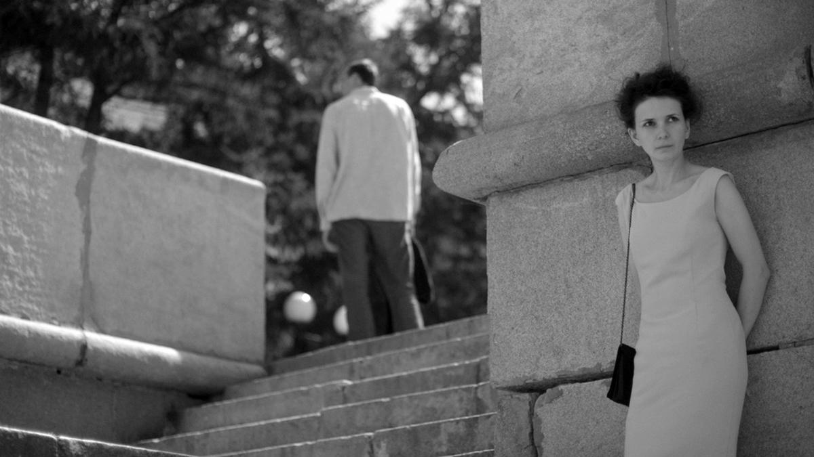

# Не тень мою, а свет. Кинофестиваль в Выборге продолжает удивлять качественным авторским кино. Представляем картины «Лиссабон» и «Свет»

- **URL:** https://novayagazeta.ru/articles/2023/08/08/ne-ten-moiu-a-svet
- **Дата:** 2023-08-08
- **Автор:** Лариса Малюкова

## Не тень мою, а свет

## Кинофестиваль в Выборге продолжает удивлять качественным авторским кино. Представляем картины «Лиссабон» и «Свет»

Кадр из фильма «Лиссабон»

Свести себя на нет, чтоб вызвать за стеною не тень мою, а свет, не заслоненный мною.

Белла Ахмадулина

## «Лиссабон»

Черно-белый «Лиссабон» Светланы Филипповой — оммаж кинематографу шестидесятых. Про таких, как Филиппова, говорят: визуал. Мне кажется, она сначала «видит» картину, потом придумывает сюжет. Как всматриваешься в чужие окна, за которым жизнь. Кажется, что и в игровом дебюте она рисует углем на прозрачных слоях краски. Впускает в кадр солнечные пятна, тени, полосы дождя. Придумывает живые картины за окном квартиры, в которой живет одна странная семья.

Когда читаешь сценарий, начинаешь «видеть» вместе с ней. Да и камера Андрея Найденова — не просто опора режиссерского замысла, это кино пишется камерой. Часто замеревшей в статике с завораживающим внутрикадровым монтажом.

Света Филиппова — известный и премированный режиссер авторской анимации. Снимала в порошковой технологии историю погружения в детскую фантазию («Ночь пришла»). Нашла свой фирменный «угольный стиль» и сочинила воздушную историю от лица маленькой героини — «Сказка Сары», в которой вороны спасают утопающего в снегу дворника. Потом смешала анимацию с хроникой в «Трех историях любви» о поэзии Маяковского, рассказала трагическую историю «Брута» — собаки, хозяйка которой стала жертвой Холокоста. Была еще экранизация Бориса Шергина, его «Митиной любви» — с наивной живописью Павла Леонова. Со скачущими на зебре людьми и смешным спектаклем «Гроза» на сцене провинциального театра.

Кадр из фильма «Лиссабон»

…Живет семья на первом этаже старого дома с палисадом. Мама Анна (Мария Смольникова), ее сын Иван (Степан Харченко), дочь Варя (Евгения Бурмака), исчезающий и периодически запивающий экс-муж Миша (актер «Коляда-театра» Олег Ягодин). Плюс приходящий поклонник Анны (Иван Орлов) и полноценный член семьи — пес.

И все здесь ужасно перепутано. Бывший муж Миша, который вроде ушел, но никак не может окончательно оторваться от семьи, маячит, как герои вампиловских пьес, во дворе перед окном. Даже вроде собрался умереть, но не умер… Дочь Варя поступила учиться в Лиссабоне в колледж, вроде даже стипендию обещают, но медлит с отъездом. И сама Анна никак не решится заново начать новую жизнь. Прячет от зашедшего навестить их экс-мужа пиджак своего нового поклонника.

Читайте также

Четыре сестры

Сегодня — российская премьера фильма «Привет, мама», одной из лучших картин выборгского конкурса и последнего времени

А Ваня много фотографирует и собирается поступать на операторский. Но почему-то сбегает с экзамена и гуляет под дождем по городу. В молчаливом протесте пытается пережить разлад внутри семьи. Дождь льет на книги, разложенные перед подземным переходом. И Ваня их под дождем читает. Шахматисты со стоической выдержкой под дождем продолжают шахматный поединок. Временами кажется, что весь город на экране — это дождь: пространство, запечатленное фантазией Ивана.

Парашютики от одуванчиков летят бесчисленными войсками, в кинотеатре идет «Аталанта», в киноинституте смотрят «Гамлета». Все изображение — кино в квадрате, все — воздух и поэзия. Порой даже кажется чрезмерным упоение этой невозможной красотой: в лужах, на пруду, облачный рай на небе. Светопись, графика, каждый кадр — черно-белая картинка. Хоть сейчас на сцену вешай.

Кадр из фильма «Лиссабон»

А еще здесь есть окно, в котором вершится «большая жизнь», — привет Хичкоку. Там, в окне, — люди со своей жизнью. Там свет. Там приезжает машина, из которой гуськом выгружается семейство. Там несчастный муж Миша. И мыкающийся в непонимании происходящего Иван. И какой-то пьяный сосед. И дети, которых зовут вечером домой.

Кульминация воздушной трагикомедии с элементами абсурда — эпизод в парке: какая-то девушка на другом берегу реки, догнав юношу, стреляет в него в упор. И тут же убегает. Анна смотрит на это и вздыхает, обращаясь к Варе: «Надо купить тебе новую сумку, в старой замок сломался». Анна Смольникова — чистый Епиходов в черном платье и балетках. Ее сбивает собака, она спотыкается, лодыжку тянет. И кажется, образ белой клоунессы Марии Смольниковой, соединившей воедино чеховские интонации с шекспировскими, — как нельзя более кстати.

Среди образцов, которые маячат на заднем плане поэтической истории о рвущихся связях и нежных, хотя и непричесанных отношениях родственников, вдруг ставших далекими: Иоселиани и Муратова, Антониони и Герман. Как сказал после показа Олег Ягодин:

«Я бы хотел в этом кино пожить. Сегодня все мечтают об успехе коммерческого кино, но нельзя забывать о кинематографе как искусстве».

Вот в этом-то и вопрос. Возьмут ли прокатчики эстетский фильм… или будут по-прежнему крутить «Вызов», выжимая недобранные или перебранные средства.

## «Свет»

Показали и работу, очевидно претендующую на главный приз. Это «Свет» Антона Коломейца.

Поддержите нашу работу!

1000 500 300 Нажимая кнопку «Стать соучастником», я принимаю условия и подтверждаю свое гражданство РФ

Если у вас есть вопросы, пишите [email protected] или звоните:+7 (929) 612-03-68

Кадр из фильма «Свет»

Удивительно, что этот фильм снял молодой режиссер. В нем столько горечи, тоске по несостоявшемуся. По жизни, которая прошелестела. Правда, Антон Коломеец не дебютант. Помимо короткого метра у него есть фильм «Ваш репетитор». Он писал сценарий яркого сериала «Чики».

Действие «Света» разворачивается сразу в двух временах. Сегодня — и в конце семидесятых. Жили-были две девочки. Отличница и троечница. Дружили взахлеб. До самого донышка. Гуляли по потрясающей красоты пруду, тонущему в тумане. Пели душевно романс Лиды из «Свадьбы Кречинского». Тогда все девочки пели: «Другому я бы солгала, а вам душой не покривлю. / Я только вас всегда ждала». Ходили на танцы, в походы с мальчиками. Слушали «Цветы». Засматривали до дыр «Романс о влюбленных». Менялись именами. Таня называлась Мариной, Марина — Таней. Пока Марина не влюбилась. И дружба не разбилась на ранящие осколки.

Но это была дружба, которая больше, чем любовь. И опыт. Поэтому из-под ее обломков так трудно выбраться.

В сегодняшнем дне встречаем Таню на рубеже ее шестидесятилетнего юбилея. Татьяна Сергеевна (Елена Яковлева) — сотрудница социальной службы. Живет самой обычной жизнью. Помогает другим, словно отдает какие-то долги. Ждет в гости взрослого сына. А когда тот приезжает, пытается мирить их с отцом. Потому что и конфликты в этой семье самые обыкновенные. Сын злится на отца за то, что тот смотрит телевизор. «А откуда же ты новости берешь? — бесится папа. — Чай твой интернет тоже врет». У сына ощущение, как и у мамы, — что живет не свою жизнь. Поэтому увольняется с денежной унылой работы — куда глаза глядят. Он не собирается жить, как мама, — для других. Хочет своего личного подлинного счастья. В этом фильме вообще нет правых и виноватых. Здесь у каждого своя правда. И свое сложное существование.

Среди подопечных Татьяны Сергеевны — пожилая дама, философ Ава, которая критикует Таню, вечную троечницу, за неправильные слова «кушать», «ложить»… А еще Ава путает Татьяну с приемной дочерью, давно потерянной. В общем, здесь все ищут потерянное.

Но только Татьяна однажды встретит Его.

Кадр из фильма «Свет»

Антон Коломеец снял картину, пропитанную атмосферой конца семидесятых. Здесь не только квартиры, одежда, но, кажется, воздух пыльных солнечных семидесятых. Писал сценарий два года. Признался, что родители ему очень помогали: рассказывали, исправляли, советовали. Антон говорит, что его кино — история его родителей, их юности. Главная героиня во многом списана с его мамы. А всю музыку тщательно подбирал папа.

«Свет» — мелодраматический (причем не стесняющийся откровенного мелодраматизма) кинороман про то, как прошлое встречается с настоящим. Как это больно. Хрупко. Нежно. Страшно. Как исчезает безвозвратно свет юности. Сломанный свет.

Елена Яковлева

В главной роли молодой режиссер видел только Елену Яковлеву и был счастлив, когда сценарий ей понравился.

Елена Яковлева — большая трагикомическая актриса. Об этом говорили мне и Герман, и Абдрашитов. И оба сетовали, что она свое дарование «смыливает» в сериалах. Оказалось, что не «смылилось» дарование. И ее героиня, с одной стороны, — тетка, которая может быть соседкой по подъезду, а с другой — мощного излучения личность, достойная быть центром этой вселенной. Этого «Света» и его конца.

И зал после показа не расходился. Один из зрителей сказал: «Когда смотришь ваше кино, кажется, что у режиссера было столько свободы!» Словно они с оператором Екатериной Смолиной взяли камеру и рассказали историю подлинных людей. Историю своих родителей. Историю зрителей, которые в двенадцать ночи стояли у кинотеатра.

Лариса Малюкова ведет телеграм-канал о кино и не только. Подписывайтесь тут.

Читайте также

Женский род, единственное число

Женская оптика в описании шершавой, путаной, неопределенной современности преобладает в конкурсе кинофестиваля «Выборг»

### Этот материал входит в подписку

Смотровая площадкаКино с Ларисой Малюковой

### Добавляйте в Конструктор свои источники: сайты, телеграм- и youtube-каналы

Войдите в профиль, чтобы не терять свои подписки на разных устройствах

Поддержите нашу работу!

1000 500 300 Нажимая кнопку «Стать соучастником», я принимаю условия и подтверждаю свое гражданство РФ

Если у вас есть вопросы, пишите [email protected] или звоните:+7 (929) 612-03-68
