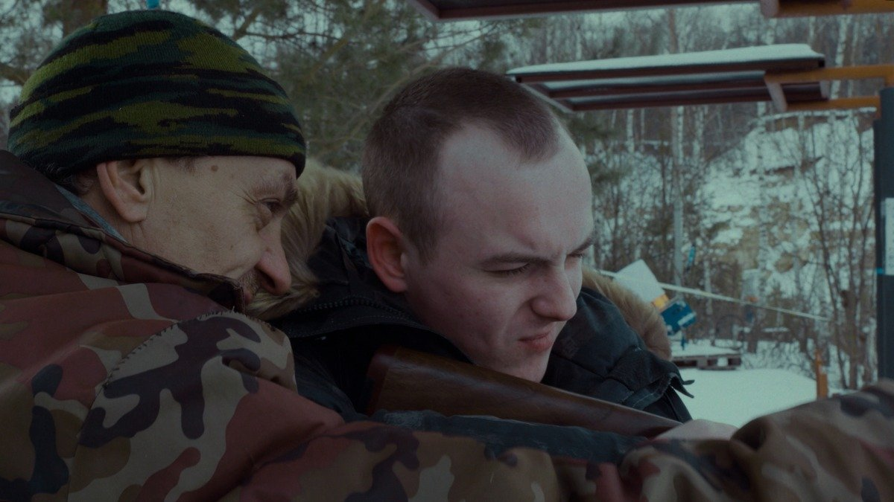

# Притвориться целым. Как эхо боевых действий докатилось до кинофестиваля в Выборге

- **URL:** https://novayagazeta.ru/articles/2023/08/10/pritvoritsia-tselym
- **Дата:** 2023-08-10
- **Автор:** Лариса Малюкова

## Притвориться целым

## Как эхо боевых действий докатилось до кинофестиваля в Выборге

Кадр из фильма «Дивный мир»

Сначала был мастер-класс председателя жюри Сергея Урсуляка. И один из известных прокатчиков спросил режиссера, почему тот не снимает кино по СВО и что по этому поводу говорит постоянный продюсер Урсуляка Антон Златопольский: «Златопольский отлично знает, — ответил Урсуляк, — кому предлагать снимать про СВО и кому не предлагать. Я не люблю снимать «про сегодня», потому что я — не новостная программа. Все, что нужно сказать про сегодня, я рассказываю в историях из прошлого».

И действительно, в недавнем «Праведнике» о партизане Николае Киселеве, спасшем жизни 218 евреям, которых он вывел во время Второй мировой из Белоруссии, захваченной фашистами, режиссер рассказал не столько о подвиге, сколько о человечности как главном антидоте против войны.

А в конкурсе неигрового кино была дебютная картина выпускника ВГИКа (мастерская Сергея Мирошниченко) Ивана Власова «Дивный мир».

Это история Никиты — самого обычного парня, вернувшегося в родной поселок где-то под Тулой с фронта. В феврале 2022-го он оказался на сборах и уже через два месяца под Харьковом потерял ногу.

С Никитой встречаемся, когда он примеряет ногу — протез. Поначалу жутко непривычно. Домой везет эту ногу отдельно. Надо будет научиться с ней жить.

Вагоны проходящего ночного поезда в темноте мелькают, как полосы трассирующих пуль.

Дома у Никиты — праздник. Мама, отец, брат, племянники. Родственники. Оливье. Лыхны. Слава богу, что все обошлось. У тех, кто лежал в госпитале рядом, и операции тяжелее, и гангрена…

Кадр из фильма «Нога»

Жаль, конечно, что нога — правая. Водить машину трудно. Но Никита тренируется. Он сильный. Он справится. В спортзале смотрит, как сверстники играют в футбол, а поздно вечером сам пытается играть. Силу удара трудно рассчитать. Нога пока не очень слушается. Вот эта его новая нога.

Парень, на изумление, искренний. Видимо, они с режиссером не только сверстники, но знали друг друга. Отсюда такая искренность. Вспоминает тех, кто был рядом. Близнецов, которым было по 19, которые не могли друг без друга. И что с ними случилось.

Его расспрашивают близкие — про ощущения в ноге. Ну какие ощущения? Похоже на электрический разряд. Или уколы иголкой. Временами тянет-ноет эта правая нога… И чешется. Хотя она осталась там… Фантомные боли. Кошмары ночью опять же…

Есть мирные эпизоды: крещение младенца в церкви. Какая-то молодежная вечеринка. Баня с отцом, где они утопают в паре (здесь вспомнится баня и стирка из лучшего и очень страшного фильма Александра Расторгуева «Чистый четверг», в котором солдаты перед отправкой на фронт словно проходили сквозь Чистилище).

Странным образом общительный Никита выглядит так, будто он не со всеми — отдельно. Есть даже сцена (впрочем, похожая на инсценировку), в которой он бреет голову. Теперь он — точно другой.

Отец Никиты вздыхает: «Не дай бог, снова мобилизация». Но если что, он бы лучше сам пошел. Его поколение вроде посильнее будет, чем эти юные.

Поддержите нашу работу!

1000 500 300 Нажимая кнопку «Стать соучастником», я принимаю условия и подтверждаю свое гражданство РФ

Если у вас есть вопросы, пишите [email protected] или звоните:+7 (929) 612-03-68

Никита планирует устроиться работать в военкомат — заниматься запасниками. Проверять «бронированных» на предприятиях.

Ко всему можно привыкнуть. Главное, научиться жить без таблеток. Тут важно настроиться на правильную жизнь в Новом Дивном Мире.

К огорчению мамы, с девушкой — расстался. Причем как-то незаметно. Не может вспомнить, когда? Может, на 8 марта? Нет, не помнит. А зачем встречаться, если чувств нет?

…Никита через какое-то время все-таки устроился на работу в военкомат. Собирается отправлять воевать только тех из добровольцев, кто действительно здоров, готов, так сказать, морально и психически. «Ищу, — говорит, — в глазах людей смерть, пытаюсь сберечь, чтобы не погибли».

А в новостях про то, что депутаты упрощают призыв, вводят электронные повестки и наказания для тех, кто попытается нарушить новый закон.

В финале — хроника и фото проводы новобранцев. Под песню поэта и музыканта Ильи Мазо:

С горочки с горочки

саночки саночки

ай полетели вниз

кочечки кочечки

ямочки ямочки

а ты родной не боись

Тем кто упал

с неба будут подарочки

ясные звезды зажглись

так что вставай

и снова на саночки

и полетели вниз

Кадр из фильма «Нога»

Маленькая скромная честная картина — выхваченная сочувствующей камерой судьба человека. Для молодого автора — попытка рассмотреть сверстника, оказавшегося в воронке исторических испытаний.

Когда смотрела, вспоминала громкий фильм-миф, фильм-легенду — «Ногу» Никиты Тягунова — дикий смех и беззвучный плач на потерю целого поколения. Тех, кому выпало исчезнуть в пыльном Афганистане на чужой войне, вернувшихся «грузом 200». «Нога» — фильм-бумеранг, поставивший безошибочный диагноз распространенной социальной болезни более 20 лет назад. От которой так и не вылечились. Рассказавшей о незалеченной фантомной боли, о приговоренных к подвигам и расплате за них. В том фильме Мартын — предшественник не только Никиты, но и Данилы Багрова — выжил вроде. Ему тоже протез выдали — чудо какой! Экспериментальный! И фантомной боли почти не было! Но так и остался он отдельным инфантильным отрезанным ломтем. Жертвой и героем на час. Человеком войны, который пытается притвориться целым. Быть похожим на тех, которые рядом. Но в кривом зеркале реальности, по меткому определению Майи Туровской, мира нет, там «война как состояние мира». Поэтому и нога Мартына самостийно бродит где-то поблизости. Живет своей жизнью.

Название фильма Ивана Власова отсылает к антиутопии Хаксли, описывавшему «Общество всеобщего счастья»

Посвящается картина «Разбитым надежам и несбывшимся мечтам. Всем живущим в смутные времена».

Лариса Малюкова ведет телеграм-канал о кино и не только. Подписывайтесь тут.

Читайте также

Не тень мою, а свет

Кинофестиваль в Выборге продолжает удивлять качественным авторским кино. Представляем картины «Лиссабон» и «Свет»

Поддержите нашу работу!

1000 500 300 Нажимая кнопку «Стать соучастником», я принимаю условия и подтверждаю свое гражданство РФ

Если у вас есть вопросы, пишите [email protected] или звоните:+7 (929) 612-03-68
