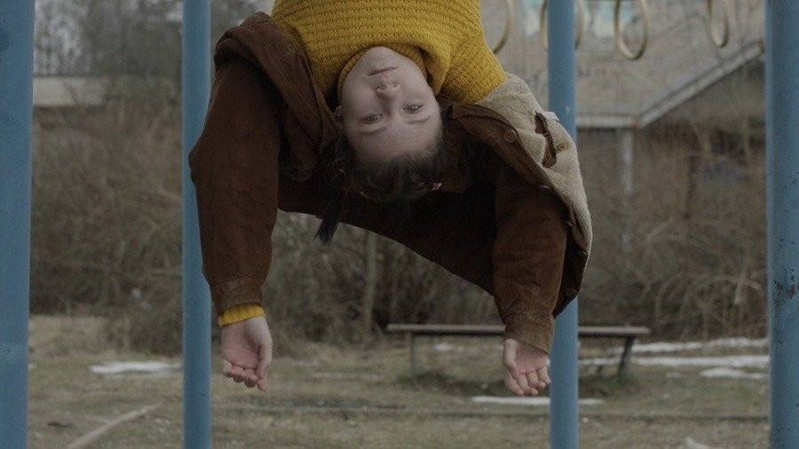

# Конец света, моя любовь? Что показали на самом молодом кинофестивале — «Короче»: обзор лучших фильмов и вердикт жюри Германа-младшего

- **URL:** https://novayagazeta.ru/articles/2023/08/22/konets-sveta-moia-liubov
- **Дата:** 2023-08-22
- **Автор:** Лариса Малюкова

## Конец света, моя любовь?

## Что показали на самом молодом кинофестивале — «Короче»: обзор лучших фильмов и вердикт жюри Германа-младшего

Кадр из фильма: «Конец света, моя любовь»

Это один из самых молодых киносмотров. Средний возраст кинематографистов примерно двадцать пять лет.

## Мне надо вам что-то сказать

И поначалу кажется, что начинающие режиссеры, не скованные диктатом продюсеров, более свободны в выборе темы и ее решении. Например, рассказать о смерти любимого кота, которого надо похоронить («По-человечески»), на языке отвязной черной комедии, да так, чтобы зрительный зал хохотал, а на титрах грустил.

Рассказать о тотальном одиночестве и парадоксальной оптике художника. В ретро-параболе «Биг» Ольги Дымской скрипач-гастролер входит в крошечный номер старинного отеля. С трудом раскладывает старое узкое кресло-кровать. Пытается заснуть, буквально стиснутый стенами и низким потолком «пенала», тишину которого периодически разрывает то скрип, то кашель невидимых соседей. Потом концерт. Мы видим только трудный шаг на сцену за красный бархатный занавес. И снова «теснота»… В финале, наконец, увидим его «пенал», оказавшийся гигантским пространством (приз за операторскую работу).

Кадр из фильма «Биг»

Многое вообще здесь было впервые. Например, история о проблемах интерсекс-людей, рожденных с половыми признаками, не вписывающимися в стереотипы бинарной системы «мужское/женское».

В патриархальном обществе истории о гендерных особенностях приравнивают к протестным заявлениям. Тем более рассказанные с такой степенью подключенности, когда не можешь не подключиться к переживаниям и душащему страху героини.

Сирота Лиля (Саша Быстржицкая) живет в многонаселенном общежитии, ждет операции и до смерти боится, что ее разоблачат. «Мне надо вам что-то сказать» Евгения Марьяна — взволнованное, психологически убедительное действо. И в конце — важный для этой истории твист. Вообще неожиданный яркий финал сегодня редкость в кино, независимо от его хронометража. В титрах указано, что в России проживает около 2 млн людей с разными интерсекс-вариациями. Жюри короткого метра под управлением Алексея Германа удивило бескомпромиссностью, наградив фильм Евгения Марьяна главным призом.

Кадр из фильма «Мне надо вам что-то сказать»

Есть фильмы, в которых наше раскаленное тревогой время получает неожиданное отражение.

«Здесь и сейчас» Павла Королько вроде бы ни о чем. Как ехали четыре друга на раздолбанной шестерке к морю. Машина заглохла, они вдрызг разругались. А потом произошло обыкновенное чудо. И вроде бы все прекрасным образом наладилось. Но «Авторадио» фоном сообщает про мобилизацию, и вся эта милая чепуха: ссоры, влюбленности, обиды этих мальчиков и девочек и песенка «Подарите мне собаку-барабаку», — словно растворяются в дымном и непредсказуемом «сейчас».

Павел Королько из мастерской Соловьева. Видимо, от учителя у него способность через малое, вроде бы второстепенное говорить о важном, больном. Ненатужно. «Рассекая темноту». Чтобы ветер, как говаривал Сергей Александрович, из левого уха гулял в правое.

Кадр из фильма «Здесь и сейчас»

Подводя итоги, замечу, что

в картинах начинающих авторов доминирует, как бы сказать поточнее… Осторожная храбрость. Когда говорят о том, что волнует, но с оглядкой.

И поэтому много картин в жанре анекдота. Эти жанровые «пирожки» разлетаются по фестивалям. Но и в анекдоте можно почувствовать «ветры перемен».

В «Прическе» Артема Захарьяна сюжет — проще не бывает. В свой день рождения молодой человек взял, да и изменил прическу, сделав себе смешную челку треугольником. Подумаешь, скажете вы. Но с вами бы не согласился его тесть. Он молча сверлил взглядом этот вызывающий крамольный «угол». Потом взорвался, подобно герою Меньшова в «Курьере», и разразился схожим монологом о порочном поведении юного отщепенца, отринувшего великие заветы и традиции.

Из искры непонимания разгорелось пламя нерешаемого конфликта между поколениями. Тут и: под чью дудку танцуешь? И про англосаксов с их неутомимым заговором. И страшное подозрение: а не педераст ли он, а его челка — каминг-аут.

Маловато актуальных высказываний. Я не про политику. Про воздух времени, без которого кинематограф задыхается. Про «косой стремительный угол», неочевидное, непредсказуемое.

Но есть фильмы-исключения.

В целом ряде картин авторы передают свое мироощущение, свой сигнал SOS через оптику жанра. Например, love story. В «Я без тебя не могу так больше» молодая пара настолько вязнет в своем неразрешимом конфликте, что решается на красивый прыжок с крыши. Только мальчик (Олег Савостюк) сдержал слово, а девочка (Мариам Псутури) привычно отменила собственное же решение и сбежала… в жизнь.

Поддержите нашу работу!

1000 500 300 Нажимая кнопку «Стать соучастником», я принимаю условия и подтверждаю свое гражданство РФ

Если у вас есть вопросы, пишите [email protected] или звоните:+7 (929) 612-03-68

Кадр из фильма «Я без тебя не могу так больше»

В фильме «Конец света, моя любовь» Алины Сорокиной Ромео (Максим Карушев) и Джульетта (Маша Лобанова) решают не ждать близкого Апокалипсиса и отправиться на последнюю войну мира. Для этого они даже воруют на рынке бушлаты. Только все идет не по плану.

«Папа» Виталия Уйманова — о цене исполняющихся желаний. Молодая жена загадывает себе ребенка. И муж с зимней рыбалки приносит не лягушку, а неведому зверушку: вроде бы рыба, но с ручками. Маленький монстр-младенец плачет от голода. Надо его кормить. Муж уходит за молоком в стужу из облупленной, страшно убогой квартиры с протекшим потолком, обвалившейся плиткой в ванной. У картины печальный исход, потому что выбор приходится делать самим людям, не полагаясь на высшие силы.

Хорошо, что короткий метр не ограничен форматами. Жюри отметили рукотворную анимацию «Расцветшая зима» Александра Бруньковского. Интереснейшая работа, сделанная в уникальной технике. Это не ротоскоп, как написали коллеги, а сложно устроенный «эклер», в котором есть съемка актеров, снятые кадры преобразованы ожившей живописью. Получилась красивая грустная история о расставании… как еще одном проявлении любви. Мне кажется, Гуэрра бы одобрил. Во всяком случае, Лоре Гуэрра очень нравится работа. Она снята на итальянском и будет показана, надеюсь, не только в России. Для поддержки подобных картин, превращающих экран в произведение искусства, и существуют фестивали.

Эскизы к анимационному фильму «Расцветшая зима»

## За правду

Впервые на фестивале была программа полнометражных дебютов.

Жюри дебютов предпочло комедии с разными оттенками. Главный приз получил Байбулат Батулла за трагикомедию «Бери и помни». Батулла — тонкий автор, и что не менее важно — очень хороший, эмпатичный парень. С отличным чувством юмора. Уверена, что эта награда поможет маленькому фильму о жизни и смерти в продвижении. Молодой автор храбро размышляет о «возрасте дожития», пытаясь не только увидеть в нем просто жизнь, но зажечь этот угасающий огонь. Отдельно отметили работу Рабита Батуллы — отца режиссера, чем-то похожего на Миядзаки (отсюда и японский акцент в фильме). Еще бы я заметила, что это редкий пример рассказа о современной деревне без телевизионных штампов и вранья. В массовке снимались жители деревни Малый Ошняк.

Кадр из фильма «Бери и помни»

Почему-то председателю жюри Борису Хлебникову в этом году хотелось поощрять комедийное или с элементами комедии кино. Может, чтобы утешить аудиторию. Наградили и меланхолическую комедию «Чайка». Юная постановщица Полина Лазарева считает, что сняла галлюциногенный триллер. Усталый Юрий Быков в роли писателя, возрастного ловеласа, которому «раба любви» Веры Кинчевой готова отдать все… кроме чувства собственного достоинства. Писатель посещает возлюбленную не чаще чем два раза в месяц, скрывая разнообразную личную жизнь. Лучшее что написал — когда написал в раковину. Такой примерно юмор. Хотя есть в фильме просто отличные ядреные сцены — это миражи недолюбленной женщины, в которых она расправляется с этим, так сказать, недо-Гумбертом Гумбертом.

«Женская тема» — главная в Выборге — на «Короче» оказалась на периферии. Потому что авторки пережевывают снова и снова конфликт матерей и дочерей, на разных лад рассказывая истории взросления. «Летом асфальт теплый» Ирины Бас — кино не слишком оригинальное; заметим, что сценарий сбоит практически во всех фильмах. Но это живое кино. Жаль, что не отметили страстную, навзрыд работу Маши Мацель в этой картине.

За бортом остались интересные работы. Больше всего жаль «Крецула» Александры Лихачевой, переосмысливающей жанр «спортивная драма». Авторское кино с молдавским темпераментом, в котором сразу два интересных сложных главных героя. Но против фильма сыграла техника. На показе был такой звук, что разобрать речь актеров было непросто.

Кадр из фильма «Аквариум»

«Аквариум» Ильи Шагалова и продюсера Сабины Еремеевой награжден спецпризом. Антиутопию снял видеохудожник из «Гоголь-центра» Илья Шагалов. Герои Алексея Филимонова и Дарьи Урсуляк живут в стерильном кластере-аквариуме, в обществе без насилия, где не только агрессия, но любое слишком эмоциональное поведение пресекается. Эта толерантность, доведенная до абсурда, управляется страхом, доносительством, оглядками одних на других,

В выверенном до микрона мире с зеркальными панелями, гигантскими стеклопакетами — выверенная геометрия, правильные краски, хайтек, идеальной формы костюмы. В саунтдтреке «Долгая счастливая жизнь» Егора Летова, превращенная в мистериальное песнопение ангельскими голосами. Нарушители идеального миропорядка сначала превращаются изгоев, а после третьего предупреждения исчезают в таинственном Анклаве, откуда нет пути назад. Чем не СИЗО. У приза жюри остроумная формулировка для фильма-антиутопии — «За правду».

Мне показался интересным зачин, настроение и тема фильма «Правда». О мучительном выборе в отсутствие выбора. Женя (Кузьма Котрелев) знает правду о пропавшем в городе ребенке. Но он недавно вышел из тюрьмы и за огласку этой правды может снова сесть. Начавшись за здравие, психотриллер Максима Кузнецова развернулся в банальный теледетектив с Кириллом Кяро в роли очередного следователя.

Кадр из фильма «Правда»

Среди выводов.

- Сегодня жанр «историческое кино», и прежде всего — фантастика, едва ли не единственный способ говорить об актуальном, о болезнях общества и неразрешимых вопросах.
- В отсутствие полноценного проката авторского кино фестивали дают возможность авторам заявить о своих картинах, предъявить себя и свое высказывание так, чтобы оно было услышано.

Лариса Малюкова ведет телеграм-канал о кино и не только. Подписывайтесь тут.

### Этот материал входит в подписки

Смотровая площадкаКино с Ларисой Малюковой

Культурные гидыЧто читать, что смотреть в кино и на сцене, что слушать

### Добавляйте в Конструктор свои источники: сайты, телеграм- и youtube-каналы

Войдите в профиль, чтобы не терять свои подписки на разных устройствах

Поддержите нашу работу!

1000 500 300 Нажимая кнопку «Стать соучастником», я принимаю условия и подтверждаю свое гражданство РФ

Если у вас есть вопросы, пишите [email protected] или звоните:+7 (929) 612-03-68
