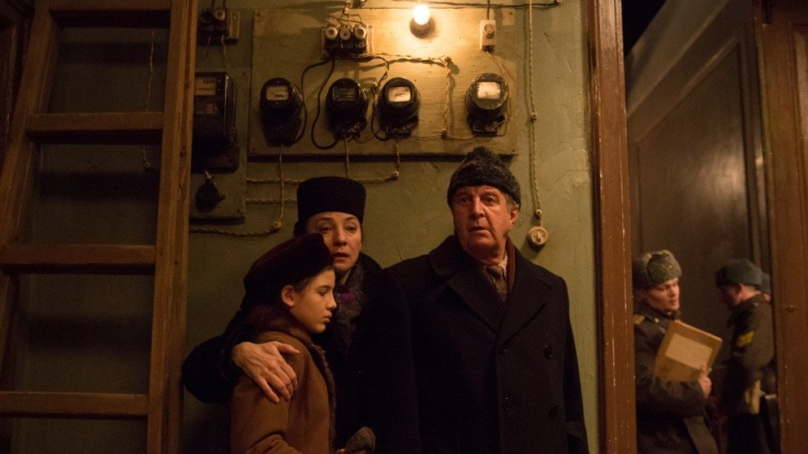

# Кадров лишают. Получившие прокатные удостоверения картины «Капитан Волконогов бежал» и «За нас с вами» сняты с показа после доносов. А пиратской «Барби» ничего не угрожает

- **URL:** https://novayagazeta.ru/articles/2023/08/29/kadrov-lishaiut
- **Дата:** 2023-08-29
- **Автор:** Лариса Малюкова

## Кадров лишают

## Получившие прокатные удостоверения картины «Капитан Волконогов бежал» и «За нас с вами» сняты с показа после доносов. А пиратской «Барби» ничего не угрожает

Кадр из фильма «За нас с вами»

## Пример первый. Можно, но нельзя

Все начиналось здорово. Даже слишком. Расположенный в Москве Музей истории ГУЛАГа объявил о показе двух ярких картин о сталинских репрессиях. Замечу, не публицистических, а именно что художественных произведениях. «Капитан Волконогов бежал» Натальи Меркуловой и Алексея Чупова и «За нас с вами» Андрея Смирнова. Фильмы должны были показать в рамках акции «Ночь кино».

Обе картины не выходили в широкий прокат в России, хотя официально и не запрещены. Более того, у обеих лент есть прокатное удостоверение, выданное Минкультом.

Премьера «Капитана Волконогова» состоялась осенью 2021-го на Венецианском кинофестивале. Это история раскаявшегося капитана НКВД, которого блистательно сыграл Юра Борисов. Он хочет найти и получить прощение родственников невинно убиенных. Вот такая «крамола».

Кинороман «За нас с вами» — о том, как одна семья, одна коммуналка переживает череду страшных событий на фоне террора. Его закатных дней. Премьера фильма состоялась в «Художественном», при полных аншлагах были отдельные показы в Новосибирске, Екатеринбурге, Рыбинске.

Значит, в отличие от провалившегося в прокате раболепного патриотического «Свидетеля», переобувшего «Пианиста» Поланского, эти картины востребованы?

Но кинотеатры боятся брать фильмы про нехорошего Сталина и его жертвы в широкий прокат.

Но вот исключение. Штучный показ в День кино, в небольшом зале. Билеты мигом распроданы.

Кадр из фильма «Капитан Волконогов бежал»

В этот самый момент анонимные telegram-каналы, отвечающие за «культуру», как по команде включают сигнал «Фас!». Попросту говоря, хором пишутся доносы. Причем в куртуазной манере. Мол, кому же в голову пришло выбрать для публичного показа именно эти фильмы? И дальше «телеграмма» в вышестоящие органы, призывающая к бдительности, а также наказанию «провинившихся»:

«Видимо, Роман Романов, директор этого учреждения, подведомственного московскому департаменту культуры, решил громко хлопнуть дверью и уйти в закат, куда-нибудь за Сахаровским центром* и международным «Мемориалом»*, своими старыми друзьями и партнерами, деятельность которых теперь запрещена.

Но, в отличие от них, музей ГУЛАГа отчитывается не перед частными спонсорами. Такие программы согласовываются с начальством, утверждаются «наверху». И что? Выходит, там, наверху, со всем этим согласны? После всех скандалов и разборок с этими фильмами?

Или «начальство» просто не знает, не в теме и не контролирует ситуацию?»

Что такое «скандалы и разборки»? Различные мнения? Или любое негативное мнение сегодня — черная метка? Кто ее ставит?

А может, есть тайный директивный документ, на государственном уровне запрещающий тему ГУЛАГа и репрессий? Ведь некоторые депутаты давно требуют исключить «Архипелаг ГУЛАГ» из учебников.

Но кого волнуют реальные обстоятельства, конкретные фильмы и их авторы.

Был сигнал! Начальство немедленно смертельно испугалось, показ запретили. Без объяснения причин. Жертвой доноса на картину Чупова и Меркуловой стал и фильм Смирнова, тот самый, который свободно лежит на трех платформах. И картину «За нас с вами», по неофициальной информации, посмотрело уже более миллиона человек. Но нельзя.

Потому что страшно.

Потому что в следующем посте телеграмщиков может быть твоя фамилия. Потому что анонимки и доносы, официально признанные и поддержанные властью, сильнее любых «разрешительных удостоверений».

Кадр из фильма «Капитан Волконогов бежал»

Поддержите нашу работу!

1000 500 300 Нажимая кнопку «Стать соучастником», я принимаю условия и подтверждаю свое гражданство РФ

Если у вас есть вопросы, пишите [email protected] или звоните:+7 (929) 612-03-68

## Пример второй. Нельзя, но можно

Формально мы, конечно, с пиратством боремся. Да и Уголовный кодекс Российской Федерации не отменяли, в том числе и статью 146 «Нарушение авторских и смежных прав» с наказанием до шести лет. Но ясно, что в сегодняшней ситуации развода с западными странами на нарушителей закона правоохранители скорей всего будут смотреть сквозь пальцы. Или почти сквозь пальцы, рандомно выбирая, в согласии с историческим опытом, жертв.

Конечно, пиратские показы начались не сегодня, а едва ли не сразу после ухода мейджеров.

«Из-под полы» показывали «Бэтмена», «Форсаж 10», «Аватар 2», «Человек-паук. Паутина вселенных», «Не смотрите наверх», мультфильм «Я краснею». Арбитражные суды отказывают в защите правообладателям из стран, принявших санкции против России, ссылаясь на злоупотребление правом и Указ президента РФ от 28 февраля 2022 года «О применении специальных экономических мер в связи с недружественными действиями США и примкнувших к ним иностранных государств и международных организаций».

К тому же начинается осень и кинотеатрам нужно показывать что-то, кроме «Свидетеля» и «За Палыча!» с финальным отъездом героя в туманные дали на бэтээре.

А тут два мировых триумфальных хита «Барби» и «Оппенгеймер»… И мимо носа?

Министерство культуры резонно отвечает журналистам, что «…не получало заявки на прокатные удостоверения по фильмам «Барби» и «Оппенгеймер».

То есть, в отличие от «Волконогова» и «За нас с вами», у фильмов про куклу и про бомбу прокатного удостоверения нет и не будет…

Что в нашем Зазеркалье означает: их будут показывать в кинотеатрах.

Сразу в нескольких российских кинотеатрах уже появились афиши «Барби» и «Оппенгеймера». Показы начнутся после 9 сентября, когда появятся цифровые релизы фильмов.

Афиши «Барби» и «Оппенгеймера» в США. Легальные! Фото: Chris Pizzello / AP / TASS

Как? В рамках так называемого предсеансового обслуживания. Зрители покупают билет на отечественную короткометражку, документальный или анимационный фильм, а к ним «в нагрузку» приклеивают исторический блокбастер Нолана или розовую фантазию Греты Гервиг.

Формально комар носа не подточит. Сеанс отображается в ЕАИС, билеты посчитаны. Голливуд с носом.

Впрочем, вариантов много. Кинотеатр сдает в аренду кинозалы сторонней организации, она и продает билеты, при этом в ЕАИС отчет не передается, вся выручка — у кинотеатра. Устраиваются творческие вечера или лекции с показом «фрагментов фильма». Фрагментом можно считать фильм без финальных титров.

Уже сделан качественный русский дубляж. О чем заявило РИА: «Профессиональная студия перевода, озвучки и дубляжа сериалов и фильмов Red Head Sound завершила работу над дубляжом фильма «Барби» с участием российских «официальных голосов» Марго Робби и Райана Гослинга — Татьяны Шитовой и Андрея Бархударова… И дальше по тексту: «Это будет не экранка, а цифровая копия высочайшего качества», — добавили в студии».

Студия Red Head Sound предлагает заинтересованным лицам обращаться, чтобы фильм завезли «именно к вам».

Если вы зайдете на сайт киносети «Мираж», то вас встретит улыбчивое лицо Марго Робби — Барби и дата выхода фильма — 16 сентября.

Теневой прокат развивается мощными темпами, говорят, что DCP-копии продают в закрытых telegram-чатах.

Кто может помешать подпольщикам и жаждущим голливудских хитов зрителям?

Вы не поверите, но снова проверенный крик «с мест»: депутатов, телеграмщиков. Как только голливудские хиты начнут вытеснять из кинозалов российские, мягко скажем, разного достоинства ленты… разгорится новый скандал. Будут новые запреты и наказания.

Так и работает система зеркал, в которой все можно и ничего не разрешено.

Лариса Малюкова ведет телеграм-канал о кино и не только. Подписывайтесь тут.

### * «Сахаровский центр» закрыт в России, юрлицо «Фонд Андрея Сахарова» на территории РФ признано иноагентом, нежелательной организацией.

### * Деятельность правозащитной организации «Мемориал» в России прекращена решением суда.

### Этот материал входит в подписки

Смотровая площадкаКино с Ларисой Малюковой

Культурные гидыЧто читать, что смотреть в кино и на сцене, что слушать

### Добавляйте в Конструктор свои источники: сайты, телеграм- и youtube-каналы

Войдите в профиль, чтобы не терять свои подписки на разных устройствах

Поддержите нашу работу!

1000 500 300 Нажимая кнопку «Стать соучастником», я принимаю условия и подтверждаю свое гражданство РФ

Если у вас есть вопросы, пишите [email protected] или звоните:+7 (929) 612-03-68
