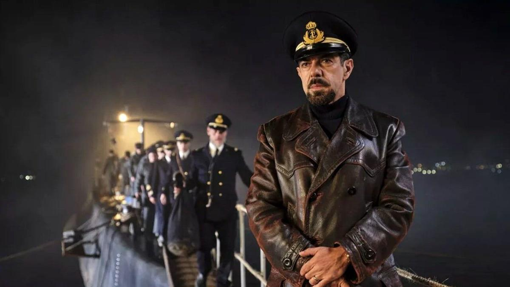

# Страшные сказки о реальности. Юбилейный Венецианский кинофестиваль состоится на острове Лидо. Наш гид по конкурсной программе

- **URL:** https://novayagazeta.ru/articles/2023/08/30/strashnye-skazki-o-realnosti
- **Дата:** 2023-08-30
- **Автор:** Лариса Малюкова

## Страшные сказки о реальности

## Юбилейный Венецианский кинофестиваль состоится на острове Лидо. Наш гид по конкурсной программе

Кадр из фильма «Командир»

Юбилейный Венецианский кинофестиваль состоится на острове Лидо с 30 августа по 9 сентября. Наш гид по конкурсной программе, в которой слишком много итальянских картин, также байопики, нуары, фэнтези и кровоточащая белорусско-польская граница.

Перед фестивалем организаторы заменили фильм Открытия. «Претенденты» Луки Гуаданьино пали жертвой голливудских забастовок. Картину в отсутствие звезд из США решили не показывать.

Вместо нее будет «Командир» («Команданте», или «Капитан») Эдоардо Де Анджелиса, в котором отзвуки далекой войны перекликаются с нынешней.

1940-й. Храбрый капитан итальянской подводной лодки Сальваторе Тодаро топит подозрительное вооруженное торговое судно. Но! Вопреки законам войны и приказу, спасает экипаж тонущего корабля. Он высаживает людей в ближайшей безопасной гавани. Ради успеха этой миссии Тодаро три дня находится в опасном районе, рискуя собой и командой, подставляясь под удар вражеских кораблей. В фильме, созданном в суровом стиле, цвет тусклый, погашен, как на выцветших старых фото.

В главной роли любимец Италии — Пьерфранческо Фавино.

### Из ожидаемого:

### «Убийца». Режиссер Дэвид Финчер

Дэвид Финчер — один из главных авторов современного кинематограф — с неонуарным флером, основанный на серии одноименных французских графических романов писателя Алексиса Ноулента и иллюстратора Люка Жакамона.

История киллера — ударника и лучшего в своей профессии. Но однажды его настигает беда — личностный кризис. В официальном синопсисе говорится, что после рокового промаха герой начинает сражаться не только со своими работодателями, но и с самим собой.

В главной роли неустрашимый Майкл Фассбендер («Люди Икс: Дни минувшего будущего», «12 лет рабства» и «Бесславные ублюдки»), хотя изначально рассматривалась кандидатура Бреда Питта.

Партнерша Фассбендера — Тильда Суинтон. Сценарист картины — Эндрю Кевин Уокер, тот самый, что уже работал с Финчером над эпохальным психотриллером «Семь». Оператор — мастер светописи Эрик Мессершмидт («Манк»).

В ноябре 2020-го Финчер заключил с Netflix эксклюзивную сделку: ближайшие четыре года все картины режиссера будут выходить на платформе. Премьера его эстетского киноромана «Манк» о жизни и творчестве сценариста Хермана Манкевича, автора сценария легендарной ленты «Гражданин Кейн», уже состоялась на стриминге.

Кадр из фильма «Память»

### «Память». Режиссер Мишель Франко

«Новый порядок» Франко в свое время вызвал колоссальный скандал и обвинения режиссера в расизме, хотя автор считал, что как раз борется с расизмом). На сей раз он решил сосредоточиться на воздушной камерной драме с филигранно прописанными взаимоотношениями героев.

Бывшие возлюбленные Сильвия и Сол встречаются в Нью-Йорке во время отпуска. Они пытаются открыть дверь в прошлое и заново выстроить отношения, вопреки своим психологическим травмам и нарывам. Здесь вся акварельная нюансировка — в актерской игре. В главных ролях Джессика Честейн и Питер Сарсгаард. Чейстейн — социальный работник. Оказывается, в этом году профессия соцработника — самая популярная не только в российском кино.

Кадр из фильма «Присцилла»

### «Присцилла». Режиссер София Коппола («Трудности перевода», «Мария-Антуанетта»)

Биодрама о заоблачном романе короля рок-н-ролла Элвиса Пресли и его принцессы, французской певицы и актрисы Присциллы Болье. О сногсшибательной встрече, семейной жизни и последующем разводе.

Вспоминаем, как Король рок-н-ролла влюбился в 14-летнюю девочку, годами доказывал ее родителям, что достоин их небесноподобной дочери, и дождался ее совершеннолетия, чтобы сыграть волшебную свадьбу. В основе ленты — мемуары Присциллы «Элвис и я» (Elvis & Me) 1985 года. Коппола предлагала роль Элвиса Джастину Биберу, канадскому поп-R&B-певцу, музыканту, актеру, чем-то напоминающему юного Пресли, но тот отказался.

Поэтому в этой роли Джейкоб Элорди, известный по сериалу «Эйфория» и роману с Зендеей.

Кадр из фильма «Я — капитан»

### «Я — капитан». Режиссер Маттео Гарроне

Итальянский классик рассказывает о двух молодых мигрантах, пытающихся прорваться сквозь асфальт невзгод, ксенофобии, собственных страхов. Они отправляются на поиски лучшей судьбы. Приключенческая драма о взрослении. Беженцам предстоит пройти опасный путь через пустыню, переплыть море, дабы добраться до заветной Европы. Работая над сценарием, Гарроне вдохновлялся реальными историями сенегальцев, проделавшими схожий путь.

Гарроне — автор англоязычных «Страшных сказок» и оригинальной и осовремененной экранизации великой итальянской сказки «Пиноккио», превращенной в трагедию с библейскими мотивами и метафору современного мира. За фильм «Гаморра» режиссер получал Гран-при Каннского кинофестиваля, за драмеди «Реальность» — Гран-при жюри.

В главных ролях: дебютанты Мустафа Фалл и Сейду Сарр.

Кадр из фильма «Догмен»

### «Догмен». Режиссер Люк Бессон

Про аутсайдера, который боится людей, но лучше всех на свете понимает собак.

С собаками у Дугласа (Калеб Ландри Джонс) особый контакт, доверительный разговор и чувство собственной силы. Они готовы выполнять его любые прихоти и задания: украсть, припугнуть и даже приготовить блинчики. Вместе они — стая.

Дуглас — единственный, кто командует «взять», когда город прибирает к рукам влиятельный наркобарон. Увидевшие на предпоказах новую работу Бессона зрители, отмечают мрачное цветовое решение и настроение в духе первых инди-картин Бессона «Подземка», «Голубая бездна», «Никита» и «Леон». Картину сравнивают и с «Джокером» Тодда Филлипса. В обеих историях центральным персонажем оказывается сломленный человек, который хочет спрятаться с помощью косплея и провокаций от жестокого мира, преодолеть травмы детства. Отец запирал его в детстве в собачьей конуре. И эту обиду он не может в себе изжить.

Калеб Ландри Джонс получил в Каннах награду за лучшую мужскую роль в фильме «Нитрам».

Люк Бессон не только срежиссировал фильм, но и написал к нему сценарий и выступил продюсером.

А я вспоминаю еще одного «Догмена» — Маттео Гарроне. Там маленький и нежный собаковод Марчелло оказывается втянутым в опасную паутину, стянувшую его родной город.

Поддержите нашу работу!

1000 500 300 Нажимая кнопку «Стать соучастником», я принимаю условия и подтверждаю свое гражданство РФ

Если у вас есть вопросы, пишите [email protected] или звоните:+7 (929) 612-03-68

Кадр из фильма «Бедные-несчастные»

### «Бедные-несчастные». Режиссер Йоргос Лантимос

Экранизация любовного романа с элементами фантастики, готики и социальной сатиры. Написал его шотландский писатель и художник Аласдер Грей. Происходящее описано по принципу «Расемона» — с позиций сразу нескольких героев.

Утонувшая молодая женщина Белла Бакстер возвращается к жизни благодаря ученому — доктору Годвину Бакстеру. Знать бы ей, что этот благородный ученый просто мечтает создать себе идеальную спутницу жизни. Он вставляет в ее голову мозг ребенка и дарит второе рождение. Правда, дальше все идет не по плану.

Отчасти Грей использовал в своем романе сюжет «Франкенштейна» Мэри Шелли, существенно его изменив.

Кадр из фильма «Феррари»

### «Феррари». Режиссер Майкл Манн

Майкл Манн — лауреат премий BAFTA и «Эмми», четырехкратный номинант на премию «Оскар».

В основе сюжета — биография конструктора, предпринимателя и автогонщика Энцо Феррари.

1957-й. Энцо готовится к гонке, хотя у него серьезные семейные проблемы, а созданной им компании грозит банкротство.

Это кино — давняя идея Манна. В самом начале нулевых он обсуждал ее с Сидни Поллаком. В 2015-м на роль Феррари приглашали актера-хамелеона Кристиана Бэйла. Но он не захотел снова набирать вес для этой роли, хотя Бэйл феноменально худеет и поправляется по заданию продюсеров. В 2017-м переговоры вели с Хью Джекманом. В феврале 2022-го Джекман покинул проект, главную роль получил Адам Драйвер. Его жену сыграла Пенелопа Крус.

Кадр из фильма «Граф»

### «Граф». Режиссер Пабло Ларраин

Сатирическая черная комедия известного чилийского режиссера Пабло Ларраина, снятая по заказу Netflix. Главный герой фильма — чилийский диктатор Аугусто Пиночет, он же 250-летний вампир, которому наконец-то надоело жить. В трейлере, выпущенном Netflix, Пиночет (Хайме Ваделл) поясняет это желание ради своих детей, которые ждут не дождутся своего наследства.

Но этот прекрасный план нарушит прибытие скромной французской бухгалтерши (Паулы Лухсингер), которая невольно отложит долгожданную кончину, переключив на себя внимание Пиночета.

В интервью IndieWire Ларраин говорит, что фильм борется с наследием реального диктатора, дожившего до 91 года. «Он ошеломительная фигура, имеющая огромное влияние в нашем обществе, — сказал режиссер. — Он привнес элементы ужаса, трагедии и насилия, которые разрушили нашу страну».

Ларраин стал соавтором сценария вместе с Гильермо Кальдероном, с которым он уже работал над «Нерудой» (2016) и «Эль-клубом» (2015), фильмом, за который режиссер получил премию: Приз Большого жюри Берлинского международного кинофестиваля.

Кадр из фильма «Происхождение»

### «Происхождение», или «Источник». Режиссер Ава Дюверней

История афроамериканской журналистки Изабель Уилкерсон — лауреатки Пулитцеровской премии за социальные очерки в The New York Times. Авторши книги «Касты. Истоки неравенства в XXI веке», в которой она исследует истоки кастового общества в современном мире и доказывает: и в XXI веке людей продолжают делить на социальные слои — высших и низших.

Номинантка на «Оскар» Дюверней («Сельма», «Излом времени»), получившая известность благодаря работам, посвященным расовому неравенству в США, в своем фильме использует материалы книги.

Кадр из фильма «Зеленая граница»

### «Зеленая граница». Режиссер Агнешка Холланд

Действие фильма происходит на белорусско-польской границе в начале 2020-х. Главные герои — беженцы, как и в картине Гарроне. Здесь это учительница английского языка из Афганистана, семья сирийских беженцев, дети и взрослые. Все они встречаются на польско-белорусской границе во время последнего гуманитарного кризиса в Беларуси. Черно-белое кино, сделанное в документальной манере, и поэтому оно смотрится страшным реалистичным роуд-муви, похищенным у хроники.

Лариса Малюкова ведет телеграм-канал о кино и не только. Подписывайтесь тут.

Читайте также

Кадров лишают

Получившие прокатные удостоверения картины «Капитан Волконогов бежал» и «За нас с вами» сняты с показа после доносов. А пиратской «Барби» ничего не угрожает

### Этот материал входит в подписку

Смотровая площадкаКино с Ларисой Малюковой

### Добавляйте в Конструктор свои источники: сайты, телеграм- и youtube-каналы

Войдите в профиль, чтобы не терять свои подписки на разных устройствах

Поддержите нашу работу!

1000 500 300 Нажимая кнопку «Стать соучастником», я принимаю условия и подтверждаю свое гражданство РФ

Если у вас есть вопросы, пишите [email protected] или звоните:+7 (929) 612-03-68
