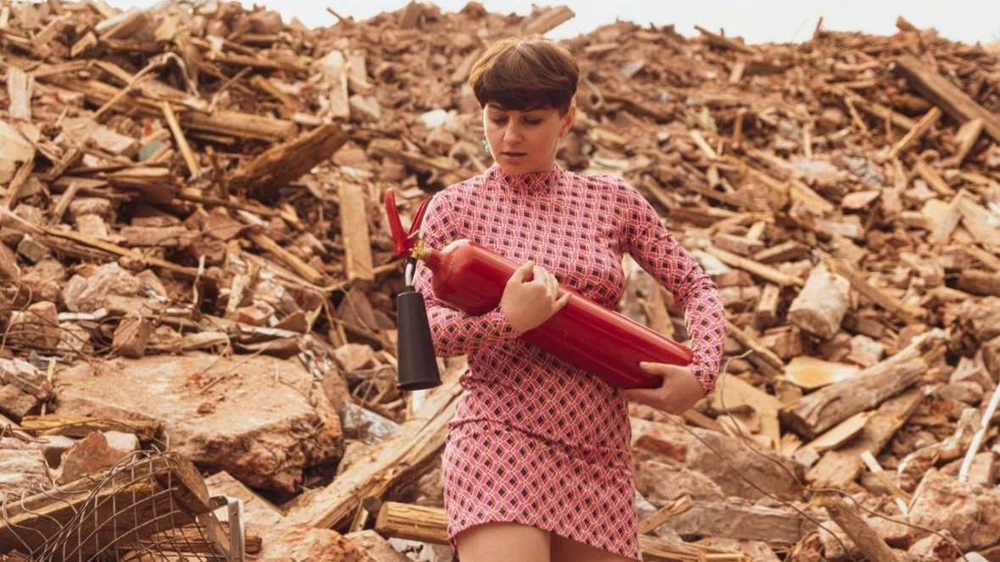

# Шесть персонажей в поисках жизни. Премьера спектакля «Хиросима» накануне суда Беркович и Петрийчук

- **URL:** https://novayagazeta.ru/articles/2023/09/06/shest-personazhei-v-poiskakh-zhizni
- **Дата:** 2023-09-06
- **Автор:** Лариса Малюкова

## Шесть персонажей в поисках жизни

## Премьера спектакля «Хиросима» накануне суда Беркович и Петрийчук

Фото: vnutri.space/hiroshima

Премьерой спектакля Александра Плотникова «Хиросима» открылся театральный сезон театра «Пространство Внутри». Спектакль создан совместно с командой «Дочери Сосо», созданной под руководством режиссерки и драматурга Жени Беркович.

Время показа перенесли — оно совпадало со временем суда над Евгенией Беркович и Светланой Петрийчук, которые придумывали постановки вместе с «Дочерьми Сосо».

…В зал надо заходить осторожно: между сценой и первым рядом расстояние крошечное. А условная сцена полностью залита водой. По стенам бегут сначала иероглифы, они превращаются в русский текст, рассыпанный, собирающийся заново. Временами буквы и слова «забегают» на лица актрис. А отсветы «живой воды», кажется, шевелят стены.

Героини передвигаются тоже осторожно — на деревянных сандалиях гэтах. И движения на этих «скамеечках» немного семенящие, «прибранные».

Но больше они сидят. Вспоминают — как все было. Пьют чай. И рассказывают.

Фото: Александр Андриевич

В основе действа — знаменитый репортаж американского журналиста и писателя Джона Херси, он опрашивал переживших катастрофу в Хиросиме, сразу после трагедии. Вернувшись в Америку, написал рассказы шести выживших в Хиросиме: немецкого пастора, овдовевшей швеи, двух врачей, местного священника и молодой женщины, работницы фабрики.

В 1946 году The New Yorker отвел целый номер под этот материал, Херси мгновенно прославился. Альберту Эйнштейну, безуспешно пытавшемуся купить несколько номеров, чтобы разослать коллегам, пришлось самому делать копии.

Спустя два месяца текст вышел в виде книги, которая разлетелась тиражом свыше трех миллионов экземпляров.

Херси называют одним из основателей «новой журналистки». Его текст — мгновенные снимки происходящей трагедии. Взгляд через увеличительное стекло на жизнь и смерть людей. Прямо сейчас. Здесь.

Актрисы Мариэтта Цигаль-Полищук, Ира Сова, Наташа Горбас, Юлия Скирина, Ульяна Лукина и Елена Махова — приглушенный трагический хор, прислушивающийся к шагам по воде, шороху песка, звону маленькой уцелевшей чайной чашечки.

Фото: vnutri.space/hiroshima

Вместе с режиссером они пытаются эту почти нейтральную интонацию сохранить. Спектакль-шок, но все вполголоса. Когда все самое страшное рассыпается в секундах. Боль, крик — это потом. Но эта тихая фиксация чудовищной трагедии, которой разродится одно вполне себе мирное утро одной вполне себе воюющей страны — похлеще любого надрывного хора.

Что они делали в то самое утро? Доктор ехал на поезде в клинику в Токио, где его ждали пациенты. Мама дала своим трем детишкам по ложке арахиса, чтобы подольше поспали. Кто-то тащил огромный шкаф на телеге по улице. Кто-то встал до зари, чтобы приготовить семье обед. У кого-то болел живот. Кто-то…

Они рассказывают про то утро разорванными, словно пунктир, репликами, обрывкам речи, перебивая друг друга. Это такой гул жизни, который будет прерван внезапно. Безвозвратно. Мгновением в 8.14 утра, когда Бог просто прикрыл глаза.

Светом, несущим смерть. Гигантской вспышкой над обреченным градом. Белое превратится в черное, утро рассыпется пеплом, руинами, сползающими с еще живых тел лентами кожи.

Поддержите нашу работу!

1000 500 300 Нажимая кнопку «Стать соучастником», я принимаю условия и подтверждаю свое гражданство РФ

Если у вас есть вопросы, пишите [email protected] или звоните:+7 (929) 612-03-68

Свет, расщепляющий ядра, просто расщепил живое. Обрушился дикой непривычной тишиной. Как будто мир умер. Но он не умер.

Эти шесть персонажей, вывернувших перед нами свои истории, — почти обыденные, прекрасные примеры стоицизма. Когда склеивают, как в искусстве кинцуги, те трещины облученной жизни, которые склеить уже почти невозможно.

…Он пытался перенести на другой берег реки полуживых людей. Он говорил: надо трудиться. И тащил. А когда упал без сил, прилив забрал эти тела. И он снова трудился, тащил других людей. А доктор после 19 часов непрерывной работы заснул на час. И ему было ужасно стыдно. Кого-то спасли чайные листья от жажды, принесенные заботливой рукой. Другая рука давала напиться молча лежащим на поляне городского парка ослепшим, «смотревшим» в небо. Кто-то говорил в этой мертвой тишине: «Ничего, ничего, скоро придет доктор, вылечит ваши глаза». Кто-то не хотел госпожу Сасаки, похороненную под обломками и гигантской грудой книг, спасать, а потом ее все-таки вытащили. Ей страшно повезло. Хотели загноившуюся ногу отрезать. Но после долгих мытарств оказалось, что у нее не гангрена.

Услышать тихие голоса рассказчиц, временами стеснительно улыбающихся — мол, что они о себе, да о себе. Услышать тишину замерзшего в августе неба перед оглушительным дождем и все сметающей бурей. Услышать тишину зрительного зала.

Фото: vnutri.space/hiroshima

Почувствовать спасительную, витальную силу «ниндзе» — чувство общности, сочувствия и заботы. Непостижимые для европейского сознания вежливость и кроткость. Когда погибающие люди просят прощения за принесенные ими неудобства.

А в эпицентре катастрофы сидит женщина и молча чинит капроновое кимоно.

Этот горестный, дышащий в унисон со временем спектакль напитан, как ни странно, светом и поэзией. Здесь читают хокку и псалмы. Один из них хочется запомнить, чтобы по утрам повторять. Его читала Маша Цигаль, точнее, ее персонаж:

«Господи, научи нас жить, а не выживать. Потому что как звук в тишине, наше время уходит».

Режиссер Александр Плотников, художник Константин Соловьев, композитор Мария Аникеева, художница по свету Елена Перельман, продюсер Александр Андриевич.

Спектакль «Хиросима» — накануне очередного заседания суда.

### Этот материал входит в подписки

Смотровая площадкаКино с Ларисой Малюковой

Культурные гидыЧто читать, что смотреть в кино и на сцене, что слушать

### Добавляйте в Конструктор свои источники: сайты, телеграм- и youtube-каналы

Войдите в профиль, чтобы не терять свои подписки на разных устройствах

Поддержите нашу работу!

1000 500 300 Нажимая кнопку «Стать соучастником», я принимаю условия и подтверждаю свое гражданство РФ

Если у вас есть вопросы, пишите [email protected] или звоните:+7 (929) 612-03-68
