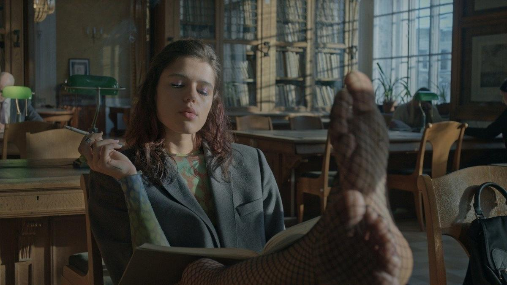

# Почему ты такая злая? На платформе Okko стартовал психотриллер «Черное облако» с Янковским и Мацель

- **URL:** https://novayagazeta.ru/articles/2023/09/07/pochemu-ty-takaia-zlaia
- **Дата:** 2023-09-07
- **Автор:** Лариса Малюкова

## Почему ты такая злая?

## На платформе Okko стартовал психотриллер «Черное облако» с Янковским и Мацель

Кадр из фильма «Черное облако»

7 сентября онлайн-кинотеатр Okko начинает показ сериала «Черное облако» о том, как злые мысли пробуждают злых демонов.

Жила-была одна девушка неравнодушная. Ну как неравнодушная… Просто Олю Сысоеву все раздражало и бесило. Подруга Алина — порочная сука, у которой в телефоне сплошь «котики», но под разными номерами, людей она познает исключительно через секс, прочие стороны жизни ее не интересуют. Есть вальяжный папаша (Юрий Колокольников), недавно объявившийся и зачем-то налаживающий контакт с выросшей дочерью, а в свободное от этого занятия время трахающий все живое. Мамаша Лидия Бойко (Виктория Толстоганова) — холодная телезвезда, умело выворачивающая наизнанку телесобеседников и занятая исключительно собой.

И старуха на инвалидном кресле, она же преподавательница из универа, которая не спешит ставить Оле зачет. И носится со своей Библией. Так и хочется ударить ее этой Библией. Чтоб она сдохла, старая тварь!

Да и ее бойфренд — идиот «на веществах», к тому же изменяет ей с подругой, с которой трудно не изменить.

Кадр из фильма «Черное облако»

Обо всей этой карусели зла Оля рассказывает психологу Борису Юрьевичу Ковальскому (Филипп Янковский), который пытается помочь смурной девушке «выпустить свой гнев», «нащупать источник своей злости».

На этих сеансах Ольга признается, что желает всем своим обидчикам страшной, мучительной смерти.

Невероятно, но в какой-то момент все, кто раздражает Олю, начинают умирать один за другим. Причем при самых необъяснимых, жестоких и загадочных обстоятельствах. Ольга напугана. Ее психолог — еще больше. Следователи (Марьяна Спивак и Алексей Розин) землю роют, но ничего понять не могут.

Кто это? Что это?

И что с этой Олей не так? Вроде эта наглая хамка не больна. А неустойчивая психика сегодня у каждого второго. Постепенно выясняется, что не очень-то эта самая Оля была нужна своим родителям. И ее самые близкие друзья — в общем, и не друзья вовсе.

Но когда желания Ольги начинают сбываться, ее настигает ужас. И чувство вины. И страх быть обвиненной.

Нелепо же думать, что это она! Ну, пересдавала она зачет прямо перед смертью строгой преподавательнице по кличке Красная Шапочка (из-за ее огненного берета). Ну вела себя ее подруга мерзко, а друг изменял. И папу она со своих двух лет не видела.

Но не хотела же она, на самом деле, смерти всех, кто ее окружает?

И как с этой нерешаемой задачей справиться психологу, у которого, как у многих психологов, свои психологические проблемы. Поэтому ему, психологу, тоже нужны сеансы у другого психолога.

Поддержите нашу работу!

1000 500 300 Нажимая кнопку «Стать соучастником», я принимаю условия и подтверждаю свое гражданство РФ

Если у вас есть вопросы, пишите [email protected] или звоните:+7 (929) 612-03-68

Кстати, самое любопытное в фильме — психотерапевтические сеансы. Потому что Борис Юрьевич вкапывается в суть фрейдовских вопросов. Расспрашивает, что чувствует Оля, когда ее темные мечты сбываются. Просит описать ее, как это — ненавидеть. Что за чернота давит ее внутри живота, в груди, в горле.

Да и следователям, судя по всему, встречи со специалистами не помещали бы. Потому что детективы здесь тоже странные. Он еще ничего. Она даже домой мыться не ходит, так увлечена работой. А может, просто в силу обстоятельств — бездомная. Марьяна Спивак играет такую же одинокую, неприкаянную, как Оля, которая — ходячая проблема. Травмированная, недолюбленная с детства. Накопившая вопросы к себе и миру, загнанная этими вопросами в лабиринт. Не выбраться.

Кадр из фильма «Черное облако»

И сам психотриллер опытного и изобретательного режиссера Карена Оганесяна — лабиринт с темными углами. Чем-то похожий на детективные драмы Пристли. Сначала хочешь понять, кто убийца. Потом, как у Пристли, камешек рождает лавину, слезинка — потоп. За чинными манерами скрывается «смерть, кровосмесительство, прелюбодеяние»… И в «Черном облаке» милые, благополучные существа оказываются представителями недоброго, изнаночного мира. А все разоблачения фальшивых сущностей вершатся обыденно, иронично.

Сценарий Дарьи Грацевич — прихотливые вариации на метод «Расемона». Когда одни и те же обстоятельства рассматриваются с разных точек зрения. Повторяются с небольшими изменениями, новыми акцентами, отличными диалогами.

Постепенно за круговоротом зла обнаруживается Мортидо — психическая энергия как инстинкт смерти. И Оля — самый выразительный пример того, насколько ненависть, влечение к агрессии саморазрушительны.

Кажется, авторам и самим любопытно двигаться в мрачные глубины подсознания. Не слишком обсуждаемых, провокативных тем. Задаваться трудными вопросами.

К примеру, что делать со своей ненавистью? И может быть, ненависть и вправду активное чувство?

Кадр из фильма «Черное облако»

Прекрасный кастинг с центральной ролью Марии Мацель — в этом году, она, пожалуй, самая востребованная и талантливая из молодых актрис. Интересное музыкальное решение, словно кто-то случайно дотрагивается до клавиш. А контрабас уводит куда-то вниз, в подполье.

Первоначальное название проекта — «Почему ты такая злая?». Я еще не досмотрела сериал до конца. Но думаю, конкретных ответов мы так и не получим. Скорее всего, будем отвечать сами себе, искать способы диалога со своей спрятанной глубоко внутри злостью. Например, на внешние, не зависящие от нас обстоятельства.

Но уже ясна одна сквозная мысль этого неглупого, хорошо снятого многосерийного фильма: темнота не может разогнать темноту.

Лариса Малюкова ведет телеграм-канал о кино и не только. Подписывайтесь тут.

### Этот материал входит в подписки

Смотровая площадкаКино с Ларисой Малюковой

Культурные гидыЧто читать, что смотреть в кино и на сцене, что слушать

### Добавляйте в Конструктор свои источники: сайты, телеграм- и youtube-каналы

Войдите в профиль, чтобы не терять свои подписки на разных устройствах

Поддержите нашу работу!

1000 500 300 Нажимая кнопку «Стать соучастником», я принимаю условия и подтверждаю свое гражданство РФ

Если у вас есть вопросы, пишите [email protected] или звоните:+7 (929) 612-03-68
