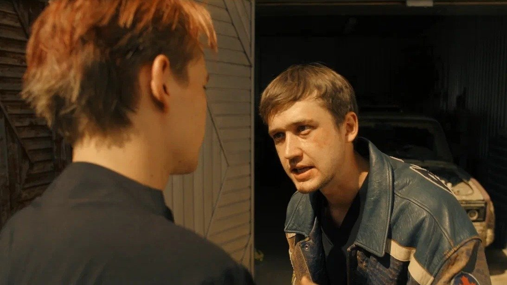

# Есть ли жизнь до секса. Криминальная комедия «Лада-Голд», новеллы Дарьи Мороз про отношения и «Бедные Абрамовичи». Премьеры фестиваля «Новый сезон»

- **URL:** https://novayagazeta.ru/articles/2023/09/09/est-li-zhizn-do-seksa
- **Дата:** 2023-09-09
- **Автор:** Лариса Малюкова

## Есть ли жизнь до секса

## Криминальная комедия «Лада-Голд», новеллы Дарьи Мороз про отношения и «Бедные Абрамовичи». Премьеры фестиваля «Новый сезон»

Кадр из сериала «Секс. До и после»

## «Лада Голд» Никиты Власова

Похоже, конец 80-х и 90-е с их криминальными разборками и погонями за золотом и кладами — из любимых времен онлайн-кинотеатров. В самом деле, сердито, зрелищно, в меру кроваво. И безопасно.

Сериал «Слово пацана» Жоры Крыжовникова покажут ближе к финалу «Нового сезона».

А первой в программе сериалов показали «Ладу-Голд» Никиты Власова (платформа «ИВИ»), проект компании «Среда».

Кадр из сериала «Лада Голд»

Лихо закрученная, отлично смонтированная криминальная комедия. О том, как внуки двух заклятых врагов — ненасытного авторитета с символичным погонялом Мидас и милиционера Ивана Огурцова — отправляются в путешествие на стареньких дедовских «Жигулях» Lada 21043. И как эти пыльные ментовские «Жигули»-четверка оказались не простые — золотые. 999-й пробы.

20 лет назад Мидас заграбастал золото общака, да и спрятал. Довольно оригинально.

В роли беспредельщика Мидаса — Павел Прилучный с золотой фиксой, словно персонаж «Жмурок». Там, в Тольятти образца 1999 года, целая галерея подобных (правда, менее шаржированных) героев. Перед тем как Мидаса повяжет ОМОН, он расскажет маленькому сыну Артуру сказку о семи рыцарях (в кадре — крестные отцы местных бандформирований), которые собрали все золото, дабы не досталось оно Дракону, да и спрятали умело.

Теперь взрослый сын Огурцова Пашка продает дедовы награды оптом. После смерти доблестного родственника его потомки забирают все тухлое наследство, оставляя младшему Паше Конька-горбунка — старенький «жигуль» в ржавом гараже. И Полина, любимая девушка Пашки с пятого класса, в очередной раз его бросает. Одна надежда на Конька-горбунка.

А внук Мидаса Артур вынужденно возвращается из Европы в Россию на похороны деда. После пышной прощальной церемонии едва от бандитов ноги уносит: им кажется, что парень знает, где золото.

Читайте также

Почему ты такая злая?

На платформе Okko стартовал психотриллер «Черное облако» с Янковским и Мацель

Поначалу бегущие параллельными галсами сюжеты похожи на историю Принца и Нищего, которые меняются ролями. Но несколько сценарных твистов смешивают легенды прошлого с преступными деяниями настоящего — и уже оба парня несутся на золотом коне к неведомым границам дозволенного, преследуемые злыми драконами.

Эта огнестрельная история, в хорошем темпе разворачивающаяся в краю Шмаляево во времена убиенные, завязана, как ни странно, не на бандитском принципе «либо ты его, либо он тебя». Она про взаимоотношения поколений и про взаимопомощь, странную, но спасительную дружбу. Куда без нее.

21 сентября обещают выложить на платформе сразу все серии.

## «Секс. До и после»

Из лучших сериалов фестиваля.

Режиссёрский дебют Дарьи Мороз. Увидев название, многие подумали: «Ну вот, опять». После популярных глянцевых и пустоватых «Содержанок» и «Жить жизнь» имя Мороз крепко-накрепко связано с темой секса.

Кадр из сериала «Секс. До и после»

И вот она делает живое, более того — целомудренное кино про отношения. Авторам интересно, что происходит «до». Как еще чужие вчера люди оказываются в одной постели. И что с ними происходит «после».

Из 14 историй показали четыре. По интонации чем-то похоже на «Любовь» Анны Меликян (только здесь все острее — и в подаче материала, и в отношении юмора).

И если у Ани все начиналось с лекции о любви, здесь все раскручивается из монолога о сексе стендапера Димы (Григорий Калинин). Этот спич и формулирует тему фильма (сам секс одинаков, главные неожиданности происходят «перед» и «потом», для настоящих самураев путь важнее цели).

А заодно пытается развеселить одну очень суровую девушку (Анна Снаткина). Выясняется, что у нее после автокатастрофы нет ноги (нет, это не треш). Флирт исчерпан? Напротив, Диме еще больше хочется рассмешить новую подругу. И когда его юмор становится почти жестким, без скидок на ее инвалидность, завязываются отношения равноправных партнеров.

Вторая новелла — ламповая. В баре знакомятся Эдуард (Ян Цапник) и Эльвира (Евгения Дмитриева). 45+. Оба вроде несвободны. Обоим чего-то не хватает. Что с ними случилось? Жизнь. В финале выясняется, что связывает их не только секс.

Есть еще история о знакомстве девушки-вегана и самца-мясоеда, не подозревающего — «не может быть!» — о существовании манги и йоги. После орального секса, который остается за кадром, рискованный диалог о веганстве партнерши продолжается.

Поддержите нашу работу!

1000 500 300 Нажимая кнопку «Стать соучастником», я принимаю условия и подтверждаю свое гражданство РФ

Если у вас есть вопросы, пишите [email protected] или звоните:+7 (929) 612-03-68

Читайте также

«Пропал друг» и злое кино

Фестиваль онлайн-кинотеатров «Новый сезон» начал свою работу. Фильм Открытия — «ЭТ»

Новелла разборок мужа (Даниил Воробьев) и любовника его жены (Александр Горбатов) отчасти отсылает к «Любовнику» Валерия Тодоровского. Там тоже муж многое узнавал о своей жене от ее любовника. Но в фильме Даши Мороз каждый из двух мужчин задумывается над своей семейной жизнью, над проблемой «одиночества вдвоем».

Ресторан, где происходят основные события, называется «Лед и пламя» — как отношения героев, проживающих в стране, где снова секса нет. Неслучайно же из названия сериала исчезает слово «Секс». На новых постерах он просто «До и после».

Сквозная линия — истории сотрудников ресторана. Прежде всего — главного менеджера (сама Дарья Мороз), горький сюжет ревности стареющей женщины, которую бросает молодой любовник.

Самого секса, кстати, в показанных новеллах концептуально нет.

Не пошлое кино — не про секс.

Про то, как люди находят и теряют друг друга.

## «Бедные Абрамовичи» Ильи Фарфеля

Производство Start.

Кадр из сериала «Бедные Абрамовичи»

Шабат, талит, тфилин — пустые звуки для Бориса Ефимовича Абрамовича (Гера Сандлер). Немолодого, рыхлого, нуждающегося пройдохи, который из кожи вон лезет, чтобы прокормить семью. Начинается первая серия буквально из гроба. В нем Борис фотографируется, чтобы послать фото криминальному богачу и антисемиту Павлу Андреевичу, которому безбожно задолжал. А с мертвого какой спрос? Все бы ничего, но вспомнит бог о грешном еврее, ночами некошерную копченую колбасу пожирающему, шарахнет его молнией неподалеку от синагоги. Да так, что явится к нему привидение его предка Хаима, тоже того еще прощелыги — он священный свиток Торы украл.

Теперь Борису за двоих отдуваться. Придется ему становиться правоверным евреем.

Авторы смешивают социальную, этно- и плутовскую комедию со сказкой. Местами выходит чрезмерно жирно, заболтано. Но в общем — обаятельная история про терпимость к другому. Близкому и дальнему. В многонаселенной еврейской семье Абрамовичей, к примеру, есть зять киргиз, а целый ряд сюжетных поворотов связан с ксенофобией, у которой нет границ. Особенно в смутные времена.

Лариса Малюкова ведет телеграм-канал о кино и не только. Подписывайтесь тут.

Читайте также

Триггер, секс и бедные Абрамовичи

Гид по программе фестиваля «Новый сезон»

### Этот материал входит в подписки

Смотровая площадкаКино с Ларисой Малюковой

Культурные гидыЧто читать, что смотреть в кино и на сцене, что слушать

### Добавляйте в Конструктор свои источники: сайты, телеграм- и youtube-каналы

Войдите в профиль, чтобы не терять свои подписки на разных устройствах

Поддержите нашу работу!

1000 500 300 Нажимая кнопку «Стать соучастником», я принимаю условия и подтверждаю свое гражданство РФ

Если у вас есть вопросы, пишите [email protected] или звоните:+7 (929) 612-03-68
