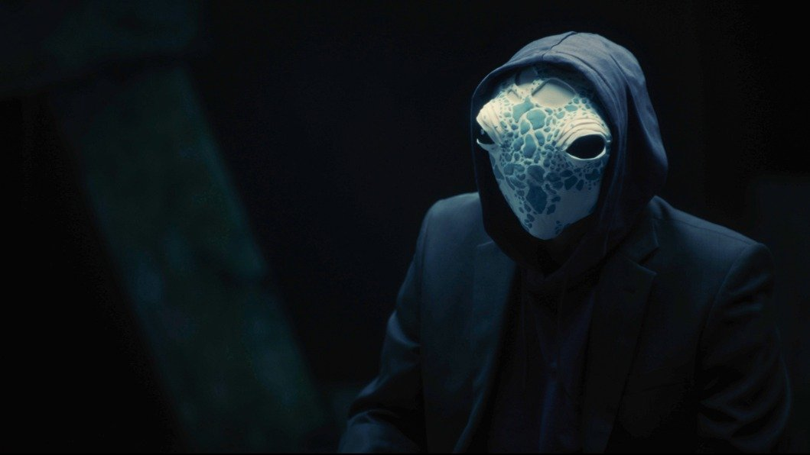

# Правда в маске. 20 сентября выходит фильм «Анонимная телега» про темную сторону популярного российского мессенджера

- **URL:** https://novayagazeta.ru/articles/2023/09/18/pravda-v-maske
- **Дата:** 2023-09-18
- **Автор:** Лариса Малюкова

## Правда в маске

## 20 сентября выходит фильм «Анонимная телега» про темную сторону популярного российского мессенджера

Кадр из фильма «Анонимная телега»

Производством фильма занималась студия «Ривелти.Кино» («Дуров» о создателе Telegram Павле Дурове).

Автор и режиссер — Дмитрий Богданов («Пандемия бизнеса», «Ген танца»)

Продюсер — Игорь Мишин

Оператор-постановщик — Денис Сапрыкин

Композитор — Георгий Химорода

20 сентября на платформе KION выходит фильм «Анонимная телега» Дмитрия Богданова про темную сторону телеграма — самого популярного мессенджера России. Это док-исследование, приоткрывающее завесу тайны над анонимными тг-каналами. Рассказ о том, как устроены эти «средства массовой информации» и их бизнес. И бизнес ли это только?

Авторам удалось проинтервьюировать 11 анонимных авторов, ведущих популярные каналы «Небожена», «Закулиска», «Кино_Еж», «Немалахов», «Невминкульт», «Депутатские будни», «Жирные коты», «Медиакиллер», «Компромат групп», «Коварная колея».

Тема, прямо скажем, горячая. Жертвами телеграмных доносов оказались многие селебрити. А с недавнего времени начались громкие скандалы, разоблачения самих телеграмщиков и уголовные дела с суровыми приговорами. Среди спикеров фильма — один из авторов канала «Компромат групп» Александр Гусов, разговор с ним записан за две недели до ареста по обвинению в вымогательстве.

Когда были задержаны коммерческий директор Ксении Собчак Кирилл Суханов, бывший главред Tatler Ариан Романовский и журналист Тамерлан Бигаев, обвиненные в вымогательстве, Ксения Собчак заявила, что это «очередное давление на журналистику». Выходит, неугодных «серьезным людям» имярек-авторов силовики мгновенно идентифицируют и деанонимизируют? А остальным пока позволено многое, в том числе фейк-ньюс?

Анонимные каналы продолжают влиять: на индустрии, репутации их игроков. Но публикуя компромат, одни «чистильщики» не проверяют информацию, другие — сознательно, ради хайпа, лжесвидетельствуют, травестируют события, льют ушаты помоев на головы «избранных», превращая людей в ходячие карикатуры.

Кадр из фильма «Анонимная телега»

Актер Сергей Бурунов приводит эпизоды откровенной и наглой лжи о нем. Изумляется тому, что люди верят любой, самой чудовищной неправде. И это отдельная тема.

За что получают гигантские деньги медиакиллеры?

Реклама — далеко не первая в статье доходов. Негатив-блок или неупоминание некоторых опрометчивых действий и поступков игроков экономической, политической, медиасферы — стоит значительно больше (блок на упоминание на экономических каналах может оцениваться от 250 тысяч рублей до нескольких миллионов в месяц).

Но и реклама — вещь не совсем безобидная. Начиная продвигать какую-то компанию за деньги, потом в критической ситуации можно утонуть в «заказухе». Не станете же вы критиковать тех, кто вам платит.

Авторы прослеживают заметный регресс в действиях тг-каналов. Поначалу создатели действительно руководствовались желанием называть вещи своими именами, даже если информация расходится с официальной точкой зрения. Представитель канала «Колея» объясняет, что изначально они действительно хотели говорить правду о железнодорожной отрасли, в которой работают. Но правда сегодня — опасна. И она преследуется.

Поэтому некоторые каналы сохраняют инкогнито, чтобы быть равноудаленными и от условного центра, и от лидеров тусовки, которые навязывают свои мнения, устанавливают свои иерархии и ждут от прессы исключительно панегириков. Но нередко телеграмщики превращаются в погромщиков. Они объединяются и разворачивают кампании против конкретных людей и институций (вроде премии «Золотая маска»).

Они публикуют сливы с взломанных аккаунтов, частную переписку, врачебные тайны, скрытую съемку селебов. Подпольные поприщины, спрятавшись за маской, «разоблачают» успешных, высмеивают, обвиняют сделавших профессиональную карьеру людей. Вроде Данилы Козловского или Сергея Бурунова. Выпуская в цифровое пространство внутренних демонов, они чувствуют себя вершителями судеб, искусными кукловодами и обличителями.

Правдорубы из бэтменов — борцов с коррупцией — превратились в киллеров. Или доносчиков.

Поддержите нашу работу!

1000 500 300 Нажимая кнопку «Стать соучастником», я принимаю условия и подтверждаю свое гражданство РФ

Если у вас есть вопросы, пишите [email protected] или звоните:+7 (929) 612-03-68

«Когда мы в масках, — объясняет один из экспертов, — нам больше позволено, мы можем избить, изнасиловать. Подменить ложью правду». Или, мягко говоря, непроверенным фактом. Автор одного из правых каналов «Невминкульт» рассказывает, как проходит проверку информация, например, об уехавшем режиссере. И это отдельный номер программы: «Что вы хотели знать об анонимных telegram-каналах».

Другой анонимщик рассказывает, что «в охотку» может навести тень на любой плетень, пусть потом жертва оправдывается. Ключевое слово — «потом», хайп уже был.

Интернет-тролли способны снять фильм с показа, изъять его из уже опубликованной программы фестиваля (мы подобное видели), настучать на «неблагонадежных» режиссеров, актеров, продюсеров.

Чем руководствуются Робин Гуды в масках? Психолог поясняет: ничего нового: влияние, власть. И все ради денег.

Кстати, совершенно не случайно фильм возник под крылом продюсера и генерального директора KION Игоря Мишина. Вот уж кому регулярно достается от чистильщиков в масках. За ним установлено пристальное внимание добровольных филёров.

Но есть и охотники на тг-каналы. Игорь Бедеров, основатель и гендиректор компании «Интернет-розыск», уже несколько лет исследует этот темный мир, создал свою программу разоблачения анонимных телеграм-каналов. Он называет спрятанные за маской имена и говорит об ответственности их администраторов и продюсеров.

На анонимщиков ругаются… И их читают. Желчь, непроверенная информация, компроматы, сливы, безжалостные характеристики, вырванные из контекста фразы, безжалостные отповеди — пользуются спросом. Это ходовой товар. Телеграм все чаще превращается в замочную скважину, в которую, стесняясь… заглядывают.

Часть спикеров в фильме — админы и участники анонимных тг-каналов — в масках. Эксперты — с открытыми лицами. Все, как в самом мессенджере.

А вокруг многочисленных интервью — массовка из людей в масках, воображаемых «теней Готэма-Сити». Все мы сегодня — его жители.

Лариса Малюкова ведет телеграм-канал о кино и не только. Подписывайтесь тут.

Читайте также

Кино золотого дна

«Новый сезон» завершен: основные тенденции индустрии и прогноз на год

Поддержите нашу работу!

1000 500 300 Нажимая кнопку «Стать соучастником», я принимаю условия и подтверждаю свое гражданство РФ

Если у вас есть вопросы, пишите [email protected] или звоните:+7 (929) 612-03-68
