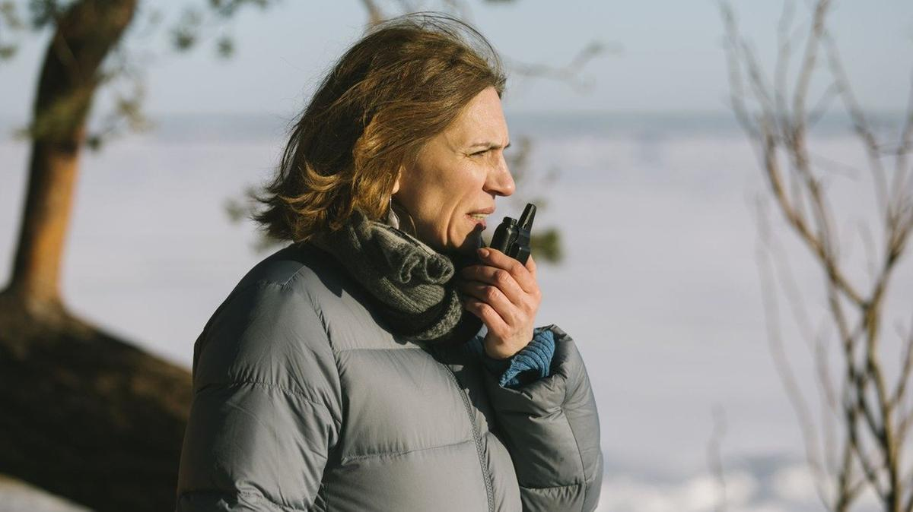

# «Я боюсь бояться». Фильм Или Малаховой «Привет, мама» — в программе фестиваля в Сан-Себастьяне, который в последнее время принципиально не брал кино из России

- **URL:** https://novayagazeta.ru/articles/2023/09/22/rezhisser-ilia-malakhova-ia-boius-boiatsia
- **Дата:** 2023-09-22
- **Автор:** Лариса Малюкова

## «Я боюсь бояться»

## Фильм Или Малаховой «Привет, мама» — в программе фестиваля в Сан-Себастьяне, который в последнее время принципиально не брал кино из России

Иля Малахова. Фото из личного архива

Мировая премьера фильма Или Малаховой «Привет, мама» состоится на Международном кинофестивале в Сан-Себастьяне, который открылся сегодня, 22 сентября. Чем же привлекла европейских отборщиков дебютная картина?

«Привет, мама» — универсальная, нежнейшая, пропитанная узнаваемой болью картина о неконвенциональной семье, в которой две старших и две младших сестры. Р

ассказ о работнице аэропорта Пулково, которая живет со своей сестрой и ее дочерями. Мама, выгнавшая их из дома, пропадает без вести. У героини появляется шанс получить наследство и начать новую жизнь, но она не хочет ничего менять, надеясь на возвращение матери. Это кино о невозможности смириться со смертью родителей, о детской памяти, которая укрытие от равнодушия взрослой жизни. И еще о Питере — городе, где смерть мерзнет в белоснежном снегу и застывшей реке.

Иля — дебютантка в режиссуре. Но у нее уже приличная фильмография. Ученица Марлена Хуциева участвовала в создании сценариев фильмов своего мужа, известного режиссера Бакура Бакурадзе, «Шультес», «Охотник», «Брат Дэян», а также космического блокбастера «Вызов».

Она помогала Бакуру и в написания сценария нового фильма про блокаду. Засела за эти материалы, и 17 килограммов веса, по ее словам, просто улетели. Такая тема… Иля — внучка блокадницы; правда, бабушка не любила рассказывать про страшный год. Они с мужем сами погружались в историю, сочиняя этот безумный эпос, пытались физически почувствовать время.

Иля Малахова. Фото из личного архива

Иля Малахова:

— Начитавшись, поняла, как двигались блокадные люди: минимальное напряжение, такое странное ощущение.

Боюсь ужасно, что Бакур начнет снимать блокаду — опасная тема. В то же время хочется, чтобы он сделал этот фильм, — он давно с ним живет.

Только что Бакур завершил картину «Снег в моем дворе» — прекрасную тбилисскую историю. С другой, более легкой камерой, с другой эстетикой. Благородное кино с изумительным дыханием.

— Интересно вы «разошлись»: ты — в женскую историю, он — в мужскую.

— Словно хотели друг другу что-то важное и нежное рассказать.

— Как ты относишься к понятию «женское кино»?

— Люблю, когда оно честное, не пытается прикинуться чем-то другим. Говоришь студентам: «Посмотрите первые кадры «Американской милашки». Что режиссер делает? Буквально залезает героям в подмышки, под ресницы. А, например, первые кадры «Смерти Людовика XIV» Серра или «Истории моей смерти» — сразу понимаешь, насколько это мужской стиль. Для меня тонкое женское кино — «Некоторые женщины» Рейхард. Там, кажется, и камера имеет юбку. Другое дело — великая Муратова. Она же не женщина — гиперчеловечище. Тут не работает женское/мужское.

Бакур Бакурадзе. Фото из личного архива

— А мне Муратова говорила, что не возражает, когда замечают в ее кино именно женский взгляд на вещи. Поэтому Литвинова ей была нужна как суперженщина, концентрат.

— Ну да, Рената — яркий гендерный образ. Я ученикам в киноколледже показываю по пять минут разных фильмов без звука. Потом отдельно слушаем звук. Прошу самих их соединить. Они говорят: «Из всего этого мы только Муратову сразу угадали-поняли-почувствовали».

— На фестивале в Выборге, где показали твою картину, в конкурсе едва ли не все фильмы были женские или про женщин.

— У меня среди студентов много парней — отчаянных, прекрасных, и, очевидно, в будущем они сделают что-то.

Но сейчас, когда мы погружены в хаос, живем в безумном контексте, кажется, что у мужчин просто пропал голос, внутренний текст. А у женщины этот текст есть всегда, потому что… она — клетка, биология, небо и земля.

— Дети…

— Да, я — мама, я — дети, я — детство… Мужчин же переполняет ощущение немоты. И новое кино Бакура прозорливое, потому что в нем выражена эта немота.

— Ты поздно решилась режиссировать собственный фильм?

— Мне кажется, я всегда была готова. Решилась, когда поняла, что уже не так нужна своим детям, они отрастили крылья, летают без меня. У меня появилось время для себя, для своей боли и радости.

История, которую хотелось рассказать, долго развивалась, менялась. Вначале она была про плохую тетю, которая доносит на свою талантливую племянницу. Внутренняя зависть ее захватила, взорвала. Потом пошло в другую сторону, через любовь, принятие. Из внутренних текстов все и слепилось. Продюсер Наташа Дрозд сказала: «Мне нравится сценарий, но он сырой». И мы целое лето встречались, прокачивали текст. Мы полюбили этих женщин.

— Героиня — это ты?

— И я, и нет. Я больше похожа в жизни на ее сестру Веру, которая проще. А наша героиня Кира — загадочный персонаж, та самая ускользающая женщина.

Кадр из фильма «Привет, мама»

— Кто-то увидел в ней «инфантилку», а мне кажется, в ее неспособности порвать связь с умершими родителями, со своим прошлым — ее особенность, сложность, уникальность.

— Мы все в одной ситуации можем быть инфантильными, в другой –супервзрослыми. Там все героини — амбивалентные, даже цельная Вера, которая тащит свою жизнь, детей, сестру. А Кира постоянно в поиске какой-то невозможной, недостижимой цели, в том числе себя.

— У меня было ощущение, что это такая твоя, прямо по содранной коже, история.

— В этом фильме я скорее вспоминала потерю свой бабушки Иры, блокадницы. Я была в Индии с младшей дочкой Дуськой. Еду на мопеде, звонит сестра, говорит: «Бабы Иры больше нет». А я не могу в аэропорту купить билеты. Не успела ее похоронить. Теперь постоянно снится: нос — ингерманландский, тонкий, как нож… вмятины от очков на переносице… руки артритные… Пытаюсь дотронуться. Кажется, мы так и не расстались. Приезжаю домой: «Привет, ба! Смотри, какая сегодня погода классная!» Она — моя хрупкая важная связь с Питером, местом силы, родиной моего детства. На самом деле она была похожа на старуху Шапокляк, вредную и смешную, такая тринадцатая фея…

— А знаешь, что у Шапокляк были прототипы «из бывших», близких родственниц Шварцмана?

— Вот и Баба Ира такая же. Перебегала дорогу, опустив голову, не смотря по сторонам, — и все машины, автобусы останавливались. Меня это пугало ужасно.

— Расскажи про свою семью.

— Мой папа — врач, татарин. Мама — русская, воспитатель в детском саду. А бабушка Ира — финка.

— По мужу ты грузинка.

— По мужу — да. Ну, Бакур тоже не супергрузин, у него папа — немец.

— Не семья — Вавилонская башня.

— У нас столько кровей… Пугаюсь, когда думаю об этом.

— В твоем кино мужчины в «женском царстве» — странные пришельцы, как их сосед мальчик Петя, аутист, создающий свое человечество из фигурок лего на подоконнике в своей квартире.

— У меня даже была сцена «Петя — идиот волшебный, с морем разговаривает». В этой роли снимался мой сын Лерик. Петя — из рода Мышкиных, супердуша, которая не умеет себя транслировать. Как у людей, с войны вернувшихся, — выжжены глаза, вопящая внутренняя немота.

Если бы у нас с Бакуром не было Лерика с таким чистым отношением к жизни, мы бы, возможно, остались конченными идиотами. Лерик перепрошил нас. И в фильме он — альтер эго Киры, ее отдельности, идиотичности, отменяющей здравый смысл.

Поддержите нашу работу!

1000 500 300 Нажимая кнопку «Стать соучастником», я принимаю условия и подтверждаю свое гражданство РФ

Если у вас есть вопросы, пишите [email protected] или звоните:+7 (929) 612-03-68

Кадр из фильма «Привет, мама»

— Другие мужчины в этом кино — проходящие поезда, пролетающие самолеты. Какие-то женатые любовники Киры, какой-то Толик у ее сестры Веры, который существует только в ее телефоне.

— Сестры — самодостаточная женская команда, русалочье братство. И младшая дочь Веры, разрисовывающая своего единственного товарища — куклу Карлсона, и старшая дочь Ася, которая влюблена и пишет стихи… В этом женском мире нет места мужчине. И в этом их драма.

— Иля, снимавшая это авторское сокровенное кино, и Иля, которая участвовала в написании сценария космического «Вызова», — разные люди? Ты разные половины мозга для коммерческого и авторского кино включаешь?

— Изначально в «Вызове» был хороший сценарий, который большим количеством людей, отвечающих за проект, был, на мой взгляд, испорчен. Для меня это была человеческая история про женщину-доктора. Потерянную, загнанную, ничего не успевающую, ни с ребенком, ни с мамой. Она и сильная, и такая маленькая.

— Зачем тебе ученики? И не в престижных киношколах, а в колледже. Какого возраста там дети?

— 15–20 — лучший возраст на земле. Они умеют взрываться, загораться. Это совершенно невероятная энергия. Когда мне говорят: «Кино умерло», — я отвечаю: «Извините, нет. Я знаю, что кино будет. Я просто вижу в их глазах это новое кино».

— У тебя есть ученики, которые уже состоялись?

— Габриэла Селиванова, Слава Иванов, Степа Тихонов, сделавший несколько работ. Света Абрамова потрясающую работу сделала про свет. Ты видишь, что они живые. И я не боюсь открыть им свою боль. Это важный не только профессиональный, но и человеческий взаимообмен.

— Как снимать сегодня, сохранять себя во враждебном, сложном мире?

— Когда все началось, я показала им «Мефисто», потрясающую историю выбора и духовной деградации. Кино — лучший из способов задуматься, как остаться собой.

Кадр из фильма «Привет, мама»

— Не боишься с ними говорить о сложном, страшном?

— Я боюсь бояться, боюсь молчания. Мы все в какой-то момент пугаемся, сдаемся, и, возможно, придет момент тотальной немоты. Но сегодня панически боюсь испугаться, не задать вопрос и уйти от ответа. Страшусь обмануть сама себя через этот страх. Это, наверное, еще связано с детьми… Знаешь, родил одного, чуть не умер, второго, а он аутист, а потом третьего, и опять чуть не умер.

— У тебя трое детей, и среди них особенный…

— Они все сложные. Лерик — это суперподарок. Не знаю, что с нами было бы без него. Его так любят его сестры…

— Зачем ты включила историю блокады со штабелями трупов в интимную, личную историю одной странной семьи?

— Об этом же Кира говорит своему женатому мужчине. Это ее обида. Он: «Хочу здесь квартиру купить, буду бегать на роликах». И испытывая боль своего отсутствия в его благополучной жизни, несостоявшейся судьбы с этим мужчиной: «А хочешь здесь квартиру купить? На том самом месте, где блокадники трупы сваливали?» Когда снимался «Салют-7», Бакуру сняли квартиру на улице Репина. Я говорю: «Не могу здесь находиться». Он спрашивает: «Почему?» — «Ночью выхожу и вижу, чувствую замороженные тени людей».

Кадр из фильма «Привет, мама»

— Но так же жить невозможно. Это везде будет тебя преследовать. У нас и в Москве много подвалов, в которых мучили людей. И под Красной площадью — могилы.

— Да, едва ли не в любом месте есть эта спрятанная под землей адова мука. Но при этом есть и новые восходы, и шум Невы, и Лерик мой, и радуга. Все многообразно переплетено. И меня вечерами младшая дочка Дуся спрашивает: «Мам, ты видишь голубые горы, там, за деревьями?» Я говорю: «Детка, это просто облака очень низкие».

— Любопытно, что твоя очень ленинградская киноистория оказалась универсальной. Интересной одному из важных европейских кинофестивалей.

— Знаешь, один из операторов нашего фильма Денис Клеблеев сказал: «Иля, одним кадром, в котором малышка разрисовывает своего Карлсона, мы опровергаем все самое страшное, что происходит со всеми нами». Для меня это супервитальность. Это как… давайте татуху набьем.

Давайте будем! Просто будем вопреки всему. Поначалу было наше общее жуткое состояние. В кадр залезаешь — дышишь, потом: «Стоп, снято!» Снимаешь наушники — и нечем дышать: боже мой, все, что с нами сейчас происходит, это реальность?

— Про что бы ты сейчас могла рассказать еще?

— Пишу смешную историю про взрослого дяденьку и молодую девушку, про их сложные прекрасные отношения. Я Наташе Дрозд предложила: «Давай скрестим «Трудности перевода» и «Влюблен по собственному желанию», два фильма, которые я обожаю. Мне интересны эти тексты. Усталый мужчина, у которого нет дочери, смотрит на эту чужую девушку. И между ними возникает интимный диалог о скрытом и важном, о чем чужому не скажешь. Разговор, который не вписать в привычную картину мира, не рассказать ни детям, ни жене. К эротике это отношения не имеет: именно соприкосновение душ, ослепляющее, неловкое, выводящее на иной уровень понимания другого.

Кадр из фильма «Привет, мама»

— Что самое ценное ты приобрела у своего бесценного учителя Марлена Хуциева?

— Помнишь дрожащие «плечики» — пустую вешалку в «Мне двадцать лет»? Как метафора новой жизни, которую начинает герой, вернувшийся домой. Она мне сердце разорвала, эта вешалка. Ты можешь быть слабым, не состояться, но все равно чувствовать эту поэзию. Он был прекрасным чудаком. Помню, стою в зеленом плаще, а он: «О, Илечка, это что, накладные плечи?» — и дотрагивается до руки. «Нет, Марлен Мартынович, у меня такие квадратные большие плечи». И он — испуганно: «Ой! Прости!» Думал пошутить, и не вышло. И нам всем смешно. Вот как этим поделиться?

— Мне кажется, у тебя получается: через разрисованного Карлсона, слова «Ты — Балтийское море, он — «Балтика 7» или ворота «Малая Охта», которые никуда не ведут.

— Когда мы с ребятами пересматриваем «Заставу Ильича» — это лучший из возможных мастер-классов. Способ понять, что такое киноязык. Помнишь экспозицию? Гулкий звук шагов: сначала красноармейцы идут по булыжной мостовой. Потом — по мокрому асфальту, словно постепенно двигаясь в будущее. Незаметно они превращаются в трех современных молодых людей — в нас. Ночные фонари гаснут. А звук шагов нарастает почти до барабанной дроби. Это мальчик демобилизованный бежит вверх по этажам домой. И в переводе на человеческий язык все эти кадры складываются в слова «мама», «мир», «люблю».

Наш обозреватель ведет телеграм-канал о кино и не только. Подписывайтесь тут.

### Этот материал входит в подписку

Смотровая площадкаКино с Ларисой Малюковой

### Добавляйте в Конструктор свои источники: сайты, телеграм- и youtube-каналы

Войдите в профиль, чтобы не терять свои подписки на разных устройствах

Поддержите нашу работу!

1000 500 300 Нажимая кнопку «Стать соучастником», я принимаю условия и подтверждаю свое гражданство РФ

Если у вас есть вопросы, пишите [email protected] или звоните:+7 (929) 612-03-68
