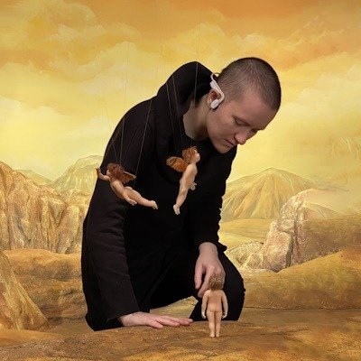

# Форнарина Гарри Бардина. Премьера фильма Ave Maria Гарри Бардина — 30 сентября в киноклубе «Эльдар»

- **URL:** https://novayagazeta.ru/articles/2023/09/25/fornarina-garri-bardina
- **Дата:** 2023-09-25
- **Автор:** Лариса Малюкова

## Форнарина Гарри Бардина

## Премьера фильма Ave Maria Гарри Бардина — 30 сентября в киноклубе «Эльдар»

27-й фильм обласканного премиями и наградами российского режиссера: от Каннской пальмовой ветви (приза за «Выкрутасы») до главного приза Анси («Серый Волк энд Красная Шапочка»).

Фото: соцсети

Пять раз он становился обладателем национальной премии «Ника».

И это пятый фильм, который режиссер снимает с помощью зрителей.

Так сказать, народное кино. Фильм снят на средства Фонда кино и благодаря краудфандингу на Planeta.ru.

Зрителями были профинансированы его «Три мелодии», «Слушая Бетховена», «Болеро 17», «Песочница».

А произрастает новый маленький фильм с ангельским приветствием в заголовке — вы не поверите — из рафаэлевского шедевра «Сикстинская Мадонна». Созданного по заказу папы Юлия II полотна для церкви монастыря Сан-Систо в Пьяченце. Тысячекратно цитированного, одного из самых почитаемых в мире, растасканного масскультом, почти как «Джоконда». Вознесенного на лучезарные пьедесталы искусствоведами.

Со спускающейся с небес к нам грешным на землю, босиком по облакам, Богоматерью, недосягаемо прекрасной, держащей на руках священного младенца. Ее торжественная скорбь — образ непостижимой жертвенности, торжественный и печальный.

«Гений чистой красоты», как отозвался о ней Василий Жуковский (Пушкин его просто цитировал).

Режиссер вдохновляется демонстративной театральностью композиции, обрамленной тяжелым зеленым занавесом. Зеленый для Рафаэля — образ неиссякаемой вечной любви, которая сильнее смерти.

Но вся патетика и искусствоведческие клише, гуляющие по музейным каталогам, как рукой снимает, когда начинается фильм.

Вначале, как перед любым представлением, — шум зрительного зала. Его прерывает стук каблучков, словно к микрофону идет ведущая, которая сейчас объявит музыкальный номер.

Например, Шуберта: его музыкальную молитву Ave Maria в инструментальном исполнении.

В это время ангелы-путти, которые примостились внизу картины и с мальчишеским любопытством рассматривают происходящее неподалеку… в облаках, не выдерживают (как дети в консерватории) и начинают шалить. Хрестоматийные образы превращаются в куклы. Поначалу это превращение кажется странным. Но постепенно меняется весь мир внутри картины. Он становится кукольным, игрушечным — живущим по своим законам.

Гарри Бардин. Фото: соцсети

Итак, путти дурачатся, проказничают, один дает оплеуху другому… крылом.

Не только ангелочки — все персонажи превращаются в куклы. Младенец, подхватив это мальчишеское озорство, вырывается из материнских рук и прыгает вниз. Мать тут же бросается за ним, летит, изумляя ротозеев-ангелов, сквозь облака. И путти, словно опомнившись, достают из-за рамы картины и растягивают спасительное белое полотно.

Подчеркнутая условность, театральная стилистика, карнавальный дух не дают скатиться фильму в пресное обесточенное занудство так называемых суперкниг — мультипликационных пересказов священных сюжетов.

Поддержите нашу работу!

1000 500 300 Нажимая кнопку «Стать соучастником», я принимаю условия и подтверждаю свое гражданство РФ

Если у вас есть вопросы, пишите [email protected] или звоните:+7 (929) 612-03-68

Персонажи здесь игрушечные, но не мертвенно сконструированные, как это нередко случается с героями в 3D.

Скорее это напоминает детскую «Мою первую Священную историю» Воздвиженского, в которой поэтично, просто и доступно — о самых сложных понятиях.

В какой-то момент кажется, будто это сами куклы разыгрывают Священное писание. Есть эпизод, в котором Мадонна с вновь обретенным младенцем прыгают на полотне, как на батуте.

Малыш при падении поранит пальчик. Мама поцелует —пройдет… Только пятнышко на белоснежном полотне… Потом пунктиром — вехи скорбного и счастливого пути — двойного подвига: решимость принести себя в жертву ради спасения человечества; и решимость — отдать сына на смерть.

Тайная Вечеря. Рука, пробитая гвоздем… Маленькое пятнышко крови на белоснежной микеланджеловской Пьяте.

Ave Maria — история выбора как поступка. Узнавание своего пути и готовность пройти этот мучительный путь к свету.

Продюсер, автор сценария и режиссер — Гарри Бардин.

Художник-постановщик — Аркадий Мелик-Саркисян

Кстати, про чрезмерный пафос. Моделью для Мадонны была возлюбленная Рафаэля, семнадцатилетняя дочь пекаря Маргерита Лути. Рафаэль назвал ее Форнарина (от итальянского fornaro — пекарь).

Купить билеты на премьеру фильма Ave Maria Гарри Бардина в киноклубе «Эльдар» можно тут.

Наш обозреватель ведет телеграм-канал о кино и не только. Подписывайтесь тут.

Читайте также

«Я боюсь бояться»

Фильм Или Малаховой «Привет, мама» — в программе фестиваля в Сан-Себастьяне, который в последнее время принципиально не брал кино из России

### Этот материал входит в подписки

Смотровая площадкаКино с Ларисой Малюковой

Культурные гидыЧто читать, что смотреть в кино и на сцене, что слушать

### Добавляйте в Конструктор свои источники: сайты, телеграм- и youtube-каналы

Войдите в профиль, чтобы не терять свои подписки на разных устройствах

Поддержите нашу работу!

1000 500 300 Нажимая кнопку «Стать соучастником», я принимаю условия и подтверждаю свое гражданство РФ

Если у вас есть вопросы, пишите [email protected] или звоните:+7 (929) 612-03-68
