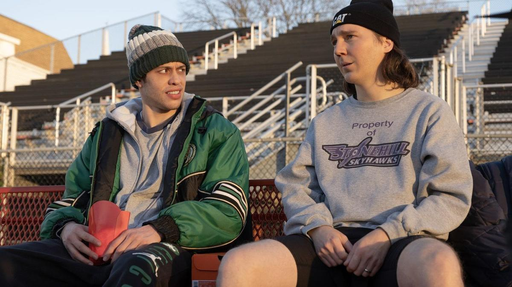

# Лузеры против Уолл-стрит. С 5 октября на экранах «Дурные деньги» — саркастическая финансовая комедия Крейга Гилеспи

- **URL:** https://novayagazeta.ru/articles/2023/10/04/luzery-protiv-uoll-strit
- **Дата:** 2023-10-04
- **Автор:** Лариса Малюкова

## Лузеры против Уолл-стрит

## С 5 октября на экранах «Дурные деньги» — саркастическая финансовая комедия Крейга Гилеспи

Кадр из фильма «Дурные деньги»

Это фильм про то, как инвесторы-любители, вынырнувшие из соцсетей, победили воротил Уолл-стрита. Тех самых, которые правят деньгами и вроде бы правят миром. Фильм снят основе реальных событий, описанных в романе «Антисоциальная сеть» Бена Мезрича.

Однажды крупнейшие брокеры с миллиардными состояниями решили, что очередная небольшая сеть магазинов видеоигр должна обанкротиться, и решили ей немного «помочь». История, так сказать, самая заурядная. Волчьи законы капитализма работают исправно, и в финансовой среде — прежде всего.

Но тут-то и возник Кит Гилл (Пол Дано) по прозвищу Ревущий Котенок. С точки зрения крупных игроков — лузер и задрот, пользователь Reddit и самодеятельный инвестиционный аналитик, который вложил свои скромные средства в акции увядающей сети магазинов GameStop, продающей игровые консоли, диски с видеоиграми, фильмами. Что и говорить, все это в каком-то смысле умирающий формат. И вкладывать в него средства?

Мужчина с оплывшим женоподобным лицом в красной бандане и принтом котов на майке — у микрофона перед экранами компьютеров. Разговаривает с такими же, как он лузерами, трейдерами-любителями. Объясняет в подкастах, почему GameStop недооценен, и предлагает объединиться — вложиться в видеоигры компании, которую крупнейшие инвесторы уже похоронили. Ревущий Котенок призывает сторонников действовать заодно.

И некоторые из них отзываются, вкладывают в неустойчивую компанию последние деньги. И акции GameStop начинают расти.

Кадр из фильма «Дурные деньги»

Уолл-стрит поначалу не обращает внимания на какую-то копошащуюся у его ног перед своей гибелью сошку. Кто сегодня из геймеров покупает диски? Едва ли не все скачивают игры в Сети.

Но цена акций взлетает вверх уже до 90% в день.

Это же не по правилам! Миллиардеры один за другим впадают в истерику: их миллионы на глазах у всех тают. Общие убытки уже 68 миллиардов. Похоже, розничные трейдеры решили их разорить, разрушить крупнейшие хедж-фонды.

Кролики решили сожрать льва?

Геймеры, тиктокеры, домохозяйки и мелкие инвесторы азартно принялись скупать акции и «сломали» Уолл-стрит, попутно заработав «дурные деньги». «Дурными деньгами» на Уолл-стрит язвительно именуют средства балующихся выскочек-инвесторов.

Вот так совершенно неожиданно из вчерашних видеонезнакомцев благодаря соцсетям сложилась некая социальная общность. Обычные люди — от медсестры, матери-одиночки из Питтсбурга до студенток в Остине или продавца дисков Маркоса (Энтони Рамос), работающего в GameStop в Детройте, — сказали «нет» тем, кто привык беззвучно закулисно править миром. Новые Робин Гуды дали бой мировым биржам.

Кадр из фильма «Дурные деньги»

Мощные хедж-фонды, пузырящиеся от доходов, до этого легко шортившие акции (по сути, делая ставку на то, что они упадут), действительно понесли огромные убытки из-за нахлынувшей армии «новичков». А Робин Гуды, стаи «ревущих котят», выказали не только способность солидаризироваться, но и, когда обналичивание казалось невообразимо прибыльным для каждого из них, не сняли средства, сохранив верность принципам.

Шейлин Вудли играет жену Гилла, которая поддерживает своего мужа, превратившегося в звезду YouTube, в горе и радости, мучительно принимает решение — не снимать деньги, в которых очень нуждается семья.

Фильм вроде бы снят в хорошем темпе, но обилие персонажей, специализированной финансовой терминологии (все эти шорт-сквизы, акцизы, волатильность и депорты), перепутанных повествовательных нитей и линий лишают повествование драйва, создают на экране некоторую суету, кружа голову даже внимательному зрителю.

Скажите мне, сколько вы зарабатываете, и я вам скажу, кто вы. Авторы «Дурных денег» показывают, как может обмануть эта формула.

Поддержите нашу работу!

1000 500 300 Нажимая кнопку «Стать соучастником», я принимаю условия и подтверждаю свое гражданство РФ

Если у вас есть вопросы, пишите [email protected] или звоните:+7 (929) 612-03-68

Все главные персонажи фильма представлены титром, обозначающим их собственный капитал. От сотен долларов до миллиардов. И симпатии авторов явно (порой даже слишком явно) на стороне «людей с обочины». Миллиардеры, акулы-воротилы временами напоминают шаржированных мультзлодеев вроде Синьора Помидора. И когда они на наших глазах паникуют, беднеют, записывают душещипательные видео на фоне коллекций дорогих вин, их не жалко.

Кадр из фильма «Дурные деньги»

Кто спорит, мир контролируется сверхбогатыми и сверхпривилегированными, которые и есть власть. И внезапный триумф Чиполлино — не событие, ознаменовавшее демократизацию фондового рынка, а лишь исключение из устаканенных и узаконенных в финансовом мире правил.

Надолго ли «давиды» победили «голиафов»? Вряд ли, эта история несистемна. Она — всего лишь экспансивный ответный удар устоявшейся циничной практике хедж-фондов решать судьбы небольших компаний.

Но Крейг Гилеспи и снимает кино не про деньги. И его Кит Гилл не похож на хитроумного брокера.

Он собирает свою армию благодаря честной, искренней интонации. Он рассказывает своим единомышленникам о погибшей в пандемию сестре. Встречает с ними Рождество. Радуется выигрышу и переживает потерю средств — прямо в прямом эфире.

В прямом эфире принимает решение идти до конца. В этом «казино» люди делают ставки не на черное и красное — на солидарность.

Фильм Крейга Гиллеспи («Тоня против всех», «Круэлла») во многом откровенно опирается на «Социальную сеть» Дэвида Финчера и на «Игру на понижение» Адама Маккея о финансовых махинациях (неслучаен схожий монтажный рисунок — обе картины монтировал Кирк Бакстер).

Сегодня снова, как во времена «Уолл-Стрита» Стоуна или «Волка с Уолл-стрит» Скорсезе в моде финансовые триллеры и комедии. Только что на кинофестивале «Санденс» прогремела «Честная игра» Хлои Домон, скрестившей финансы и эротику. Фильм приобрела платформа Netflix после аукциона между полдюжиной компаний, включая Searchlight Pictures за 20 миллионов долларов. Таким образом, для продюсеров создание фильмов о деньгах и их влиянии на нашу жизнь — неплохое вложение собственных средств.

Наш обозреватель ведет телеграм-канал о кино и не только. Подписывайтесь тут.

Читайте также

Лотерея с бывшей

На экраны выходит 50-й фильм Вуди Аллена «Великая ирония» — романтическая трагикомедия с криминальным привкусом

### Этот материал входит в подписки

Смотровая площадкаКино с Ларисой Малюковой

Культурные гидыЧто читать, что смотреть в кино и на сцене, что слушать

### Добавляйте в Конструктор свои источники: сайты, телеграм- и youtube-каналы

Войдите в профиль, чтобы не терять свои подписки на разных устройствах

Поддержите нашу работу!

1000 500 300 Нажимая кнопку «Стать соучастником», я принимаю условия и подтверждаю свое гражданство РФ

Если у вас есть вопросы, пишите [email protected] или звоните:+7 (929) 612-03-68
