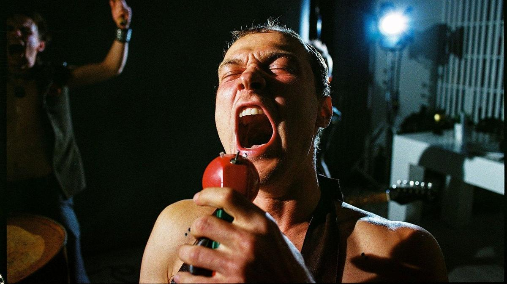

# «Але, Марина!». 5 октября открывается кинофестиваль актуального российского кино «Маяк»

- **URL:** https://novayagazeta.ru/articles/2023/10/05/ale-marina
- **Дата:** 2023-10-05
- **Автор:** Лариса Малюкова

## «Але, Марина!»

## 5 октября открывается кинофестиваль актуального российского кино «Маяк»

Кадр из фильма «Год рождения»

Новые имена и авторские высказывания известных режиссеров, профессиональный форум, который в хаосе и «шуме времени» пытается расслышать одинокий голос человека.

Программу собирал мой коллега Стас Тыркин, имя которого почему-то любят полоскать анонимные телеграмщики. Может, за сотрудничество с Гоголь-центром, в котором Стас был куратором киноклуба «Гоголь-кино». Или за его радикальную программу на ММКФ «Фильмы, которых здесь не было». Я уважаю его профессионализм и доверяю его вкусу, хотя мы можем и не совпадать в оценках ряда картин. И сам фестиваль может стать смотром неофициального живого авторского кино.

А для открытия трудно выбрать более точную картину, чем «Год рождения».

Романтика и панк, микс фэнтези и трагифарса в исполнении Михаила Местецкого, автора «Тряпичного союза».

Кадр из фильма «Год рождения»

Стертая хроника 90-х, словно воспроизведенная на обсыпавшихся вэхаэсках. Бешеные, рвущие голоса панки из группы «Яичный свет» носятся по сцене клуба в вымышленном городе Металлогорске. В центре свирепствует солист Сопля (Юра Борисов), в какой-то момент взлетающий на верхотуру и под рев толпы и звездную композицию группы «Але, Мария! Подыхаю без тебя» (панковский ремикс молитвы Баха–Шуберта) бензопилой отрезает себе… голову.

Но если вы думаете, что на этом партия Сопли завершается и он окончательно расстается с головой, то глубоко ошибаетесь.

Потому что рок бессмертен. Как и первая любовь, хрупкая, перерезающая плоть жизни на «до» и «после».

Юный мечтательный Филипп (Эльдар Калимулин) в относительно тихие десятые собрал в своей малогабаритной квартире фанатские раритеты — принадлежащие в прошлом тем самым музыкантам. Сейчас специально для девушки-одуванчика Марины (Анастасия Талызина), которая продает диваны, он проводит экскурсию. Показывает не только бензопилу и прочий хлам, но и особый музыкальный инструмент, изобретенный Соплей, уандер-элемент, который извлекает внутреннюю музыку из всех людей. Стоит только поднести этот инструмент — очевидный потомок трубы Бананана — к человеку, как сразу начинаем его слышать.

Колыбельную — рядом с малышом, восточную попсу — с «неместным» таксистом, советскую — про сбежавшую электричку — рядом с бабулей.

Вполне себе земная Марина поддержит Филиппа в его мечте организовать в их нью-васюковском Металлогорске Международный фестиваль металлического андеграунда «Месиво», посвященный их знаменитым землякам «Яичному свету». В Металлогорск съедутся 200 000 участников и туристов! Надо только найти работу. Остепениться. Можно к папе Марины — владельцу цеха по переработке мяса. Способности электрика Филиппа могут пригодиться везде. Разумеется, такой «жених» с его нелепыми заоблачными фантазиями не может понравиться крепко стоящим на ногах родителям Марины… Кабы не известие о ее беременности.

Кадр из фильма «Год рождения»

Значит, Филиппу придется повзрослеть. Одуматься. Пойти трудиться в мясной цех. Согласиться с перестановкой и ремонтом ради будущего малыша в его музейной квартире и даже с белым чужеродным диваном из Марининой коллекции. Попытаться устроиться в местный краеведческий музей, в котором манекен медсестры перевязывает манекены раненых бойцов. И до смерти напугать директрису Зульфию Махмудовну своими безумными планами о музее «металлогорского чуда», посвященного тяжелому року?

А еще — забыть любимые композиции «Але, Марина!» и «Я живу, под собою не чуя штанов».

И едва не задохнуться от тоски. «Але, жизнь — пресная, мясная, серая!»

Живи себе в городе Металлогорске с его ржавыми буквами в названии, среди замороженных туш. Отличай вырезку от филейной части. Думай об ответственности и жди полного заземления.

Поддержите нашу работу!

1000 500 300 Нажимая кнопку «Стать соучастником», я принимаю условия и подтверждаю свое гражданство РФ

Если у вас есть вопросы, пишите [email protected] или звоните:+7 (929) 612-03-68

Ходи на занятия для будущих родителей. Тужься. Подумаешь, вылез на свет яичный… полезай обратно! Кому, на хрен, нужны твои самокаты с авокадами. Делай фестиваль «Холодец» для тучных. Тогда и администрация впишется.

Матрицу не сломаешь.

Тем более что в уши тебе льют яд: мол, и чуда никакого не было, не был Сопля ракетой, волшебником металла, не покрывал себя татуировками усилиями воли. Просто спился/скололся.

К шее голову не приклеить. Фантазию — к жизни. Новую жизнь — к жизни (название фильм «Год рождения» — это время действия: девять месяцев до рождения ребенка Филиппа и Марины).

…Ну разве что клеем «Момент»? Или первой любовью, которая склеивает намертво «до» и «после». Или криком «Але, Марина! Подыхаю без тебя!» Или голосом нерожденного сына.

Потому что без фантазии в нашем ржавом Металлогорске не выжить, а моментами — вообще труба.

Кадр из фильма «Год рождения»

Снимали это кино в Мурманске. Все совпадения топонимики случайны. Просто оператору Давиду Хайзникову казалось, что небо здесь низкое и многослойное. А в кадре это серое небо словно давит, висит на головах у героев.

А кино при этом получилось летнее, безумное (как любит Местецкий), немного обшарпанное (как и должно быть в нашем Металлогорске), обнадеживающее. С булгаковсими мотивами. С аллюзиями на «Шапито-шоу» и «Лето», с отсылками к Гиллиаму, Дель Торо и Гондри.

Фильм снят по сценарию самого Михаила Местецкого (между прочим, создателя логоцентричной музыкальной группы «Шкловский») и молодого режиссера и сценариста Алексея Смирнова. Вот как они друг друга находят и соединяются в неожиданных союзах? Не иначе как с помощью уандер-элемента и особого клея «Момент».

Композиторы Кирилл Белоруссов и Михаил Местецкий.

### P.S.

Организатор кинофестиваля «Маяк» — Фонд развития современного кинематографа «Кинопрайм». С 2019 года фонд поддержал производство более семидесяти российских фильмов, многие из которых участвовали в программах и получили призы международных кинофестивалей в Каннах, Венеции, Локарно, Берлине и Роттердаме. Продюсер кинофестиваля — исполнительный директор фонда Антон Малышев.

Лариса Малюкова ведет телеграм-канал о кино и не только. Подписывайтесь тут.

Читайте также

Лузеры против Уолл-стрит

С 5 октября на экранах «Дурные деньги» — саркастическая финансовая комедия Крейга Гилеспи

### Этот материал входит в подписки

Смотровая площадкаКино с Ларисой Малюковой

Культурные гидыЧто читать, что смотреть в кино и на сцене, что слушать

### Добавляйте в Конструктор свои источники: сайты, телеграм- и youtube-каналы

Войдите в профиль, чтобы не терять свои подписки на разных устройствах

Поддержите нашу работу!

1000 500 300 Нажимая кнопку «Стать соучастником», я принимаю условия и подтверждаю свое гражданство РФ

Если у вас есть вопросы, пишите [email protected] или звоните:+7 (929) 612-03-68
