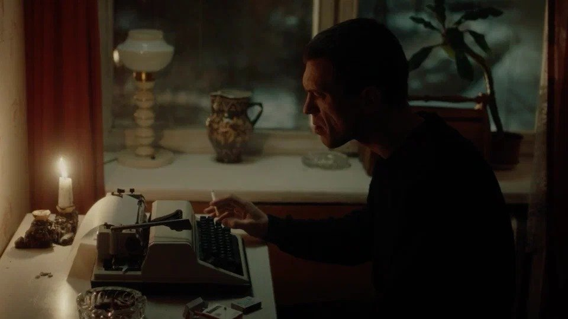

# Как хорошо мы плохо жили. «Рыжий» — фильм Семена Серзина на фестивале «Маяк»

- **URL:** https://novayagazeta.ru/articles/2023/10/09/kak-khorosho-my-plokho-zhili
- **Дата:** 2023-10-09
- **Автор:** Лариса Малюкова

## Как хорошо мы плохо жили

## «Рыжий» — фильм Семена Серзина на фестивале «Маяк»

Кадр из фильма «Рыжий»

О лишнем человеке, проклятом поэте, неприкаянном страннике. Ушедшим из жизни в 26. На пике славы. По своей воле.

Екатеринбург 90-х — вчерашний Свердловск. Молодые, амбициозные и нищие поэты пытаются быть… поэтами. Хотя все против них. А все равно пытаются. Хотя бы просто быть. Самые счастливые кадры в фильме — домашнее видео: зимнее катание всей разношерстной разудалой компании со снежных горок. Смешные, нелепые раздолбаи и бедолаги.

И любимая жена Ира (Таисия Вилкова) — единственная вечная горькая любовь, несчастная муза: «Не покидай меня, когда / горит полночная звезда».

И сын Артемка, которому обещал из самих далеких Нидерландов доставить Лего. Ира скажет: «Не привезет». А Артем все равно верит. Потому что поэзия честнее прозы. «Я тебе привезу из Голландии Legо, мы возьмем и построим из Legо дворец».

Каким ветром занесло его с его стихами в эти обшарпанные пятиэтажки, в прогорклый район Вторчермета, где наркоман на наркомане, бандит на бандите? В безнадежность-безденежье. Ну тут уж они сами виноваты.

Тот же Рыжий, например. Сбился с протоптанной дороги. Из хорошей семьи, папа — профессор, заведующий Лабораторией геофизики. Да и сам Борис подающий надежды молодой ученый, геофизик. Автор диссертации на тему «Глобальная проблематика сейсмичности России».

Вот чего, а сейсмичности у нас с переизбытком.

Переломные эпохи — дурное время. Особенно для поэтов. Безжалостный водоворот для бескожих — «возможность плакать от чужого горя», но и «любя, чужому счастью улыбаться». Он помогает друзьям-бедолагам выходить если не сухими, то живыми… или почти живыми из разнообразных передряг. Договариваться с бандитами. Да что там с бандитами, самому пахану Ангольцу (Олег Васильков) заговаривать зубы своими виршами — удивительное дело — трогающими всех: от снобов до алкашей. Бандиты слушают его и натурально плачут.

Поэт Борис Рыжий. Фото: letsgophotos.ru

Тащит других из болота, но как вытащить себя?

Главное — не ссать. Держаться за буквы и рифмы. Или за придуманную ими сумасшедшую литературную премию «Мрамор». За лучшие стихи уральских самородков. Вроде бы стеб. Но раз уж крышуют бандиты ритуальный бизнес, самое время о вечности подумать. Впрочем, и у «мраморной бандитской» премии какое будущее?

Тут поспевает публикация подборки в «Знамени». Неизвестный уральский поэт получает «Антибукера», и тут же на вечеринке «махается кулаками», как на Вторчермете с братвой.

Он неудобный всем. Маргинал и изгнанник, свой среди чужих. Цитирующий Батюшкова на попойках с друзьями, но и среди «богемы» — уральский инопланетянин. Залетевший в криминальные 90-е словно из другого времени.

Они хоронят друзей, а кажется, самих себя. Если сегодня заглянуть на екатеринбургское кладбище — рядами могилы 90-х, в них двадцатилетние парни. Поколение. Он их голос.

По словам Рыжего, они «запнулись с медью в черепах как первые солдаты перестройки».

«Не так все должно было выйти, Боря», — говорит ему товарищ, приковавший себя к батарее, чтобы не колоться. Продавший последние спортивные медали и кубки.

Сигарета, свеча, пишущая машинка, окно. Рыжий бьется в крошечной пустой комнате, словно муха. Ищет ускользающие «ненормированные» рифмы, краски невидимого мира. Бросает в окно скомканные неслучившиеся стихи.

Он рвал строфы в клочья, и даже слово разделял на части, как все вокруг распадалось: страна, люди в телевизоре, люди рядом с телевизором, в котором Ельцин говорит, что сделал все что мог и уходит. Доллар скачет в пределах 25 рублей. И только Якубович, словно прикованный, как кореш Рыжего, крутит свое колесо. Что им делать в неведомом еще более сером будущем? «Глохнуть в шуме разрушающегося быта?» Но он вслед за Ходасевичем хочет слышать музыку времени, даже если она ему не нравится. Даже если она его убивает.

Просто в разные времена поэты поют разными голосами. Их пение — оправдание их глупой жизни. Их трагедия — быть поэтом, дышать рифмами. И музыка Рыжего — поэзия, скрещенная с прозой жизни 90-х.

Поддержите нашу работу!

1000 500 300 Нажимая кнопку «Стать соучастником», я принимаю условия и подтверждаю свое гражданство РФ

Если у вас есть вопросы, пишите [email protected] или звоните:+7 (929) 612-03-68

Как все намертво слепилось? Признание и депрессия? Аплодисменты — и запои, интервью — и хамские провокации. Поток стихов — и «Осталась глупая досада: «Не то что говорить не надо, а то что нечего сказать».

В фильме много поэзии. Вообще, это неплохой, я бы даже сказала, правильный фильм. Хотя и без какой-то тайны, сдвига от общеизвестного. И даже отличная сцена, в которой малоизвестный поэт попадает на концерт суперзвезды российского рока Егора Летова, — слишком очевидное объяснение его невыразимой тоски от своей ненужности.

Кадр из фильма «Рыжий»

Неожиданный и при этом снайперски точный выбор актера на роль «лишнего поэта». Евгений Алехин, сыгравший Рыжего, — писатель, режиссер, актер и вокалист группы «Ночные грузчики». Лицо с отпечатком судьбы. Таисия Вилкова — Ирина. Любящая и любимая, земная и — «ржавая в черных прожилках звезда и ничего никогда».

Уже традиционно трагикомическая звонкая — временами слишком звонкая, бенефисная — роль Евгения Ткачука. Самого нелепого и самого несчастного из друзей. Не сложившего своей судьбы поэта и сгоревшего на ветру эпохи фигляра. Гонимого, повязанного долгами. Как многие другие «местные поэты», завидующего прорвавшемуся в высшие орбиты и зарвавшемуся Боре. Почему именно он? И поймавшего в старенькую камеру их редкие моменты снежного счастья и единения в «те баснословные года», когда «нам пиво воздух заменяло».

Сцена из спектакля «Как хорошо мы плохо жили». Фото: spb.radario.ru

Это давний замысел Семена Серзина («Человек из Подольска»), пять лет назад он поставил на сцене «Невидимого театра» спектакль по мотивам стихов и дневников Рыжего «Как хорошо мы плохо жили». Осуществиться замыслу помог продюсер Илья Стюарт и компания Hype Film.

За магазином ввечеру стояли, тихо говорили: «Как хорошо мы плохо жили», прикуривали на ветру.

Лариса Малюкова ведет телеграм-канал о кино и не только. Подписывайтесь тут.

Читайте также

Приговоренный к жизни, К… У… КУ!

Новая картина Резо Гигинеишвили «Пациент №1» с Александром Филиппенко — про гниение диктатур. Мировая премьера в ноябре

### Этот материал входит в подписки

Смотровая площадкаКино с Ларисой Малюковой

Культурные гидыЧто читать, что смотреть в кино и на сцене, что слушать

### Добавляйте в Конструктор свои источники: сайты, телеграм- и youtube-каналы

Войдите в профиль, чтобы не терять свои подписки на разных устройствах

Поддержите нашу работу!

1000 500 300 Нажимая кнопку «Стать соучастником», я принимаю условия и подтверждаю свое гражданство РФ

Если у вас есть вопросы, пишите [email protected] или звоните:+7 (929) 612-03-68
