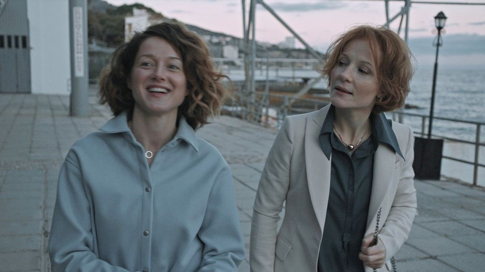

# До свиданья, лето, до свидания! Лучший фильм кинофестиваля авторского российского кино «Маяк» — «Каникулы» Ани Кузнецовой

- **URL:** https://novayagazeta.ru/articles/2023/10/10/do-svidania-leto-do-svidaniia
- **Дата:** 2023-10-10
- **Автор:** Лариса Малюкова

## До свиданья, лето, до свидания!

## Лучший фильм кинофестиваля авторского российского кино «Маяк» — «Каникулы» Ани Кузнецовой

Кадр из фильма «Каникулы»

Вчера стал известен лучший фильм кинофестиваля авторского российского кино «Маяк» — «Каникулы» Ани Кузнецовой. Картина, которая развивает и переосмысляет фильмы романтической трилогии Сергея Соловьева («Сто дней после детства», «Спасатель», «Наследница по прямой») об отроках в советской (здесь — постсоветской) вселенной. Об их отношениях со взрослыми.

О чем история?

Вроде бы все очень просто. Двенадцать школьников из калужского театрального кружка летят в Сочи на фестиваль. За ними присматривают строгая завуч Мария Генриховна (Полина Кутепова) и совсем молодая учительница-режиссер Татьяна Викторовна (Дарья Савельева), между которыми отношения, мягко говоря, натянутые. Потому что они — лед и пламя. Дисциплинированная, ответственная, живущая по правилам, выверенным разнообразными надзорными организациями (от Минпроса до разнообразных департаментов), — завуч. И ветер в голове — Таня, не сильно отличающаяся от подростков, с которыми она ставит спектакль.

Две сплетенные линии — взаимоотношения подростков, в крови которых кипит первая, как правило, безответная любовь, максимализм, отчаянный буллинг и неумеренные амбиции. Но на первом плане — отношения двух учительниц, поначалу яростных антагонисток.

Таня — бунтарка и неформалка: все против правил. Она может развернуть целую операцию, чтобы достать посадочный талон для ребенка с неправильно оформленными документами. Может на рассвете на пустом сочинском побережье достать кофе. И потом непедагогично курить с трудной воспитанницей, танцевать на пустом берегу с исчезнувшей тинейджеркой. Шататься и бражничать неведомо где до утра. Загадывать судьбу по фантику жвачки. Такая вроде бы инфантильная Мэри Поппинс, которая говорит с детьми на одном языке. Чувствует их вибрацию. Относится к ним как к равным.

Она ставит с ними спектакль «Земляничное вино» как прощание с летом… Или как прощание с детством. Когда пальцы — красные от земляники, солнечный свет гладит руки, а взгляды красноречивей слов. Сразу вспоминается даже не «Вино из одуванчиков», а чудный рассказ Брэдбери «Прощай, лето». Там эти слова все время повторял дедушка подростка Дугласа, и Дуглас никак не понимал, что именно дедушка имеет в виду. Лишь после вязкого, очень тревожного сна, в котором был земляничный пирог, земляничное мороженое и расставание навсегда с самыми близкими, дорогими людьми, Дуглас подошел к зеркалу, чтобы посмотреть, как выглядит печаль. И увидел: она затуманила лицо и глаза, да так, что вовек не сотрешь.

Кадр из фильма «Каникулы»

Однако на детском фестивале со строгими возрастными ограничениями и дежурными педагогическими установками никому не нужны эти нежные психологические кружева, мучительные мысли о прощании с детством, о первой любви и расставании… может быть, навсегда.

Вино — в спектакле лишь образ летучего летнего воспоминания. Его изображают на сцене светодиодные огоньки в стеклянной банке. Они волшебно рассыпаются, растекаются из рук детей по сцене. Но на сочинском фестивале нельзя даже упоминать слово «вино». Здесь солнечные детки стройным хором поют здравицу «Россия, мы дети твои». Суперсамодеятельно играют «Питера Пэна».

Спектакль с думающими живыми подростками кажется устроителям до неприличия неуместным. Претенциозным. Раздражает герой — мальчик, переживающий расставание с девочкой: «бездеятельный», попусту рефлексирующий! Это неправильный вектор. А нам сегодня нужен какой герой? Правильно. Активный, деятельный. Детям необходимо внушать оптимизм, создавать правильную картину мира с помощью таких светлых спектаклей, как «Золотой ключик» или «Волшебник Изумрудного города». А тут еще вино! Вы не забыли, на минуточку, о возрастных цензах?!

И эти пыльные, архаичные, советские установки, столь востребованные сегодня, не просто бесят — они оскорбительны для Татьяны Викторовны. Все эти требования умозрительного «добра и света», зацикленность на «формировании нравственных критериев», воспитательных функциях детского театра. И вообще на «функциях», а не сути. И этот казенный, выхолощенный, отполированный язык, за которым нет горизонта. Нет ничего живого.

Но самое любопытное — наблюдать за тем, как узнают друг друга, учатся друг у друга чему-то важному и сближаются учительницы-антагонистки. Как Таня затягивает в водоворот «праздника непослушания» всегда причесанную, строго одетую Марию Генриховну. На чужую армянскую свадьбу с танцами, прыжками в море, доставкой суши на рассвете.

И как теряется Мария Генриховна, выбирая между близкой дружбой и привычной иерархией.

Что останется от этих кратких каникул? Вкус поражения? Или вкус позолоченных театральных масок на торте?

Поддержите нашу работу!

1000 500 300 Нажимая кнопку «Стать соучастником», я принимаю условия и подтверждаю свое гражданство РФ

Если у вас есть вопросы, пишите [email protected] или звоните:+7 (929) 612-03-68

И острое ощущение, как в фильмах Соловьева, что вот он, последний, искренний, как детство, день лета, которого больше никогда не будет. Собираешь светодиодные огоньки в ладони, как воспоминания, чтобы они не ускользали. Как этот шум волн. И уже не детских слез, размазывающих тушь. И горечь неразделенной первой любви.

Как в ломкой песенке «Конфетти» группы «Обе две»:

Летят конфетти с небес. Мы ловим их ртом. Снег. Мы ловим их ртом. Снег. Мы ловим их. Я так устала… Ничего не чувствую.

Кадр из фильма «Каникулы»

Дебютный фильм делался в основном молодой женской командой. Аня Кузнецова вместе с Екатериной Задохиной написали сценарий. Даша Данилова монтировала. Продюсер Наталья Дрозд добилась поддержки фильма от европейского фонда «Евримаж». Даше Савельевой и Полине Кутеповой можно было бы дать приз за лучший актерский дуэт.

Но есть здесь и крепкая мужская финская рука — оператора Яни-Петтери Пасси.

А еще — Анна Кузнецова, одна из любимых учениц Алексея Попогребского, а креативный продюсер фильма — Борис Хлебников.

В общем, Аня — их «наследница по прямой»: в поиске своей личной темы, честного, антипафосного, негромкого человеческого кино. Если говорить об актуальности, то вот оно, художественное осмысление сегодняшнего дня.

- Гран-при — «КАНИКУЛЫ» Анны Кузнецовой;
- Лучшая режиссерская работа — Дмитрий Давыдов («ЧУМА»);
- Лучшая мужская роль — Эльдар Калимулин («ГОД РОЖДЕНИЯ»);
- Лучшая женская роль — Лиза Янковская («ФРАУ»);
- Лучшая работа оператора — Алишер Хамидходжаев («КОРОЛЕВСТВО»);
- Лучший сценарий — Любовь Мульменко («ФРАУ»);
- Лучший дебют — «КОРОЛЕВСТВО» (реж. Татьяна Рахманова)

Лариса Малюкова ведет телеграм-канал о кино и не только. Подписывайтесь тут.

### Этот материал входит в подписку

Смотровая площадкаКино с Ларисой Малюковой

### Добавляйте в Конструктор свои источники: сайты, телеграм- и youtube-каналы

Войдите в профиль, чтобы не терять свои подписки на разных устройствах

Поддержите нашу работу!

1000 500 300 Нажимая кнопку «Стать соучастником», я принимаю условия и подтверждаю свое гражданство РФ

Если у вас есть вопросы, пишите [email protected] или звоните:+7 (929) 612-03-68
