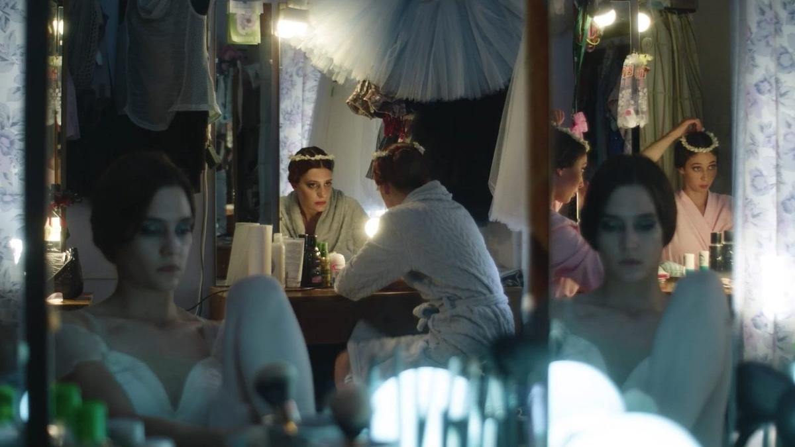

# Ледяная сказка из морозильника. «Фрау» Любови Мульменко — нежное кино о несостоявшейся любви

- **URL:** https://novayagazeta.ru/articles/2023/10/11/ledianaia-skazka-iz-morozilnika
- **Дата:** 2023-10-11
- **Автор:** Лариса Малюкова

## Ледяная сказка из морозильника

## «Фрау» Любови Мульменко — нежное кино о несостоявшейся любви

Кадр из фильма «Фрау»

Какой-то неожиданный живой антиромком. Не про неразделенность, безответность или преодоление препятствий. В общем — не про Ромео и Джульетту. А как пишут в соцсетях — «все сложно».

И начинается кино, будто в другом временном измерении. Черно-белом советском ретро. Под задорный пионерский хор из старой картины «Приключения Толи Клюквина». «Как хорошо проснуться рано, / Чуть в небе солнце заиграло! / Как хорошо веселой песней / Встретить новый день чудесный, /Синеглазый день!»

Синеглазый бодрый день встречает Иван (Вадик Королев), которому уже явно за тридцать. Но кажется, он чистый и ясный подросток. Зарядка под звонкую «Мы птицами-синицами мотив один свистим!» В общем, да здравствует мыло душистое… зубной порошок… и яйцо крутое, и сосиски с горошком. И вилка — идеально вымытая. И на улице девушку — через лужу. Как прекрасен этот мир — посмотри!

Вадик Королев в роли Вани. Кадр из фильма «Фрау»

…И титры, словно из детской книжки «Тиль Уленшпигель» с выразительными иллюстрациями Юрия Богачева и шрифтом с вензелями. Хорошо помню эту зачитанную книжку. Эта книжка, эта легенда много значит для Ивана, который работает в магазине «Рыболов-спортсмен». Потому что Иван — рыцарь. И все женщины для него — прекрасные богоподобные «фрау». И вооружен Иван нешуточно, за ремнем у него топорик… из того же магазина «Охотник-рыболов».

На выходные с коллегами на рыбалку. С костром. И подвижными играми.

На обед — свежее и питательное. Очень вкусные ромштексы, к примеру.

А вот Фрау (Лиза Янковская). Кристина-балерина. Она еще не подозревает, что стала «прекрасной дамой» для рыцаря Вани. Мается со своим любовником, пьющим и глубоко женатым Гришей. В общем, проживает самую что ни есть обычную бабскую жизнь, хотя на сцене она — принцесса.

Танцует несчастную любовь Жизель. И не чует, что чудик — встречающий ее после спектакля с васильками и знающий про васильки и их разновидности все на свете (да если бы только про васильки), может быть, ее соломинка из тоски. Из женского домашнего царства.

Лиза Янковская в роли Кристины. Кадр из фильма «Фрау»

Ей уже под тридцать. И авторитарная сухая бабушка Ольга Семеновна (Людмила Чиркова), в прошлом доктор (из тех, что «резать к чертовой матери, не дожидаясь перитонита»), и забитая интеллигентная мама Полина Аркадьевна, втайне от бабушки покуривающая (Инга Оболдина), — мозг выносят. Только и мечтают выдать ее замуж.

Иван тоже страдает, скрашивая уединение общением со своим черным котом и кроссвордами. Слово, обозначающее «смертный грех», — для него однозначно: «одиночество».

Потому и ищет с маниакальной настойчивостью себе пару. В прошлом у него уже была трагическая история любви. Когда он со всей душой, на белом коне с совой и зеркалом в руках, как подобает настоящему рыцарю, приехал свататься к своей Дульсинее — Марии. А девушка сбежала. То ли от испуга. То ли из природной скромности.

Но Ваня продолжает искать смысл жизни, полагая, что это — нормальная семья: жена и дети.

Вот такие полярности встретились. Друг друга рассмотрели.

Ретро-человек Иван, который хоть и сантехнику любую починит, но в небесах летает. Живет в бабушкиной квартире с бабушкиной мебелью, торшером, красными в горошек коробочками для круп. Его черно-белый застывший в уютном бабушкином прошлом мир пронизан светом, красотой.

Кадр из фильма «Фрау»

Поддержите нашу работу!

1000 500 300 Нажимая кнопку «Стать соучастником», я принимаю условия и подтверждаю свое гражданство РФ

Если у вас есть вопросы, пишите [email protected] или звоните:+7 (929) 612-03-68

В этом мире растет дерево — хранитель леса, а под деревом землеройка бьется за свое право жизни. Юродивый, одним словом. А может, и нормальный, а мы все — юродивые.

И Кристина с ее охряным увядшим тусклым жизненным пространством. С нулем на эмоциональной шкале. С вовсе не сказочной изматывающей работой. И полным отсутствием нормальной личной жизни. Хотя где она, эта нормальность?

Что хорошо в сценарии и фильме талантливого автора Любы Мульменко — отсутствие однозначных стереотипных ходов и характеров. Взять хотя бы «токсичную бабушку», которая замучила и дочь, и внучку наставлениями. А как только сильная и умная бабушка Ольга Семеновна тяжко заболевает, и нет средств ее спасти, — выявляется такая сила взаимной любви, жертвенности внутри этого обреченного на вымирание женского царства. (Кажется, в эту историю Люба вложила свое интимное признание в любви к своей бабушке, тоже врачу — эпидемиологу, и маме — переводчику, ее собственно, и воспитавших.) А спасать умирающую бабушку приходит экс-любовник Кристины. И нет здесь правых и виноватых.

Есть страх оказаться в одиночестве. И ради этого люди «обманывать себя рады», вступать обеими ногами на заминированное матримониальное поле. Ломать себя под другого. Или другого — под себя. Перевоспитать, убрав все лишнее. Но если это лишнее — и есть другой?

Кадр из фильма «Фрау»

В режиссерском дебюте «Дунай» был воздушный сумасшедший летний Белград. Во «Фрау» — летняя с цветущими палисадами и садами, а потом замерзающая вместе с исчезающей надеждой на обретение себя в другом Пермь.

Родина Любы Мульменко. С заснеженными трамваями, ледяными пригородами. Как в «Ледяной сказке», написанной от руки Иваном и спрятанной от чужих глаз в морозилке.

Чудесные акварельные работы актеров. Причем с первого момента ясно, что герои Лизы Янковской и Вадика Королева — не пара. Но все время надеешься на обыкновенное чудо любви. На то, что Принцесса и Дровосек полюбят друг друга и будут счастливы. Как в сказках. В сказках только так и бывает. И тут даже Матрона, которой Вадик цветы дарит, не поможет.

Читайте также

До свиданья, лето, до свидания!

Лучший фильм кинофестиваля авторского российского кино «Маяк» — «Каникулы» Ани Кузнецовой

### P.S.

На фестивале актуального авторского кино «Маяк» Лиза Янковская получила приз за лучшую женскую роль. А Люба Мульменко — за лучший сценарий.

Лариса Малюкова ведет телеграм-канал о кино и не только. Подписывайтесь тут.

### Этот материал входит в подписку

Смотровая площадкаКино с Ларисой Малюковой

### Добавляйте в Конструктор свои источники: сайты, телеграм- и youtube-каналы

Войдите в профиль, чтобы не терять свои подписки на разных устройствах

Поддержите нашу работу!

1000 500 300 Нажимая кнопку «Стать соучастником», я принимаю условия и подтверждаю свое гражданство РФ

Если у вас есть вопросы, пишите [email protected] или звоните:+7 (929) 612-03-68
