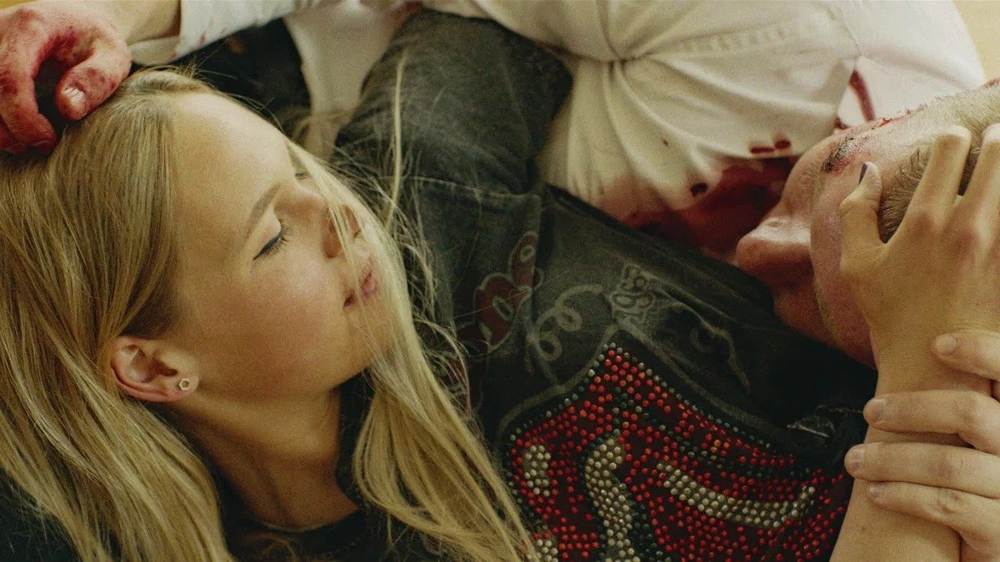

# Королевство кривых зеркал, или Генералы песчаных карьеров. Фильм «Королевство» Татьяны Рахмановой назван лучшим дебютом на кинофестивале актуального российского кино «Маяк»

- **URL:** https://novayagazeta.ru/articles/2023/10/12/korolevstvo-krivykh-zerkal-ili-generaly-peschanykh-karerov
- **Дата:** 2023-10-12
- **Автор:** Лариса Малюкова

## Королевство кривых зеркал, или Генералы песчаных карьеров

## Фильм «Королевство» Татьяны Рахмановой назван лучшим дебютом на кинофестивале актуального российского кино «Маяк»

Кадр из фильма «Королевство»

Однажды несколько выпускников детдома устроили себе выпускной.

Арендовали коттедж и соорудили праздник, какого в жизни не видели. Устроили ламбаду на краю бездны.

«Батор» на сиротском жаргоне — «детский дом» (от слова «инкубатор»). Ну так со стороны видится: вроде бы в сиротском доме все одинаковые, как из инкубатора.

А вот и неправда! Они все разные, очень яркие: Игорян, Леська, Станислав. Они зачитывают друг другу свои выкраденные характеристики как диагнозы: Станислав склонен к бреду. Ильин — признаки шизофрении. Васильков — энурез. Ситников — раздражительный.

Поломанные, прибитые жесткой дисциплиной и дедовщиной «казенного дома». И хотя бы на день вырвавшиеся из «клетки».

Есть среди них и тихий интеллектуал Особенный. Он про Серафима и волшебного Медведя рассказывает, мечтает о своей квартире. Не хочет любви за деньги с проституткой и читает ей стихи, Набокова и Соловьева. Маниакально любит числа и помнит все дни рождения сверстников-друзей.

А самый заводной — Александр. Зачитывает про себя: «неуравновешенный, агрессивный после неудач». Зато у Александра есть фантазия, эмпатия. Он и в Баторе всем помогал. Он всю эту вечернику и устроил. Вместе с товарищами даже Серегу из психушки вытащил, чтобы вместе со всеми отпраздновать первый день самостоятельной жизни. Он и местную «звезду» Лесю без памяти любит.

Сане и взрослые, и девушка любимая говорят, что неправильно жить с отсутствием горизонта планирования.

А где этот горизонт, если в самостоятельной жизни их никто не ждет? Поэтому гуляй, Саня, сегодня на последние! Трать скудное «единовременное пособие». Объясняйся в любви под белой снежной крупой Лесе.

Кадр из фильма «Королевство»

Что тебе светит, кроме черных риелтеров, которые ноги сломают и отберут крохи жилплощади, выделенные вам государством. Опекуны обманут, проедят-пропьют твои последние… И после казенного дома тебя ждет скорее всего совсем другой казенный дом.

Зато сегодня можно мечтать…

Стать популярной и опубликовать свои самодеятельные стихи.

Стать стилистом-парикмахером. Построить дом с навесным потолком и барной стойкой. Попробовать каперсы. Съездить в Кингисепп. Влюбиться в дом смерти.

Им страшно. И идти им некуда. Они останутся в королевстве Батор. Устроят из чужой усадьбы неприступную крепость.

Поддержите нашу работу!

1000 500 300 Нажимая кнопку «Стать соучастником», я принимаю условия и подтверждаю свое гражданство РФ

Если у вас есть вопросы, пишите [email protected] или звоните:+7 (929) 612-03-68

Но даже в самые раскаленные страхом трагические минуты эти генералы песчаных карьеров будут смешно-безрассудно-волшебно мечтать о невозможном, неосуществимом будущем.

Режиссер фильма Татьяна Рахманова сняла короткометражку на схожую тему — «Мой брат Бэтмен». Она тоже о кризисе и травмах юного возраста. Старший брат Миша пытается смягчить боль потери родителей для младшего — семилетнего Сережи. Сережа верит в Бэтмена. И тогда Миша надевает маску и черный плащ. Так они и гуляют по городу. Теперь Сережа не один: рядом с ним супергерой, который защитит от любой беды. От недобрых прохожих. От въедливого священника. Они создают собственный хрупкий мир, который вот-вот разрушится.

«Королевство» — ее полнометражный дебют.

Кадр из фильма «Королевство»

Фильм шероховатый, с рыхлой драматургией, словно сшитый на живую нитку, без наметки. Словно все происходящее — импровизационная игра. Но с цепкими деталями, запоминающимися характерами.

Картина снята в документальной стилистике. Камера замечательного мастера Алишера Хамидходжаева как будто полностью растворилась — как в неигровом кино по разбежкинскому методу наблюдения. Алишер — мастер «растворять» камеру, будто ее нет вовсе.

Если говорить об аналогиях, мне это кино напомнило отличный, предельно честный документальный сериал «Сироты» Алексея Суховея — целый кинороман о группе подростков, только что вышедших из детского дома. И не понимающих, как жить в этой чужой и непонятной им взрослой жизни. И один из важных фильмов 90-х «За день до» Негребы и Борецкого, интимного и страшного кино о высокой цене, заплаченной героями за выживание. О празднике у порога смерти.

В ролях: Игорь Филиппов, Иван Решетняк, Дарья Каширина, Полина Гурьянова, Даниил Стриганов, Алексей Нилов, Елизавета Лобачева, Андрей Ильин, Станислав Шадчин и другие. Почти все артисты — дебютанты.

Лариса Малюкова ведет телеграм-канал о кино и не только. Подписывайтесь тут.

Читайте также

Ледяная сказка из морозильника

«Фрау» Любови Мульменко — нежное кино о несостоявшейся любви

### Этот материал входит в подписки

Смотровая площадкаКино с Ларисой Малюковой

Культурные гидыЧто читать, что смотреть в кино и на сцене, что слушать

### Добавляйте в Конструктор свои источники: сайты, телеграм- и youtube-каналы

Войдите в профиль, чтобы не терять свои подписки на разных устройствах

Поддержите нашу работу!

1000 500 300 Нажимая кнопку «Стать соучастником», я принимаю условия и подтверждаю свое гражданство РФ

Если у вас есть вопросы, пишите [email protected] или звоните:+7 (929) 612-03-68
