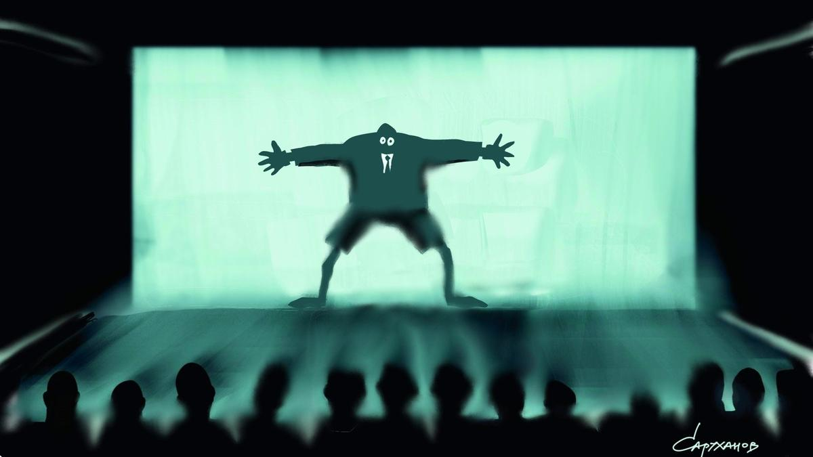

# Сказки кончились. Запреты «Айты», «Сказки», фильма «ЭТ» — цензура в культуре стала жестче и нелогичней. Те, кто ее санкционируют, — безлики

- **URL:** https://novayagazeta.ru/articles/2023/10/17/skazki-konchilis
- **Дата:** 2023-10-17
- **Автор:** Лариса Малюкова

## Сказки кончились

## Запреты «Айты», «Сказки», фильма «ЭТ» — цензура в культуре стала жестче и нелогичней. Те, кто ее санкционируют, — безлики

Петр Саруханов / «Новая газета»

В российской киноиндустрии все ощутимей невидимая, но безжалостная хватка цензуры. Подобно магистрам Тевтонского ордена некие тайные силы, используя Минкульт как инструмент, карают не слишком лояльных кинематографистов. Их картины «закрывают», изымают с платформ, их самих лишают работы.

И примеров тому все больше.

Поговорим только о недавних — самых очевидных.

## «В ней намек…»

Московская премьера фильма выдающегося режиссера Александра Сокурова «Сказка» должна была состояться 15 октября на международном фестивале «Каро. Арт». До Москвы фильм побывал на целом ряде фестивалей: от Локарно, Турина, Пуссана и Токио до вологодского Voices и питерского «Примера интонации».

Было продано 1200 билетов. Но показ запретили. И буквально на следующий день фильму отказали в прокатном удостоверении, сославшись на туманный пункт «Ж» в Правилах выдачи и отказа прокатных удостоверений «в иных определенных федеральными законами случаях».

В каких случаях, какими законами — не объясняется.

«Уверен, что за этим последуют иные запретительные или силовые действия в мой адрес. Считаю подобные действия Минкульта антиконституционными», — прокомментировал происходящее Александр Николаевич.

Сокуров, который жил большую часть своей жизни в СССР и у которого в СССР была печальная слава одного из самых «полочных режиссеров», — понял все правильно: не столько конкретный фильм запрещают, сколько его.

«Предстоят большие проблемы в жизни — как в советские времена, когда все мои работы были запрещены к показу. Время моей жизни опять остановилось. Не прошу о помощи: как прежде, мне никто не сможет помочь».

В «Сказке» по зыбкому молочному пространству Чистилища бродят неприкаянные призраки диктаторов. Или их бездушные безбожные души. Среди них, кроме Гитлера, Черчилля, Муссолини, есть Сталин. Их диалоги — сплав из фраз, обрывков разговоров, речей, статей, пропагандистских клише, проговорок, разглагольствований перед толпой, злобных взаимных подколок (Гитлер саркастически выспрашивает Сталина, не кавказский ли тот еврей). Их образы созданы с помощью современных технологий из архивных съемок. И к этим монструозным, временами карикатурным образам нет никакого авторского пиетета, они множатся на наших глазах, как дубликаты своего плотоядного эго. Фантазмы, отверзшие двери ада для миллионов.

Но сегодня считается крамольным относиться к диктаторам без должного пиетета. Кроме того, сравнивать СССР и гитлеровскую Германию в России воспрещено. Поэтому, видимо, и фильм спрятали подальше от глаз зрителя.

«Я не просто протестую против цензуры — я заявляю протест против нарушения моего конституционного права свободного общения моих произведений с соотечественниками», — говорит Александр Сокуров. Но кинематографическое сообщество, как обычно, набрало в рот воды.

## За деструктивную информацию?

Все больше разделительных. С российских видеосервисов убрали картину «Айта» — самый кассовый якутский фильм известного режиссера Степана Бурнашева, обладателя главного приза национального кинофестиваля «Окно в Европу» (за фильм «Черный снег»).

Роскомнадзор, который все с большим энтузиазмом и воображением занимается цензурными ограничениями и проверками, обнаружил в фильме «деструктивную информацию, противоречащую принципам единства народов России».

С какой лупой они смотрели это кино — не знаю.

Поддержите нашу работу!

1000 500 300 Нажимая кнопку «Стать соучастником», я принимаю условия и подтверждаю свое гражданство РФ

Если у вас есть вопросы, пишите [email protected] или звоните:+7 (929) 612-03-68

Читайте ранее

Дождь на полароидных снимках

На экраны выходят фильмы «Солнце мое» и «Айта». Рекомендуем

«Айта» всем своим настроем связана с главным вектором якутского кинематографа: на объединение с другими народами, на отказ от национальной розни. И как можно было в таком фильме разглядеть демонстрацию неравенства по национальному признаку», если кино разоблачает ксенофобию? Жители деревни поначалу считают виновным в попытке самоубийства школьницы взрослого русского, но оказывается, во всем виноват ее сверстник — якут. Автор как раз бичует скоропалительный гнев толпы, направленный на «чужого», «инородца».

Это кино о призрачной грани между прощением и местью. Справедливостью и беззаконием. Любовью и ненавистью. Особенно по отношению к чужому.

И люди приняли и поняли картину, она стали лидером якутского проката. Ее взяли в свои библиотеки российские онлайн-платформы. Якутское кино, кажется, начало выходить из гетто республиканского проката на федеральный простор, тем самым подтверждая мысль о равенстве авторов, вне зависимости от их проживания, удаленности от центра. И благодаря прежде всего онлайн-кинотеатрам открылась еще одна возможность доводить свои произведения до широкого российского зрителя.

Кроме того, картина поддержана фестивалями. А ее премьера состоялась на первом Российском фестивале авторского кино «Зимний». Жюри под управлением Алексея Германа-младшего вручило фильму награды за лучшую режиссуру и лучшую мужскую роль (Иннокентий Луковцев).

Кадр из фильма «Айта». Источник: «Кинопоиск»

В этом фильме дождь льет не переставая, словно началось светопреставление. И Бурнашев, отталкиваясь от криминальной интриги, спускается в запредельные глубины мрачного и податливого человеческого «я», превращаемого в безжалостное «мы». Рассказывает вроде бы о всесильной родительской любви как катализаторе разрушительной силы толпы. Когда эти две силы соединяются — нет ничего страшнее.

Вражда побеждает любовь, а война — мир. Но вряд ли фильм запретили из-за его горьких выводов. Возможно, дело в сцене, где возмущенный люд идет брать штурмом полицейский участок? Остается только гадать.

Российские киноведы и кинокритики выступили с открытым письмом в связи с отзывом прокатного удостоверения у картины Степана Бурнашева «Айта». Копии письма, которое подписали 67 киноведов, кинокритиков и киножурналистов, направлены в Минкульт и в Роскомнадзор.

## Пропал сюжет

Очередная загадочная история произошла с новым альманахом лидеров якутского кино Дмитрия Давыдова и Степана Бурнашева. Это уже второй их совместный фильм, который сейчас вышел суперограниченным тиражом на экраны и на платформе WINK.

Первый альманах — «ЫТ», семь историй о жителях деревни, получил приз Варшавского кинофестиваля. Второй — открывал фестиваль «Новый сезон». По сути, это вертикальный микросериал с разными персонажами о современниках.

В «ЭТ», как и в первом альманахе, должно было быть семь историй. Но к премьере странным образом исчезла одна новелла. Если спросить у продюсеров и авторов, что же случилось, они будут искать уклончивые ответы. Но если открыть сайт «Нового сезона», то на страничке фильма есть кадры из новеллы, не вошедшей в картину. И видимо, сюжет, сильно расстроил цензоров. На кадрах — суд над женщинами среднего возраста, явно не злонамеренными преступницами. Скорей всего, учительницами или служащими библиотеки.

Среди значений слова «эт» в переводе с якутского — «сказать». Когда-то в Москве гремел ермоловский спектакль с Татьяной Догилевой «Говори!» о необходимости в немое время произнести вслух то, что тебя волнует.

«ЭТ» — тоже попытка сказать о своей боли, о распространенных пороках людей. Поразмышлять над причинами взаимного непонимания, вражды. Потому что снова наступили времена, когда «сказать» — равно поступку. Порой не знаешь, что опасней.

### * * *

Сегодня художников упрекают в немоте, но они пытаются. Поэтому и строится стена между экраном и зрителем.

…Топор запрета падает почти рандомно — по закону репрессий. Трудно предположить, кто или что может оказаться следующей жертвой. Тем более что самих «запретителей» мы не видим. А официальные бумаги приходят с подписями чиновников Минкульта, отчего-то забывших историю. В какое-то время могут запретить и их. Как и стоящих за ними «искусствоведов в штатском», которые тщательно охраняют свои персональные данные.

Читайте также

Согласно подпункту «ж»

Продажа нефти недружественным странам, Whatsapp, фильмы «Айта» и «Сказка» — что запрещали россиянам за последние две недели

Поддержите нашу работу!

1000 500 300 Нажимая кнопку «Стать соучастником», я принимаю условия и подтверждаю свое гражданство РФ

Если у вас есть вопросы, пишите [email protected] или звоните:+7 (929) 612-03-68
