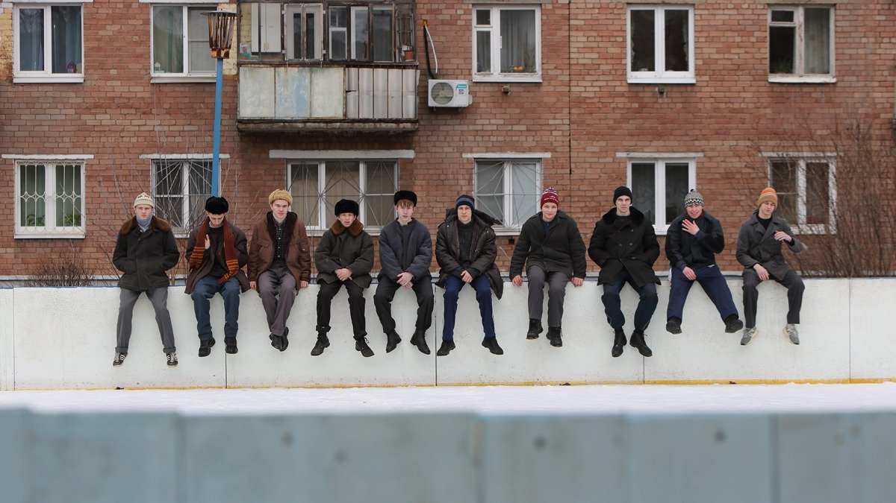

# Гопники. 9 ноября на платформах Wink и START выходит сериал «Слово пацана. Кровь на асфальте» Жоры Крыжовникова, который вызвал бурю возмущения еще до того, как его посмотрели

- **URL:** https://novayagazeta.ru/articles/2023/11/08/gopniki-nashego-vremeni
- **Дата:** 2023-11-08
- **Автор:** Лариса Малюкова

## Гопники

## 9 ноября на платформах Wink и START выходит сериал «Слово пацана. Кровь на асфальте» Жоры Крыжовникова, который вызвал бурю возмущения еще до того, как его посмотрели

Кадр из сериала «Слово пацана. Кровь на асфальте»

Он старательно выстукивает на нарисованной клавиатуре (на пианино денег не раздобыть) «Лунную сонату», на нем пионерский галстук и школьная форма. С кухни летит мамино «Андрюша, иди есть». Кажется, что пахнет котлетами с пюре.

Это Андрюша (Леон Кемстач). Живет с заботливой мамой (Юля Александрова) и младшей сестренкой. Перед ним ноты, книжка на подставке, на стенах — картинки машин и битлов, разумеется. В школу идет, размахивая портфелем и мешком со сменкой, обходя «нехороших» дерущихся мальчишек. А в портфеле — подготовленный к уроку доклад.

Вот такой и правда показательно хороший мальчик, словно из киножурнала «Пионерия». Всем ребятам пример. И когда шальной подросток, гопник Марат (Рузиль Минекаев) влетает в троллейбус и приказывает пробить «фанеру» его другу, Андрей отказывается.

Потому что он человек, а не чушпан.

«Слово пацана» — о ребятах из молодежных казанских группировок конца 1980-х. О так называемом казанском феномене. Когда подростки массово объединялись в банды, соперничающие за территории в городе, устраивая массовые побоища «стенка на стенку», вооруженные арматурой, монтажками, кастетами, металлическими шарами. Случалось, битвы заканчивались смертельным исходом.

В перестроечные времена у совсем юных, особенно из неблагополучных семей, выброшенных на улицу, словно резьбу сорвало. Города делили на районы, строго контролируемые теми или иными группировками. В Казани было около 100 группировок.

Кадр из сериала «Слово пацана. Кровь на асфальте»

Так вот, тот самый беспредельщик Марат из троллейбуса оказался отстающим учеником, которого Андрею велят подтянуть по английскому. Кто кого подтягивает, становится понятно, когда Андрей, не умеющий в одиночку противостоять наглой силе, спустя короткое время вступает в молодежную преступную группировку.

Жора Крыжовников снял многофигурный, многонаселенный, многосерийный кинороман, в котором сразу несколько главных героев. Рядом с белоголовым Андрюшей без отца — тот самый Маратик, как ласково зовут его мама и папа, из обеспеченной семьи. С дедушкиным пианино в квартире, на котором, впрочем, никто не играет. Ну разве что Андрюша. После службы в Афгане возвращается старший брат Маратика по кличке Адидас (Иван Янковский) — ксенофоб, ненавидящий «пиндосов», — и тут же вливается в группировку, конкурируя с ее вожаком.

Есть и самый маленький, хотя и задиристый Ералаш. Тот, кто осуществил мечту — купить бабушке, с которой живет, настоящий электрический утюг. С переключением. С паром. Дожила бабушка до счастливого момента.

Здесь нет злодеев или просветленных. Взрослые и дети — обычные люди. Просто время им досталось злое, лживое. И у пацанов из банд (за исключением некоторых отпетых или схематичных) свои разноцветные характеры. Темные и светлые стороны. Даже беспутный оторва Маратик на улице не пройдет мимо замерзающего пьяного. Дотащит до теплого подъезда. Да и к ксенофобу Адидасу авторы, судя по первым сериям, явно испытывают симпатию.

Сама улица и внутренние уставы группировки диктуют свои жесткие правила. Не подчиняешься — жестоко поплатишься.

Но сквозная линия, сшивающая роман, — история подростка, поначалу опьяневшего. От новой взрослой свободы, за которую он принимает вседозволенность. От права сильного. От ощущения авантюры.

Стырить в комиссионке дефицитные бейсболки «Калифорния», отобрать у младшеклассников клюшки и гонять в ледяной «коробке». Курить запрещенку. Дорваться до компьютерной игры. Стрелять мелочь. Сидеть на трубах. Крышевать дороги. Биться насмерть с себе подобными. Гонять по «своим улицам» под рыдающее шатуновское «И снова седая ночь, и только ей доверяю я» и защищать их от «чужих». Видеть кругом исключительно врагов. И да, доверять только ночи.

## Лишь бы не быть чушпаном

Кадр из сериала «Слово пацана. Кровь на асфальте»

О чем это кино? О пробуждении темной древней энергии, дремлющей в человеке на фоне умирающей страны.

Трудно не вспомнить мощные абрашитовские «Магнитные бури» про то, как легко это эти первобытные энергии завоевывают человеческое пространство, превращая отдельного человека в частичку озверевшей толпы, пропитанной ненавистью и кровью. Ощущением, что враги кругом. Только внутри группировки чувствуешь себя среди своих, в безопасности. Обманчивое ощущение, что здесь-то не царят хаос и непредсказуемость, обрушенные на головы родителей. Здесь «порядок», иерархия, даже свой кодекс чести. Или то, что они именуют честью.

Взрослые в фильме инфантильные, растерянные. Как мама Андрея, не понимающая, что происходит с сыном, или советский человек, отец Марата (Сергей Бурунов). Странная, немного литературная сотрудница полиции (Анастасия Красовская), которая проводит с ребятами воспитательные беседы, пытается вытащить Андрея из беды. Показывает им фильм Марины Разбежкиной «А у вас во дворе?». Но ребятам с нашего двора и кино до лампочки, и нравоучения полицейских.

Поддержите нашу работу!

1000 500 300 Нажимая кнопку «Стать соучастником», я принимаю условия и подтверждаю свое гражданство РФ

Если у вас есть вопросы, пишите [email protected] или звоните:+7 (929) 612-03-68

Кадр из сериала «Слово пацана. Кровь на асфальте»

Снят сериал по оригинальному сценарию Андрея Золотарева и Жоры Крыжовникова. Но опора фильма — книга-исследование «Слово пацана. Криминальный Татарстан 1970−2010-х» Роберта Гараева. Используя многочисленные интервью непосредственных участников событий, автор рассказал об истории казанских группировок. Книгу в Казани приняли в штыки, тема «казанского феномена» как была, так и остается запретной. Сразу возбудились начальники и краеведы, называющие «казанский феномен» позорным пятном на теле города, которое надо забыть.

Вообще правило избирательной «забывчивости» сегодня как никогда востребовано. Вспомним крики, обвинения в русофобстве и антисоветизме авторов сериала «Зулейха открывает глаза» по роману Гузель Яхиной. Рассказавший о репрессиях и раскулачиваниях сериал назвали вредительским, искажающим историю. Чулпан Хаматову, сыгравшую главную роль, проклинали в республике.

К слову, и новый сериал в Татарстане местные власти снимать запретили. Да и к самой идее фильма здесь отнеслись скептически.

Кадр из сериала «Слово пацана. Кровь на асфальте»

Детский омбудсмен республики Ирина Волынец просила прокуратуру проверить ООО «Тумач Продакш» на законность вовлечения несовершеннолетних в контент, «наносящий вред их психическому и нравственному здоровью». Может быть, Ирина Волынец не в курсе, что ложь, умолчания, лакировка собственной истории наносят подростку гораздо больший вред, чем возможность честно обсудить реальные факты.

Мнение «казанского Кремля» сформулировала глава пресс-службы президента РТ Лилия Галимова. На предусмотрительный вопрос, нужно ли поднимать в культуре тему казанского бандитизма, она ответила: «Я думаю, в Республике Татарстан и в столице с тысячелетней историей есть гораздо более интересные и поучительные истории, которые бы заслуживали экранизации. Культура у нас богатая, интересная, и нам есть что показать — гораздо более интересное, глубокое и достойное нашего молодого поколения, нежели чем вот это».

Вокруг невышедшего фильма разгорелись споры и баталии. Депутат Госдумы Яна Лантратова из «Справедливой России» направила запрос главе Роспотребнадзора Анне Поповой с просьбой проанализировать тизеры фильма, находящиеся в открытом доступе, на предмет «романтизации бандитизма и героизации образа преступника».

Тизеры! Яна Валерьевна Лантратова — первый заместитель председателя комитета Государственной думы по просвещению, это она недавно убеждала министра культуры ввести институт художественных советов, а теперь озаботилась запретом еще не виденной ею картины. По ее мнению,

«драма содержит элементы романтизации бандитизма и героизации образа преступника, что при активной рекламе и пиар-кампании может негативно сказаться на неокрепшей психике подрастающего поколения».

Пришлось в Казань на встречу с главой Республики Татарстан Миннихановым мчаться культурному десанту: продюсеру Федору Бондарчуку, режиссеру Жоре Крыжовникову, Алексею Гореславскому, гендиректору ИРИ («Институт развития интернета»). А после встречи срочно менять название.

Но дело не в названии. В тех сериях, которые я видела, нет романтизации юных банд. Есть попытка понять: зачем? почему? Эта беспощадность. Беспричинная ненависть. Рев толпы с арматурой. Бессмысленные жертвы. А флер романтики, который окутывает новобранцев поначалу, мгновенно тает поздним вечером у двери морга с истошным криком бабушки, потерявшей единственного, такого заботливого внука.

Читайте также

Ну ладно, смотри, какая я на самом деле

Док «Предлагаемые обстоятельства» о легендарном театре «Современник» не понравится его героям — звездам российской сцены, — зато точно портретирует реальность

Лариса Малюкова ведет телеграм-канал о кино и не только. Подписывайтесь тут.

### Этот материал входит в подписки

Смотровая площадкаКино с Ларисой Малюковой

Культурные гидыЧто читать, что смотреть в кино и на сцене, что слушать

### Добавляйте в Конструктор свои источники: сайты, телеграм- и youtube-каналы

Войдите в профиль, чтобы не терять свои подписки на разных устройствах

Поддержите нашу работу!

1000 500 300 Нажимая кнопку «Стать соучастником», я принимаю условия и подтверждаю свое гражданство РФ

Если у вас есть вопросы, пишите [email protected] или звоните:+7 (929) 612-03-68
