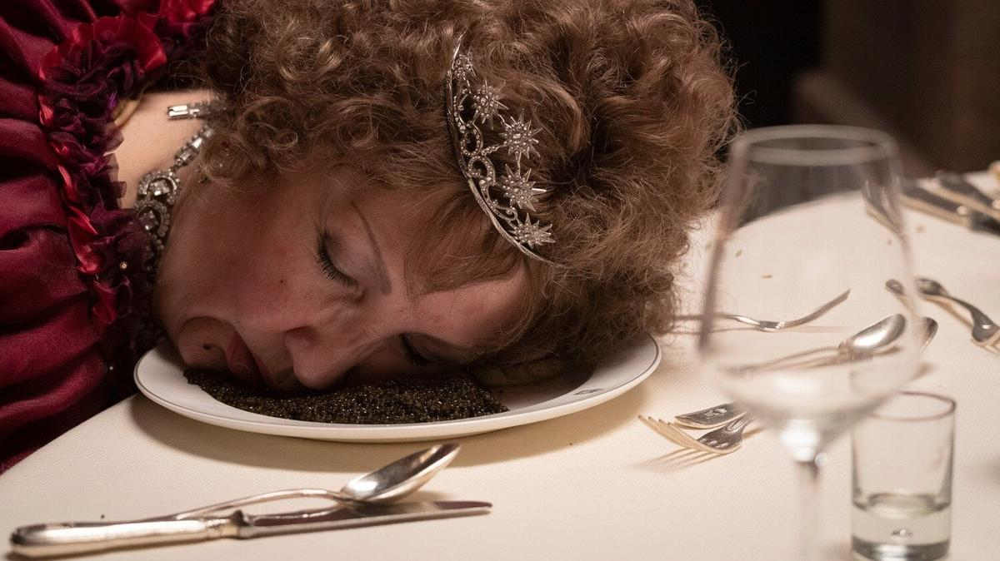

# «Все обнулится, и никто ничего не поймет». В российский прокат выходит трэш-комедия «Дворец» Романа Полански, фильм-издевательство

- **URL:** https://novayagazeta.ru/articles/2023/11/23/vse-obnulitsia-i-nikto-nichego-ne-poimet
- **Дата:** 2023-11-23
- **Автор:** Лариса Малюкова

## «Все обнулится, и никто ничего не поймет»

## В российский прокат выходит трэш-комедия «Дворец» Романа Полански, фильм-издевательство

Кадр из фильма «Дворец»

«Дворец» Романа Полански на российской афише манит эмблематичными звездами разнообразных достоинств: Микки Рурк и Александр Петров.

Большой режиссер, создатель «Отвращения», «Ребенка Розмари», «Ножа в воде», «Китайского квартала» и «Пианиста», решил громко хлопнуть дверью. «По самым разным причинам я долгие годы откладывал съемки «Дворца». И вот теперь, отпраздновав 90-летие, я сказал себе, что наконец-то могу позволить себе снять такой фильм. Лучшей возможности может уже и не представится», — признается режиссер. Это точно. Не случайно Венецианская премьера «такого фильма» вызвала громкий скандал.

Черная новогодняя комедия с бродячим нафталиновым призраком апокалипсиса 2000-го. Миллионеры в ожидании праздничного конца света с фейерверком беснуются в роскошном альпийском отеле, утопающем в снежных открыточных видах. Это и есть Gstaad Palace, примеченный нами и в «Возвращении Розовой Пантеры», и в «Рождестве в любви».

У каждого из постоянных вип-гостей свои заботы. Любимая чихуахуа рыжей Маркизы Фанни Ардан только что нагадила на ее простыни. То ли из-за отсутствия зеленого газона, то ли обожравшись черной икрой. Джон Клиз (звезда «Монти Пайтона») в образе Артура Дункана Далласа III, плотоядного 97-летнего техасского плутократа, отмечает годовщину свадьбы с 22-летней пампушкой, жизнерадостно вываливающейся из пеньюаров.

Микки Рурк в фильме «Дворец» Романа Полански. Кадр из фильма

Все труднее опознаваемый Микки Рурк в соломенном парике и с трамповским загаром — жуликоватый богач Краш, закрутивший очередную банковскую махинацию, которую покроет полное обнуление в ночь с 1999 года на 2000-й. Пожившая уже порнозвезда по имени Бонго ломает нос. Пластический хирург — доктор Лима — в окружении изрезанных им и перебравших ботокса пожилых дам с лицами-масками ставит нос порнозвезде на место и изучает экскременты чихуахуа.

Читайте также

Вверх по лестнице, ведущей вверх

В «Электротеатре» прошел показ авангардного экспериментального фильма режиссера и медиахудожника Андрея Сильвестрова «Вверх, вниз»

И в центре этого громкого безумного гериатрического круговорота — очаровательный и находчивый регулировщик Хансуэли (Оливер Масуччи), управляющий. В начале фильма он дает инструкции персоналу, зачем необходимо «нафаршировать икрой до самого сердца» съезжающихся на Новый год «дорогих гостей». Они должны остаться всем довольны, потому что «от них зависит жизнь миллионов». Управляющий — из тех, кто «решает проблемы». Любые. Платили бы.

Наш Петров с привычно шальным взглядом — главарь банды русских, сопровождаемых тертыми моделями (Наташа–Зойка), неумеренно пьющих водку под икру и прячущих в бункер времен Второй мировой чемоданы с валютой. А потом… не только чемоданы.

Александр Петров в фильме «Дворец»

В этом евротрэше нетрезвые миллионеры падают лицом вниз в икру, пингвин трахается с чихуахуа, маркиза — с сантехником-эмигрантом, техасский нефтяник и экс-порнозвезда мучаются проблемами эрекции.

И все, живые и мертвые, спешат смотреть новогодний фейерверк — символ того, что и после Миллениума их жизнь не изменится.

Отдельно от богачей гуляет и поет Марсельезу пролетариат: горничные, повара и охранники русских бандитов, которым достались лишь раскладушки. Но социальная критика фильму чужда. Хотя политика просочилась и в это кино… через телевизор.

Перед тем как перешагнуть в новый век, человечество прослушает прощальную речь Бориса Ельцина, передающего эстафету своему молодому преемнику, застенчивому Владимиру Путину, занимавшему пост премьер-министра. Впрочем, из соображений безопасности в российском прокате кадры с Путиным исчезли, в том числе из русского трейлера и рекламных материалов.

Кадр из фильма «Дворец»

Можно, конечно, в качестве предположения развить замысел режиссера, приоткрывшего завесу над новым веком и его угрозами светопреставления в момент разлома, когда старая, точнее — престарелая и бессильная Европа давится деликатесами, финансирует зло, использует труд и здоровье приезжих, бесчинствует и блюет на дорогие лимузины. А их обслуживают эмигранты…

Но это натяжка. Проще довольствоваться туманной репликой Рурка:

«Все обнулится, и никто ничего не поймет, а если поймет, то очень нескоро».

Поддержите нашу работу!

1000 500 300 Нажимая кнопку «Стать соучастником», я принимаю условия и подтверждаю свое гражданство РФ

Если у вас есть вопросы, пишите [email protected] или звоните:+7 (929) 612-03-68

Мир действительно растает и превратится в нули. Для этого в фильме есть выразительная метафора. Гигантские ледяные цифры «2000» на утро после праздника превращаются в обглоданные теплом остовы.

В анамнезе картины целый ворох памятных и разнообразных черных комедий: «Уикенд у Берни» Теда Котчеффа и «Большая жратва» Марко Феррерри, «Треугольник печали» Остлунда и «Отель «Гранд Будапешт» Уэса Андерсона, ну и отчасти «Белый лотос», разумеется.

На псевдовавилонской башне, построенной вечным эмигрантом Полански, говорят на разных языках (фильм продан на большинстве крупных территорий Европы). Прокатчики объясняют нам, что жанр фильма — «незаслуженно забытый guilty pleasure, которое смотреть и стыдно, и смешно, и хочется повторить».

Ну, это на любителя. Повторить, конечно, можем, но не хочется.

Фанни Ардан в фильме «Дворец»

Бюджет «Дворца» составил 17 миллионов евро, музыку сочинил Александр Депла, звезды слетелись в Gstaad Palace и, видимо, недурно провели там время.

Но во время показа думаешь: «Они издеваются? Или сошли с ума?» Ведь помимо самого Полански в создании сценария этого новогоднего вертепа принимали участие Ежи Сколимовский и Ева Пясковска, создавшие только чудный меланхолический фильм об ослике «Иа».

Понятно, что

хотелось провокации в духе Эстлунда. Но не получилось даже отвязного трэша. Потому что скучно. Вместо гротеска — анекдоты с бородой, вместо иронии — неловкость. Впрочем, на любой уровень «юмора» найдутся охотники.

Вывод можно сделать один: это он специально. Десятилетиями отбиваясь от общественного порицания и уголовных преследований по делу о совращении 13-летней модели, режиссер показывает порицателям и гонителям, погрязшим во лжи, лицемерии, «неофеминистском маккартизме» и тысяче грехах большой фак. Этот вполне конкретный знак мы увидим не раз на протяжении фильма. И финал картины — можно счесть символическим ответом Романа Полански своим критикам, которых он попытался обнулить в своем кэмпе «Дворец».

Кадр из фильма «Дворец»

Любопытно, что всего несколько лет назад там же состоялась мировая премьера фильма «Офицер и шпион» Полански о деле Дрейфуса. И Альберто Барбере — главе Венецианского фестиваля — пришлось защищать режиссера от многочисленных нападок: «История искусств знает много художников, совершивших то или иное преступление, но мы продолжаем восхищаться их работами». Тогда Полански, несмотря на скандал, получил приз за режиссуру. Но это было состоявшееся авторское высказывание, и второе название фильма «Я обвиняю» — говорило само за себя.

В каком-то смысле «Дворец» продолжает линию защиты «несправедливо обвиненного» как «линию нападения». Полански говорит и снимает кино о том, как массовая истерия охватывает общество. В случае с фильмом о Дрейфусе жюри Международного кинофестиваля между общественным порицанием и профессией выбрало профессию.

В случае с «Дворцом» — выбора не было.

Лариса Малюкова ведет телеграм-канал о кино и не только. Подписывайтесь тут.

### Этот материал входит в подписки

Смотровая площадкаКино с Ларисой Малюковой

Культурные гидыЧто читать, что смотреть в кино и на сцене, что слушать

### Добавляйте в Конструктор свои источники: сайты, телеграм- и youtube-каналы

Войдите в профиль, чтобы не терять свои подписки на разных устройствах

Поддержите нашу работу!

1000 500 300 Нажимая кнопку «Стать соучастником», я принимаю условия и подтверждаю свое гражданство РФ

Если у вас есть вопросы, пишите [email protected] или звоните:+7 (929) 612-03-68
