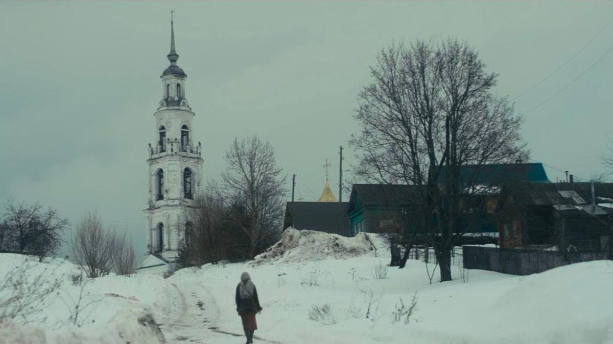

# Angelus Domini. Среди лучших фильмов V Международногоо фестиваля кино стран Содружества «Московская премьера» — «Анжелюс» Эдуарда Жолнина

- **URL:** https://novayagazeta.ru/articles/2023/11/27/angelus-domini
- **Дата:** 2023-11-27
- **Автор:** Лариса Малюкова

## Angelus Domini

## Среди лучших фильмов V Международногоо фестиваля кино стран Содружества «Московская премьера» — «Анжелюс» Эдуарда Жолнина

Кадр из фильма «Анжелюс»

Необычное в наших пенатах тихое авторское кино, которое пытается почувствовать-запечатлеть выцветшую красоту провинции. Не набившая оскомину оппозиция «столица — провинция» интересует автора, а скорее редко исследованная: «духовность — культура». «Подлинное — наносное». Причем все это не в лоб, без надрыва, припорошено снегом, расцвечено погасшими красками фресок полуразрушенных храмов, которых у нас и сегодня не сосчитать.

Таня (Милена Нестерова) живет в маленьком старинном провинциальном городке с отцом — путевым обходчиком (Вячеслав Гардер). Помогает за небольшую плату капризной лежачей соседке Нине Алексеевне. С ней же Новый год встречает. Поет в церковном хоре. Ходит на службу, как на работу. Нигде никогда не была: ни в Москве, ни за границей, ни на море.

Кадр из фильма «Анжелюс»

Однажды знакомится с интеллигентным столичным юношей Сергеем (Алексей Кокорин), опоздавшим на поезд. Так начинаются их редкие прогулки-путешествия по Таниной родине: поля, храмы, местное кладбище. Сергею здесь, конечно, скучновато. И тихо так, словно комендантский час. Только звон колоколов рвет тишину. А на Таню повеяло другой жизнью и манким, соблазнительным желанием поменять свою тихую обитель на дальний большой город.

И ждет она его приезда, особенно на Новый год, всматриваясь в проносящиеся поезда. И снова встречает Новый год с Ниной Алексеевной. А на службе она поет ангельским голосом молитву: «От юности моея мнози борют мя страсти, но Сам мя заступи, и спаси Спасе мой». В общем, «девушка пела в церковном хоре». В этом стихотворении Блока трагичный безнадежный финал: «И голос был сладок, и луч был тонок, / И только высоко, у царских врат, / Причастный тайнам, плакал ребенок / О том, что никто не придет назад».

Кадр из фильма «Анжелюс»

И в жизни Татьяны, русской душою, и ее отца — своя трагедия. Танин брат, двадцатиоднолетний Максим, десантник, погиб тоже в Новый год в Чечне. Тогда мама с папой все телевизор смотрели, надеясь, что его в новостях покажут. Мать после гибели сына ушла в Дивеевский монастырь. А папа теперь, когда Максима поминает, всегда повторяет ту самую формулировку «Участвовал в мероприятиях по восстановлению конституционной законности и правопорядка на территории Чеченской Республики». Он эту «формулировочку», как он говорит, до последнего часа не забудет. Она — все, что осталось от живого сына. И еще письма. В этих письмах он рассказывает, как ему тяжко. Как ходят они грязные, оборванные, портянки не меняют. И подробно про сон рассказывает, как его в отпуск отпустили. И как он во сне плакал. И поздравляет своих самых-самых близких с Новым годом, и с Новым веком.

А еще Максим к Тане приходит. Утешает ее. Должен же ее кто-то утешить.

В этом скромном, не без вкусовых погрешностей фильме есть своя чистая, почти утерянная в нашем кино интонация, ощущение всеобщей связанности: и этого серого неба, и гудка проносящегося поезда, и темного божьего лика в церкви, и Таниной тоски по недостижимому.

Поддержите нашу работу!

1000 500 300 Нажимая кнопку «Стать соучастником», я принимаю условия и подтверждаю свое гражданство РФ

Если у вас есть вопросы, пишите [email protected] или звоните:+7 (929) 612-03-68

Кадр из фильма «Анжелюс»

Кстати, надо заметить, что режиссеру удается не скатиться в декоративное патриотическое благолепие, снимать храмы без китчевого любования. При этом внимательная камера Сергея Циписа словно «видит» воздух, который косыми световыми полосками стелется из высоких церковных окон. И нет в этой картине при всем поэтичном любовании родными осинами елейности. Мертвый брат спросит Таню: «А нас-то помнят?» Близкие будут помнить. Только самые-самые близкие.

Так же как в своей дебютной картине «Земун», молодой автор Эдуард Жолнин идет по краю между реальностью и мифом, метафизикой.

Название фильма дала картина Жана-Франсуа Миле «Анжелюс». О ней рассказывает скромной провинциалке Тане столичный киношник Сергей. На картине мужчина и женщина на закате замерли на краю поля, слушают церковный колокол.

«Анжелюс». Картина французского художника Жана-Франсуа Миле

Но именно Таня, не Сергей понимает, что мужчина и женщина на картине не за урожай картофеля молятся, а оплакивают молитвой своего умершего ребенка. И молитва эта — «Angelus Domini» — связана с «Благой вестью», когда Ангел Господень возвестил Марии, и она зачала от Духа Святого.

Снимали эту тихую, как мольба, картину в старинном городке Нерехте и селах в округе. Сейчас она вышла в ограниченный прокат. Фестиваль Московская премьера продлится до 29 ноября.

Лариса Малюкова ведет телеграм-канал о кино и не только. Подписывайтесь тут.

Читайте также

Вверх по лестнице, ведущей вверх

В «Электротеатре» прошел показ авангардного экспериментального фильма режиссера и медиахудожника Андрея Сильвестрова «Вверх, вниз»

### Этот материал входит в подписки

Смотровая площадкаКино с Ларисой Малюковой

Культурные гидыЧто читать, что смотреть в кино и на сцене, что слушать

### Добавляйте в Конструктор свои источники: сайты, телеграм- и youtube-каналы

Войдите в профиль, чтобы не терять свои подписки на разных устройствах

Поддержите нашу работу!

1000 500 300 Нажимая кнопку «Стать соучастником», я принимаю условия и подтверждаю свое гражданство РФ

Если у вас есть вопросы, пишите [email protected] или звоните:+7 (929) 612-03-68
