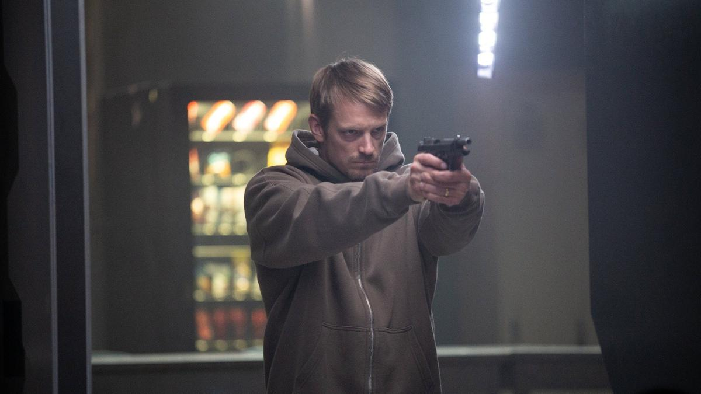

# Джон Ву и его безмолвный гнев. На экраны выходит «Немая ярость» — новый триллер голливудского режиссера и супербренда

- **URL:** https://novayagazeta.ru/articles/2023/11/28/dzhon-vu-i-ego-bezmolvnyi-gnev
- **Дата:** 2023-11-28
- **Автор:** Лариса Малюкова

## Джон Ву и его безмолвный гнев

## На экраны выходит «Немая ярость» — новый триллер голливудского режиссера и супербренда

Кадр из фильма «Немая ярость»

Джон Ву — режиссер фильмов «Без лица», «Наемный убийца», «Пуля в голове» «Час расплаты», «Миссия невыполнима 2». Легендарный автор со своим стилем, которому поклоняются Тарантино, Вачовски. Чьи фильмы изучают в киношколах и растаскивают на цитаты. При этом он снимает и разнообразное, разного достоинства коммерческое кино и в Гонконге, и в Голливуде.

Его новый экшен-триллер по сценарию Роберта Арчера Линна — традиционная, крепко сбитая, взрывоопасная история мести с неожиданным запалом.

Канун Рождества. Нарядные коробки с лентами у елки, надувной Санта-Клаус на зеленой лужайке перед домом и новенький велосипед сыну-малышу в подарок с воздушным красным шариком на руле. Идиллия… будет расстреляна в упор. Семья окажется под перекрестным огнем двух банд, жертвой этой высокоскоростной разборки окажется маленький сын Брайана Годлака (Юэль Киннаман). Самому ему, попытавшемуся догнать бандитов, прострелят горло. И вот уже — едва ли не первых эпизодах — главный герой фильма на наших глазах истекает кровью, льющейся вместе с замедляющимся дыханием, волнами…

Врачи его спасут. Там, правда, что-то со связками. Голос. Теперь его нет. Это ключевая символическая сцена фильма — безмолвный крик растерзанного гневом и болью, как шипение пойманной в клетку змеи.

Дома Брайана после больницы по-прежнему ждет уже запылившаяся елка с шарами и подарками. И детская комната. Игрушки, пижама с динозавриками на кровати, подушка с лисичками. И жена, безуспешно пытающаяся вытащить мужа из алкогольной депрессии.

«Немая ярость» — история мести как способ справиться с травмой, вытащить себя за волосы из черной ямы. У Брайна меньше года на подготовку. До следующего Рождества.

Ву, несмотря на солидный возраст (ему 77), демонстрирует фирменный стиль: головокружительные гонки по битому стеклу, прыжки и полеты бойцов, битвы машин, фейерверки перестрелок и капельные фонтаны крови.

А еще фирменная, временами чрезмерная сентиментальность, которой он никогда не боялся: страдающая супружеская пара, флешбэки райских минут счастливой жизни, бесхозный красный шарик в небе, как душа погибшего ребенка.

Но есть в фильме и черная ирония. Как бравурный хор из финала бетховенской Девятой симфонии. Тот самый бравурный хор «Ода к радости»: «Люди — братья меж собой. Обнимитесь, миллионы! Слейтесь в радости одной!»

И вся эта красота — на тотальной шквальной перестрелке с диким количеством трупов и брызгами крови.

Кадр из фильма «Немая ярость»

Поддержите нашу работу!

1000 500 300 Нажимая кнопку «Стать соучастником», я принимаю условия и подтверждаю свое гражданство РФ

Если у вас есть вопросы, пишите [email protected] или звоните:+7 (929) 612-03-68

Но все же самое неожиданное и притягательное в фильме — отсутствие диалогов. Это самый молчаливый фильм Ву, да и, скорее всего, самый молчаливый экшен.

Получился такой триллер-балет с продуманной хореографией боев. В котором вместо па и фуэте — подготовка к битве, гонки и перестрелки. Отсутствие диалогов, по мнению режиссера, позволило использовать визуальные эффекты, чтобы рассказать историю, передать, что чувствует персонаж: «Мы используем музыку вместо языка. И весь фильм посвящен изображению и звуку». Относительно скромный бюджет вынудил режиссера изменить стиль работы: «Обычно для большого студийного фильма мы снимаем много дублей, а затем оставляем это на монтаж. Но в этой картине я пытался мысленно соединять историю прямо на съемочной площадке, не делая дополнительных дублей. Некоторые сложнопостановочные сцены занимали две или три страницы, но мы в се это снимали за один долгий дубль».

Киннаман в главной беззвучной роли («Отряд самоубийц», «Секреты, которые мы храним» и «Братья по крови») более чем выразителен и продолжает традицию великолепных молчунов в мировой киноистории. Вспомним хотя бы таинственного Арендатора Макса фон Сюдова из драмы «Жутко громко и запредельно близко» или немую героиню Холли Хантер из «Пианино» Джейн Кэмпион.

Юэль Киннаман в фильме «Немая ярость»

Это первый американский игровой фильм Ву после вышедшего 10 лет назад «Часа расплаты». Снимали в Мексике. Причем сами съемки походили на экшен. В марте 2022-го ассистент по спецэффектам был ранен во время репетиции трюков в Мехико. Другого члена группы сбила машина, и он со сломанным бедром попал в госпиталь.

Выход новой картины Джона Ву — отличный повод пересмотреть работы классика жанра экшена и боевика, который умеет соединять умопомрачительные битвы с душераздирающей мелодраматичностью и романтикой. Самые известные его гонконгские фильмы о «героическом кровопролитии» — «Лучшее завтра» (1986), «Убийца» (1989) и «Крутые» (1992) — прорвались на Запад в начале 1990-х годов, оказав влияние на многих мастеров, включая Джеймса Кэмерона и Тарантино.

Примерно тогда же Ву сам приехал в США, дебютировав в Голливуде с фильмом «Трудная мишень», ставшем классикой, с Жан-Клодом Ван Даммом в главной роли (1993).

«Немая ярость» — крепкий боевик и что-то еще… Ностальгия по классическому стилю. Без дрожащей камеры. С долгими крупными планами актеров. Мы наблюдаем, как день гнева для Брайана превращается в целый год. Как замершая вместе с кровью в горле ярость постепенно превращается в упоение в бою. Потому что для Ву месть — блюдо, которое, в отличие от Тарантино, он любит подавать горячим.

Лариса Малюкова ведет телеграм-канал о кино и не только. Подписывайтесь тут.

Читайте также

Angelus Domini

Среди лучших фильмов V Международногоо фестиваля кино стран Содружества «Московская премьера» — «Анжелюс» Эдуарда Жолнина

### Этот материал входит в подписки

Смотровая площадкаКино с Ларисой Малюковой

Культурные гидыЧто читать, что смотреть в кино и на сцене, что слушать

### Добавляйте в Конструктор свои источники: сайты, телеграм- и youtube-каналы

Войдите в профиль, чтобы не терять свои подписки на разных устройствах

Поддержите нашу работу!

1000 500 300 Нажимая кнопку «Стать соучастником», я принимаю условия и подтверждаю свое гражданство РФ

Если у вас есть вопросы, пишите [email protected] или звоните:+7 (929) 612-03-68
