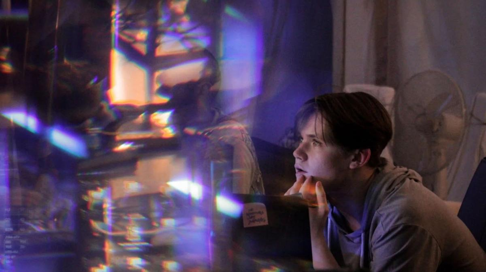

# Разбитое корыто у Жемчужной реки. Что происходит с новой картиной Романа Михайлова

- **URL:** https://novayagazeta.ru/articles/2023/12/04/razbitoe-koryto-u-zhemchuzhnoi-reki
- **Дата:** 2023-12-04
- **Автор:** Лариса Малюкова

## Разбитое корыто у Жемчужной реки

## Что происходит с новой картиной Романа Михайлова

Кадр из фильма «Поедем с тобой в Макао»

Фильм «Поедем с тобой в Макао» еще не вышел в прокат, а над ним уже сгустились тучи. Минкультуры РФ с лупой исследует: нет ли здесь «пропаганды азартных игр»? Прокатное удостоверение сегодня, 4 декабря, все же выдали.

Про что фильм. Это меланхолический психотриллер о лудомане Сергее (сам Роман Михайлов), вышедшем из тюрьмы. Он встречается со своим повзрослевшим сыном Олегом (Олег Чугунов), студентом юрфака, который живет с мамой и отчимом. Мать этой встрече не рада: того и дело и сам пропадет бедолага, и сына в болото затащит.

А Сергей и впрямь не уймется, берет сына с собой в тайный клуб.

Молодой человек погружается в незнакомое пространство большого покера, подпольных казино и исследовательских лабораторий. Гигантский параллельный мир со своими законами, взаимоотношениями, выборами и рисками. И людьми, живущими по этим законам.

Кадр из фильма «Поедем с тобой в Макао»

В клубе болтают на разные темы: о чепухе, о философии, о том, как общество подавляет… впрочем, диалоги эти не имеют никакого значения. Главные разговоры — о покере. Причем временами из-за обилия терминов и профессионального сленга, кажется, что говорят здесь на птичьем языке. Какие-то шортдеки, стриты; игра через линзы, в которых метки крапленых карт видны, «жирнющие трибеты».

Когда-то Сергей круто играл, но сейчас, увы, — возраст. А замашки его покерные все устарели. Как и сам он. Сегодня в клубе игроки новой генерации: рубят в софтах, забубенных теориях, математических моделях. Старикам здесь не место, для них остались скорее шулерские темы. Вот и ищут удачу в запрещенных катранах — клубах, с которых менты стригут бабки. Они готовы, как Серега, сесть за стол с последними деньгами, играть в долг с залетными гастролерами. Таков Сергей: спустит последнее, но не остановится.

Молодой успешный игрок Фадей смотрит на него свысока. Он в онлайне бешеные бабки стрижет. Профессионал высшей пробы, умненький Буратино-Фадей понимает, что покер — не денежное дерево, и ставка на везение давно уже отбыла на заслуженный отдых. Сегодня нужно как проклятому учиться, тренироваться, ничем другим, кроме покера, не заниматься. Его брак с покером — исключительно по расчету.

Кадр из фильма «Поедем с тобой в Макао»

То ли дело Серега: ловец удачи, мастер, убежденный, что может «читать соперника». На самом же деле он — зависимый игроман, не в силах отказаться от игры, даже проиграв все, включая квартиру. И когда он узнает о приезде в город известного игрока-гастролера, которому все и проиграл, у него в глазах снова зажигаются огни: удача больше от него не отвернется…

Роман Михайлов перевоплощается в лузера-лудомана на физическом уровне. У него карты прилипают к ладоням. У него сначала тусклые глаза, потом пьяные, потом безумные от выигрыша и больные распахнутые — от проигрыша.

Читайте также

Люди — вы звери!

Ромен Дюрис и Адель Экзаркопулос в поэтичном сай-фай времен повышенной тревожности «Королевство зверей», снятом Томасом Келли

Поддержите нашу работу!

1000 500 300 Нажимая кнопку «Стать соучастником», я принимаю условия и подтверждаю свое гражданство РФ

Если у вас есть вопросы, пишите [email protected] или звоните:+7 (929) 612-03-68

Даже не знаешь, когда его больше жаль, когда ему везет… или когда он проигрывает. Когда падает, падает, падает…

Кино не столько про игру, сколько про гэмблинг-зависимость. Подмену реальности жизни, человеческих отношений. Игрой упоительной, азартной… безнадежной. Это все в фильме есть.

Но не только. Есть Олег, который, встретив отца, открывает для себя новый мир, в котором Сергей сначала для него царь, потом — раб, сначала взрослый, потом — инфантил. Больной ребенок. И в своей привязанности Олег взрослеет. Пытается понять-почувствовать градус этого больного влечения. Но больше всего сын хочет быть рядом. Просто быть рядом. Поэтому самые светлые кадры фильма — их прогулки вдвоем по вечернему, залитому золотым светом городу. Поэтому Олег готов любой, даже самой неслыханной ценой спасти-вытащить. А отец все равно будет мечтать об игре. Хоть в катране, хоть в психушке, хоть в тюрьме… Но лучше в Макао. Азиатский Лас-Вегас на Жемчужной реке. К берегам разбитых надежд.

«Поедем с тобой в Макао» — еще одно иррациональное приключение Романа Михайлова, продолжение его мистических снов о России. Или как он говорит, «эзотерических трактатов».

Кадр из фильма «Поедем с тобой в Макао»

На сей раз путешествие в мир профессионального подпольного покера, мир катал, инфарктов, заезжих гастролеров.

Впрочем, каждый фильм Михайлова — одиссея в поисках неочевидного. Магии сказки и «древнерусской тоски» в криминальной истории про братков. Размышлений о вере и непротивлении злу насилием (в «Наследии» герой Олега Чугунова тоже готов ради другого на беспрецедентный поступок). Исследование тайных примет отечественного кино как кода нашего сознания («Отпуск в октябре»).

Михайлов — сам феномен, персонаж, достойный киноописания, проживающий, как кажется, параллельные жизни. Профессор-математик, успешный писатель (лауреат премии Андрея Белого), а еще — драматург, актер и экс-танцор и даже уличный жонглер. В кино буквально ворвался всего пару лет назад с полусамодеятельными поначалу, но обладающими магией, своим почерком и жанровыми кульбитами картинами.

Избрав фасбиндеровский способ работы — вокруг него сплоченная группа ведущих российских актеров. У него и его оператора Алексея Родионова свой метод съемки. Они любят долгие, нередко однокадровые сцены. Живые, порой спонтанные диалоги, которыми наполняют сценарий. Монтируют кино по ходу съемок.

Стахановские темпы, которыми он выпускает свои малобюджетные фильмы, вызывают зависть и недобрые комментарии коллег. Только в этом году вышли три его картины. Сейчас снимают следующую — с символичным названием «Жар-птица». И фестивали охотно берут их в программы. Возможно, скоро состоится ретроспектива его фильмов.

Из фильма в фильм он исследует матрицу нашей парадоксальной диковинной жизни, каждый раз выхватывая лишь какую-то ее часть, словно и в кино продолжает развивать математическую теорию групповых колец, каждое из которых — свободный модуль, а соединенные вместе — создают некую систему.

Лариса Малюкова ведет телеграм-канал о кино и не только. Подписывайтесь тут.

### Этот материал входит в подписки

Смотровая площадкаКино с Ларисой Малюковой

Культурные гидыЧто читать, что смотреть в кино и на сцене, что слушать

### Добавляйте в Конструктор свои источники: сайты, телеграм- и youtube-каналы

Войдите в профиль, чтобы не терять свои подписки на разных устройствах

Поддержите нашу работу!

1000 500 300 Нажимая кнопку «Стать соучастником», я принимаю условия и подтверждаю свое гражданство РФ

Если у вас есть вопросы, пишите [email protected] или звоните:+7 (929) 612-03-68
