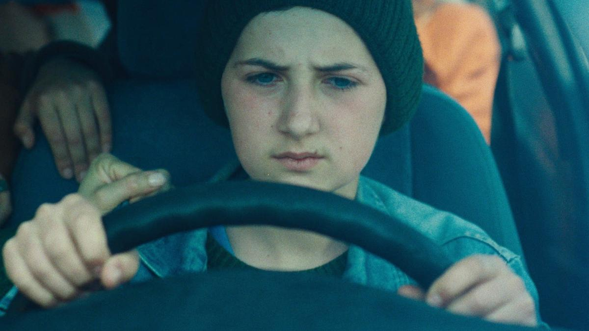

# Без корней не может быть космоса. На Урале завершилась «Кинопроба» — впечатляющий фестиваль молодого кино. Что смотреть?

- **URL:** https://novayagazeta.ru/articles/2023/12/09/bez-kornei-ne-mozhet-byt-kosmosa
- **Дата:** 2023-12-09
- **Автор:** Лариса Малюкова

## Без корней не может быть космоса

## На Урале завершилась «Кинопроба» — впечатляющий фестиваль молодого кино. Что смотреть?

Кадр из фильма «250 км»

Прежде всего, поделюсь изумлением программой игровых картин. В этом году была на нескольких фестивалях, и много писала об эскапизме молодых кинематографистов. Уральская «Кинопроба» продемонстрировала удивившую отвагой степень вовлеченности начинающих профессионалов (наших в том числе) в современную повестку со всем ее трагизмом, тревогой. Хочется поблагодарить отборщиков, директора фестиваля Лилию Немченко и президента режиссера Владимира Макеранца. Кажется, что на уральском морозе, далеко от центра, вольней дышится. Расскажу о впечатливших меня работах, и, думаю, вы со мной согласитесь.

- «250 км» Асмик Мовсисян (главный приз кинофестиваля «Кинопроба»)

О том, как в первый же день внезапно вспыхнувшей войны, семья вынуждена бежать из своего дома, потому что бомбы летят совсем рядом. Но как бежать? Куда? И подросток, которому нет еще и 14, выводит из гаража папин старенький автомобиль. В него загружается семья и соседи, и еще встреченные на дороге люди, в том числе беременная девушка. А еще черепаха, ради которой главный герой рискует жизнью. Он везет их по разбитым дорогам под обстрелами за 250 километров в безопасное место. А сама машина становится хрупким Ноевым Ковчегом, сберегающим людей от смертоносной бойни. Конечно, в каком-то смысле это оммаж «Балладе о солдате» — мире и сострадании в душе во время побеждающей ненависти. Удивительно, что в основе кино реальная история.

- «Дерево без листьев» Романа Белова (приз за лучший дебют)

Сухим пером написанная и снятая история юного мобилизованного, которого призывают. Ему страшно, и он не понимает: зачем? Но отец, не выключающий телевизор ни днем, ни ночью, строг: «Нас защитить от врагов». «От каких?» — «Расскажут». Трагический финал. Скупые метафоры. Тихая трагедия беспомощности.

- «Всегда готов» Рони Вайнера (приз за лучший учебный фильм)

Кадр из фильма «Всегда готов»

Кино, сделанное в израильской киношколе имени Стива Тиша, которая названа лучшей среди всех школ. И действительно: фильмы ее один лучше другого. На полигоне стрельбы. Офицер дает команду. Но один новобранец на огневой линии не может выстрелить в мишени, обряженные в платки. Что с ним ни делают. Ну просто не может, хоть убей. Тогда вызывают самого старшего командира. И начинается сильнейшая психологическая обработка юного солдата. Его практически вводят в состояние аффекта. Он начинает стрелять и уже не может остановиться.

- «МИР» Гурама Нармании (Спецприз) (Московская школа кино)

Идет видеосъемка. В кадре парень, едва не плача, извиняется. Над ним нависли двое грозных джигитов. Парень скорбно просит прощения у всего грузинского народа за то… что назвал хинкали пельменями. Когда джигиты с чемоданчиками и видео приходят к начальнику в Министерство Извинений, начальник возмущен: не достоверно, не душевно! Приходится возвращаться за вторым дублем. Потом еще много покаяний.

Кадр из фильма «МИР»

На титрах режиссер извиняется перед зрителями за то, что снял такое позорное кино. Потом продюсер — за то, что дала деньги на такой ужасный, порочащий всех нас фильм. Нармания — известный блогер, видеорежиссер. Сразу чувствуется опытная рука и отличное чувство юмора с социальной подкладкой. Зал долго аплодировал.

- «Стейк» иранского режиссера Киараша Дадгара (Диплом жюри)

Выразительное микрокино без слов. Мама жарит-парит, готовит стол — день рождения ребенка. Шарик. Тортик. Она начинает готовить мясо. Но на улице стреляют. Мама немедленно прячет ребенка в шкаф. Одна из случайных пуль через открытое окно смертельно ее ранит… Не буду пересказывать дальнейшие события. Все это происходит в считанные минуты.

Кадр из фильма «Стейк»

Знаковый финал. Камера движется снизу вверх по перевернутому изображению — миру верх тормашками. Оказывается, по стеклу духовки. И замирает на том самом стейке, который жарила мама для праздничного ужина.

- «Айыы КУО» выпускника мастерской Александра Сокурова Айаала Адамова

Айаал Адамов уже побывал на фестивалях в Пусане, Торонто, Монреале, Петербурге и прочих. Айаал — не просто думающий режиссер. Он ищет свой киноязык, развивая традиции национальной культуры. Он снял не столько историю, сколько визуальные стихи, основанные на мифологии: о круговороте женской судьбы среди якутских снегов. О неразрывной связи с родным местом. Младшая сестра после смерти старшей приезжает из Петербурга домой в глухую деревню. В тот самый дом, где было тихое насилие, и она была жертвой. Теперь сестры с ее больным сердцем нет, и младшая станет матерью своей племяннице… А потом ее место займет племянница. Замкнутый круг.

Кадр из фильма «Айыы КУО»

Кино проистекающее, как зимний ручей, из оледенелой «вселенной» олонхо, ее среднего мира, в котором среди людей (племени Айыы) живут иччи (духи). Приз за развитие киноязыка в традициях национальной культуры.

- «Че, обнимемся?» Анастасии Кузиной (ВГИК)

О семнадцатилетнем Степе, попавшем в колонию за убийство обидчика мамы. Теперь о мечтает об одном: о встрече с мамой. Но на свидания приезжают другие мамы — с пирожками, соленьями, с прикосновеньями, заботой. Мама Степы на письма не отвечает. А самого Степу нещадно ночью и днем избивают. За то, что деньгами за работу не делится. Все маме отсылает. Бьют так, что мир вокруг кровавой пеленой застилается. Мы увидим эту страшноватую маму, с ее нелюбовью, с колкими режущими словами: чтоб сдох-отвял-не мешал жить.

Поддержите нашу работу!

1000 500 300 Нажимая кнопку «Стать соучастником», я принимаю условия и подтверждаю свое гражданство РФ

Если у вас есть вопросы, пишите [email protected] или звоните:+7 (929) 612-03-68

Кадр из фильма «Че, обнимемся?»

И скрючится подросток на койке карцера эмбрионом, укрытый красным маревом. Закроет голову окровавленными руками. И покажется ему, что голова его — на маминых коленях, она гладит его волосы и поет колыбельную (такой же финал был в «Волчке» Василия Сигарева про беспутную и безжалостную мамашу в исполнении Яны Трояновой). Там тоже был узкий просвет катарсиса в черном коридоре финала — мамина колыбельная.

Читайте также

Чушпаны нашего времени

Кинособытие года — сериал «Слово пацана. Кровь на асфальте». Лариса Малюкова — о феномене проекта, которым восхищаются так же сильно, как хотят запретить

### ***

«Кинопроба» — форум-практикум. С утра до вечера помимо показов: лекции, мастер-классы, питчинги.

На моей лекции в Ельцин-центре «Российское кино. Продолженное настоящее» была особая аудитория. После рассказа об основных тенденциях современного российского авторского кино возникла дискуссия — отчего сегодня в нем отчетливо доминирует женское начало.

Версии такие. В отсутствие возможности говорить о внешнем мире, женщина, которая больше связана с природой, биологией, детьми, а значит, не только с настоящим, но и с будущим, — рассказывает истории чувств с повернутым зрачком внутрь.

Доцент Уральского университета уточнила свою точку зрения. Во времена излома, кризиса постепенно отменяется цивилизационное поступательное развитие, преемственность — во всех областях культуры, кинематографа в том числе. А женщины-режиссеры словно с белого листа снимают кино про себя, из себя.

Одним из самых интересных был мастер-класс Константина Бронзита. Дважды оскаровского номинанта и прочее…

Если исходить из постулата «Кино не может быть лучше, чем сам автор», то в случае Кости это подтверждается. Чаще всего лауреат-прелауреат говорит о том, что не получилось в его картинах. Почему не вышло. Как упустил возможность сделать такую сцену — и описывает ее в красках.

Он делает такое разное кино, будто каждый раз это другой автор с иной стилистикой. Я думала, так — само время просит. Оказывается, совершенно осознанно. Каждая история требует своего дизайна.

Он и придумывает каждый раз — мир с чистого листа: графический, красочный, абсурдный… Но с точными реалистическими деталями и достоверной психологической мотивацией героев.

### Константин Бронзит:

— Из меня режиссера слепил мой учитель, ученый и культуролог Анатолий Прохоров. Чтобы ваше творчество менялось, становилось лучше себя предыдущего, надо двигаться вперед. Ты должен быть озабочен не фильмами, а собой, собственным ростом. Делать сегодня то, что продвигает тебя по отношению к себе вчерашнему. В процессе работы над собой меняется фильтр. Ведь идей всегда много, но большинство из них — мусорные. Вот фильтр и нужен автору и режиссеру, чтобы этот мусор отсеивать. Мы, конечно, все придумываем из головы. Но у всего придуманного есть корни. Без этих корней не может быть и зрительской эмпатии. Соучастия.

Снова смотрела «Мы не можем жить без космоса», небольшой фильм, который он делал четыре с половиной года. Было 24 минуты. Он выбросил девять! В этом фильме о беззаветной, бескорыстной дружбе взахлеб двух космонавтов поражает снайперская точность в деталях. Глухой стук их прощального рукопожатия — потому что они оба в скафандрах. Или на тренировке они парой парят внутри центрифуги, один теряет высоту, и другой незаметно поддерживает его за руку.

Кадр из фильма «Мы не можем жить без космоса»

Когда выберут в полет одного, и ракета взлетает, у другого — по щеке внутри скафандра от напряжения и волнения катится капля пота.

А знак гибели — подаренная другом книжка «Мы не можем жить без космоса», обугленная — она одна летит в звездном небе.

«Представляете, — говорит он, — каким был бы плохим этот фильм… будь он на 9 минут длиннее». Вот такой фирменный бронзитовский фильтр. Настоящий мастер-класс.

### P.S.

Даже наша работа жюри тоже, по сути, оказалась семинаром. Когда обсуждение — продолжение кино. Хочу сказать за это спасибо коллегам: российскому режиссеру Павлу Мирзоеву, известному якутскому режиссеру Эдуарду Новикову, директору казахстанской Turan Film Academy Аяну Найзабекову, актеру Театра на Литейном Сергею Гамову.

Лариса Малюкова ведет телеграм-канал о кино и не только. Подписывайтесь тут.

Читайте также

Разбитое корыто у Жемчужной реки

Что происходит с новой картиной Романа Михайлова

### Этот материал входит в подписку

Смотровая площадкаКино с Ларисой Малюковой

### Добавляйте в Конструктор свои источники: сайты, телеграм- и youtube-каналы

Войдите в профиль, чтобы не терять свои подписки на разных устройствах

Поддержите нашу работу!

1000 500 300 Нажимая кнопку «Стать соучастником», я принимаю условия и подтверждаю свое гражданство РФ

Если у вас есть вопросы, пишите [email protected] или звоните:+7 (929) 612-03-68
