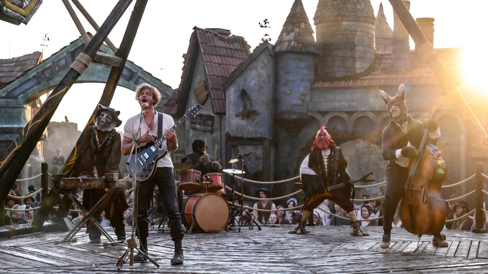

# «Шо?! Опять?!!». «Бременские музыканты» Алексея Нужного — с 1 января обещают «рвать кассу»

- **URL:** https://novayagazeta.ru/articles/2024/01/05/sho-opiat
- **Дата:** 2024-01-05
- **Автор:** Лариса Малюкова

## «Шо?! Опять?!!»

## «Бременские музыканты» Алексея Нужного — с 1 января обещают «рвать кассу»

Кадр из фильма «Бременские музыканты»

Кому не хочется повторить успех народного хита — советского мультфильма (если быть точным, дилогии: «Бременские музыканты» и «По следам бременских музыкантов»), который в свое время был принят в штыки — слишком уж разнузданно, по мнению чиновников, по-западному, в духе модных битлов, вели себя герои фильма. Прежде всего Трубадур и его высокопоставленная подруга Принцесса. Да и одеты были по тем временам разнузданно: у Трубадура был хипповый вид, «клеши» и «патлы», Принцесса носила слишком короткую юбку. Авторов фильма обвиняли в подражании Западу. На каком-то собрании в Союзе композиторов их уличили в том, что пластинок композитора Тихона Хренникова продано всего 3 миллиона штук, а «Бременских музыкантов» — 28 миллионов!

«Бременские» — золотая жила, потому что поются за каждым столом, звездами на корпоративах, народом на кухнях и на улице. Разобраны на цитаты, и «луч солнца золотого» можно отлично монетизировать.

Поэтому новые «Бременские музыканты» — чисто продюсерский проект. На этот раз за дело взялись генералы золотоносных кинокарьеров: ТриТэ + «Централ Партнершип»! + «Союзмультфильм» + поддержка Фонда кино.

Сказку решили несколько модернизировать, но продолжить игру в ретро.

Итак, среди льдов и гор, туманов и тюльпанов поет цветочница (Юлия Пересильд) — мама маленького гитариста Трубадура (Мирон Проворов). Она оставит его дома — надо петь пышно растущим тюльпанам, да и по льду в город идти опасно — пойдет сама и после поэтической баллады «Луч солнца золотого» провалится под лед. Дом с тюльпанами охватит пожар, и талантливый ребенок с гитарой вынужден отправиться в город Бремен, где правит пухлый Король-самодур (Сергей Бурунов).

Талантливого сироту «приголубит» Атаманша с фиксой: чтобы пел, а карманы завороженных его пением горожан будет чистить ее шайка-лейка беспризорников. Но не виновников, а именно сироту после каверз маленьких и больших разбойников — засадят несправедливо в городскую темницу славного города Бремена. И, видимо, приговор, как сегодня принято, недетский. Потому что выйдет он уже пожившим Тихоном Жизневским. Трубадуром в летах.

Дальше состоится знаменательная встреча самих «бременских музыкантов» — животных, которые мечтают о лидере, так сказать, хозяине. И наконец они соединятся с Трубадуром. Принцесса исчезнет из дворца. Потому что все они мечтают о сцене. Все они и отправятся на музыкальный фестиваль…

Месть превратится в музыку. Главный вопрос, который должны решить герои: «Может ли песня изменить мир к лучшему?»

Мы, к сожалению, уже знаем на него ответ. Они, к счастью, еще нет. В финале вся дружная компания устремится в сторону гигантского вулкана, что можно трактовать как «продолжение следует».

Кадр из фильма «Бременские музыканты»

Поддержите нашу работу!

1000 500 300 Нажимая кнопку «Стать соучастником», я принимаю условия и подтверждаю свое гражданство РФ

Если у вас есть вопросы, пишите [email protected] или звоните:+7 (929) 612-03-68

Из плюсов.

- Та самая музыка и стихи Гладкова-Энтина.
- Юная бедовая Принцесса Валентины Ляпиной («Мир! Дружба! Жвачка!»).
- Яркие запоминающиеся образы Короля (Сергей Бурунов), Атаманши (Мария Аронова) и Гениального Сыщика (Константин Хабенский), которым, правда, не хватает сценарного материала.
- Головокружительные, хотя и неожиданные для Западной Европы пейзажи: съемки проходили в Подмосковье, Дагестане, Кабардино-Балкарской Республике, а также в Чечне и Ингушетии.
- Необычный пластический грим Петра Горшенина плюс аниматроника (хотя первые зрители выражали изумление и недовольство антропоморфными образами Осла (Дмитрий Дюжев), Пса (Роман Курцын), Кошки (Ирина Горбачева) и Петуха (Аскар Нигамедзянов). Любопытно, как к ним отнесутся дети.

Из минусов.

- Сырой, не слишком продуманный сценарий, который в основном «музыкально» растягивает короткий метр почти на два часа, искусственные мотивации героев и внезапные решения конфликтов.
- Саундтрек, в котором современные аранжировки старых хитов (музыкальному продюсеру Максиму Фадееву помогал композитор оригинального мультфильма Геннадий Гладков, который, увы, не дожил до премьеры) и новые песни с текстами вроде «Не хватает родного света твоих глаз», «Верю в надежду и любовь / Я знаю, мы точно увидимся вновь».
- Специфический юмор и особенные диалоги «Раз пошла такая валерьянка!».
- На одном из самых первых показов где-то в середине фильма вдруг включили караоке: понятно, чтобы и зритель запел вместе с героями.

В общем, как ни стараются, ни вкладывают большие деньги в проект: все получаются «Старые песни о главном».

Кадр из фильма «Бременские музыканты»

Последние бременские в игровом кино были сняты Александром Абдуловым («Бременские музыканты & Co») с целым созвездием актеров — от двух Янковских (Олега и Филиппа), двух Лазаревых (Александра и Александра) до Анастасии Вертинской, которая в роли Атаманши отплясывала на танке («Не желаем жить по-другому!»), что не помогло успеху фильма.

Сегодня другие времена. Голливуда на Новый год в кинотеатрах нет. А привычка смотреть кино в новогодние каникулы, тем более сказочное — уже сформирована. Поэтому такие баталии за «новогодний пирог» среди продюсеров.

Можно делать ставки: кто же победит в главном бою между «Бременскими» и «Холопом 2» — оба из коллекции «Централ Партнершипа» — лидера киноиндустрии 2023-го? Кинотеатры охотно берут в репертуар знакомые громкие названия — сиквелы и франшизы. Зритель охотно смотрит. Всей семьей. И только назаровский Волк из нетленного «Жил-был Пес» высунется с недоумением из-за снежного куста: «Шо?! Опять?»

Читайте также

«Холоп 2» — хоть поверьте, хоть проверьте

Новогодние премьеры. Второй дубль, зато дорого, богато, нарядно, успешно…

Лариса Малюкова ведет телеграм-канал о кино и не только. Подписывайтесь тут.

Читайте также

«Холоп 2» — хоть поверьте, хоть проверьте

Новогодние премьеры. Второй дубль, зато дорого, богато, нарядно, успешно…

### Этот материал входит в подписки

Смотровая площадкаКино с Ларисой Малюковой

Культурные гидыЧто читать, что смотреть в кино и на сцене, что слушать

### Добавляйте в Конструктор свои источники: сайты, телеграм- и youtube-каналы

Войдите в профиль, чтобы не терять свои подписки на разных устройствах

Поддержите нашу работу!

1000 500 300 Нажимая кнопку «Стать соучастником», я принимаю условия и подтверждаю свое гражданство РФ

Если у вас есть вопросы, пишите [email protected] или звоните:+7 (929) 612-03-68
