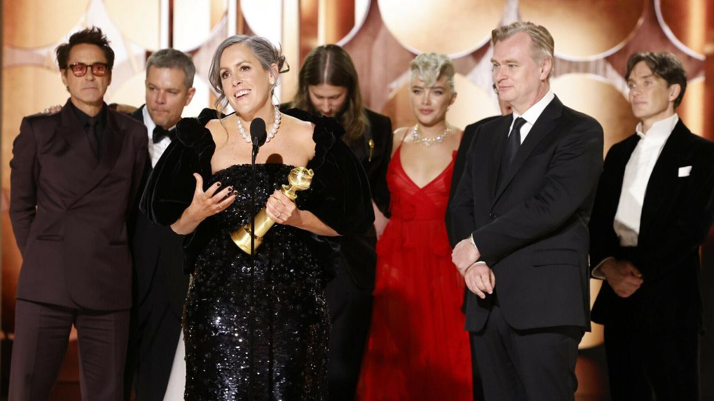

# Последний прогон. «Золотой глобус» — 2024: триумф «Оппенгеймера» и все награды ожидаемы, словно призовой лист сыгран по заранее написанным нотам

- **URL:** https://novayagazeta.ru/articles/2024/01/08/poslednii-progon
- **Дата:** 2024-01-08
- **Автор:** Лариса Малюкова

## Последний прогон

## «Золотой глобус» — 2024: триумф «Оппенгеймера» и все награды ожидаемы, словно призовой лист сыгран по заранее написанным нотам

Продюсер Эмма Томас принимает награду за фильм «Оппенгеймер». На сцене так же Роберт Дауни-младший, Мэтт Дэймон, композитор Людвиг Йоранссон, Флоренс Пью, Кристофер Нолан и Киллиан Мерфи. Фото: Sonja Flemming / Associated Press / East News

В ночь с 7 на 8 января в Беверли-Хиллс прошла 81-я церемония «Золотого глобуса», вторая по престижности после «Оскара».

После череды локальных кризисов и глобальных проблем: только что завершившаяся почти шестимесячная забастовка актеров и сценаристов; а до нее — пандемия с колоссальными убытками кинотеатров; не забудем конкуренцию со стримингами; громкие скандалы внутри самой премии и обвинения в коррупции — Голливуд пытается вернуть все на круги… красной дорожки. Говорят, что ничто так не успокаивает… как свет софитов.

Непререкаемым фаворитом премии стал «Оппенгеймер» Кристофера Нолана, получивший пять статуэток. Антигероический взрывной байопик рассказывает не только о выдающемся ученом, отце атомной бомбы, но и об открытиях, которые нас разрушают, об этическом выборе, заведомо проигрышном.

Помимо статуэтки за «Лучший драматический фильм» награда за режиссуру — Кристоферу Нолану. Актер Киллиан Мерфи справедливо увенчан наградой за лучшее исполнение главной мужской роли в драматическом фильме.

Киллиан Мерфи получает награду за лучшее исполнение главной мужской роли в фильме «Оппенгеймер». Фото: goldenglobes.com

Правда, я болела за Леонардо ди Каприо. Считаю его работу в картине Мартина Скорсезе «Убийцы цветочной луны» — выдающейся, непостижимой. И если Нолан здорово помог Мерфи визуально… Посмотрите только, как он снимает словно смотрящие в разные стороны светлые глаза мучающегося сомнением ученого… Ди Каприо ради роли словно перекраивает всю свою физику, теряет фирменное обаяние, существует на экране сразу в тысячах разнородных оттенков: внутренний конфликт, чувство вины и отрицание, лицемерие и искренность, сочувствие и жестокость, верность и предательство. В его «маленьком человеке» — особая пластичность, готовность быть ведомым, стать частью толпы, банды, «злой улицы», из «твари дрожащей» превратиться в «право имеющего».

Вообще, думаю,

если бы не картина Нолана, заряженная атомным потенциалом, совпавшая с накалом времени, классическому фильму Скорсезе не было бы равных.

Роберт Дауни-младший с золотым глобусом за лучшую мужскую роль второго плана. Фото: EPA

В копилке «Оппенгеймера» — награды актеру Роберту Дауни-младшему, сыгравшему Льюиса Штрауса, тогдашнего соучредителя Комиссии по атомной энергии США, плетущего сеть наветов на ученого, обвиняющего его в связях с коммунистами. Приз получил и шведский композитор Людвиг Йоранссон, создавший эпохальную партитуру, в которой главная партия скрипки, описывает прорывный путь гения сквозь хаос времени.

Лучшей комедией стали «Бедные-несчастные», авангардный стимпанк Йоргоса Лантимоса. Шокирующий карнавал, буйная фантасмагория, в которой режиссер из винтажных платьев Франкенштейна и Пигмалиона шьет собственный футуристический фильм. При этом опирается на неувядающий миф изгнания из рая. Эмма Стоун за умопомрачительную работу в картине удостоена награды за «лучшую женскую роль». Ее Белла — очаровательный монстр, непредсказуемый, притягательный и отталкивающий в каждом движении.

Режиссер Йоргос Лантимос, актриса Эмма Стоун, актер Уиллем Дефо, актеры Марк Руффало, Рами Юссеф. Фото: EPA

Поддержите нашу работу!

1000 500 300 Нажимая кнопку «Стать соучастником», я принимаю условия и подтверждаю свое гражданство РФ

Если у вас есть вопросы, пишите [email protected] или звоните:+7 (929) 612-03-68

Глянцевая и ироничная «Барби», которая стала «светлой тенью» и «двойником» Оппенгеймера, собрала множество номинаций, но получила лишь утешительный приз «за кинематографические и кассовые достижения» и награду за лучшую песню Билли Айлиш. Что не помещало Марго Робби, повторившей образ легендарной куклы, стать главной звездой «Золотого глобуса».

Композитор Финнеас ОКоннелл, певица Билли Айлиш, получившие награды в номинации «Лучшая песня» за песню «What Was I Made For» к фильму «Барби». Фото: AP / TASS

Совершенно очевидно, что «Мальчик и птица» Хаяо Миядзаки — анимация вне всякой конкуренции. С кем соперничать мировому классику, снимающего кино в категориях высокого искусства, без оглядки на «моду», «тенденции»? Его фильм — очаровывающее поэтическое фэнтези о детской боли, потерях в ураганах Второй мировой войны. Как оказывается, тема сколько вечная, столь и актуальная.

Лучшим неанглоязычным фильмом стала французская драма «Анатомия падения» Жюстин Трие. Глубоководное, опасное и отважное погружение в космос сложного устройства одной семьи. Когда у каждого — своя картина происходящего. И в этой «каждой картине» — своя правда. Своя боль. С помощью искусного киноязыка режиссер фиксирует наше внимание на моральных вопросах и конфликтах в противовес судебному разбирательству.

Мэттью Макфэдиен, Сара Снук и Киран Калкин с личными статуэтками за сериал «Наследники». Фото: EPA

Про то, что сериал «Наследники» не сдает из сезона в сезон позиций, свидетельствует его востребованность. И не дрязги и конфликты, борьба за владение вымышленной консервативной медиакорпорацией, списанной с Fox, волнует зрителя. Но история циничных продуманных манипуляций тех, кто «за кадром», кто зарабатывает на fake news и пропаганде. Кто управляет другими за стенами дорогих вилл, за дверями высоких кабинетов, за экранами телевизоров. Плюс выдающаяся работа актеров, справедливо отмеченная большим жюри. Призы получили Сара Снук и Киран Калкин — лучшие актриса и актер в драматическом сериале. Мэттью Макфэдиен назван лучшим актером второго плана в мини-сериале.

«Золотой глобус» называют репетицией «Оскара». И похоже, что главные награды академики уже для себя определили.

Читайте также

Несчастные убийцы, их бедные жертвы и образцовые соседи

10 лучших зарубежных фильмов 2023 года по версии Ларисы Малюковой

Лариса Малюкова ведет телеграм-канал о кино и не только. Подписывайтесь тут.

### Этот материал входит в подписки

Смотровая площадкаКино с Ларисой Малюковой

Культурные гидыЧто читать, что смотреть в кино и на сцене, что слушать

### Добавляйте в Конструктор свои источники: сайты, телеграм- и youtube-каналы

Войдите в профиль, чтобы не терять свои подписки на разных устройствах

Поддержите нашу работу!

1000 500 300 Нажимая кнопку «Стать соучастником», я принимаю условия и подтверждаю свое гражданство РФ

Если у вас есть вопросы, пишите [email protected] или звоните:+7 (929) 612-03-68
