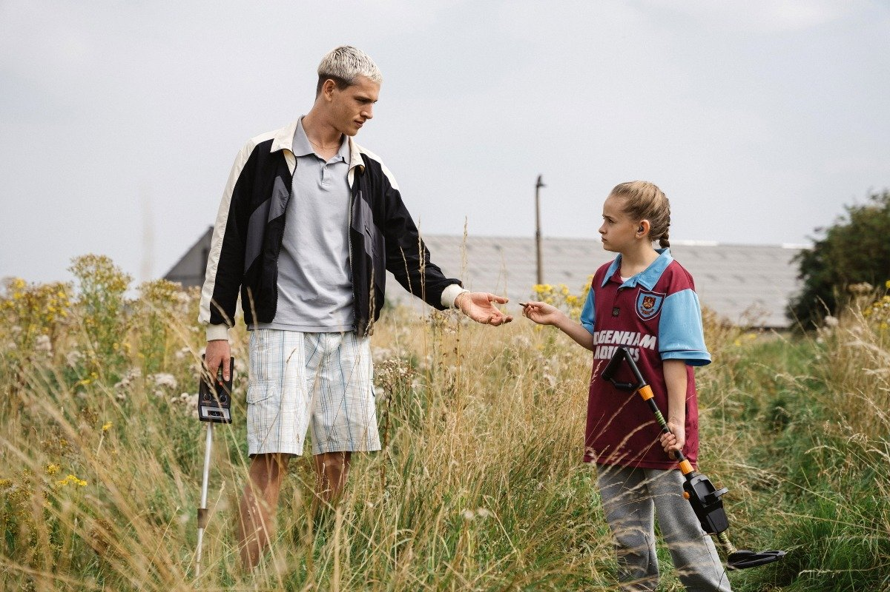

# Как Джорджи встретила Джейсона. 18 января на экранах трогательная и обаятельная «Задира» — идеальная возможность семейного похода в кино с подростком

- **URL:** https://novayagazeta.ru/articles/2024/01/13/kak-dzhordzhi-vstretila-dzheisona
- **Дата:** 2024-01-13
- **Автор:** Лариса Малюкова

## Как Джорджи встретила Джейсона

## 18 января на экранах трогательная и обаятельная «Задира» — идеальная возможность семейного похода в кино с подростком

Во время просмотра дебюта Шарлотты Риган сразу вспоминается прошлогодний фильм Шарлотты Уэллс «Солнце мое» — еще одна история сложных отношений между отцом и дочерью, разлученных зигзагами судьбы. Сенсорное, почти бессобытийное «Солнце мое» — об общении девочки с «отпускным папой», появляющимся на семейном горизонте раз в год, было об упущенных моментах детства. То кино было более воздушным, импрессионистским, беззаботным. В крепком дебюте Риган сквозит социальное неблагополучие героев, да и действие разворачивается не на курорте — в бедном пригороде Лондона.

Двенадцатилетняя Джорджи (Лола Кэмпбелл) после смерти матери умудрилась обмануть соцработников — не без помощи продавца из соседней лавки (и это самый неправдоподобный момент фильма). Сущий сорванец, палец в рот не клади — умеет за себя постоять, о себе позаботиться, себя накормить, вымаливает продукты в магазине в долг. Промышляет вместе с приятелем Али воровством велосипедов (привет шедевру Де Сика «Похитители велосипедов»). Помимо друга Али, с которым болтает без устали, ведет диалоги с домашними пауками, вознагражденными звонкими именами: Наполеон, Александр Великий. Есть, в общем, с кем вести душеспасительные беседы.

А еще Джорджи очень тоскует по матери. И когда грусть берет верх, забивается в щель между ветхими домами и пересматривает на телефоне одно и то же видео, где мама ворчит и расчесывает ей волосы.

А еще Джорджи прячется-кутается в своих фантазиях, которые для нее более существенны и безопасны, чем утлая реальность.

Но однажды обнаружится, что она — не полная сирота: блудный папаша Джейсон (Харрис Дикинсон) перелезет через забор, заберется в квартиру… и окажется едва ли не более инфантильным, чем его дочь-подросток, выдающая себя за взрослую. Кто кого должен взять под опеку — большой вопрос. Впрочем, на многие вопросы придется искать ответы Джорджи. Где папаша шлялся 12 лет? Что забыл в брошенном им доме? Да и не оборотень ли он, скрещенный с вампиром? Или, допустим, с пауком Александром Великим? А еще здорово было бы выяснить: каким он был в детстве? Или… во что они с мамой играли? И понять: а может, мама права? И они действительно похожи?

Удивительная почти осязаемая химия между Лолой Кэмпбелл и невероятным Харрисом Дикинсоном, совершенно не похожим на своего модельного красавчика в «Треугольнике печали». Его герой, благодаря нежданной-негаданной встрече с дочерью, словно нащупывает почву под ногами, ищет контакт не только с ней, но и с самим собой. Дикинсона критики уже назвали актером-трансформером. Его превращения — невероятны. Пока в главном зале кинотеатра «Художественный» шла премьера «Задиры», в соседнем зале показывали «Стальную хватку», где актер играет длинноволосого артистичного рестлера — последователя и антагониста своего жесткого одержимого «папочки».

Кадр из фильма «Задира»

Поддержите нашу работу!

1000 500 300 Нажимая кнопку «Стать соучастником», я принимаю условия и подтверждаю свое гражданство РФ

Если у вас есть вопросы, пишите [email protected] или звоните:+7 (929) 612-03-68

Шарлотта Риган не скатывается в сентиментальность, легкую добычу — мелодраматизм. Она прошивает диалоги едкой иронией.

В фильме совершенно нет ни морализаторства, ни обвинений, ни социальных разоблачений. Авторы создают не слишком благостный мир, в котором при желании люди могут быть великодушными.

В котором надежда пробивает тучи уныния и горя. А энергия молодости придает героям силы, чтобы разгрести всю муторную хмарь бедного дождливого «сегодня».

Этот непредсказуемый, неловкий, шероховатый «роман с отцом», эти их странные игры — истории узнавания друг друга и истории взросления. Не только Джорджи, но и Джейсона. Встретив шалопая-отца, девочка — оставшаяся одна в гигантском мире, постепенно начинает находить утешение в их совместных, хотя и кратких воспоминаниях о маме, в расспросах об их юношеском романе, в дурацких забавах.

А для Джейсона — эта встреча не только шанс тоже повзрослеть, но и исправить собственные ошибки хронически затянувшейся юности.

И еще в фильме совершенно восхитительная работа оператора Молли Мэннинг Уокер (чей собственный режиссерский дебют «Как заниматься сексом», удостоенный Гран-при «Особого взгляда» Каннского кинофестиваля, выйдет в этом году). Камера то замирает вместе с Джорджи и грустит, то несется по лугам и дорогам, то мечется, как сумасшедшая, то взмывает в облака вместе с фантазиями девочки.

Фильм стал фестивальным хитом, получил приз Большого жюри на фестивале «Сандэнс» в категории «Мировое кино».

Картину выпускает на экраны дистрибьюторская компания Arthouse.

Лариса Малюкова ведет телеграм-канал о кино и не только. Подписывайтесь тут.

### Этот материал входит в подписки

Смотровая площадкаКино с Ларисой Малюковой

Культурные гидыЧто читать, что смотреть в кино и на сцене, что слушать

### Добавляйте в Конструктор свои источники: сайты, телеграм- и youtube-каналы

Войдите в профиль, чтобы не терять свои подписки на разных устройствах

Поддержите нашу работу!

1000 500 300 Нажимая кнопку «Стать соучастником», я принимаю условия и подтверждаю свое гражданство РФ

Если у вас есть вопросы, пишите [email protected] или звоните:+7 (929) 612-03-68
