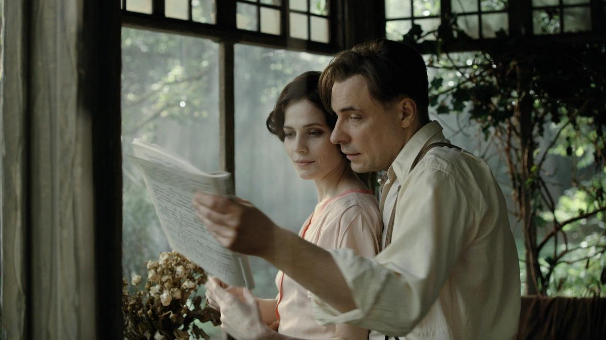

# С кем вы, Мастера и Маргариты? Экранизация романа Булгакова за выходные проката собрала почти полмиллиарда рублей. «Патриоты» призывают картину запретить, а режиссера посадить

- **URL:** https://novayagazeta.ru/articles/2024/01/30/s-kem-vy-mastera-i-margarity
- **Дата:** 2024-01-30
- **Автор:** Лариса Малюкова

## С кем вы, Мастера и Маргариты?

## Экранизация романа Булгакова за выходные проката собрала почти полмиллиарда рублей. «Патриоты» призывают картину запретить, а режиссера посадить

Кадр из фильма «Мастер и Маргарита»

Картина по мотивам легендарного романа-мифа «Мастер и Маргарита» со всей булгаковской метелью вышла за пределы экрана. И теперь метет по всем пределам: соцсетей, телеграм-каналов, грозных инстанций и департаментов.

Мчатся наперегонки: зрители — в кинотеатры, чтобы успеть увидеть; и циклопических размеров армия ультра-патриотов, не видевших картину, — с донесениями в разнообразные органы (от СК до «Госуслуг»), чтобы запретить тлетворный «продукт» враждебного режиссера.

Сборы первого уикенда — 416 801 048 руб. — свидетельствуют, что народ, за который и ратуют патриоты, в кино пошел. Более того, в Сети много постов о том, что люди успели уже пересмотреть фильм дважды.

Миллион человек — без поддержки федеральных телеканалов только за первые выходные.

Картина, сохранившая интонацию Булгакова, сделанная изобретательно, с голливудским размахом, не столько дословно пересказывает книгу, сколько раскрывает с помощью художественных средств и современных технологий процесс создания нетленого, не сгорающего в печи злой эпохи романа Мастером, которого гнобят, исключают, песочат, допрашивают, стирают.

И весь мир фильма, населенный членами МАССОЛИТа, кухарками, артистами варьете, критиками, следователями ОГПУ, врачами и нянечками психиатрического отделения, римским прокуратором Иудеи Пилатом и проповедником Иешуа Га-Ноцри, повелителем сил Тьмы Воландом и его инфернальной свитой, участниками Великого бала Сатаны, — все они плод фантазии Мастера. На наших глазах, исписывая в психушке страницы буквами, он и создает все это многоэтажное пространство, миксуя трагедию и цирк, ар-деко, конструктивизм и небоскребы с дирижаблями тоталитарной мечты 1930-х, рожденные, чтобы дикую утопическую сказку сделать былью.

Есть в фильме даже буквальная рифма-подсказка. Сначала Мастер, в квартиру которого колотится НКВД, швыряет рукопись в огонь, в финале Воланд — достает из пламени эти горящие листы и начинает их вместе с нами читать/перелистывать.

И вот уже огненные страницы покинули экран, как и свойственно мистическому роману, и мы все вместе, обжигая пальцы, их читаем, изумляясь пророчеству булгаковского гения.

Потому что он и нас всех сегодняшних описал.

Режиссер Михаил Локшин. Фото: news.myseldon.com

Подобного консолидированного «патриотического» штурма одного отдельно взятого произведения в новые времена не случалось. Зато вспоминаются прежние. Первые полосы и развороты газет с письмами простых рабочих и колхозников, а также деятелей культуры против романа «Доктора Живаго»: общая подача — «ГНЕВ и ВОЗМУЩУНИЕ», автора именовали «пасквилянтом» или «лягушкой в болоте». Народный гнев воспламенял не столько сам роман, который прочитали единицы, но враждебный поступок автора, отдавший роман в руки воинствующей «заграницы».

Нынешние патриоты массово возмущены поведением и позицией режиссера Михаила Локшина (его «Серебряные коньки» — в первой десятке Netflix). Российское Z-движение «Зов народа» обратилось к главе Следственного комитета РФ и директору ФСБ с требованием возбудить уголовное дело за «фейки» о российской армии в отношении режиссера, внести его имя в список экстремистов и террористов. Захар Прилепин, Дарья Митина, Анастасия Миронова, многие культурные и провоенные Z-каналы обвинили Локшина в русофобии, требуя срочно принять меры.

Активисты публикуют скриншоты, предположительно, со страницы режиссера от февраля 2022-го в поддержку Украины. Сейчас записей, осуждающих спецоперацию, нет, но у интернета длинная память. Атаку поддерживает артиллерия федеральных каналов.

Соловьев, не называя имени Локшина (чтобы не делать ему рекламы?), припоминает «одного режиссеришку», который «снял частично на американские деньги, частично на государственные это кино и еще и «донатит ВСУ». Он призывает перед «решительными выводами» «разобраться во всей этой схеме».

Между тем не сложно узнать, что Михаил Локшин перевел деньги украинской документалистке Миле Жлуктенко. Она сняла фильм «Просыпаясь в тишине», который показали на «Берлинале» и который получил приз за лучший короткометражный док. Картина рассказывает об украинских детях, после начала СВО оказавшихся в Германии.

Ведущий радио «Спутник» Трофим Татаренков разразился гневным монологом: «У меня к вам вопрос. Имеет ли право мразь, русофоб и тварь, желающая поражения своим солдатам и своей стране, транслировать свои мысли через свои произведения искусства? …Оттепель породила целую плеяду русофобов. Многим из них мы поклоняемся по сей день: Солженицын, Сахаров, Довлатов, Боннер, Шаламов и многие другие. …И вот теперь Локшин».

Экс-режиссер Тигран Кеосаян разделяет возмущение коллеги: «Если инфа о том, что Михаил Локшин, режиссер фильма «Мастер и Маргарита», вышедшего в прокат и снятого на бюджетные деньги, донатил на ВСУ и выступает с антироссийских позиций, правда — надо серьезно садиться и что-то решать со всей этой ситуацией — начиная с продюсеров и заканчивая правоохранительными органами… Дело в какой-то мазохистской терпимости в нашей стране к откровенным врагам».

Актер Евгений Цыганов на премьере фильма «Мастер и Маргарита». Фото: Алексей Белкин / Бизнес Online / ТАСС

Кажется, что это отзывы из той самой папочки, которую Мастер в фильме, а Булгаков — в реальном 1930-м собирал и куда вклеивал злые поклепы на свои творения.

Да и сами «отзывы» обгоняют иезуитские фантазии критика Латунского.

Блогер-миллионник, по совместительству психолог, специалист по «пути к успеху» Вероника Степанова, в своем TГ обвиняет «до кучи» и Михалкова в… спонсировании ВСУ (сохраняем орфографию и пунктуацию). «Хочется напомнить, что именно Никита Михалков (распределяющий финансирование на российское кино), выделил американскому гражданину (режиссеру, русофобу) Михаилу Локшину 1,2 миллиарда рублей, на съемки фильма «Мастер и Маргарита». Полученные от фильма деньги, Локшин отправлял на поддержку ВСУ и убийство русских солдат», — пишет Вероника, на своем пути к успеху не замечая, что Михалкова нет в Фонде кино с 2017-го. Да и к фильму Локшина он отношения не имеет.

«Патриотично настроенные граждане» с возмущением недоумевают, как государство этому идейному врагу могло выделить больше миллиарда.

Но государство не выделяло миллиард на фильм. Средства на протяжении многих лет продюсеры собирали из разных источников.

И. Толстунов, продюсер, объясняет подробно: «У всех все время почему-то возникает, ощущение, что мы все время снимаем за государственные деньги. Это большое заблуждение. В нашем случае государственное финансирование составляет приблизительно 45%. А остальное — это частные, коммерческие деньги «Амедиа», «Марс-медиа», «Кинопрайм» и прочее».

Однако энтузиасты наступательной стратегии держатся неукоснительно. При этом все эти латунские защищают «великого русского писателя» от русофобов.

Среди вопросов к авторам:

- Почему Воланда нашли в Германии (Аугуст Диль), а Иешуа Га-Ноцри играет вообще израильский актер Аарон Водовоз; наши разучились играть?
- Почему подожгли Москву? (Как удивились бы «критики», узнав, что это придумал Булгаков, а Воланд в первых редакциях романа сравнивал горящую Москву с пожаром Рима.)
- Почему в главных ролях пацифисты Снигирь и Цыганов?

Поддержите нашу работу!

1000 500 300 Нажимая кнопку «Стать соучастником», я принимаю условия и подтверждаю свое гражданство РФ

Если у вас есть вопросы, пишите [email protected] или звоните:+7 (929) 612-03-68

Читайте также

А в нашей сказочной стране всего хватает нам вполне

На экранах «Мастер и Маргарита» — фантастический блокбастер с фантастическим бюджетом в 1,2 млрд рублей

«Вы еще хотите в кино? — строго допрашивает уже неизбирательного зрителя «Культурный фронт Z». — Хотите собрать на ВСУ, как это делает Минкульт и Фонд кино. Сходите. ФСБ к вам не придет, пока Локшины снимают кино для вас». Родственные каналы создают петиции «О запрете проката «Мастера и Маргариты» русофоба и спонсора ВСУ Локшина»

Под удар попали производившая фильм компания Mars Media, Фонд кино и Минкульт и лично Ольга Любимова, позволившая прокат русофобам. Видеоканал Criminal Info и другие сулят министру культуры потерю должности. Другие патриоты еще суровей — выдачу прокатки фильму они приравнивают к спонсированию ВСУ.

Министр культуры РФ Ольга Любимова. Фото: Сергей Бобылев / ТАСС

Но возможно, битвы идут не только на идеологическом фронте. Но ура-патриотов используют для подковерных решений кадровых вопросов.

«Собеседники BRIEF считают, что определенные медиасетки сейчас наносят удары не столько по Локшину, сколько лично по министру культуры Ольге Любимовой, — полагает журналист Екатерина Винокурова. — Если прокат фильма будет сорван и финансовые показатели прибыли не будут достигнуты, удар будет тем сильнее:

Любимову обвинят не только в финансировании «непатриотичного режиссера», но и, по сути, в растрате. Это может стоить ей министерского кресла в будущем кабинете министров».

К тому, же по сведениям того же телеграмм-канала, есть «бизнес-нюансы нынешней истории: в конце декабря «Коммерсантъ» сообщил, что МТС (Владимир Евтушенков) заинтересовался покупкой продюсерского центра «Марс Медиа Энтертейнмент» (ММЕ) в рамках развития направления продакшена в онлайн-кинотеатре Kion, эксперты издания оценили потенциальную сделку в 1 млрд рублей».

В ответ на всю эту кипящую круговерть вокруг фильма его продюсеры написали осторожное письмо в его защиту. И их можно понять — потрачены огромные деньги, силы и время: более 500 (!) профессионалов на протяжении почти шести лет создавали картину. Они объясняют бесчисленным «прокурорам», что «по окончании съемочного периода, осенью 2021 года, режиссер Михаил Локшин, закончив свои контрактные обязательства и финансовые взаимоотношения с продюсерскими компаниями, вернулся в США. Дальнейшая работа над проектом велась под контролем продюсеров фильма».

Кадр из фильма «Мастер и Маргарита»

А булгаковская метель тем временем продолжает нестись над изучаемым Воландом городом. Через пару дней после премьеры пожар окутал Театр сатиры. На рубеже двадцатых-тридцатых именно здесь размещался Московский мюзик-холл, ставший прототипом театра «Варьете», в котором отрывали голову Бенгальскому.

Перед премьерой Евгения Цыганова, сыгравшего Мастера (надо сказать блестяще, это самый запоминающийся, глубокий образ, по сравнению с никакими «мастерами» в предыдущих экранизациях), спрашивали, не боится ли он, что булгаковское произведение принесет несчастье. «Вы знаете, время от времени чувствуешь над собой проклятие, но думаешь: неужели это от того, что мы начали снимать этот фильм? Желаю вам всем такой жизни, чтобы мы не чувствовали над собой проклятия».

### P.S.

Пока писался этот текст, фильм украли. И плохонькую «экранку», снятую в кинозале, бросили на разные ресурсы в интернет. И теперь про картину, над изображением которой кропотливо работали годы, судят по этому темному отражению.

Тоже своего рода зеркало.

### * Компания Meta, которой принадлежат соцсети Instagram и Facebook, признана экстремистской и запрещена в России.

### Этот материал входит в подписку

Смотровая площадкаКино с Ларисой Малюковой

### Добавляйте в Конструктор свои источники: сайты, телеграм- и youtube-каналы

Войдите в профиль, чтобы не терять свои подписки на разных устройствах

Поддержите нашу работу!

1000 500 300 Нажимая кнопку «Стать соучастником», я принимаю условия и подтверждаю свое гражданство РФ

Если у вас есть вопросы, пишите [email protected] или звоните:+7 (929) 612-03-68
