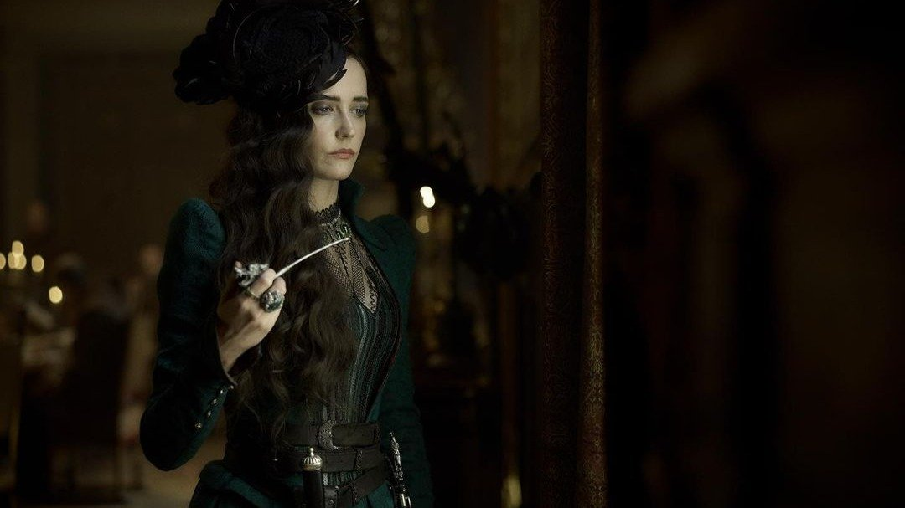

# Фам фаталь в кубе. Французский спин-офф «Три мушкетера. Миледи» вышел на экраны, но если вам к Дюма, то вы ошиблись дверью

- **URL:** https://novayagazeta.ru/articles/2024/02/09/fam-fatal-v-kube
- **Дата:** 2024-02-09
- **Автор:** Лариса Малюкова

## Фам фаталь в кубе

## Французский спин-офф «Три мушкетера. Миледи» вышел на экраны, но если вам к Дюма, то вы ошиблись дверью

Кадр из фильма «Три мушкетера. Миледи»

Фильм — продолжение вышедшей в прошлом году картины «Д'Артаньян. Три мушкетера». Первая часть — тоже не каноническая версия культовой и неустаревающей книги. И главные герои показательно старше своих литературных прототипов. А история с бриллиантовыми подвесками, которые надо любой ценой вернуть королеве (не из-за патриотизма, просто Констанция очень попросила своего возлюбленного д'Артаньяна), еще не окончательно тонула в кутерьме событий и политических интриг.

Но фильм, отдаленно напоминавший оригинал, понравился на родине Дюма, получил хорошую кассу и одобрение миллионов зрителей.

Вторая часть — скорее спин-офф. На первом плане — коварная и неотразимая Миледи де Винтер Евы Грин, способная убить и приласкать (едва ли не одномоментно). Сентиментальная киллерша. Фам фаталь в кубе: она не просто обводит всех вокруг пальца: от мушкетеров до Ришелье и Короля с Королевой, она скачет из Парижа к англичанам со скоростью ветра, берет закрытые крепости, бьется на шпагах почище мушкетеров. И в отличие от д‘Артаньяна (которого она дважды пытается совратить) — не боится собак.

И да, сочувствие авторов — на ее стороне.

А еще в центре путаной истории — грандиозный политический заговор, связанный с войной конфессий, с терактом против красавчика короля Людовика XIII (красавчик Луи Гаррель). Кабы не наши доблестные и умудренные опытом четыре мушкетера д'Артаньян (Франсуа Сивиль), Атос (Венсан Кассель), Портос (Пио Мармай) и Арамис (Ромэн Дюрис). Они проникнут в крепость, остановят убийц, предотвратят преступление, раскроют заговор. Но главное, совершат подвиги во имя друзей — на виду у врагов и своих соратников, которые устроят им овацию.

Лозунг доблестных рыцарей плаща и шпаги порадовал бы наших патриотов:

«Мушкетеры, надо идти! Смерть — ваше призвание!»

Читайте также

Он, она и потофе

С 14 февраля на экранах «Рецепт любви» — одна из лучших картин Каннского кинофестиваля. Почему ее надо непременно смотреть

Новая «серия» Мартена Бурбулона («Эйфель», «Любовь вразнос»), который уже командовал мушкетерами в первой части, — это яркие битвы и бои на шпагах, скачки по живописным туманным полям, погони, показательные казни и поцелуи перед расставанием… В общем, красочное масштабное, почти голливудское зрелище.

Поддержите нашу работу!

1000 500 300 Нажимая кнопку «Стать соучастником», я принимаю условия и подтверждаю свое гражданство РФ

Если у вас есть вопросы, пишите [email protected] или звоните:+7 (929) 612-03-68

Кадр из фильма «Три мушкетера. Миледи»

Большого смысла или познаний в области истории (о застарелом конфликте католиков и протестантов, об отношений французов с британцами, о событиях осады и взятия крепости Ла-Рошели) здесь не почерпнуть.

В какой-то момент великодушный д’Артаньян освободит из очередного плена Миледи, даже повоюет заодно с нею, помогая украсть секретные документы, в которых и будет имя того, кто хочет убить Короля.

Констанция спрячется во дворце герцога Бекингемского.

Портос закрутит роман с сестрой Арамиса.

Кадр из фильма «Три мушкетера. Миледи»

А родственник Короля, который напоминает Фею из «Золушки», решающую все проблемы, окажется чернокожим Принцем Ганнибалом (не предком ли нашего солнца русской поэзии?).

Это безрассудный и лихой блокбастер, переворачивающий с ног на голову все наши представления о происходящем, все наши воспоминания о книге, заученные цитаты. Любопытно, как Александр Дюма воспринял бы это кино. Возможно, что не слишком критично. Для него главным критерием качества произведения была его востребованность у читателя. И гонорар, разумеется.

Кадр из фильма «Три мушкетера. Миледи»

Судя по всему, это начало французской мегафранчайзинговой вселенной. И возможно, в перспективе мы увидим разные приключенческие фильмы: об Атосе, Портосе, Арамисе, а может, и о Людовике. Ведь его, как и всех мушкетеров, играет звезда и любимец публики Луи Гаррель. А значит, и он заслуживает своей главы в героической франшизе вроде Marvel.

Кстати, из придуманных Дюма артефактов в фильме есть тот самый секретный документ — индульгенция, выписанная кардиналом, гласящая: «Все поступки совершены во благо Франции». У авторов фильма такой индульгенции не было. Но судя по открытому финалу, они всерьез задумываются о продолжении.

Состоится ли оно — решать зрителю.

Лариса Малюкова ведет телеграм-канал о кино и не только. Подписывайтесь тут.

### Этот материал входит в подписки

Смотровая площадкаКино с Ларисой Малюковой

Культурные гидыЧто читать, что смотреть в кино и на сцене, что слушать

### Добавляйте в Конструктор свои источники: сайты, телеграм- и youtube-каналы

Войдите в профиль, чтобы не терять свои подписки на разных устройствах

Поддержите нашу работу!

1000 500 300 Нажимая кнопку «Стать соучастником», я принимаю условия и подтверждаю свое гражданство РФ

Если у вас есть вопросы, пишите [email protected] или звоните:+7 (929) 612-03-68
