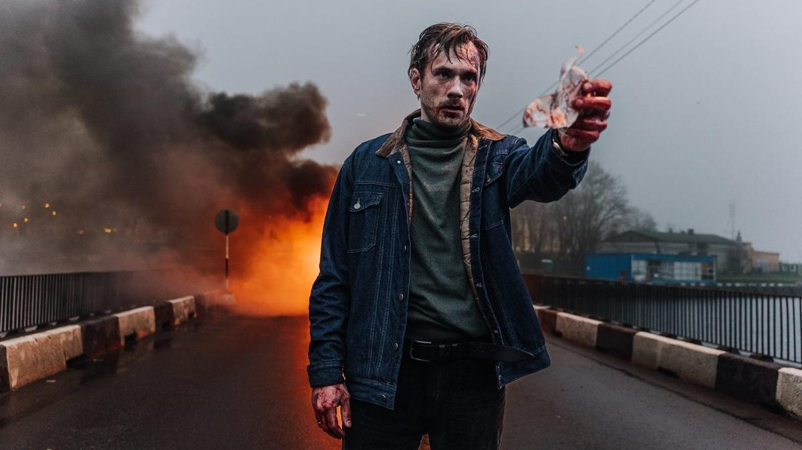

# Разведчики без правил. Выходит политический триллер «ГДР» о падении Берлинской стены и о тех, кто ее «уронил»

- **URL:** https://novayagazeta.ru/articles/2024/02/14/razvedchiki-bez-pravil
- **Дата:** 2024-02-14
- **Автор:** Лариса Малюкова

## Разведчики без правил

## Выходит политический триллер «ГДР» о падении Берлинской стены и о тех, кто ее «уронил»

Кадр из сериал «ГДР»

Режиссер Сергей Попов. 14 серий. Большой бюджет. Консультанты — бывшие разведчики, которые бывшими не бывают. Съемки в разных странах.

СССР, осень 1989 года. Битва между спецслужбами СССР, Германии и США в полном разгаре — на фоне разрушающейся империи. Когда по швам трещит гигантская империя, страдают не только «простые граждане», по швам прорывается плотина из дипломатии и военных союзов. А вместе с «Титаником» — СССР — под воду медленно уходит и Германская Демократическая Республика — витрина социализма.

Капитан разведки Нечаев (Александр Горбатов) после провальной спецоперации возвращается в Москву. Под видом фотографа ТАСС он должен попасть в концертное гастрольное закулисье и узнать, кто из артистов берлинского мюзик-холла передаст зашифрованную информацию американскому шпиону «под видом журналиста». Так начинается боевитая, в меру фантастическая история с отравлениями связных, переправкой трупа «курьера» в Берлин, слежка, прослушка, погони, поединки разнообразных разведок мира, которые гоняются за секретными архивами внешней разведки Министерства госбезопасности ГДР, подозрения своих в том, что они — чужие. Причем западные шпионы действуют вне всяких правил, а наши разведчики, как положено — по инструкции.

Кадр из сериал «ГДР»

Талантливые гримеры «воскрешают» мертвых. Пилот-любитель Матиас Руст летит к Красной площади, и на земле в панике решают, что с ним делать. Длинноногие девушки театра-ревю Фридрихштадтпаласт достают синхронно до звезд… ногами и заманивают в западню советских разведчиков. «Джеймс Бонд» Нечаев, судя по всему, победит в тактической игре противников, которые попытаются его ошельмовать. Тем более что у него есть верная жена (Дарья Урсуляк). А в кабинетах спецслужб в скором времени снимут портреты Андропова и Горбачева. И больше никто не будет петь хором: «Навеки Дружба — Freundschaft! Дружба — Freundschaft!»

Читайте также

Застывшее время истекает кровью

15 февраля открывается 74-й Берлинский фестиваль. Чем он примечателен

Всегда мы вместе, всегда мы вместе, ГДР и Советский Союз! Играющий главную роль сумрачного советского супергероя актер Александр Горбатов называет это многосерийное кино стильной и умной шпионской драмой. Я видела только две первые серии. Возможно, экшен и шпионская интрига увлекут аудиторию НТВ. Во всяком случае, актеры собраны хорошие. От Горбатова до Дарьи Урсуляк и Олега Фомина. Но

закручивая шпионскую интригу, в которой разведки играют друг с другом в кошки-мышки, авторы сами заняты политической игрой со зрителем в духе сегодняшнего дня.

Они расправляются с недополитиком Ельциным, который вроде бы сам инсценирует нападение на себя. Из Горбачева делают безвольную марионетку в руках Раисы Максимовны.

Поддержите нашу работу!

1000 500 300 Нажимая кнопку «Стать соучастником», я принимаю условия и подтверждаю свое гражданство РФ

Если у вас есть вопросы, пишите [email protected] или звоните:+7 (929) 612-03-68

Кадр из сериал «ГДР»

Незабываем диалог Михаила Сергеевича с Раисой Максимовной за завтраком. Оба в белых рубашках. Перед ними много плошек с салатиками, обычный утренний разговор мужа с женой:

— Я этим всем вот уже четыре года обещаю проект общего европейского дома. Но вот все никак не доделаю.

Раиса Максимовна вся в гриме намазывает белый хлеб маслом.

— Ты говорил это в июле на Парламентской ассамблее в Страсбурге. Подождут.

— Да я не могу ждать! Ситуация накаляется. Мне сейчас нужно определиться, как интегрировать ФРГ с ГДР. Это же ключевой момент моего плана.

Раиса Максимовна — точь-в-точь как Чапаев Бориса Бабочкина показывает Петьке с помощью картофелин, где должен быть командир: показывает мужу на салатиках, как именно интегрировать и как определиться:

— Отделить соперничество социалистических и капиталистических идей и технологий от разрушительного соперничества военных блоков. Это и закончит холодную войну.

Вот так она и делает своего растерянного мужа архитектором новой Европы. Салатиков жаль — так и не поели. И эти люди руководят империей?

Кадр из сериал «ГДР»

А для души здесь музыка Лозы с «Плотом», «Земляне» — с «Травой у дома». И экс-американский, а ныне гэдээрошный певец, любимец СССР — прозрачный намек на Дина Рида. Существует версия, что смерть Рида была операцией спецслужб ГДР. Вот такой политический «Голубой огонек» с игрой в шпионов, внезапными убийствами и геройством скромных незаметных парней, пытающихся удержать мир, летящий в пропасть.

- Производство: «Всемирные русские студии» при участии телекомпании НТВ, видеосервиса Wink.ru, «НМГ Студии» и Института развития интернета (АНО «ИРИ»).
- Онлайн-платформы: Wink.ru (в линейке Wink Original).

Лариса Малюкова ведет телеграм-канал о кино и не только. Подписывайтесь тут.

### Этот материал входит в подписки

Смотровая площадкаКино с Ларисой Малюковой

Культурные гидыЧто читать, что смотреть в кино и на сцене, что слушать

### Добавляйте в Конструктор свои источники: сайты, телеграм- и youtube-каналы

Войдите в профиль, чтобы не терять свои подписки на разных устройствах

Поддержите нашу работу!

1000 500 300 Нажимая кнопку «Стать соучастником», я принимаю условия и подтверждаю свое гражданство РФ

Если у вас есть вопросы, пишите [email protected] или звоните:+7 (929) 612-03-68
