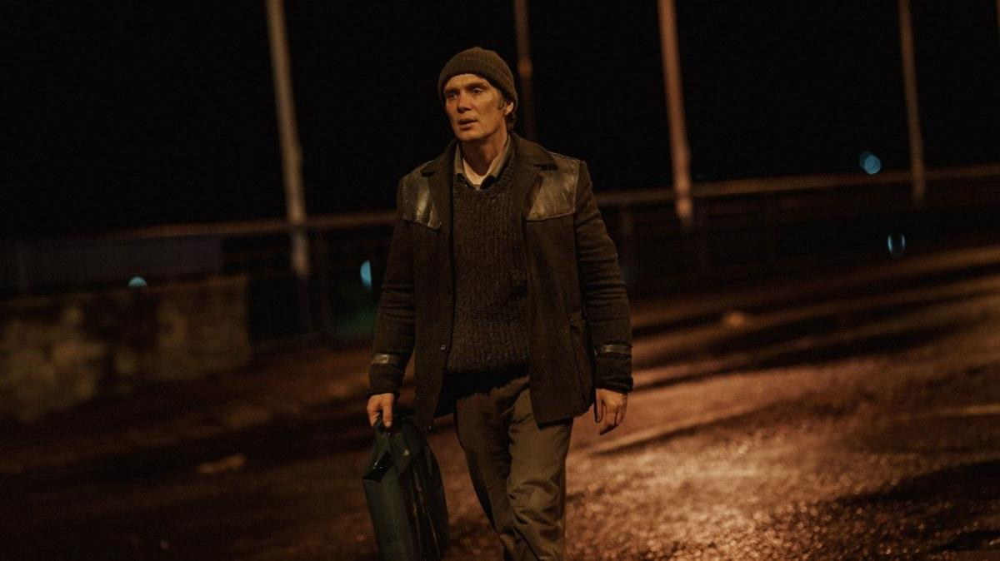

# Событие мирового значения и «Такие мелочи». Жюри Берлинале атаковали вопросами о Газе, Украине и правых в немецкой политике. Но и до кино добрались: фестиваль открыл новый фильм с Киллианом Мерфи

- **URL:** https://novayagazeta.ru/articles/2024/02/16/sobytie-mirovogo-znacheniia-i-takie-melochi
- **Дата:** 2024-02-16
- **Автор:** Лариса Малюкова

## Событие мирового значения и «Такие мелочи»

## Жюри Берлинале атаковали вопросами о Газе, Украине и правых в немецкой политике. Но и до кино добрались: фестиваль открыл новый фильм с Киллианом Мерфи

Кадр из фильма «Такие мелочи»

На пресс-конференции жюри основного конкурса, предваряющей показ, ожидаемо про политику спрашивали больше, чем про кино.

И да, было жарко.

Настолько, что члены жюри не могли скрыть своего раздражения.

Журналисты интересовались:

- правильно ли, что на открытие пригласили правую партию «Альтернатива для Германии» (АдГ), а потом отозвали приглашение;
- событиями в Украине;
- кризисом в Газе.

Вопрос об арабско-израильском конфликте возмутил известного немецкого режиссера Кристиана Петцольд, который сказал: «Не хочу отвечать на этот вопрос здесь… Я за мир, за дискуссии, надеюсь, что в нашем жюри у нас получится обсуждать любые темы».

Два члена жюри — его председатель Лупита Нионго, кенийско-мексиканская актриса, лауреат премии «Оскар», и известный немецкий режиссер Кристиан Петцольд — среди подписантов открытых писем с призывом к прекращению огня в секторе Газа. От ответа на вопрос о Газе Нионго ушла. Известно, что три израильских режиссера отказались участвовать в работе фестиваля из-за публичной позиции многих ведущих кинематографистов.

Выдающийся испанский режиссер Альберто Серра был вынужден оправдываться за слова о том, что он «очарован» экс-президентом США Дональдом Трампом и российским президентом Владимиром Путиным.

Серра ответил, что свое мнение выразил в большом двухчасовом интервью, и кому интересно, может прослушать его полностью, чтобы понять его точку зрения.

Член жюри украинская писательница Оксана Забужко сказала, что ей интересно обсуждать этот вопрос с Альбертом Серра, и она уже подарила ему свою книгу на итальянском языке об украинско-российских отношениях.

Жюри 74-го Берлинского кинофестиваля: Брэди Корбет, Жасмин Тринка, Кристиан Петцольд, Лупита Нионго и Альберт Серра. Фото: AP / TASS

Понятно, что в Берлине самой острой темой оказалась тема отношения к националистической партии «АдГ», представителей которой отфутболили в последний момент. Довольно бестактно спросили Нионго, комфортно ли ей было бы находиться в одном зале с «партийцами», которые предлагают депортировать мигрантов из Германии. На что она заметила, что, к счастью, ей не придется оказаться в таком положении.

Петцольд иронизировал: «Я ждал этого вопроса неделю и забыл свой ответ». Но все же продолжил:

«Мы не трусы; если мы не выдержим в зале пятерых представителей «АдГ», мы проиграем нашу борьбу».

Разумеется, работа жюри предстоит весьма напряженная. И дискуссии будут касаться не только кино, что, собственно, и предполагает программа самого политизированного кинофестиваля в мире. Особенно, как заметил кто-то на пресс-конференции, когда фестиваль проводится в центре обезумевшего мира.

Да, и про кино. Спросили, как члены жюри собираются смотреть фильмы: со зрителями или с прессой. Они ответили, что будут и приватные показы, и в главных залах. Не будет только линков для компьютера. Фестивальное кино — только на большом экране.

А перед началом торжественного открытия несколько групп протестующих вышло на фестивальную площадь. Около 50 представителей киноиндустрии со значками «Кино объединяет, ненависть разделяет» прошло по красной дорожке, держась за руки. Митингующие включили фонарики на телефонах и скандировали «Защити демократию!», та же фраза отображалась на большом экране фестивального дворца.

## «Маленькие вещи», или «Такие мелочи»

Поначалу выбор фильма удивляет. Вроде бы совсем скромное кино о почти незаметных мелочах.

Может быть, даже слишком скромное для открытия гигантского кинофестиваля класса А, который открывался нарядным «Отелем «Гранд Будапешт» Андерсона, «Жизнью в розовом свете» Даана про Эдит Пиаф или эффектным вестерном неугасаемых братьев Коэнов «Железная хватка».

А тут короткий, в духе Кесьлёвского, но словно спрятанный под амальгамой времени мрачный фильм. Однако есть в картине Тима Милантса изумляющая киногения, есть завораживающая тусклая атмосфера, во многом отражающая состояние сегодняшнего сумрачного мира. И замечательная, хотя и предельно сдержанная работа Киллиана Мерфи. Кстати, это их не первый совместный с Минатсом проект — до этого был знаменитый сериал «Острые козырьки». Сегодня в связи с «Оппенгеймером» имя Мерфи у всех на устах, и «Оскар» плывет ему в руки. Но с самых ранних его фильмов — «Дискосвиней, «Разрыв», «Завтрак на Плутоне» — было не забыть этого особенного актера со своей интонацией и с почти прозрачными серыми глазами.

Киллиан Мёрфи на пресс-конференции съемочной группы фильма «Такие мелочи». Фото: dpa / picture-alliance

Фильм — экранизация романа Клэр Киган «Маленькие вещи вроде этих» (Small Things Like These), получившего множество премий и наград. Сразу замечу, не столько экранизация, сколько бережный, но несинхронный перевод с литературного языка книги, номинированной на «Букер», на киноязык. И перевод сделан вдумчиво и здорово. Сценарий писал хороший ирландский драматург Энда Уолш («Дискосвиньи», «Голод»).

1985 год, ирландский городок Нью-Росс. Несколько недель до Рождества. У Билла Ферлонга, торговца углем и древесиной, пик сезона. Всем нужен уголь. Он его грузит, развозит по домам. Везет «тепло». И мы видим в огонь очагах и каминах, зажженный благодаря Биллу. И был бы он богат, но «природа» подводит: не может отказать страждущим, поэтому отгружает черное золото в долг, придерживает для нуждающихся. Билл скромен, сердечен, временами проявляет почти диккенсовскую сентиментальность и мечтательность. В детстве неслучайно с упоением читал «Рождественскую песнь в прозе». Такие, как он, никогда не разбогатеют. И жена об этом знает. И дочки. Тем не менее они чувствуют себя удачливыми.

Но это все какое-то внешнее. Даже его благополучная семья. Жена мечтает о туфлях. И они их купят. Повесят рождественский венок на дверях дома. А внутри него — сверло прошлого. Крутится, разъедает детская травма. Однажды Билл привозит уголь в монастырь на окраине города и видит, как сопротивляющуюся молодую женщину заталкивают в «застенок».

В монастырской прачечной под строгим приглядом работают молодые женщины. О них ходят ужасные слухи: будто там легкодоступные девицы или девушки из хороших семей, опорочившие себя, и их пришлось «спрятать» после родов. Вернувшись в монастырь, он обнаруживает в угольном сарае ту самую девушку, едва способную ходить. У нее отняли все надежды, кроме последней — увидеть своего ребенка. И тут уж ей никак не помочь.

В так называемых прачечных Магдалины в XVIII–XX веках содержалось в заключении около 30 000 ирландских женщин. Католическая церковь выделяла на их содержание скудные деньги, но, по сути, превратила эти приюты в трудовые исправительные заведения, в которых над бесправными работницами просто издевались.

Поддержите нашу работу!

1000 500 300 Нажимая кнопку «Стать соучастником», я принимаю условия и подтверждаю свое гражданство РФ

Если у вас есть вопросы, пишите [email protected] или звоните:+7 (929) 612-03-68

Почему эта встреча осталась занозой в сердце героя? Может, оттого, что мать родила его вне брака, когда ей было шестнадцать? И она тоже могла бы стать заключенной одной из «прачечных»?

В книге — сложная, связанная паутина деталей-раздумий насыщенной внутренней жизни Билла.

Талантливый режиссер вместе с одним из лучших актеров современности очень неторопливо погружаются в этот загадочный «внутренний мир» со своими меридианами и параллелями, соединенностью времен: нынешнего — с детством. Все на полутонах, на игре планов. И многочисленные флешбэки — не про события, а про реакции на события.

Ребенок догадывается о тайне, которую от него скрывают. И не ведает, как это пережить.

В повести Киган «Проповеди Джинджер Роджерс» главный герой описывает тривиальные секреты, которые все вокруг него прячут друг от друга: «В нашем доме все что-то знают, но притворяются, что ничего не знают». Точно так же обыгрывается внезапная смерть мамы. Как что-то ужасное и обыденное. Что делать, это жизнь. И ощущение потери тверди под ногами тоже не в словах. Просто изумление застывает в круглых глазах маленького Билла (и где только нашли такого ребенка: точно Мерфи в детстве). Вот отчего ощущение, будто любое явное или малозаметное действие героя словно приведено в движение много лет назад. Все в человеке, по мнению авторов, нерасторжимо, каждая «мелочь», уколовшая годы назад, отзовется болью.

Билл живет в городке под грузом «протокола». Все здесь издавна знают, как надо себя вести и как не надо. Поэтому его жена и велит ему забыть несправедливостях в отношении других… «таких» женщин. Причем в отличие от книжной стервы в кино жена вполне милая, обычная женщина. И это еще убедительней. Да и горожане не монстры. Просто всем не поможешь. А зло обыденно.

Читайте также

Застывшее время истекает кровью

15 февраля открывается 74-й Берлинский фестиваль. Чем он примечателен

Ну хорошо, а как с этим жить? Билл ищет согласия между тьмой выученной беспомощности, привычной, как топка печи, несправедливости, горя конкретного другого — и своим личным, тихим семейным покоем.

И не находит. Одно опрокидывает другое.

Этот роман называют антидиккенсовским. И героя, как знакомого персонажа Диккенса, в кино растушевали, добавили оттенков. Авторы не устают разглядывать лицо Билла. Он не просто протагонист, он и есть содержание, история.

У Билла уголь въелся в кожу, под ногти. Он щеткой трет их каждый день, и не может, подобно Пилату, «умыть руки». Трет их рьяно, словно пытается счистить с души горечь детских воспоминаний. Тайны, так и оставшейся тайной. Но ни прошлого не вычистить, ни припорошенного угольной пылью настоящего. Весь город знает о мытарствах женщин в «прачечной Маргариты», и все с этим согласились.

И этот заговор молчания делает горожан соучастниками тихого преступления вместе с церковью.

Во главе с благочестивой старшей монахиней Оберен (Эмили Уотсон), которая возглавляет монастырь и пытается сохранить ради устоев и высшей морали существующий «справедливый порядок вещей». Главное — не нарушать устоявшийся порядок.

Авторы снимают ирландский город 80-х с его туманными рассветами, редкими проблесками солнца, мрачными стенами домов, городской площадью и монастырем-тюрьмой, словно время здесь когда-то давно (с диккенсовской поры) замерло. Словно и в город с горожанами вместе с углем въелось жестокое, равнодушное архаичное прошлое. И перед нами снова старая недобрая Англия, почерневшая от угольного дыма.

Темнеют каменные своды, вечерняя темень прокрасила прожилки пожухлых, поржавевших листьев и травы, страшная чернота зияет в угольном сарае для провинившихся девушек. Но снег идет везде, и здесь он будет падать, как прозрачный занавес. В какой-то момент кажется, что только ему под силу справиться с этой темной безнадежностью. Но нет, Билл придет на подмогу снегу, протянет руку попавшей в беду.

- Фильм сняла кинокомпания Бена Аффлека и Мэтта Дэймона Artists Equity.

Лариса Малюкова ведет телеграм-канал о кино и не только. Подписывайтесь тут.

### Этот материал входит в подписку

Смотровая площадкаКино с Ларисой Малюковой

### Добавляйте в Конструктор свои источники: сайты, телеграм- и youtube-каналы

Войдите в профиль, чтобы не терять свои подписки на разных устройствах

Поддержите нашу работу!

1000 500 300 Нажимая кнопку «Стать соучастником», я принимаю условия и подтверждаю свое гражданство РФ

Если у вас есть вопросы, пишите [email protected] или звоните:+7 (929) 612-03-68
