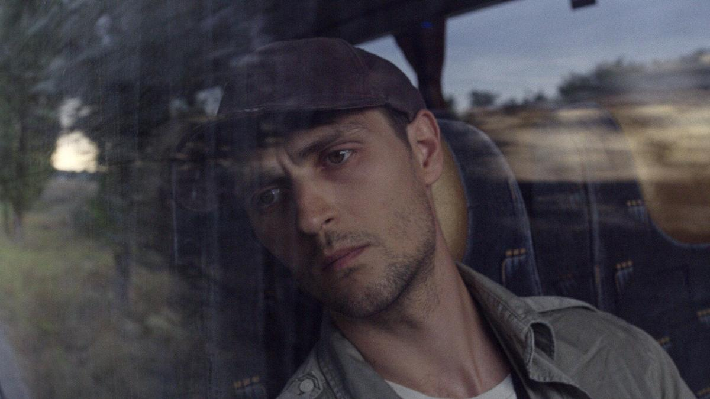

# Кино на черном фоне. Берлинале продолжается. Смотрим украинский бурлеск «Редакция» — про победу одного и того же фейка на выборах, и иранскую драму «Мой любимый торт» — про общество духовных скреп

- **URL:** https://novayagazeta.ru/articles/2024/02/19/kino-na-chernom-fone
- **Дата:** 2024-02-19
- **Автор:** Лариса Малюкова

## Кино на черном фоне

## Берлинале продолжается. Смотрим украинский бурлеск «Редакция» — про победу одного и того же фейка на выборах, и иранскую драму «Мой любимый торт» — про общество духовных скреп

Кадр из фильма «Редакция» Романа Бондарчука

После объявления о смерти Алексея Навального более тысячи человек собрались на бульваре Унтер-ден-Линден, неподалеку от Берлинале. Цветов было очень много. И слез.

А чуть ближе к метро была организована другая акция. Буквально из нескольких человек. Но с богатыми транспарантами, киоском с листовками — «Свободу Джулиану Ассанжу». Но молодые люди шли мимо — к стихийно образовавшемуся мемориалу с фотографиями Алексея Навального.

## Бондарчук. Не тот

«Редакция» — украинский фильм на Берлинале в секции экспериментального кино «Форум». Режиссер Роман Бондарчук. Создатель сатирического «Вулкана».

Первый кадр: гигантский суслик среди степей замер. Смотрит в камеру, словно пришелец.

Небольшой провинциальный город. Научный сотрудник пыльного Музея естественных наук Юра разыскивает редкие виды животных и пытается спасти их от уничтожения. Вместе с товарищем они становятся свидетелями поджога леса и даже успевают сфотографировать поджигателей. Фото Юра предлагает опубликовать в местной газете «Степная правда», хочет достучаться до «верхов».

Но скандала боятся. Общество погрязло в коррупции. Депутаты, чиновники, редактор — все повязаны. Не до сурков с сайгаками, иди они лесом… вместе с горящим лесом. На носу выборы. А главный кандидат у нас кто? Да тот же, нынешний мэр. Он, правда, в коме. Лежит давно в укромной реанимации, подключенный к искусственному питанию. А на выборах его прежнее видео принимает участие. Предвыборная кампания в разгаре. Команда мэра — хозяин похоронного бизнеса, главный редактор, депутат — «танцуют все» на вирусных роликах, которые разлетаются, как горячие пирожки. И народ радостно голосует.

Кадр из фильма «Редакция» Романа Бондарчука

На тело «победителя» в реанимации возлагают праздничные букеты. Тело поздравляют. А пуск новой газовой трубы презентуют исключительно для телевидения… и тут же увозят на склад. Да и лес, как выясняется, жгут, чтобы создать впечатление, что все сгорело, оставшуюся же древесину можно гнать в Турцию.

Такой вот довоенный бурлеск, безжалостный по отношению к продавшим душу чиновникам, к чужим среди своих. Про то, как фейк становится главным действующим лицом политики и экономики. Видимое — важнее реального. Много узнаваемого до боли. Портфель с компроматом живет своей жизнью, любовницу депутата приковывают на даче, надевая кандалы прямо на лабутены, бедствующая мама Юры закладывает квартиру ради покупки криптовалюты, которую пропагандирует американский гуру. А гигантский суслик смотрит на эту карусель с недоумением. Ну, это пока еще до него и его норы не добрались.

В столкновении правды и лжи, закона и беззакония ложь и анархия побеждают, потому что не церемонятся, действуют нагло, нахраписто.

Правду надо пробивать, доказывать, пластичный фейк сам до ушей дотанцует.

Самое удивительное, что многие сюжеты этого сюрреалистического памфлета взяты из реальности. Прежде чем начать снимать кино, Роман Бондарчук и его соавторы провели большое, небезопасное расследование.

Отличие меж нами все же есть. Им позволено хотя бы назвать вещи своими именами. И в этом различие двух Бондарчуков.

В постскриптуме гротескные Борис Джонсон, Шольц, Макрон и Зеленский в заранее подготовленные ямки (на месте сожженного леса) перед камерами сажают деревья. А с ними… и вся команда «победившего» мэра.

## «Мой любимый торт»

Простодушное на первый взгляд иранское кино, которое критики сравнивают с тортом. Сначала очень сладким на вкус. Потом горьким.

Кино — особенно понятное в России. Махин (Лили Фархадпур) — 70-летняя медсестра на пенсии. Спит до полудня. А куда ей спешить. Муж умер лет тридцать назад. Дети эмигрировали. Теперь на родине многие старшие живут в одиночестве. Здесь дом, здесь все свое. Дети только в телефоне. Вечерами сериалы и вязанье. Иногда она собирает подруг, готовит долму, обсуждают болезни, выученное одиночество и даже гипотетическую (!) возможность познакомиться в их возрасте (!) с одиноким мужчиной. Какой мужчина! Когда подруга дарит Махин диск. С фильмом? Да нет, с колоноскопией, раз она не верит, что у подруги рак.

Кадр из фильма «Мой любимый торт» Бехташа Сенайи и Марьям Мукаддм

Поддержите нашу работу!

1000 500 300 Нажимая кнопку «Стать соучастником», я принимаю условия и подтверждаю свое гражданство РФ

Если у вас есть вопросы, пишите [email protected] или звоните:+7 (929) 612-03-68

Но однажды ей повезет, приметит в столовой для пенсионеров симпатичного усатого мужчину — таксиста. Тут Махин и совершит свой самый дерзкий в жизни поступок. Она его дождется и попросит отвезти домой. Мало того, пригласит в дом. У нее вообще весь день — протестный. То девушку без хиджаба отобьет у полиции нравов. То впустит мужчину по имени Фарамарз в дом. И будет им недолгое счастье.

Они сядут под деревьями в райском саду Махин за забором, защищающим от враждебного города и стукачей-соседей. Она достанет вино — огромную бутыль. Он починит электричество и загорятся лампочки. Она наденет два своих лучших платья. Даже успеет испечь торт.

Это их праздник непослушания, лучший вечер в жизни, хотя фанатичная соседка и будет стучать в дверь, фальшиво волнуясь: «Одна ли Махин? Все ли у нее в порядке? И отчего слышен мужской, прости аллах, голос?»

Они будут пить вино и танцевать. И с самого начала этого почти нереального праздника за них страшно. Потому что локальное счастье внутри агрессивного мира — хрупкое стекло.

Читайте также

Событие мирового значения и «Такие мелочи»

Жюри Берлинале атаковали вопросами о Газе, Украине и правых в немецкой политике. Но и до кино добрались: фестиваль открыл новый фильм с Киллианом Мерфи

Роскошные актеры не демонстрируют себя, но растворяются друг в друге. Рядом с Фархадпур известный иранский актер Эсмаил Мехраби.

Маленький фильм, поначалу просахаренный до основания, оказывается точной зарисовкой происходящего в Иране. Когда люди лишаются права на личную жизнь.

И сюжет фильма отзывается эхом в реальности. Его авторы Марьям Могаддам и Бехташ Санаиха уже участвовали в берлинском конкурсе с фильмом «Баллада о белой корове» несколько лет назад. На нынешний фестиваль их из страны не выпустили. Прежде всего из-за самого — заметим, сверхцеломудренного — фильма, в котором героиня ведет себе вызывающе: без хиджаба, пьет вино и танцует с мужчиной. Причем не мужем!

Известно, что основные съемки проводились тайно. И если бы про них прознала полиция нравов, кинематографистам бы несдобровать. Но режим и так возложил на них ответственность за это «безнравственное кино».

На титрах после горестного финала будет звучать музыка, как будто в саду Махин по-прежнему горят лампочки — знак ее свободы от душного религиозного фанатизма.

Мы решили пересечь красные линии.

Иранская актриса Лили Фархадпур и актер Эсмаил Мехраби, сыгравшие в фильме «Мой любимый торт», держат фотографию, на которой изображены режиссеры картины. Фото: RONNY HARTMANN/AFP / East News

На пресс-конференции актеры, сыгравшие главные роли в фильме — Лили Фархадпур и Эсмаил Мехраби, — зачитали обращение Марьям Могаддам и Бехташа Санаиха:

«Дорогая аудитория, дорогие журналисты и команда Берлинале!

Сегодня фильм, на создание которого мы потратили три года нашей жизни, родится рядом с вами, к сожалению, без нашего присутствия. Как родителям, которым запрещено смотреть на своего новорожденного, так и нам запрещено наслаждаться ощущением просмотра нашего фильма вместе с вами, взыскательной публикой этого важного фестиваля. Нам грустно, мы устали, но мы не одни. Это магия кино. Кино объединяет нас. Это окно, открывающееся в пространство, где мы встречаемся. Теперь нам запрещено присоединяться к вам и смотреть на киноэкране фильм о любви, о жизни, а также о свободе, потерянном сокровище нашей страны.

В течение многих лет иранские кинематографисты снимали фильмы в соответствии с ограничительными правилами, соблюдая красные линии, пересечение которых может привести к многолетним отстранениям, запретам и сложным судебным разбирательствам. Болезненный опыт, который мы пережили много раз за последние годы. В такой плачевной ситуации мы всегда пытаемся отобразить в наших фильмах реальность иранского общества. Реальность, которая чаще всего теряется или затемняется цензурой.

Мы пришли к выводу, что больше невозможно рассказывать историю иранской женщины, соблюдая строгие законы, такие как обязательное ношение хиджаба. Женщины, которым красные линии мешают изобразить свою истинную жизнь как полноценных людей. На этот раз мы решили пересечь все ограничительные красные линии и принять последствия нашего решения нарисовать реальную картину жизни иранских женщин — образы, которые были запрещены в иранском кино со времен Исламской революции».

Лариса Малюкова ведет телеграм-канал о кино и не только. Подписывайтесь тут.

### Этот материал входит в подписку

Смотровая площадкаКино с Ларисой Малюковой

### Добавляйте в Конструктор свои источники: сайты, телеграм- и youtube-каналы

Войдите в профиль, чтобы не терять свои подписки на разных устройствах

Поддержите нашу работу!

1000 500 300 Нажимая кнопку «Стать соучастником», я принимаю условия и подтверждаю свое гражданство РФ

Если у вас есть вопросы, пишите [email protected] или звоните:+7 (929) 612-03-68
