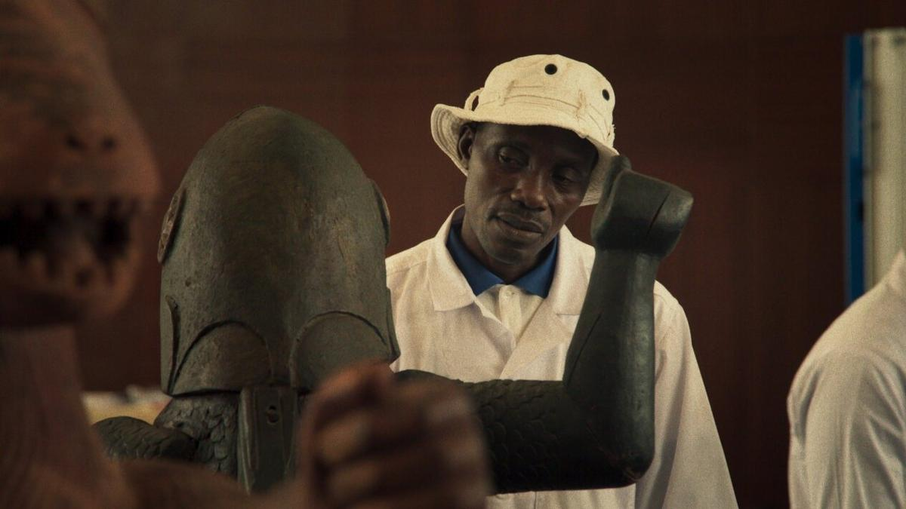

# Победа дискурса над разумом. Почему на Берлинале-2024 политика вытесняет искусство

- **URL:** https://novayagazeta.ru/articles/2024/02/26/pobeda-diskursa-nad-razumom
- **Дата:** 2024-02-26
- **Автор:** Лариса Малюкова

## Победа дискурса над разумом

## Почему на Берлинале-2024 политика вытесняет искусство

Кадр из фильма «Дагомея»

Формулировка в заголовке не моя, а умной подруги, талантливого режиссера. Точней не скажешь. На протяжении всего фестиваля приметы «дискурса» мигали ярким светом. Современная политика всегда была важной частью одного из главных кинофорумов мира, существующего на месте шрама разорванной некогда Европы. Но сегодня политика вторгается в сферы искусства, все больше и больше диктуя ему правила, на наших глазах превращающихся в новые догмы. Новостные фестивальные пресс-релизы все больше напоминают заголовки газет.

Впервые председателем жюри стала афроамериканка! Это красивая кенийско-мексиканская актриса, обладательница премии «Оскар» за фильм «12 лет рабства» Лупита Нионго. И выбор судейства под ее управлением тоже похож на политическое заявление.

## Прямое действие

«Золотой медведь» «Дагомее» франко-сенегальской постановщицы Мати Диоп — свидетельство не столько кинематографических достижений, сколько высокой степени толерантности. По сути, это документальный диспут о постколониальных травмах — на фоне возвращения королевских сокровищ Бенина (в прошлые времена — королевство Дагомея), разграбленных и присвоенных Францией.

Эти сокровища взывают к европейскому зрителю вместе с бенинскими активистами, студентами университета. Зооморфная деревянная фигурка короля Дагомеи Гезо, небольшие скульптурные аллегорические портреты его наследников с горечью повествуют о «плене в пещерах цивилизованного мира». Их бережно заворачивают, упаковывают в ящики белые руки культурных колониалистов. Колониалисты никак не могут решить, можно ли деревянную скульптуру столь почтенного господина упаковать лицом вниз.

Из семи тысяч украденных предметов возвращено только 26. Цифра вопиющая. Оскорбительная, как говорят на диспуте. И как справедливо считает автор. Судя по всему, это только начало процесса Возвращения, и громкий успех фильма этот процесс может ускорить. Студенты заявляют, что не только культура, но и сами они — жертвы колониализма, ведь говорят они по-французски. И даже о возвращении культурных артефактов мечтают по-французски. Тем не менее они полны оптимизма, культура Бенина создается сегодня. И у нее большое будущее.

Кадр из фильма «Дагомея»

Фильм не лишен поэзии. Служитель Бенинского музея замирает перед вернувшейся статуей короля Бехазина, изображенного в виде акулы, и что-что долго про себя шепчет. Словно молится. И тусклый голос короля Гезо доносится до нас, словно из вечности. О том, что сам Гезо вел многочисленные военные кампании против соседних африканских племен, превращая военнопленных в рабов, фильм умалчивает.

Диоп — первая чернокожая постановщица, участвовавшая в 2019-м с интересной дебютной драмой «Атлантика» в Каннском конкурсе, получившая Гран-при жюри. Ее «Дагомея» — приличная неигровая картина. Уместная в документальной Панораме. Но главный приз игрового конкурса «Берлинале» — еще и лоцманская карта, вектор для развития мирового кинематографа. И это печалит.

Кстати, лучшей в документальном конкурсе названа картина «Нет другой земли» об уничтожении палестинских деревень «израильскими оккупационными силами» на западном берегу реки Иордан. Авторы фильма — палестино-израильский коллектив активистов. «Хрустального медведя» за лучший фильм в конкурсе Generation 14plus получил фильм «Последнее плавание». Режиссер Саша Натвани. О юной иранке в Лондоне, влюбленной в астрономию.

Кадр из фильма «Нет другой земли»

На церемонии награждения Мати Диоп взывала к ответственности за прошлое, которое — основа для движения вперед:

«Пришло время восстанавливать справедливость — для этого и нужна реституция». Она раскритиковала войну в Газе со сцены и призвала к немедленному прекращению огня.

Гийом Кайо и Бен Рассел, режиссеры фильма «Прямое действие», названного лучшим в секции Encounters, надели куфии, выражая поддержку палестинцам. Рассел сказал журналистам, что это «жест присоединения наших голосов к голосам, призывающим к прекращению огня, чтобы положить конец геноциду. Палестинский режиссер-документалист Базель Адра призвал прекратить поставки оружия Израилю, заявив, что тот «уничтожил десятки тысяч людей в секторе Газа». К ним присоединилась Джулиана Рохас, получившая приз Encounters за лучшую режиссуру за фильм «Сидаде».

Зрители аплодировали. Тему террора боевиков ХАМАС выступающие лауреаты задели лишь вскользь.

## А-а! Крокодилы, бегемоты

Помимо говорящего короля Гезо отметили говорящего убитого бегемота-философа «Пепе». Точнее, доминиканского режиссера Нельсона Карло де лос Сантос Ариаса, вдохновенно рассказавшего эту легенду. Про фильм мы писали. Но в притче о пугающем местное население водном чудище, привезенном наркобароном Пабло Эскобаром, тоже сильны антиколониальные мотивы.

Привычно получая очередной приз за свой (в этот раз не самый лучший) фильм «Нужды путешественника», снятый за несколько дней, южнокорейский классик Хон Сан Су иронизировал: «Я не знаю, что вы увидели в этом фильме». Увидели Изабель Юппер, на которую можно смотреть, как на воду. И у которой потрясающее чувство юмора. Для своей француженки, бог знает как оказавшейся в Корее, она придумала походку, болтающиеся кисти рук — как крылышки птиц, и непредсказуемые, временами совершенно нелепые реакции. Мне кажется,

Хон Сан Су умеет снимать прекрасное полое кино — с воздушными дырами, которые зритель сам заполняет собственными идеями и смыслами.

Поддержите нашу работу!

1000 500 300 Нажимая кнопку «Стать соучастником», я принимаю условия и подтверждаю свое гражданство РФ

Если у вас есть вопросы, пишите [email protected] или звоните:+7 (929) 612-03-68

Изабель Юппер в новом фильме Хон Сан Су «Нужды путешественника»

Еще один замечательный режиссер — Брюно Дюмон — получил приз за комедию-пародию на «Звездные войны». Действие фильма «Империя» о пришельцах и битве добра со злом происходит во французской рыбацкой деревне. Мило для домашнего просмотра.

На «Берлинале» актерские призы больше не делят по гендерному признаку, поэтому их стало меньше. В этом году награды для лучшей женской роли не нашлось. И это обидно. Потому что в конкурсе были прекрасные работы. Аня Плашг — в роли детоубийцы Агнесс в картине «Дьявольская баня», невероятная тунисская актриса Салха Насрауи — в роли матери Айша, которая не верит своему сыну, вернувшемуся с войны буквально со Смертью в образе девушки в никабе. Иранская звезда Лили Фархадпур — в роли свободолюбивой пенсионерки Махин, которой выпал один день счастья и любви. Но почему-то отметили звезду Marvel Себастьяна Стэна, сыгравшего в трагикомедии «Другой человек» актера с нейрофиброматозом — генетическим заболеванием, вызывающим уродливые опухоли, — которого можно вылечить с помощью новаторского медицинского лечения. Поэтому половину фильма он — в маске. После награждения Стэн говорил о том, что уродство и инвалидность — темы, которые несправедливо долго «упускалась из виду из-за нашей собственной предвзятости». Так что еще одна справедливость восстановлена.

Эмили Уотсон с наградой за лучшую роль второго плана в фильме «Такие мелочи». Фото: dpa / picture-alliance

Выдающая актриса Эмили Уотсон получила награду за лучшую роль второго плана. Она действительно убедительно сыграла эпизод в фильме Открытия «Такие мелочи». Настоятельницу монастыря с жестокими устоями, в котором перевоспитывают заблудшие души «грешных женщин». Эмили Уотсон поддержала общее митинговое настроение. Отдала дань уважения «тысячам и тысячам молодых женщин, чьи жизни были разрушены сговором между католической церковью и государством в Ирландии».

Из безусловных наград — «Серебряный медведь» за выдающийся художественный вклад оператору Мартину Гшлахту за изображение, а я бы сказала — за визуализацию мира в духе картин Босха или Брейгеля в фильме «Дьявольская баня». Женщины в восемнадцатом веке убивают детей… дабы католическая церковь простила их несуществующие грехи. Очень красивый и очень страшный психотриллер.

Читайте также

Кино на черном фоне

Берлинале продолжается. Смотрим украинский бурлеск «Редакция» — про победу одного и того же фейка на выборах, и иранскую драму «Мой любимый торт» — про общество духовных скреп

Немецкий писатель и режиссер Матиас Гласнер («Час волка», «Милосердие») получил «Серебряного медведя» за лучший сценарий трагикомедии «Умирание» — кинороман о неблагополучной семье, которая, как говорил классик, «несчастлива по-своему». В ней все не «слава богу». Умирает впавший в деменцию отец, мать тяжело больна, у взрослого сына не ладятся репетиции над симфоническим произведением «Умирая», назревает конфликт с композитором, его сочинившим. К тому же его гражданская жена рожает от другого мужчины. А еще есть его чокнутая сестра, у которой аллергия на музыку, и поэтому главный концерт жизни героя под угрозой. В пересказе выглядит анекдотично. Но Гласнер — мастер плести психологические кружева на экране даже в самой концентрированной комедии со слезами на глазах.

Заметим, что уже второй год главный приз Берлинского кинофестиваля получает неигровая картина.

Кадр из фильма «Мой любимый торт»

В прошлом году триумфатором стал фильм «На Адаманте» Николя Филибера — первая часть трилогии о психиатрической клинике. В 2024-м — кино о королевских сокровищах травмированного колониализмом Бенина. Если так пойдет, впору режиссерам-игровикам и актерам выступить с идеей защиты игрового кино на фестивалях.

Чувство изумления результатами фестиваля отчасти компенсировал приз кинокритики и кинопрессы FIPRESCI — иранской картине «Мой любимый торт» режиссеров Марьям Могаддам и Бехташ Санаиха, которых на Берлинале из страны не выпустили. Снимая кино о личной свободе в несвободной стране, они осознанно рисковали. И эта простая история говорит о чудовищной дискриминации без пафоса, художественными средствами.

Не удивительно, что в наше время на кинофестивале о политике говорят больше, чем о кино. Тревожно, когда есть угроза превращения кинофорума в средство политической непримиримой борьбы.

Лариса Малюкова ведет телеграм-канал о кино и не только. Подписывайтесь тут.

### Этот материал входит в подписки

Смотровая площадкаКино с Ларисой Малюковой

Культурные гидыЧто читать, что смотреть в кино и на сцене, что слушать

### Добавляйте в Конструктор свои источники: сайты, телеграм- и youtube-каналы

Войдите в профиль, чтобы не терять свои подписки на разных устройствах

Поддержите нашу работу!

1000 500 300 Нажимая кнопку «Стать соучастником», я принимаю условия и подтверждаю свое гражданство РФ

Если у вас есть вопросы, пишите [email protected] или звоните:+7 (929) 612-03-68
