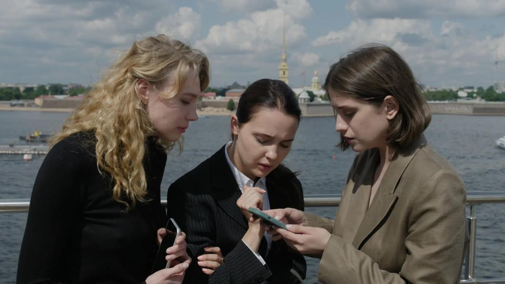

# Лекарство от страха и интим — предлагать. Какие сериалы и проекты покажут российские онлайн-платформы: обзор программы фестиваля Original+

- **URL:** https://novayagazeta.ru/articles/2024/03/03/lekarstvo-ot-strakha-i-intim-predlagat
- **Дата:** 2024-03-03
- **Автор:** Лариса Малюкова

## Лекарство от страха и интим — предлагать

## Какие сериалы и проекты покажут российские онлайн-платформы: обзор программы фестиваля Original+

Кадр из фильма «Первый класс»

## Где: Рутуб

Новые проекты команда российского видеохостинга подает с огромным размахом, немереные вложения подчеркиваются: здесь и реалити-шоу, и интервью (например, «Медийные лица с Сусанной Альпериной»). Ставка на молодую аудиторию. Приготовили веселую нарезку. Проекты:

- «Путь бойца»
- «Злые языки» (тайны про звезд)
- Первое уличное реалити
- «Смешная история» (артист в гриме Брежнева)
- «Музлофт», разнообразные музпроекты (с Шаманом и без)
- «Близкие» (со звездами разговаривают их родные)
- «Родное» — про российские аналоги западной продукции
- «Земля виноделия» — про замечательное отечественное вино
- Шоу «Чат», в котором конкурируют чаты. Среди первых конкурсов — кто быстрее скинет на карту капитану сто тысяч рублей.
- «Пусти переночевать»
- «Постыдные истории» и прочее

Много знакомых лиц — экс-резидентов «Камеди клуба».

…А потом показали фестивальный проект Рутуб — «Свидание с прицепом».

## Что: «Свидание с прицепом», шоу

### Где: Рутуб

Тизер шоу «Свидание с прицепом»

Дмитрий Шепелев — теперь не только ведущий, но и продюсер. Перед просмотром он рассказал, что сначала познакомились дети — его и будущей жены, а потом уже поженились и взрослые. В новом шоу дети помогают родителям встретить свою любовь.

В первой серии сын Соломон помогает Анфисе Чеховой распознать любовь своей жизни. Выбрать, так сказать, из пылких кандидатов.

Вопрос ребенку: «Есть ли у кого-нибудь из претендентов шанс?» Ответ ребенка: «У кого-нибудь есть».

«Соломон, судьба мужчины жизни твоей мамы у тебя в руках!»

Соломон к поставленной задаче относится серьезно. Допрашивает взрослых дядек с пристрастием: качков и худых, лысых, с татуировками и без. Про иностранные языки, про решимость сделать предложение, про татуировки, про вранье, будут ли с ним играть. И главное, станут ли его наказывать?! Женихи стараются понравиться… Соломону.

Потом Соломон выгоняет не приглянувшихся ему женихов. В том числе тату-мастера, у которого дева Мария набита на лысой голове.

Анфиса томно признается: ей хочется, чтобы ее будущий муж занимался ребенком и играл с ним. Ей самой не до этого. Она звезда.

Соломон прогоняет. Соломон решает. Соломон выбирает. Размышляет об изменах. А еще Соломон звонит маме «жениха», чтобы про его недостатки узнать…

С этической точки зрения все эти психологические игры и манипуляции с ребенком, по-моему, запредельны и недопустимы.

А вот жюри прессы выдало проекту спецприз.

## «Интимная жизнь семьи Коноваловых», сериал

### Где: Рутуб

Кадр из сериала «Интимная жизнь семьи Коноваловых»

«Придется попотеть, — предупредил продюсер. — Потому что пикантная тема». Светлана Камынина и Ян Цапник играют супружескую пару Кристину и Андрея на грани развода. Они устали друг от друга. Их спасет только секс. Горячий и нетрадиционный. А всему научит коуч в бусах и с откровенными советами.

На наших глазах трещит патриархальность героя Цапника. Ему приходится искать общий язык и с коучем, и с женой. Раскрепощаться. Рассыпать в спальне лепестки роз. И даже смириться со страшным словом «кунилингус».

Сериал о сексуальном воскрешении. Зал потребовал вторую серию.

Приз жюри — «за оригинальную коллаборацию».

Что они имели в виду?

## «Первый класс», сериал, драмеди

### Где: Иви

Приличный сериал определяется с первых кадров и первых слов. Режиссер-постановщик — Светлана Самошина («Край надломленной луны»), производство Star Media. Отличный кастинг — Юлия Хлынина, Марина Васильева, Аня Чиповская, Елена Лядова, Артем Быстров, Никита Ефремов, Александра Ребенок, Ростислав Бершауэр. Даже не знаю, кого там нет. Иронический текст, узнаваемые ситуации.

Три подруги-душки готовы землю рыть ради светлого и — что главное — престижного будущего своих детей. Поэтому их дети должны учиться в самой престижной элитной школе очень культурного города — в «настоящем дворце» с традициями и латынью.

Игра на выживание, бег с препятствиями в виде морали. «Когда на кону дети, нравственные законы теряют силы». Можно и сподличать, и друг друга растереть в порошок.

Поддержите нашу работу!

1000 500 300 Нажимая кнопку «Стать соучастником», я принимаю условия и подтверждаю свое гражданство РФ

Если у вас есть вопросы, пишите [email protected] или звоните:+7 (929) 612-03-68

Вот все у нас «ради детей»… даже сами дети. Прекрасное далеко… мы начинаем путь.

Жюри дало приз актрисе Юлии Хлыниной.

## «Калимба», сериал, психотриллер

### Где: Okko

Кадр из сериала «Калимба»

Психотриллер с Федором Бондарчуком и Аленой Михайловой в главных ролях. Режиссер Нурбек Эгейн («Переговорщик», «Фандорин. Азазель», «Самка богомола», «Шерлок в России», «Мажор»), производство NORM PRODUCTION.

Профессор Виктор Анатольевич Мещерский — гуру судебной психиатрии. Проводит опасный эксперимент: запирает в загородном особняке в одном помещении жертв и их обидчиков (насильников, наркодилеров, мошенников). Как поведут себя собравшиеся вместе антагонисты в критических обстоятельствах?

Цели доктора Мещерского, как и его диагноз, — пока остаются под завесой тайны, им самим (с помощью сценаристов) накрученной. Звучит пара несвежих аксиом про то, что здоровых людей нет, есть недообследованные. Этот недочет и ликвидирует Виктор Анатольевич. У него богатый бэкграунд в области экспериментальной генетики, он и с Чикатило работал.

Кино о темных сторонах личности. Некоторые кадры сняты через специальные объективы — как через искривленную лупу. Метафора того, как мы отражаемся в глазах друг друга.

Вспоминаются десятки фильмов про эксперименты над людьми: «Круг», «Экспериментатор» (про опыты Милгрэма), «Контроль» Тима Хантера, «Коматозники», отчасти «Игра в Кальмара».

Федор Сергеевич, он же Дмитрий Анатольевич, — в привычной роли волшебника Гудвина, обволакивающего, затягивающего в свои металлические в мелкую клетку сети. А про настоящие мотивы этого опасного эксперимента — узнаем в следующих сериях.

Приз жюри — актеру Федору Бондарчуку.

## «Ректор», сериал

### Где: Premier

Кадр из сериала «Ректор»

Молодой ученый, социофоб Лаврик Тимошин (Владимир Конухин) — весьма положительный юноша. Не пьет, не гуляет. День и ночь в лаборатории. Изобретает лекарство от страха и тревог. Страх — изначально полезная эмоция, спасает нас от опасности, но, превратившись в панику, разрушает. А новый препарат Тимошина сильно укрепляет адаптивные возможности подопытной мыши мадам Кюри, которая буквально на подвиг готова. В это самое время проворовавшийся ректор НИУ Богомолов (Михаил Горевой) решает скрыть свои «преступные действия», назначив ботаника Лаврика — на время ректором — в рамках Федеральной программы. Да и списать на дурачка все уворованное. Но не такой наш Лаврик.

Заканчивается серия явлением комиссии Службы финансового контроля во главе с товарищем Стальной (Елена Морозова).

Начало многообещающее, хотя отправная интрига у режиссера Романа Фокина и напоминает сюжет волобуевского «Последнего министра» (там тоже левого человека назначили главой министерства). И еще зачем-то закадровый текст — некий «мистер очевидность» говорит нам: «Надо только понять, кто ты и какое твое настоящее место». Правда?

Мы продолжим рассказывать о новых сериалах, увиденных на фестивале Original+.

Лариса Малюкова ведет телеграм-канал о кино и не только. Подписывайтесь тут.

### Этот материал входит в подписку

Смотровая площадкаКино с Ларисой Малюковой

### Добавляйте в Конструктор свои источники: сайты, телеграм- и youtube-каналы

Войдите в профиль, чтобы не терять свои подписки на разных устройствах

Поддержите нашу работу!

1000 500 300 Нажимая кнопку «Стать соучастником», я принимаю условия и подтверждаю свое гражданство РФ

Если у вас есть вопросы, пишите [email protected] или звоните:+7 (929) 612-03-68
